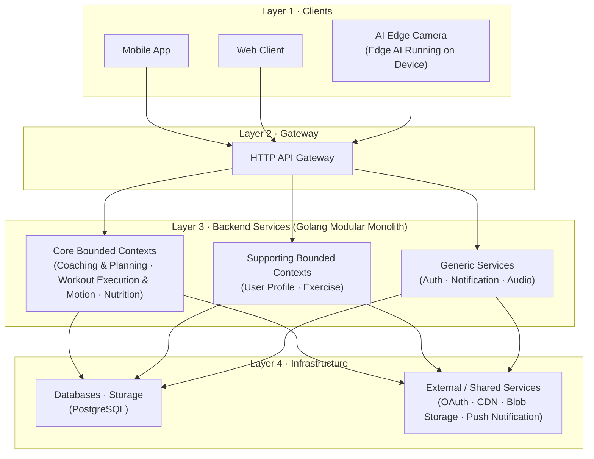

# FITAI — Kiến trúc Hệ thống

> Nguồn: [Đặc tả Bounded Context](./02_bounded_context.md)

---

## 1. Tổng quan

Hệ thống FITAI được phát triển sử dụng **Golang** làm ngôn ngữ lập trình backend chính, thiết kế theo mô hình **Modular Monolith** kết hợp cấu trúc **Hexagonal Architecture** (Ports & Adapters) cho từng module nghiệp vụ độc lập. Hệ thống hỗ trợ tập luyện và dinh dưỡng cá nhân hóa bằng AI & Computer Vision.

Kiến trúc tổng thể đi theo mô hình **Client → Gateway → Backend Services → Infrastructure**, kết hợp xử lý AI trên thiết bị (Edge AI) để đảm bảo tốc độ phản hồi tư thế thời gian thực.

---

## 2. Sơ đồ Kiến trúc (High-Level)



---

## 3. Ánh xạ Bounded Context (Logic) sang Thư mục Vật lý (Physical Folder)

Để tránh tranh cãi về mặt cấu trúc và đảm bảo tính nhất quán giữa tài liệu phân tích nghiệp vụ và cấu trúc code thực tế trong thư mục `internal/`, dưới đây là bảng ánh xạ chi tiết:

| Bounded Context (Logic) | Phân loại | Thư mục Vật lý (`internal/`) | Lý do thiết kế & Trách nhiệm triển khai |
| :--- | :--- | :--- | :--- |
| **User Profile** | Supporting | [profile/](file:///e:/LEAN/TTTN/internal/profile) | Quản lý thông tin thể trạng, lịch sử chỉ số cơ thể và hồ sơ người dùng. |
| **Coaching & Planning** | Core | [coaching/](file:///e:/LEAN/TTTN/internal/coaching) | Chịu trách nhiệm sinh lộ trình tập (Roadmap), sinh giáo án ngày và thích ứng giáo án tập luyện. |
| **Workout Execution & Motion** | Core | [workout_execution/](file:///e:/LEAN/TTTN/internal/workout_execution) | Chấm điểm tập đúng/sai thông qua AI Camera (Form Score), đếm rep/set và lưu trữ nhật ký tập thực tế. |
| **Nutrition** | Core | [nutrition/](file:///e:/LEAN/TTTN/internal/nutrition) | Quản lý chế độ ăn uống, calo/macro, gợi ý thực đơn và danh mục thực phẩm chuẩn. |
| *Không có (Generic)* | Generic | [auth/](file:///e:/LEAN/TTTN/internal/auth) · [notification/](file:///e:/LEAN/TTTN/internal/notification) · [audio/](file:///e:/LEAN/TTTN/internal/audio) | Các dịch vụ kỹ thuật dùng chung cho toàn bộ hệ thống (Xác thực, Thông báo, Tích hợp Âm thanh). |

---

## 4. Nguyên tắc vận hành

- **AI Edge xử lý trên máy**: Video không rời thiết bị. Chỉ gửi kết quả số (MotionResult) về server.
- **Không gián đoạn khi offline**: Khi Coaching Service gặp sự cố, người dùng vẫn tự tập luyện bằng timer và ghi log thủ công bình thường.
- **Mỗi Service = 1 Bounded Context**: Thiết kế modular monolith giúp cô lập thay đổi, dễ dàng tách thành microservices độc lập.
- **Phân luồng dữ liệu**: Dữ liệu tóm tắt đi qua API chính. Dữ liệu thô (tọa độ khớp xương) upload ngầm vào Blob Storage qua luồng chạy nền của Client để tránh gây nghẽn API.
- **Thiết kế thích ứng thay đổi (Change Propagation)**: Tách biệt dữ liệu nghiệp vụ (Exercise) và cấu hình thuật toán AI (Workout & Motion) qua ID bài tập. Nâng cấp model AI không ảnh hưởng đến database nghiệp vụ.

---

## 5. Cấu trúc Thư mục Dự án Toàn diện (Project Directory Tree)

```text
.
├── cmd/
│   └── api/                    # Điểm khởi chạy ứng dụng (Main Entrypoint)
├── docs/
│   ├── swagger/                # Tài liệu Swagger OpenAPI generated
│   │   └── contracts/
│   │       ├── core/
│   │       ├── supporting/
│   │       └── generic/
│   └── ...                     # Các tài liệu phân tích thiết kế khác
├── internal/
│   ├── gen/                    # Thư mục chứa stubs tự động sinh ra
│   │   └── go/
│   │       └── contracts/      # Go gRPC & HTTP Gateway stubs từ proto
│   │           ├── core/
│   │           ├── supporting/
│   │           └── generic/
│   ├── shared/                 # Shared Kernel (Thư viện dùng chung)
│   │   ├── database/           # Bộ Helper kết nối DB vật lý (Postgres)
│   │   └── eventbus/           # Bộ điều phối sự kiện in-memory hoặc Kafka wrapper
│   │
│   ├── coaching/               # Module AI Coaching & Planning (Core)
│   │   ├── domain/             # Lõi: Thực thể, Value Objects, Ports (Interfaces)
│   │   ├── application/        # Lõi: CQRS Use Cases, Command/Query Handlers
│   │   ├── infrastructure/     # Ngoài: DB Repositories, API handlers, AI Clients (Adapters)
│   │   └── docs/               # Lưu trữ tài liệu phân tích nghiệp vụ & kỹ thuật của module
│   ├── workout_execution/      # Module Workout Execution & Motion (Core)
│   │   ├── domain/
│   │   ├── application/
│   │   ├── infrastructure/
│   │   └── docs/

│   ├── nutrition/              # Module AI Nutrition Engine (Core)
│   │   ├── domain/
│   │   ├── application/
│   │   ├── infrastructure/
│   │   └── docs/
│   ├── profile/                # Module User Profile & Onboarding (Supporting)
│   │   ├── domain/
│   │   ├── application/
│   │   ├── infrastructure/
│   │   └── docs/
│   ├── auth/                   # Module Identity & Auth (Generic)
│   │   ├── domain/
│   │   ├── application/
│   │   ├── infrastructure/
│   │   └── docs/
│   ├── notification/           # Module Notification Service (Generic)
│   │   ├── domain/
│   │   ├── application/
│   │   ├── infrastructure/
│   │   └── docs/
│   └── audio/                  # Module Audio Integration (Generic)
│       ├── domain/
│       ├── application/
│       ├── infrastructure/
│       └── docs/
└── proto/                      # Định nghĩa các API contract và cấu hình Buf
    ├── buf.yaml                # Cấu hình Buf module v2
    ├── buf.gen.yaml            # Cấu hình plugins sinh mã stubs (Go & Swagger)
    └── contracts/              # Thư mục chứa các tệp Protocol Buffers gốc
        ├── core/
        │   ├── coaching/v1/
        │   ├── workout_execution/v1/
        │   └── nutrition/v1/
        ├── supporting/
        │   └── profile/v1/
        └── generic/
            ├── auth/v1/
            ├── notification/v1/
            └── audio/v1/
```
