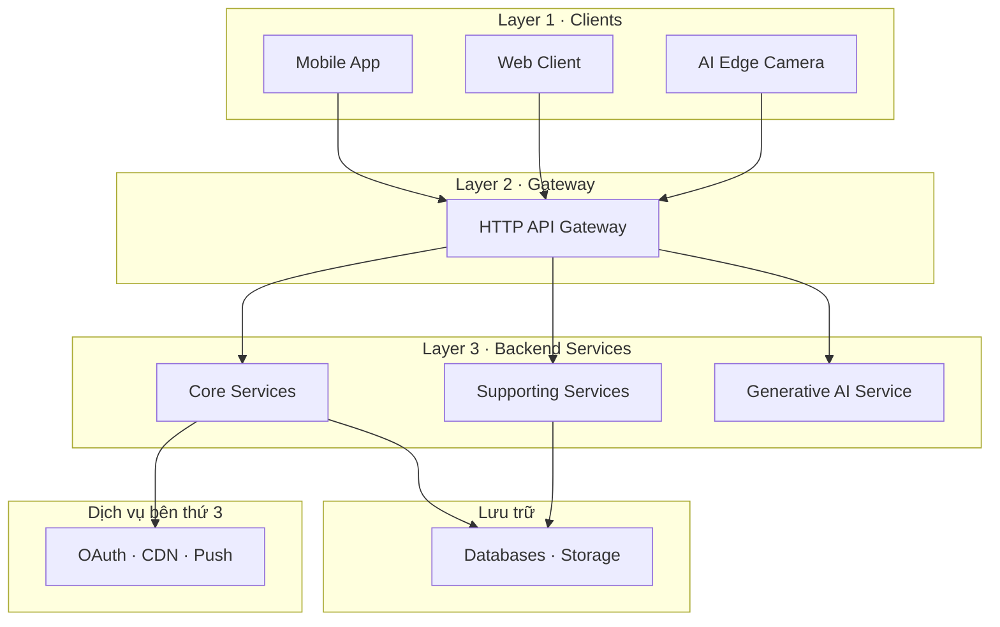

# FITAI — Kiến trúc Hệ thống

> Nguồn: [Đặc tả Nghiệp vụ Cốt lõi BABOK](./NGHIEP_VU_COT_LOI_BABOK.md)

---

## 1. Tổng quan

Hệ thống FITAI là nền tảng hỗ trợ tập luyện và dinh dưỡng cá nhân hóa bằng AI & Computer Vision. Kiến trúc theo mô hình **Client → Gateway → Backend Services → Storage / External**, kết hợp xử lý AI trên thiết bị (Edge AI) để đảm bảo tốc độ phản hồi tư thế thời gian thực.

---

## 2. Sơ đồ Kiến trúc (High-Level)

---

## 3. Nguyên tắc

- **AI Edge xử lý trên máy**: Video không rời thiết bị. Chỉ gửi kết quả số về server.
- **Não hỏng, tay chân vẫn hoạt động**: Coach Service sập → User vẫn tự tập, ghi log bình thường.
- **Mỗi Service = 1 Bounded Context**: Sửa Service này không ảnh hưởng Service khác.
- **Phân luồng dữ liệu**: Data tóm tắt đi qua API. Data thô (toạ độ khớp) upload ngầm vào Blob Storage.
