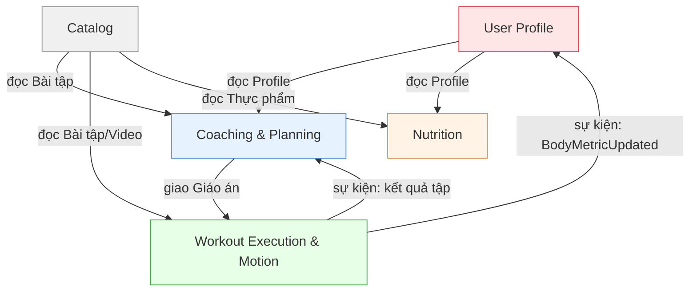

# FITAI — Bounded Context

> Nguồn: [Đặc tả Yêu cầu Nghiệp vụ Cốt lõi BABOK](./NGHIEP_VU_COT_LOI_BABOK.md)

---

## 1. Tổng quan

Hệ thống chia thành 5 Bounded Context nghiệp vụ chính:

| # | Context | Câu hỏi nghiệp vụ | Phân loại |
|---|---|---|---|
| 1 | User Profile | "Tôi là ai? Thể trạng ra sao?" | Supporting |
| 2 | Coaching & Planning | "Tôi nên tập gì? Khi nào điều chỉnh?" | Core (Não) |
| 3 | Workout Execution & Motion | "Tôi tập thế nào? Kết quả ra sao? Đúng hay sai?" | Core (Tay chân + AI) |
| 4 | Nutrition | "Tôi ăn gì hôm nay?" | Core |
| 5 | Catalog | "Hệ thống có những bài tập/thực phẩm nào?" | Supporting |

*Lưu ý: Chức năng gửi tin nhắn/thông báo (Notification) và xác thực (Auth) được xếp vào hạ tầng kỹ thuật (Shared Infrastructure Services), không coi là Bounded Context nghiệp vụ.*

---

## 2. Đặc Tả Từng Bounded Context

### 1. User Profile Context
- **Trách nhiệm**: Xác thực tài khoản, liên kết MXH, quản lý chỉ số cơ thể hiện tại và lịch sử (cân nặng, % mỡ, số đo các vòng, ảnh tiến trình), quản lý chấn thương và thời gian tập. [FR-UM-01, FR-UM-02, FR-PT-01].
- **Không trách nhiệm**: Không tính Fitness Score, không sinh lộ trình, không chạy timer buổi tập.
- **Aggregates**: `User`, `HealthProfile`, `InjuryRecord`.
- **Quy tắc nghiệp vụ**:
  - BR-UM-01: Hồ sơ đạt ≥ 80% mới kích hoạt AI Coach và tạo lộ trình.
- **Context liên quan**:
  - Cung cấp Profile cho `Coaching` và `Nutrition`.
  - Lắng nghe Event `BodyMetricUpdated` từ `Workout Execution & Motion` để cập nhật tiến trình cơ thể.

### 2. Coaching & Planning Context
- **Trách nhiệm**: Lập lộ trình 4 tuần, lịch tuần, giáo án JIT chi tiết, quản lý phong cách Coach, gửi tin nhắn động viên, nhắc lịch tập và thực thi thích ứng (Trigger A/B). [FR-AC-01, FR-AC-04, FR-AC-05, FR-AC-06, FR-AC-07, FR-UM-04].
- **Không trách nhiệm**: Không ghi nhận thực tế buổi tập, không đếm rep, không tính 1RM.
- **Aggregates**: `WorkoutRoadmap`, `WeeklySchedule`, `DailyWorkoutPlan` (Aggregate độc lập để tối ưu transaction).
- **Quy tắc nghiệp vụ**:
  - BR-AC-01: Tối đa 6 buổi/tuần, ≥ 1 ngày nghỉ.
  - BR-AC-02: Progressive Overload ≤ 10% volume/tuần.
  - BR-AC-03: Buổi bỏ tập = "Bỏ qua", không tự dồn bù.
  - BR-AC-04: Quy tắc CR cuối chu kỳ (4 mức: <40%, 40-70%, 70-90%, ≥90%).
  - BR-AC-05: Signal B1 — Không hoạt động 7 ngày.
  - BR-AC-06: Signal B2 — Lịch không tương thích.
  - BR-AC-07: Signal B3 — Overtraining.
  - BR-AC-08: Signal B4 — Plateau.
- **Context liên quan**:
  - Đọc Profile từ `User Profile`.
  - Đọc bài tập từ `Catalog`.
  - Đọc kết quả tập từ `Workout Execution & Motion`.
  - Gọi Shared Infrastructure Service để gửi Push Notification nhắc lịch.

### 3. Workout Execution & Motion Context
- **Trách nhiệm**: Thực thi buổi tập (timer, nhạc, video), đếm rep, ROM, Form Score và lỗi tư thế bằng AI Camera, ghi log buổi tập (AI/Phi AI), quản lý cấu hình AI bài tập (PoseTemplate, RepCountingRules) theo ID bài tập từ Catalog, lưu dữ liệu thô và đo PR (1RM). [FR-WL-01, FR-WL-02, FR-WL-03, FR-WL-04, FR-CC-01 -> 05, FR-PT-02].
- **Không trách nhiệm**: Không sinh giáo án, không quản lý lịch sử chỉ số cơ thể (cân nặng, số đo vòng), không chạy logic thích ứng lộ trình.
- **Aggregates**: `WorkoutSession`, `SetLog`, `PersonalRecord` (1RM), `ExercisePoseProfile`.
- **Quy tắc nghiệp vụ**:
  - BR-CC-01: Rep hợp lệ khi ROM ≥ 70%.
  - BR-CC-02: Frame skeleton hợp lệ < 50% → Đánh dấu "Không đạt chuẩn xác thực".
  - BR-WL-01: Cảnh báo 90'/180', tự đóng sau 240' không tương tác.
  - BR-WL-02: Tải lượng > 250% trung bình 5 buổi → yêu cầu xác nhận.
  - BR-WL-03: Bài phi AI không ghi Form Score (N/A).
- **Context liên quan**:
  - Lấy giáo án từ `Coaching`.
  - Đọc bài tập từ `Catalog`.
  - Phát Event `WorkoutCompleted` cho `Coaching` và `BodyMetricUpdated` cho `User Profile`.

### 4. Nutrition Context
- **Trách nhiệm**: Tính calo/macro (Mifflin-St Jeor), gợi ý thực đơn ngày theo 3 mức ngân sách, chống lặp thực phẩm, tư vấn định lượng tự nấu/ăn ngoài và ghi nhật ký bữa ăn. [FR-NU-01, FR-NU-02, FR-NU-03, FR-NU-04].
- **Không trách nhiệm**: Không quản lý danh mục thực phẩm gốc (Catalog quản lý).
- **Aggregates**: `DailyMealPlan`, `MealLog`, `LockoutRegistry`.
- **Quy tắc nghiệp vụ**:
  - BR-NU-01: Thực đơn tối thiểu 1,200 kcal/ngày.
  - BR-NU-02: Khóa protein 7 ngày, tinh bột 5 ngày, chủ đề món 3 ngày.
  - BR-NU-03: Luôn kèm đề xuất sản phẩm đối tác nếu có.
- **Context liên quan**:
  - Đọc Profile & Cân nặng hiện tại từ `User Profile`.
  - Đọc thực phẩm chuẩn từ `Catalog`.

### 5. Catalog Context
- **Mục tiêu**: Quản lý kho danh mục bài tập và thực phẩm dùng chung.
- **Trách nhiệm**: Cung cấp danh mục bài tập (tên bài, nhóm cơ, video, dụng cụ) và thực phẩm chuẩn cho Admin CRUD, phê duyệt kích hoạt và các Context khác tham chiếu. [FR-SM-01, FR-SM-02, FR-SM-03].
- **Không trách nhiệm**: Không chứa cấu hình khớp AI (Workout & Motion quản lý), không gợi ý giáo án hay thực đơn.
- **Aggregates**: `Exercise`, `FoodItem`, `AdminApprovalRegistry`.
- **Quy tắc nghiệp vụ**:
  - Bài tập/thực phẩm mới phải được Admin phê duyệt mới kích hoạt.
- **Context liên quan**:
  - Cung cấp danh mục tham chiếu cho tất cả các Context khác.

---

## 3. Context Map

---

## 4. Nhận xét thiếu sót của tài liệu DDD hiện tại

Tài liệu DDD hiện tại đã phân định rõ ranh giới nghiệp vụ (Strategic Design), nhưng để team phát triển bắt đầu code (đặc biệt với Go gRPC Monolith), hệ thống vẫn đang thiếu các tài liệu kỹ thuật sau:

1. **Đặc tả chiến thuật (Tactical Design)**: Chi tiết cấu trúc dữ liệu bên trong từng Context (Aggregate Root, Entity, Value Object). Tránh việc dev code sai ranh giới, gọi trực tiếp struct của nhau thay vì giao tiếp qua Interface.
2. **Ubiquitous Language (Ngôn ngữ thống nhất)**: Chưa có bảng thuật ngữ chung cho toàn hệ thống. Thống nhất từ khóa code từ DB, API đến UI.
3. **Payload Specification của Domain Events**: Chưa định nghĩa cấu trúc dữ liệu của các sự kiện bất đồng bộ (như `WorkoutCompleted`).
4. **API Contracts / Protobuf Spec**: Chưa có định nghĩa interface gRPC cụ thể giữa các Context (ví dụ: `GetDailyWorkoutPlan(UserId) returns (DailyWorkoutPlan)`).
