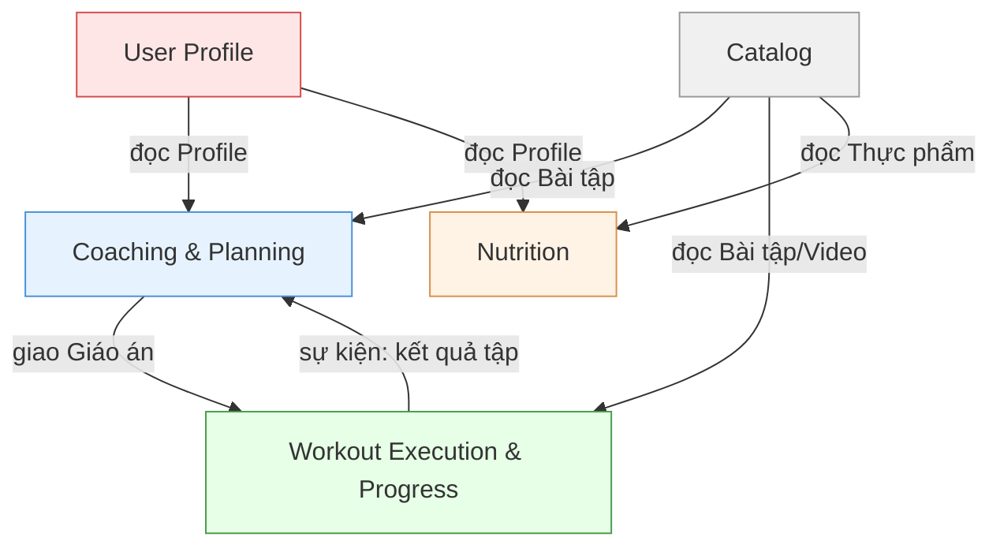

# FITAI — Bounded Context

> Nguồn: [Đặc tả Nghiệp vụ Cốt lõi BABOK](./NGHIEP_VU_COT_LOI_BABOK.md)

---

## Tổng quan

Hệ thống chia thành 5 Context theo ranh giới nghiệp vụ:

| # | Context | Câu hỏi nghiệp vụ | Module BRD |
|---|---|---|---|
| 1 | User Profile | "Tôi là ai? Thể trạng ra sao?" | Module 1 |
| 2 | Coaching & Planning | "Tôi nên tập gì? Khi nào điều chỉnh?" | Module 2 |
| 3 | Workout Execution & Progress | "Tôi đang tập thế nào? Kết quả ra sao?" | Module 3, 4, 6 |
| 4 | Nutrition | "Tôi ăn gì hôm nay?" | Module 5 |
| 5 | Catalog | "Hệ thống có những bài tập/thực phẩm nào?" | Module 7 |

---

## 1. User Profile Context

- **Mục tiêu**: Quản lý căn cước sức khỏe của người tập.
- **Trách nhiệm**:
  - Đăng ký/đăng nhập (Email, SĐT OTP, MXH) — FR-UM-01
  - Lưu chỉ số cơ thể (tuổi, giới tính, chiều cao, cân nặng, mục tiêu) — FR-UM-02
  - Khai báo chấn thương/bệnh lý mãn tính
  - Chọn khung giờ tập cố định — FR-UM-03
  - Thu thập dần thiết bị & dị ứng thực phẩm qua chatbot — Assumption-03
- **Không chịu trách nhiệm**: Không tính Fitness Score, không sinh lộ trình, không nhắc lịch.
- **Dữ liệu sở hữu**: `User`, `HealthProfile`, `InjuryRecord`, `TrainingScheduleSlot`
- **Quy tắc nghiệp vụ**:
  - **BR-UM-01**: Hồ sơ ≥ 80% mới kích hoạt Coach.
- **Context liên quan**: Coach và Nutrition đọc Profile.

---

## 2. Coaching & Planning Context

- **Mục tiêu**: Não bộ của hệ thống — quyết định User tập gì, khi nào điều chỉnh.
- **Trách nhiệm**:
  - Tính User Fitness Score từ Profile
  - Sinh Lộ trình 4 tuần & Lịch tập tuần — FR-AC-01
  - Sinh Giáo án chi tiết theo buổi (JIT) — FR-AC-06
  - Chèn Warm-up/Cool-down theo nhóm cơ — FR-AC-07
  - Thay bài tập khi chấn thương đột xuất — FR-AC-03
  - Chọn phong cách Coach — FR-AC-05
  - Gửi tin nhắn động viên — FR-AC-04
  - Nhắc lịch Push Notification — FR-UM-04
  - Đánh giá & Điều chỉnh lộ trình:
    - Trigger A (Cuối chu kỳ 4 tuần): Tính CR → **BR-AC-04**
    - Trigger B (Giữa chu kỳ): Quét tín hiệu → **BR-AC-05 → BR-AC-08**
  - Xử lý buổi bỏ tập — **BR-AC-03**
- **Không chịu trách nhiệm**: Không ghi log buổi tập, không đếm rep, không xử lý camera, không tính 1RM.
- **Dữ liệu sở hữu**: `Roadmap`, `WeeklySchedule`, `DailyWorkoutPlan`, `CoachingMessage`, `CoachStyle`
- **Quy tắc nghiệp vụ**:
  - **BR-AC-01**: Tối đa 6 buổi/tuần, ≥ 1 ngày nghỉ.
  - **BR-AC-02**: Progressive Overload ≤ 10% volume/tuần.
  - **BR-AC-03**: Buổi bỏ tập = "Bỏ qua", không tự dồn bù.
  - **BR-AC-04**: Quy tắc CR cuối chu kỳ (4 mức: <40%, 40-70%, 70-90%, ≥90%).
  - **BR-AC-05**: Signal B1 — Không hoạt động 7 ngày.
  - **BR-AC-06**: Signal B2 — Lịch không tương thích.
  - **BR-AC-07**: Signal B3 — Overtraining.
  - **BR-AC-08**: Signal B4 — Plateau.
- **Context liên quan**:
  - Đọc từ User Profile (chỉ số, chấn thương) và Workout (log kết quả, RPE, 1RM).
  - Đọc từ Catalog (danh sách bài tập, bài thay thế).
  - Phát sự kiện: `RoadmapCreated`, `WorkoutPlanGenerated`, `CoachingMessageSent`.

---

## 3. Workout Execution & Progress Context

- **Mục tiêu**: Ghi nhận sự thật — User thực tế đã tập ra sao, và theo dõi tiến trình dài hạn.
- **Trách nhiệm**:
  - Nhận bản sao Giáo án từ Coach để thực thi
  - Chạy buổi tập: Timer, phát nhạc, hiển thị video mẫu — FR-WL-02
  - Nhánh AI Camera: Nhận data từ Edge AI (rep, ROM%, Form Score) — FR-WL-01, FR-CC-01→05
  - Nhánh Phi AI: User tự ghi nhận set/rep/tạ thủ công — FR-WL-02
  - Audio Ducking khi phát cảnh báo tư thế — FR-WL-03
  - Tính 1RM ước tính (Epley) & vinh danh PR — FR-WL-04
  - Xuất báo cáo buổi tập (time, volume, calo, Form, lỗi phổ biến)
  - Cập nhật chỉ số cơ thể (cân nặng, % mỡ, số đo, ảnh) — FR-PT-01
  - Vẽ biểu đồ xu hướng (1RM, cân nặng, Form) — FR-PT-02
  - Báo cáo định kỳ tiến trình — FR-PT-03
- **Không chịu trách nhiệm**: Không sinh giáo án, không quyết định tăng/giảm tạ cho buổi sau, không phân tích tín hiệu B1-B4.
- **Dữ liệu sở hữu**: `WorkoutSession`, `SetLog`, `PersonalRecord`, `BodyMetric`, `ProgressChart`
- **Quy tắc nghiệp vụ**:
  - **BR-CC-01**: Rep hợp lệ khi ROM ≥ 70%.
  - **BR-CC-02**: Frame nhận diện < 50% → "Không đạt chuẩn xác thực".
  - **BR-WL-01**: Cảnh báo 90'/180', tự đóng sau 240' không tương tác.
  - **BR-WL-02**: Tải lượng > 250% trung bình 5 buổi → yêu cầu xác nhận.
  - **BR-WL-03**: Bài phi AI không ghi Form Score, chỉ ghi set/rep/tạ.
- **Context liên quan**:
  - Đọc từ Coach (giáo án hôm nay).
  - Đọc từ Catalog (video hướng dẫn, toạ độ khớp chuẩn).
  - Phát sự kiện: `WorkoutCompleted`, `PersonalRecordAchieved`, `BodyMetricUpdated` → Coach lắng nghe.

---

## 4. Nutrition Context

- **Mục tiêu**: Cá nhân hóa dinh dưỡng — "Tôi ăn gì hôm nay?"
- **Trách nhiệm**:
  - Tính TDEE/macro cá nhân (Mifflin-St Jeor) — FR-NU-01
  - Gợi ý thực đơn ngày: 3 bữa chính + 1 bữa phụ, 3 mức giá — FR-NU-02
  - Đề xuất sản phẩm đối tác tiện lợi — BR-NU-03
  - Áp dụng quy tắc chống lặp món — FR-NU-03
  - Nhật ký ăn uống (tìm kiếm món / quét mã vạch) — FR-NU-04
  - Tư vấn định lượng đồ ăn tự chuẩn bị/quán ngoài — BR-NU-03
- **Không chịu trách nhiệm**: Không quản lý thư viện thực phẩm gốc (Catalog quản lý). Không liên quan đến tập luyện.
- **Dữ liệu sở hữu**: `DailyMealPlan`, `MealLog`, `NutritionTarget`
- **Quy tắc nghiệp vụ**:
  - **BR-NU-01**: Không gợi ý < 1,200 kcal/ngày.
  - **BR-NU-02**: Protein đã ăn khóa 7 ngày, tinh bột 5 ngày, chủ đề 3 ngày.
  - **BR-NU-03**: Luôn kèm đề xuất sản phẩm đối tác nếu có.
- **Context liên quan**:
  - Đọc từ User Profile (cân nặng, mục tiêu, food_restrictions).
  - Đọc từ Catalog (thư viện thực phẩm, kcal/macro).

---

## 5. Catalog Context

- **Mục tiêu**: Kho nội dung tham chiếu dùng chung.
- **Trách nhiệm**:
  - CRUD Thư viện bài tập (nhóm cơ, video, toạ độ khớp chuẩn, dụng cụ, bài thay thế) — FR-SM-01
  - CRUD Thư viện thực phẩm (kcal, macro, chay/Halal, nhãn dị ứng) — FR-SM-02
  - Admin duyệt mới kích hoạt
  - Dashboard giám sát — FR-SM-03
- **Không chịu trách nhiệm**: Không tính toán. Không gợi ý bài tập hay thực đơn.
- **Dữ liệu sở hữu**: `Exercise`, `Food`, `AdminApproval`
- **Quy tắc nghiệp vụ**: Bài tập/thực phẩm mới cần Admin duyệt trước khi kích hoạt.
- **Context liên quan**: Tất cả Context khác chỉ đọc từ Catalog. Catalog không phụ thuộc ai.

---

## Context Map

| Cung cấp (Upstream) | Tiêu thụ (Downstream) | Kiểu quan hệ |
|---|---|---|
| User Profile | Coaching & Planning | Conformist |
| User Profile | Nutrition | Conformist |
| Catalog | Coaching & Planning | Supplier |
| Catalog | Workout Execution | Supplier |
| Catalog | Nutrition | Supplier |
| Coaching & Planning | Workout Execution | Customer-Supplier |
| Workout Execution | Coaching & Planning | Event-driven |

---

## Đánh giá

### Vì sao tách Coach khỏi Workout Execution?
- **Tách vì**: Thuật toán AI Coach thay đổi thường xuyên. Luồng tập luyện (timer, ghi log) cần ổn định. Tách ra để sửa Coach không crash luồng tập.
- **Không gộp vì**: Bug logic Plateau (B4) có thể crash luồng ghi log. Rủi ro lan truyền quá lớn.
- **Có thể thay đổi**: Nếu Coach đơn giản (chỉ if/else), có thể gộp lại.

### Vì sao gộp Progress vào Workout Execution?
- **Gộp vì**: Progress (1RM, biểu đồ, báo cáo) là phần kết thúc tự nhiên của buổi tập: Tập → Ghi → Xem lại. Tách ra tạo ranh giới giả tạo.
- **Không tách vì**: Source of Truth của progress là log buổi tập. Tách sẽ phải đồng bộ liên tục, coupling ngược.
- **Có thể thay đổi**: Nếu query biểu đồ chậm, tách Read Model (CQRS) như tối ưu kỹ thuật.

### Vì sao tách Nutrition khỏi Catalog?
- **Tách vì**: Nutrition có logic phức tạp riêng (TDEE, chống lặp 7 ngày, 3 mức giá). Catalog chỉ CRUD. Khác bản chất.
- **Không gộp vì**: Admin sửa thư viện sẽ ảnh hưởng logic gợi ý thực đơn.
- **Có thể thay đổi**: Nếu Nutrition đơn giản (chỉ hiện macro), gộp vào Catalog.

### Vì sao Catalog là 1 Context chung?
- **Gộp vì**: Bài tập và Thực phẩm cùng bản chất: nội dung tham chiếu do Admin quản lý. Cùng workflow: tạo → duyệt → kích hoạt.
- **Không tách vì**: Tách tạo 2 module CRUD giống nhau, overhead không cần thiết.
- **Có thể thay đổi**: Nếu thư viện bài tập phức tạp (AI tạo bài mới), tách riêng.
