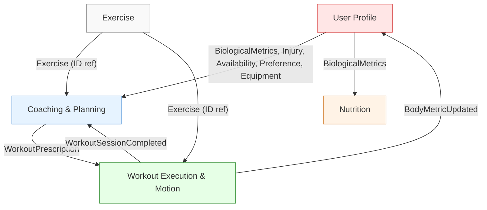

# FITAI — Bounded Context

> Nguồn: [Đặc tả Yêu cầu Nghiệp vụ Cốt lõi BABOK](./NGHIEP_VU_COT_LOI_BABOK.md)

---

## 1. Tổng quan

| # | Context | Câu hỏi nghiệp vụ | Phân loại |
|---|---|---|---|
| 1 | User Profile | "Tôi là ai? Thể trạng ra sao?" | Supporting |
| 2 | Coaching & Planning | "Tôi nên tập gì? Khi nào điều chỉnh?" | Core |
| 3 | Workout Execution & Motion | "Tôi tập thế nào? Tư thế đúng/sai và lịch sử tập?" | Core |
| 4 | Nutrition | "Tôi ăn gì hôm nay?" | Core |
| 5 | Exercise | "Danh mục bài tập chuẩn gồm những gì?" | Supporting |

> Notification và Auth là Shared Infrastructure Services, không phải Bounded Context nghiệp vụ.

---

## 2. Đặc Tả Từng Bounded Context

### 1. User Profile Context
- **Trách nhiệm**: Xác thực tài khoản, quản lý chỉ số cơ thể và lịch sử (cân nặng, % mỡ, số đo, ảnh tiến trình), quản lý chấn thương, `experience_level`, khung giờ rảnh theo tuần (`availability`), nhóm cơ ưu tiên (`preferred_muscle_groups`) và dụng cụ tập luyện sẵn có (`available_equipment`). [FR-UM-01 → FR-UM-06, FR-PT-01]
- **Không trách nhiệm**: Không tính Fitness Score, không sinh lộ trình, không chạy timer buổi tập.
- **Aggregates**: `User`, `BodyMetricsHistory`
- **Quy tắc nghiệp vụ**:
  - BR-UM-01: Hồ sơ đạt ≥ 80% mới kích hoạt AI Coach và tạo lộ trình.
- **Context liên quan**:
  - Cung cấp `BiologicalMetrics`, `Injury`, `experience_level`, `availability`, `preferred_muscle_groups`, `available_equipment` cho `Coaching`; `BiologicalMetrics` cho `Nutrition`.
  - Lắng nghe Event `BodyMetricUpdated` từ `Workout Execution` để cập nhật lịch sử chỉ số.

---

### 2. Coaching & Planning Context
- **Trách nhiệm**: Lập lộ trình 4 tuần, lịch tuần, giáo án JIT chi tiết theo đúng thời gian rảnh/dụng cụ/nhóm cơ ưu tiên/`experience_level` của User; thực thi thích ứng (Signal B1–B4, CR cuối chu kỳ, Fit Score định kỳ); quản lý phong cách Coach và nhắc lịch. [FR-AC-01 → FR-AC-07, FR-UM-03 → FR-UM-06]
- **Không trách nhiệm**: Không ghi nhận thực tế buổi tập, không đếm rep, không tính 1RM.
- **Aggregates**: `WorkoutRoadmap`, `WeeklySchedule`, `DailyWorkoutPlan`
  - `WeeklySchedule` chứa `AvailabilityWindow` (tham chiếu khung giờ rảnh của User cho từng ngày) để đảm bảo BR-AC-09.
  - `WorkoutRoadmap` mang `PlanningTier` (suy ra từ `experience_level`: Beginner | Experienced) quyết định trần Overload và mức độ Fixed Template theo BR-AC-11, và `primary_goal` quyết định `MuscleSplit`/rep-range theo BR-AC-14.
- **Domain Services**: `AdaptiveCoachEngine`, `OverloadValidator`
- **Quy tắc nghiệp vụ**:
  - BR-AC-01: Tối đa 6 buổi/tuần, ≥ 1 ngày nghỉ.
  - BR-AC-02: Progressive Overload ≤ 10% volume/tuần (trần mặc định; xem BR-AC-11 cho tier Beginner).
  - BR-AC-03: Buổi bỏ tập = "Bỏ qua", không tự dồn bù.
  - BR-AC-04: Quy tắc CR cuối chu kỳ (4 mức: <40%, 40–70%, 70–90%, ≥90%).
  - BR-AC-05: Signal B1 — Không hoạt động 7 ngày.
  - BR-AC-06: Signal B2 — Lịch không tương thích.
  - BR-AC-07: Signal B3 — Overtraining (≥ 2 buổi/ngày hoặc RPE ≥ 8.5 liên tục ≥ 5 buổi).
  - BR-AC-08: Signal B4 — Plateau (1RM + Form không tăng 3 tuần liên tiếp với CR ≥ 70%).
  - BR-AC-09: Lịch tập chỉ được xếp vào slot rảnh User khai báo (`availability`); thiếu slot rảnh → tự hạ số buổi/tuần.
  - BR-AC-10: Nhóm cơ ưu tiên (`preferred_muscle_groups`) được tăng tần suất nhưng vẫn phải giữ sàn cân bằng toàn thân và khoảng cách phục hồi ≥ 48h/nhóm cơ.
  - BR-AC-11: Chiến lược lập kế hoạch phân theo `PlanningTier` — Beginner dùng Fixed Template + trần Overload 5%/tuần + bắt buộc Warm-up/Cool-down; Experienced dùng trần BR-AC-02 đầy đủ + chọn bài linh hoạt hơn.
  - BR-AC-12: Fit Score định kỳ sau mỗi buổi (RPE, CR, delta 1RM) để điều chỉnh nhẹ tải lượng sớm, tạm ngưng khi Signal B3/B4 đang active.
  - BR-AC-13: Chỉ chọn bài tập có `EquipmentID` nằm trong `available_equipment` của User (hoặc Bodyweight).
  - BR-AC-14: `primary_goal` quyết định split/overload/rep-range; `secondary_goals` chỉ ảnh hưởng accessory; xung đột mục tiêu phải hỏi lại User trước khi `InitiateRoadmap`.
  - BR-AC-15: Không lặp lại accessory/finisher giống hệt cho cùng nhóm cơ trong 2 tuần liên tiếp, trừ compound nền tảng của Fixed Template (Beginner).
- **Context liên quan**:
  - Đọc `BiologicalMetrics`, `Injury`, `experience_level`, `availability`, `preferred_muscle_groups`, `available_equipment` từ `User Profile`.
  - Đọc thông tin bài tập được quản lý bởi `Workout Execution & Motion`.
  - Lắng nghe `WorkoutSessionCompleted` từ `Workout Execution`.
  - Gọi Shared Infrastructure để gửi Push Notification.

---

### 3. Workout Execution & Motion Context
- **Trách nhiệm**: Thực thi buổi tập (timer, nhạc, video hướng dẫn), đếm rep/ROM/Form Score bằng AI Camera, chấm điểm đúng/sai của tư thế, ghi log tập luyện thực tế (AI/Phi AI), quản lý cấu hình AI bài tập (PoseTemplate, RepCountingRules), lưu dữ liệu thô và đo PR (1RM). [FR-WL-01 → FR-WL-03, FR-CC-01 → FR-CC-05, FR-PT-02]
- **Không trách nhiệm**: Không sinh giáo án tập luyện tuần/ngày, không quản lý lịch sử chỉ số cơ thể của profile, không chạy logic thích ứng lộ trình, không quản lý danh mục bài tập chuẩn.
- **Aggregates**: `WorkoutSession`, `WorkoutPerformance`, `MotionSpecification`
- **Domain Services**: `TrainingLoadGuard`
- **Quy tắc nghiệp vụ**:
  - BR-CC-01: Rep hợp lệ khi ROM ≥ 70%.
  - BR-CC-02: Frame skeleton hợp lệ < 50% → đánh dấu "Không đạt chuẩn xác thực".
  - BR-WL-01: Cảnh báo 90'/180', tự đóng sau 240' không tương tác → Anomalous Session.
  - BR-WL-02: Tải lượng > 250% trung bình 5 buổi gần nhất → yêu cầu xác nhận (xử lý bởi `TrainingLoadGuard`).
  - BR-WL-03: Bài phi AI không ghi Form Score (N/A).
- **Context liên quan**:
  - Lấy `WorkoutPrescription` từ `Coaching`.
  - Tham chiếu danh mục bài tập từ Exercise.
  - Phát `WorkoutSessionCompleted` cho `Coaching` và `BodyMetricUpdated` cho `User Profile`.

---

### 4. Nutrition Context
- **Trách nhiệm**: Tính calo/macro (Mifflin-St Jeor), gợi ý thực đơn ngày theo 3 mức ngân sách, chống lặp thực phẩm, tư vấn định lượng tự nấu/ăn ngoài và ghi nhật ký bữa ăn, quản lý danh mục thực phẩm chuẩn (Food Library) nội bộ. [FR-NU-01 → FR-NU-04]
- **Không trách nhiệm**: Không gợi ý giáo án hay lịch tập luyện.
- **Aggregates**: `NutritionPlan`, `MealHistory`, `FoodItem`
- **Quy tắc nghiệp vụ**:
  - BR-NU-01: Thực đơn tối thiểu 1,200 kcal/ngày.
  - BR-NU-02: Khóa protein 7 ngày, tinh bột 5 ngày, chủ đề món 3 ngày.
  - BR-NU-03: Luôn kèm đề xuất sản phẩm đối tác nếu có.
  - BR-NU-04: Thực phẩm mới phải qua trạng thái `PendingApproval` → Admin duyệt → `Active` mới được sử dụng.
- **Context liên quan**:
  - Đọc `BiologicalMetrics` từ `User Profile` để tính TDEE.

---

### 5. Exercise Context
- **Trách nhiệm**: Quản lý danh mục bài tập chuẩn (Exercise Library), kiểm soát vòng đời bài tập từ khi tạo nháp đến khi phê duyệt để đưa vào sử dụng trong toàn hệ thống. [FR-WL-04]
- **Không trách nhiệm**: Không đếm rep, không ghi log buổi tập, không tính TDEE, không gợi ý thực đơn hay kế hoạch tập luyện, không quản lý thực phẩm.
- **Aggregates**: `Exercise`
- **Quy tắc nghiệp vụ**:
  - BR-CAT-01: Bài tập mới phải qua trạng thái `PendingApproval` → Admin duyệt → `Active` mới được sử dụng.
- **Context liên quan**:
  - Cung cấp dữ liệu bài tập cho `Coaching` để lên kế hoạch và cho `Workout Execution` để tham chiếu.

---

## 3. Context Map

