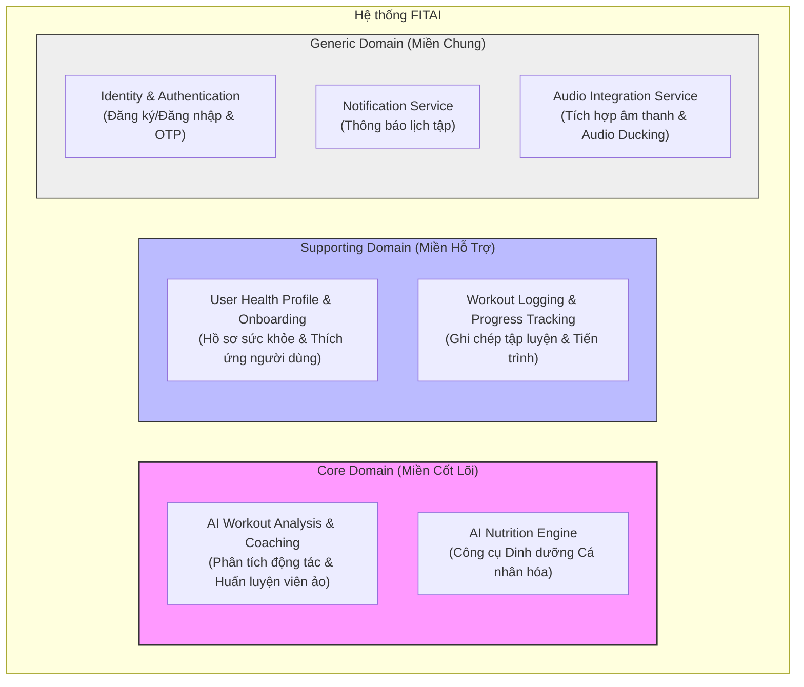

# 2. Khám Phá Miền Nghiệp Vụ (Domain Discovery) - FITAI

Tài liệu này thực hiện phân rã hệ thống **FITAI** thành các miền con (Subdomains) dựa trên mức độ quan trọng và giá trị kinh doanh cốt lõi.

---

## 2.1 Bản Đồ Phân Rã Miền Con (Subdomain Mapping)

Hệ thống được chia thành 3 loại miền con chính: **Core Domain** (Miền cốt lõi), **Supporting Domain** (Miền hỗ trợ), và **Generic Domain** (Miền chung).

---

## 2.2 Chi Tiết Các Miền Con (Subdomain Details)

### 1. Core Domain (Miền Cốt Lõi)
Đây là các thành phần tạo nên giá trị cạnh tranh độc nhất của FITAI và giải quyết trực tiếp mục tiêu an toàn (`OB-02`, `OB-04`) và dinh dưỡng cá nhân hóa (`OB-05`).
* **AI Workout Analysis & Coaching**:
  * **Nghiệp vụ**: Phân tích hình ảnh khung xương (33 điểm khớp) và đánh giá chuyển động (ROM%) thời gian thực trên thiết bị di động/trình duyệt (Edge AI) để đếm rep và cảnh báo sửa lỗi tức thì (< 500ms). AI Coach tự động sinh giáo án chi tiết JIT hàng ngày dựa trên hiệu năng tập/RPE/chấn thương của buổi trước; đồng thời điều chỉnh lộ trình thích ứng theo chu kỳ 4 tuần (Trigger A) và theo dõi sát sao 4 tín hiệu hành vi độc lập (Trigger B - Signals B1-B4) để can thiệp kịp thời. Hỗ trợ đầy đủ luồng tập phi AI.
  * **Giá trị**: Tối ưu hiệu năng, giảm nguy cơ chấn thương nhờ phản hồi tức thì và cá nhân hóa lịch tập chính xác theo trạng thái phục hồi hàng ngày của người dùng.
* **AI Nutrition Engine**:
  * **Nghiệp vụ**: Tính toán calo/macros cá nhân hóa sâu theo TDEE, cung cấp cả 2 hình thức: tự nấu ăn hoặc đề xuất quán ăn ngoài tiệm theo 3 mức giá (Tiết kiệm, Phổ thông, Thoải mái), ưu tiên sản phẩm đối tác liên kết. Áp dụng thuật toán **Anti-Repetition** nghiêm ngặt (khóa protein chính 7 ngày, tinh bột 5 ngày, chủ đề món ăn 3 ngày) để luân chuyển thực đơn không trùng lặp.
  * **Giá trị**: Thực đơn dinh dưỡng tối ưu và đa dạng, phù hợp ngân sách thực tế và thói quen ăn uống của người dùng.

### 2. Supporting Domain (Miền Hỗ Trợ)
Các miền này không tạo lợi thế cạnh tranh trực tiếp nhưng cần thiết để miền cốt lõi hoạt động bình thường.
* **User Health Profile & Onboarding**:
  * **Nghiệp vụ**: Đăng ký thông tin Onboarding tối giản (chỉ số cơ thể cơ bản, mục tiêu, chấn thương cũ) để thiết lập lộ trình ban đầu. Tích hợp chatbot hỏi đáp tự động thu thập dần các dữ liệu không bắt buộc (dụng cụ tập luyện, hạn chế/dị ứng thực phẩm) trong quá trình sử dụng. Áp dụng quy tắc hoàn thiện hồ sơ $\ge 80\%$ để bắt đầu kích hoạt các tính năng của AI Coach.
* **Workout Logging & Progress Tracking**:
  * **Nghiệp vụ**: Ghi chép tự động (đối với buổi tập dưới AI Camera) và cho phép sửa tay. Hỗ trợ luồng ghi chép thủ công cho các bài tập phi AI (ghi nhận set, rep, weight; tính toán volume, điểm Form Score báo N/A/Trống). Đo lường sức mạnh 1RM (công thức Epley) và tính toán Tải lượng tập luyện (Training Load) để đánh giá trạng thái quá tải / tiến bộ đình trệ.

### 3. Generic Domain (Miền Chung)
Các miền tiêu chuẩn, có thể tái sử dụng giải pháp có sẵn hoặc thư viện bên thứ ba.
* **Identity & Authentication**: Đăng ký, đăng nhập qua Email, OTP điện thoại, Google/Apple/Facebook OAuth.
* **Notification Service**: Gửi Push Notification nhắc nhở tập luyện trước 15 phút theo lịch cố định, hoặc gửi tin nhắn khích lệ, cảnh báo quá tải, Plateau từ AI Coach.
* **Audio Integration Service**: Quản lý thư viện, catalog và cấu hình nhạc nền (EDM/Lofi). Lưu ý: Việc thực thi giảm nhạc nền (Audio Ducking) khi phát giọng nói cảnh báo lỗi được thực hiện hoàn toàn ở Client (thiết bị/trình duyệt) để đảm bảo độ trễ thời gian thực cực thấp (< 500ms).
