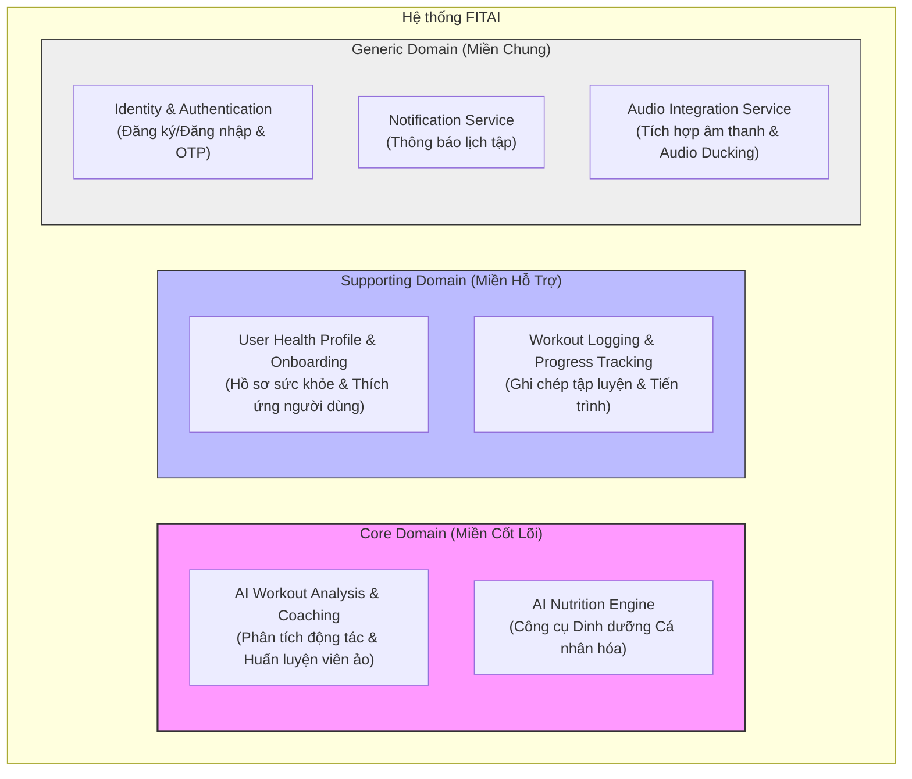

# 2. Khám Phá Miền Nghiệp Vụ (Domain Discovery) - FITAI

Tài liệu này thực hiện phân rã hệ thống **FITAI** thành các miền con (Subdomains) dựa trên mức độ quan trọng và giá trị kinh doanh cốt lõi.

---

## 2.1 Bản Đồ Phân Rã Miền Con (Subdomain Mapping)

Hệ thống được chia thành 3 loại miền con chính: **Core Domain** (Miền cốt lõi), **Supporting Domain** (Miền hỗ trợ), và **Generic Domain** (Miền chung).

---

## 2.2 Chi Tiết Các Miền Con (Subdomain Details)

### 1. Core Domain (Miền Cốt Lõi)
Đây là các thành phần tạo nên giá trị cạnh tranh độc nhất của FITAI và giải quyết trực tiếp mục tiêu an toàn (`OB-02`, `OB-04`) và dinh dưỡng cá nhân hóa (`OB-05`).
* **AI Workout Analysis & Coaching**:
  * **Nghiệp vụ**: Xác định khung xương (33 điểm khớp), tính toán ROM%, phát hiện lỗi kỹ thuật, đưa ra âm thanh cảnh báo thời gian thực (< 500ms), tự động đếm rep, ước lượng khối lượng tạ, và tự động điều chỉnh giáo án dựa trên hiệu năng tập luyện sau mỗi 2 tuần.
  * **Giá trị**: Giảm chấn thương, chuẩn hóa tư thế cho người mới tập, và thay thế PT thực tế.
* **AI Nutrition Engine**:
  * **Nghiệp vụ**: Tính toán calo/macros cá nhân hóa sâu theo TDEE, cung cấp 3 lựa chọn món ăn theo ngân sách (Tiết kiệm, Phổ thông, Thoải mái), áp dụng thuật toán **Anti-Repetition** (khóa protein 7 ngày, tinh bột 5 ngày, chủ đề món ăn 3 ngày).
  * **Giá trị**: Tối ưu thực đơn dinh dưỡng, chống nhàm chán và phù hợp ngân sách.

### 2. Supporting Domain (Miền Hỗ Trợ)
Các miền này không tạo lợi thế cạnh tranh trực tiếp nhưng cần thiết để miền cốt lõi hoạt động bình thường.
* **User Health Profile & Onboarding**:
  * **Nghiệp vụ**: Khai báo chỉ số cơ thể, mục tiêu tập luyện, tiền sử bệnh lý và chấn thương. Áp dụng quy tắc hoàn thiện hồ sơ $\ge 80\%$ để kích hoạt AI Coach.
* **Workout Logging & Progress Tracking**:
  * **Nghiệp vụ**: Ghi nhận kết quả các Set tập (cho phép sửa tay nếu AI nhận diện lệch), đo lường 1RM (công thức Epley), ghi nhận kỷ lục cá nhân (PR), biểu đồ xu hướng cân nặng và điểm kỹ thuật.

### 3. Generic Domain (Miền Chung)
Các miền tiêu chuẩn, có thể tái sử dụng giải pháp có sẵn hoặc thư viện bên thứ ba.
* **Identity & Authentication**: Đăng ký, đăng nhập qua Email, OTP điện thoại, Google/Apple/Facebook OAuth.
* **Notification Service**: Gửi Push Notification nhắc nhở tập luyện trước 15 phút dựa trên lịch cố định.
* **Audio Integration Service**: Tích hợp nhạc nền (EDM/Lofi) và kiểm soát giảm âm lượng (Audio Ducking) khi có giọng nói sửa lỗi của AI Camera.
