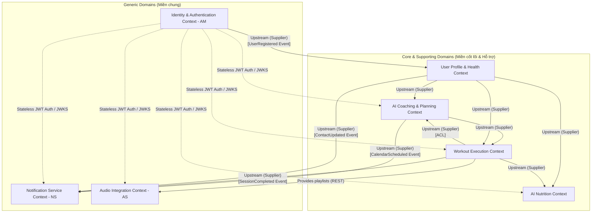
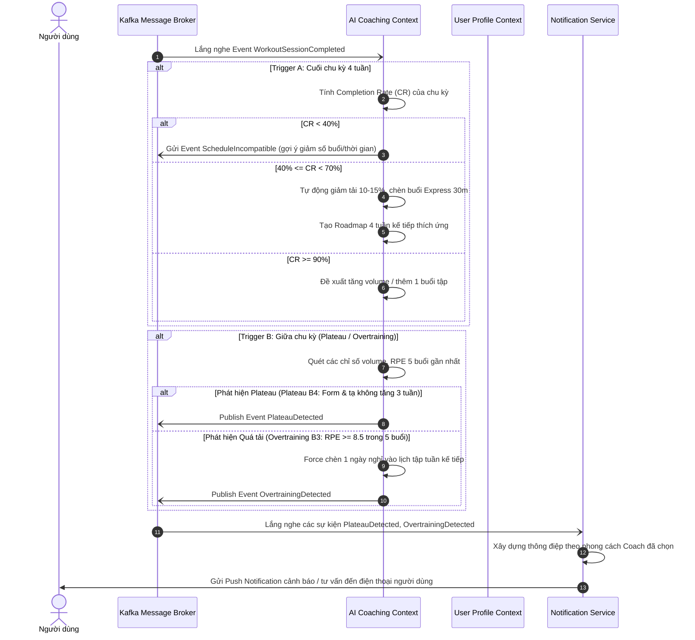

# 4. Bản Đồ Ngữ Cảnh (Context Map) - FITAI

Tài liệu này đặc tả mối quan hệ giữa các Bounded Contexts, hướng di chuyển của dữ liệu, và các giao thức tích hợp (Integration Patterns) nhằm đảm bảo hệ thống có sự tách biệt rõ ràng và không bị phụ thuộc vòng tròn (Circular Dependency).

---

## 4.1 Sơ Đồ Context Map Toàn Hệ Thống

Dưới đây là sơ đồ mở rộng thể hiện ranh giới và tương tác giữa các Bounded Context thuộc Core/Supporting Domains với các dịch vụ thuộc Generic Domains (AM, NS, AS).



---

## 4.2 Chi Tiết Các Mối Quan Hệ Tích Hợp (Core & Supporting)

### 1. User Profile Context [Upstream - Supplier] ──► AI Coaching Context [Downstream - Customer]
* **Mối quan hệ**: **Customer-Supplier**.
* **Mô tả**: Khi người dùng đăng ký hoặc cập nhật hồ sơ sức khỏe (đặc biệt là chấn thương mới hoặc mục tiêu luyện tập), hệ thống phải thông báo cho ngữ cảnh lập kế hoạch.
* **Giao tiếp**: Bắn sự kiện miền `HealthProfileUpdated`, `NewInjuryReported` qua Message Broker.
* **Chính sách hạ lưu**: AI Coaching đón nhận và cập nhật ngay lập tức: loại trừ các bài tập vào nhóm cơ bị chấn thương, thiết lập lại volume tuần.

### 2. User Profile Context [Upstream - Supplier] ──► AI Nutrition Context [Downstream - Customer]
* **Mối quan hệ**: **Customer-Supplier**.
* **Mô tả**: Dinh dưỡng cần các dữ liệu thô (chiều cao, cân nặng, giới tính, tuổi) để chạy công thức Mifflin-St Jeor nhằm thiết lập TDEE.
* **Giao tiếp**: Đồng bộ sự kiện `UserMetricsUpdated` và `HealthGoalChanged`.

### 3. AI Coaching Context [Upstream - Supplier] ──► Workout Execution Context [Downstream - Customer]
* **Mối quan hệ**: **Customer-Supplier**.
* **Mô tả**: Khi người dùng bắt đầu buổi tập, Workout Execution cần gọi gRPC/REST lấy thông tin bài tập, set, rep và tạ gợi ý của ngày hôm đó do AI Coaching lập lịch JIT.
* **Giao tiếp**: gọi lấy thông tin buổi tập của ngày hiện tại (`GetTodayWorkoutSession`).

### 4. Workout Execution Context [Upstream - Supplier] ──► AI Coaching Context [Downstream - Customer]
* **Mối quan hệ**: **Customer-Supplier** kết hợp **Anti-Corruption Layer (ACL)**.
* **Mô tả**: Kết quả tập luyện thực tế (Số rep, cân nặng thực nâng, điểm Form, chỉ số RPE) là đầu vào để AI Coaching đánh giá điều chỉnh giáo án hàng ngày (JIT) và điều chỉnh lộ trình thích ứng (Trigger A/B).
* **Vai trò của ACL**: Tầng bảo vệ (ACL) nằm ở phía đầu vào của AI Coaching Context. Nó lọc các dữ liệu thô phức tạp của buổi tập (ví dụ tọa độ khung xương hay lỗi chi tiết từng giây) và các buổi tập bất thường (Anomalous Session do quá 240 phút không tương tác) và chỉ dịch thành dữ liệu hiệu suất tổng hợp (`AggregateWorkoutPerformance`) để tránh gây ô nhiễm mô hình nghiệp vụ lên lịch.
* **Giao tiếp**: Sự kiện tích hợp `WorkoutSessionCompleted`.

### 5. Workout Execution Context [Upstream - Supplier] ──► AI Nutrition Context [Downstream - Customer]
* **Mối quan hệ**: **Customer-Supplier**.
* **Mô tả**: AI Nutrition sử dụng calo tiêu thụ từ buổi tập thực tế để điều chỉnh lượng Calo nạp thêm trong ngày.
* **Giao tiếp**: Sự kiện `WorkoutCaloriesBurned` (nằm trong payload `WorkoutSessionCompleted`).

---

## 4.3 Tích Hợp Với & Giữa Các Generic Domains (Miền Chung)

### 1. Tương tác với Identity & Authentication Context (AM)
* **Khởi tạo dữ liệu người dùng**: 
  * Khi người dùng đăng ký tài khoản thành công qua OTP/OAuth, AM phát đi sự kiện `UserRegistered`.
  * **User Profile Context** lắng nghe sự kiện này để tự động tạo bản ghi hồ sơ sức khỏe trống cho UserID mới.
* **Xác thực yêu cầu (Authentication & Authorization)**:
  * AM hoạt động như một dịch vụ **Upstream (Supplier)** cung cấp cơ chế xác thực Token phi trạng thái (Stateless).
  * AM cung cấp endpoint JWKS (`GET /api/v1/auth/.well-known/jwks.json`) để các service khác (bao gồm cả Core, Supporting và Generic) tự giải mã/xác thực JWT cục bộ tại bộ nhớ mà không cần gọi gRPC/REST trực tiếp về AM trên mỗi request.

### 2. Tương tác với Notification Service (NS)
* **Nhắc lịch tập luyện**:
  * **AI Coaching Context** phát đi sự kiện `CalendarScheduled` khi lịch tập mới được khởi tạo hoặc thay đổi. NS lắng nghe sự kiện này để xếp hàng lịch gửi tin đẩy (Push Notification) trước buổi tập 15 phút.
* **Báo cáo thành tích & Động viên**:
  * **Workout Execution Context** phát đi sự kiện `SessionCompleted`. NS lắng nghe sự kiện để gửi thông báo chúc mừng kèm theo tóm tắt số Volume tạ nâng hoặc kỷ lục mới (PR).
* **Đồng bộ thông tin liên lạc**:
  * **User Profile Context** phát đi sự kiện `ContactUpdated` (khi thay đổi Email/Số điện thoại). NS lắng nghe để cập nhật danh mục địa chỉ nhận thông báo.
* **Xác thực bảo mật**:
  * NS gọi AM để xác thực token khi admin hoặc user thực hiện quản lý cấu hình thông báo.

### 3. Tương tác với Audio Integration Context (AS)
* **Đồng bộ cấu hình danh sách phát**:
  * Trong lúc đang tập luyện (cả AI và Non-AI), **Workout Execution Context** gửi yêu cầu REST/gRPC lấy thông tin playlist hoặc bài hát từ AS (`GetPlaylistConfig`) để phát cho người dùng.
* **Lưu ý về Audio Ducking**:
  * Audio Ducking là luồng xử lý thời gian thực, vì vậy để đảm bảo độ trễ < 500ms, cơ chế giảm âm lượng được thực hiện **hoàn toàn ở Client (Edge AI)** qua Web Audio API, Android AudioFocusRequest hoặc iOS AVAudioSession. Server `AS` không tham gia xử lý luồng ducking để loại bỏ hoàn toàn độ trễ mạng.

---

## 4.4 Định Nghĩa Giao Thức Truyền Thông (Communication Protocols)

* **Đồng bộ (Synchronous)**: Sử dụng REST API / gRPC cho các truy vấn tức thời, ví dụ như truy xuất bài tập hôm nay (`GetTodayWorkoutSession`), gọi kiểm tra trạng thái token hoặc gửi yêu cầu danh sách phát nhạc (`GetPlaylistConfig`).
* **Bất đồng bộ (Asynchronous)**: Sử dụng mô hình xuất bản - đăng ký (Publish-Subscribe) qua Message Broker (Kafka hoặc RabbitMQ) cho các sự kiện nghiệp vụ (VD: `UserRegistered`, `WorkoutSessionCompleted`, `ProfileCompleted`, `CalendarScheduled`). Điều này đảm bảo tính chịu lỗi cao và giảm mức độ gắn kết (decoupling).

---

## 4.5 Đặc Tả Chi Tiết Luồng Hoạt Động Giữa Các Bounded Contexts

### 1. Danh Sách Các Luồng gRPC Đồng Bộ

| STT | Luồng giao tiếp | Module gọi (Client) | Module nhận (Server) | Tên Service & Phương thức gRPC | Tham số Request | Dữ liệu Response | Mục đích Nghiệp vụ |
|:---|:---|:---|:---|:---|:---|:---|:---|
| **1** | **Xác thực Token** | Mọi Module (Middleware) | `auth` | `AuthService.ValidateToken` | `token` (string) | `isValid` (bool), `userId` (string), `roles` (string[]) | Xác minh tính hợp lệ của token JWT trước khi cho phép vào use case. |
| **2** | **Lấy Hồ sơ Sức khỏe** | `coaching`, `nutrition` | `profile` | `ProfileService.GetHealthProfile` | `userId` (string) | `userId`, `age`, `gender`, `height`, `weight`, `goal`, `injuries` (string[]), `diseases` (string[]), `equipmentList` (string[]), `foodRestrictions` (string[]) | Lấy thông tin cơ bản để AI lập kế hoạch/sinh giáo án JIT và dinh dưỡng thích hợp. |
| **3** | **Cập nhật Thông tin Ngữ cảnh** | `coaching`, `nutrition` | `profile` | `ProfileService.UpdateContextInfo` | `userId`, `equipmentList` (string[]), `foodRestrictions` (string[]) | `success` (bool) | Cập nhật thiết bị và dị ứng thu thập qua chatbot trong quá trình sử dụng. |
| **4** | **Lấy Giáo án JIT Hôm Nay** | `workout` | `coaching` | `CoachingService.GetTodayWorkoutSession` | `userId` (string), `date` (string) | `sessionId`, `title`, `muscleGroup`, `exercises` (ExerciseSpec[]) | Lấy giáo án chi tiết ngày hôm nay đã được sinh JIT để thực thi. |
| **5** | **Lấy Lịch sử Luyện tập** | `coaching` | `workout_log` | `WorkoutLogService.GetWorkoutHistory` | `userId` (string), `limitSessions` (int32) | `sessions` (WorkoutSessionSummary[]) | Lấy dữ liệu RPE, Volume, và Form Score buổi trước để sinh giáo án JIT và tính Trigger A/B. |
| **6** | **Gửi Thông báo Đẩy** | `coaching`, `workout` | `notification` | `NotificationService.SendPushNotification` | `userId`, `title`, `body`, `payload` (string) | `success` (bool) | Gửi thông báo nhắc lịch tập hoặc báo cáo thành tích ngay lập tức. |
| **7** | **Lấy Danh Sách Bài Hát** | `workout` | `audio` | `AudioService.GetPlaylistConfig` | `playlistId` (string) | `playlistId`, `name`, `songs` (Song[]) | Lấy thông tin bài hát và đường dẫn stream nhạc nền cho buổi tập. |

---

### 2. Danh Sách Các Luồng Sự Kiện Bất Đồng Bộ (Kafka Topics)

#### Topic: `fitai.auth.events`
* **Event: `contracts.generic.auth.v1.userRegistered`**
  - **Producer**: `auth` | **Consumer**: `profile`
  - **Payload**:
    ```json
    {
      "userId": "usr_9812739123",
      "email": "user@example.com",
      "phone": "+84901234567",
      "createdAt": "2026-07-03T07:20:00Z"
    }
    ```
  - **Mục đích**: `profile` lắng nghe để khởi tạo tài khoản hồ sơ sức khỏe trống cho người dùng mới.

#### Topic: `fitai.profile.events`
* **Event: `contracts.supporting.profile.v1.profileCompleted`**
  - **Producer**: `profile` | **Consumer**: `coaching`, `nutrition`
  - **Payload**:
    ```json
    {
      "userId": "usr_9812739123",
      "completionRate": 85.0,
      "goal": "TĂNG_CƠ",
      "completedAt": "2026-07-03T07:22:00Z"
    }
    ```
  - **Mục đích**: Kích hoạt việc tạo Roadmap 4 tuần, Lịch tập tuần của AI Coach và tính toán TDEE/Thực đơn gợi ý đầu tiên của AI Nutrition.

* **Event: `contracts.supporting.profile.v1.healthProfileUpdated`**
  - **Producer**: `profile` | **Consumer**: `coaching`, `nutrition`
  - **Payload**:
    ```json
    {
      "userId": "usr_9812739123",
      "weight": 72.5,
      "height": 175.0,
      "goal": "GIẢM_MỠ",
      "updatedAt": "2026-07-03T10:15:00Z"
    }
    ```
  - **Mục đích**: Cập nhật lại chỉ số TDEE/thực đơn mới và điều chỉnh roadmap tập luyện tương ứng.

* **Event: `contracts.supporting.profile.v1.newInjuryReported`**
  - **Producer**: `profile` | **Consumer**: `coaching`
  - **Payload**:
    ```json
    {
      "userId": "usr_9812739123",
      "injuryArea": "GỐI",
      "reportedAt": "2026-07-03T10:16:00Z"
    }
    ```
  - **Mục đích**: Loại trừ ngay lập tức các bài tập tác động vào gối khỏi các giáo án JIT kế tiếp.

#### Topic: `fitai.workout.events`
* **Event: `contracts.core.workout.v1.workoutSessionCompleted`**
  - **Producer**: `workout` | **Consumer**: `coaching`, `nutrition`, `profile`, `notification`
  - **Payload**:
    ```json
    {
      "userId": "usr_9812739123",
      "sessionId": "ses_0912380123",
      "durationMinutes": 65,
      "totalVolume": 3200.0,
      "averageFormScore": 82.5,
      "averageRPE": 7.5,
      "isAICamera": true,
      "isAnomalous": false,
      "caloriesBurned": 420.0,
      "completedAt": "2026-07-03T08:30:00Z"
    }
    ```
  - **Mục đích**:
    - `coaching`: Ghi nhận volume để tính Progressive Overload, quét 4 tín hiệu hành vi Trigger B.
    - `nutrition`: Tự động cộng 420 calo tiêu hao vào hạn mức năng lượng nạp trong ngày của người dùng.
    - `profile`: Cập nhật tiến trình lịch sử tập luyện.
    - `notification`: Gửi tin chúc mừng hoàn thành và PR mới (nếu có).

#### Topic: `fitai.coaching.events`
* **Event: `contracts.core.coaching.v1.plateauDetected`**
  - **Producer**: `coaching` | **Consumer**: `notification`
  - **Payload**: `{ "userId": "usr_9812739123", "recommendation": "DELOAD_WEEK", "detectedAt": "2026-07-03T21:00:00Z" }`
  - **Mục đích**: Gửi thông báo khuyến nghị Deload Week hoặc đổi bài tập để vượt ngưỡng plateau.

* **Event: `contracts.core.coaching.v1.overtrainingDetected`**
  - **Producer**: `coaching` | **Consumer**: `profile`, `notification`
  - **Payload**: `{ "userId": "usr_9812739123", "suggestedRestDays": 1, "detectedAt": "2026-07-03T21:05:00Z" }`
  - **Mục đích**: Ghi nhận và thông báo ép buộc nghỉ ngơi 1 ngày để phục hồi cơ bắp.

---

### 3. Sơ Đồ Tuần Tự Luồng Nghiệp Vụ Quan Trọng

#### A. Luồng Sinh Giáo Án JIT & Thực Thi Buổi Tập (Cả AI & Non-AI)
Sơ đồ dưới đây mô tả luồng khi người dùng mở ứng dụng và thực hiện tập luyện:

```mermaid
sequenceDiagram
    autonumber
    actor User as Người dùng
    participant App as Mobile/Web Client
    participant CP as AI Coaching Context
    participant WL as Workout Log (WE)
    participant UP as User Profile Context
    participant AS as Audio Context

    User->>App: Mở App / Vào ngày tập
    App->>CP: Yêu cầu sinh giáo án JIT (userId)
    CP->>UP: Gọi gRPC GetHealthProfile(userId)
    UP-->>CP: Trả về chỉ số, chấn thương, thiết bị
    CP->>WL: Gọi gRPC GetWorkoutHistory(userId, 1) (Lấy buổi trước)
    WL-->>CP: Trả về RPE, Form, Volume buổi trước
    CP->>CP: Chạy thuật toán sinh giáo án JIT (Warm-up/Cool-down, bài tập, set, rep, tạ gợi ý)
    CP-->>App: Trả về giáo án chi tiết hôm nay
    
    User->>App: Bấm Check-in bắt đầu tập
    App->>AS: Gọi REST GetPlaylistConfig(playlistId)
    AS-->>App: Trả về link streaming nhạc nền
    
    alt Nhánh tập AI Camera
        App->>App: Khởi chạy local MediaPipe, phân tích skeleton & ROM% tại client
        alt Phát hiện lỗi tư thế
            App->>App: Thực thi Audio Ducking tại client (giảm nhạc nền xuống 20%)
            App->>App: Phát Voice Alert hướng dẫn sửa lỗi tức thì (<500ms)
            App->>App: Khôi phục nhạc nền về 100% khi phát xong
        else Động tác chuẩn
            App->>App: Đếm rep, cộng Form Score
        end
        User->>App: Xác nhận kết quả Set (Hệ thống tự điền)
    else Nhánh tập Phi AI (Tự ghi nhận)
        App->>App: Hiển thị Timer đếm ngược, nhạc nền và video hướng dẫn
        User->>App: Tự tập và nhập thủ công Set (rep, tạ), điểm Form = N/A
    end

    User->>App: Bấm Kết thúc buổi tập
    App->>WL: Gọi gRPC SaveWorkoutSession(sessionData)
    WL->>WL: Lưu Postgres & Mongo, tính volume
    WL-->>App: Lưu thành công
    WL-)Kafka: Publish Event WorkoutSessionCompleted
```



#### B. Luồng Đánh Giá Thích Ứng Lộ Trình (Trigger A & Trigger B)
Sơ đồ dưới đây mô tả cách hệ thống tự động điều chỉnh kế hoạch tập của người dùng:


