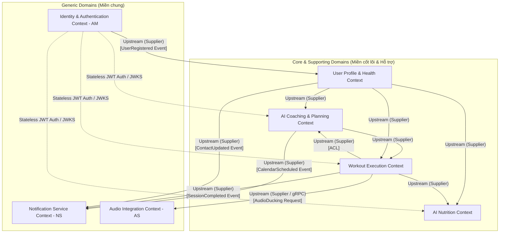

# 4. Bản Đồ Ngữ Cảnh (Context Map) - FITAI

Tài liệu này đặc tả mối quan hệ giữa các Bounded Contexts, hướng di chuyển của dữ liệu, và các giao thức tích hợp (Integration Patterns) nhằm đảm bảo hệ thống có sự tách biệt rõ ràng và không bị phụ thuộc vòng tròn (Circular Dependency).

---

## 4.1 Sơ Đồ Context Map Toàn Hệ Thống

Dưới đây là sơ đồ mở rộng thể hiện ranh giới và tương tác giữa các Bounded Context thuộc Core/Supporting Domains với các dịch vụ thuộc Generic Domains (AM, NS, AS).

---

## 4.2 Chi Tiết Các Mối Quan Hệ Tích Hợp (Core & Supporting)

### 1. User Profile Context [Upstream - Supplier] ──► AI Coaching Context [Downstream - Customer]
* **Mối quan hệ**: **Customer-Supplier**.
* **Mô tả**: Khi người dùng đăng ký hoặc cập nhật hồ sơ sức khỏe (đặc biệt là chấn thương mới hoặc mục tiêu luyện tập), hệ thống phải thông báo cho ngữ cảnh lập kế hoạch.
* **Giao tiếp**: Bắn sự kiện miền `HealthProfileUpdated`, `NewInjuryReported` qua Message Broker.
* **Chính sách hạ lưu**: AI Coaching đón nhận và cập nhật ngay lập tức: loại trừ các bài tập vào nhóm cơ bị chấn thương, thiết lập lại volume tuần.

### 2. User Profile Context [Upstream - Supplier] ──► AI Nutrition Context [Downstream - Customer]
* **Mối quan hệ**: **Customer-Supplier**.
* **Mô tả**: Dinh dưỡng cần các dữ liệu thô (chiều cao, cân nặng, giới tính, tuổi) để chạy công thức Mifflin-St Jeor nhằm thiết lập TDEE.
* **Giao tiếp**: Đồng bộ sự kiện `UserMetricsUpdated` và `HealthGoalChanged`.

### 3. AI Coaching Context [Upstream - Supplier] ──► Workout Execution Context [Downstream - Customer]
* **Mối quan hệ**: **Customer-Supplier**.
* **Mô tả**: Khi người dùng vào tập, Workout Execution cần biết danh sách bài tập, số Set, Rep, và cân nặng mục tiêu của ngày hôm đó do AI Coaching lập lịch.
* **Giao tiếp**: REST API gọi lấy thông tin buổi tập của ngày hiện tại (`GetTodayWorkoutSession`).

### 4. Workout Execution Context [Upstream - Supplier] ──► AI Coaching Context [Downstream - Customer]
* **Mối quan hệ**: **Customer-Supplier** kết hợp **Anti-Corruption Layer (ACL)**.
* **Mô tả**: Kết quả tập luyện thực tế (Số rep, cân nặng thực nâng, điểm Form, chỉ số RPE) là đầu vào để AI Coaching đánh giá điều chỉnh giáo án mỗi 2 tuần.
* **Vai trò của ACL**: Tầng bảo vệ (ACL) nằm ở phía đầu vào của AI Coaching Context. Nó lọc các dữ liệu thô phức tạp của buổi tập (ví dụ tọa độ khung xương hay lỗi chi tiết từng giây) và chỉ dịch thành dữ liệu hiệu suất tổng hợp (`AggregateWorkoutPerformance`) để tránh gây ô nhiễm mô hình nghiệp vụ lên lịch.
* **Giao tiếp**: Sự kiện tích hợp `WorkoutSessionCompleted`.

### 5. Workout Execution Context [Upstream - Supplier] ──► AI Nutrition Context [Downstream - Customer]
* **Mối quan hệ**: **Customer-Supplier**.
* **Mô tả**: AI Nutrition sử dụng calo tiêu thụ từ buổi tập thực tế để điều chỉnh lượng Calo và Carb tiêu thụ trong ngày.
* **Giao tiếp**: Sự kiện `WorkoutCaloriesBurned`.

---

## 4.3 Tích Hợp Với Các Generic Domains (Miền Chung)

### 1. Tương tác với Identity & Authentication Context (AM)
* **Khởi tạo dữ liệu người dùng**: 
  * Khi người dùng đăng ký tài khoản thành công qua OTP/OAuth, AM phát đi sự kiện `UserRegistered` (dưới dạng JSON/Protobuf).
  * **User Profile Context** lắng nghe sự kiện này để tự động tạo bản ghi hồ sơ sức khỏe trống cho UserID mới.
* **Xác thực yêu cầu (Authentication & Authorization)**:
  * AM hoạt động như một dịch vụ **Upstream (Supplier)** cung cấp cơ chế xác thực Token phi trạng thái (Stateless).
  * AM cung cấp endpoint JWKS (`GET /api/v1/auth/.well-known/jwks.json`) để các service khác tải Public Key về và tự giải mã/xác thực JWT cục bộ tại bộ nhớ mà không cần gọi gRPC/REST trực tiếp về AM trên mỗi request.

### 2. Tương tác với Notification Service (NS)
* **Nhắc lịch tập luyện**:
  * **AI Coaching Context** phát đi sự kiện `CalendarScheduled` khi lịch tập mới được khởi tạo hoặc thay đổi. NS lắng nghe sự kiện này để xếp hàng lịch gửi tin đẩy (Push Notification) trước buổi tập 15 phút.
* **Báo cáo thành tích & Động viên**:
  * **Workout Execution Context** phát đi sự kiện `SessionCompleted`. NS lắng nghe sự kiện để gửi thông báo chúc mừng kèm theo tóm tắt số Volume tạ nâng hoặc kỷ lục mới (PR).
* **Đồng bộ thông tin liên lạc**:
  * **User Profile Context** phát đi sự kiện `ContactUpdated` (khi thay đổi Email/Số điện thoại). NS lắng nghe để cập nhật danh mục địa chỉ nhận thông báo.

### 3. Tương tác với Audio Integration Context (AS)
* **Điều phối giảm âm lượng thông minh (Audio Ducking) thời gian thực**:
  * Trong lúc đang tập luyện, **Workout Execution Context** (thông qua bộ AI đánh giá tư thế cục bộ) phát hiện lỗi kỹ thuật nguy hiểm (ví dụ: cong lưng khi Squat/Deadlift).
  * `WE` ngay lập tức gửi một yêu cầu đồng bộ qua **gRPC** (`RequestAudioDuckingRequest`) sang `AS`.
  * `AS` hạ âm lượng nhạc nền (EDM/Lofi) của ứng dụng xuống 20% và phát file âm thanh cảnh báo lỗi cụ thể (ví dụ: *"Hãy thẳng lưng"*).
  * Khi file âm thanh cảnh báo hoàn thành, `AS` trả về kết quả thành công và khôi phục âm lượng nhạc nền ban đầu về 100%.

---

## 4.4 Định Nghĩa Giao Thức Truyền Thông (Communication Protocols)
* **Đồng bộ (Synchronous)**: Sử dụng REST API / gRPC cho các truy vấn tức thời, ví dụ như truy xuất bài tập hôm nay (`GetTodayWorkoutSession`), gọi kiểm tra trạng thái token hoặc gửi yêu cầu giảm âm lượng khẩn cấp (`RequestAudioDucking`).
* **Bất đồng bộ (Asynchronous)**: Sử dụng mô hình xuất bản - đăng ký (Publish-Subscribe) qua Message Broker (Kafka hoặc RabbitMQ) cho các sự kiện nghiệp vụ (VD: `UserRegistered`, `WorkoutSessionCompleted`, `ProfileCompleted`, `CalendarScheduled`). Điều này đảm bảo tính chịu lỗi cao và giảm mức độ gắn kết (decoupling).
