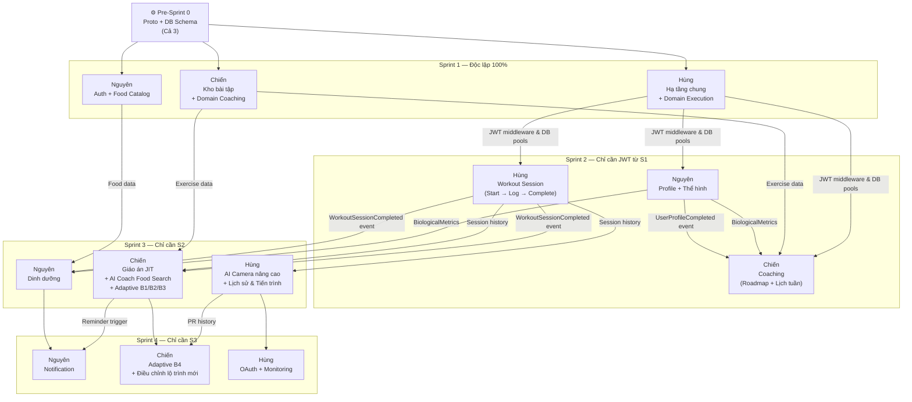

# FITAI — Backend Sprint Plan
> 3 người · 2 tuần/sprint · Parallel-First

---

## Phân công Bounded Context & Ownership

| Người | Mảng | Chịu trách nhiệm |
|---|---|---|
| **Nguyên** | Data & Nutrition | Auth · User Profile · Food Catalog · Dinh dưỡng · Notification |
| **Chiến** | Planning Brain | Kho bài tập · Coaching & Lập lịch · AI Coach Integration · Adaptive Engine |
| **Hùng** | Execution Engine | Hạ tầng chung · Thực thi buổi tập · Lịch sử cá nhân & Tiến trình |

---

## Phân loại chức năng Client vs Backend

| Chức năng | Loại | Ghi chú |
|---|---|---|
| Phát nhạc, chọn playlist theo bài tập | 🔵 **Client** | Backend không xử lý streaming nhạc |
| Audio Ducking (tự giảm nhạc khi AI nói) | 🔵 **Client** | Logic âm thanh hoàn toàn phía thiết bị |
| Overlay tư thế, hiển thị skeleton | 🔵 **Client** | Render trên camera frame |
| AI Pose Tracking 33 điểm khớp, đếm rep, đo ROM% | 🔵 **Client** | Xử lý on-device (Edge AI); backend chỉ nhận kết quả số |
| Hướng dẫn sửa sai bằng giọng nói (nội dung text cảnh báo) | 🟢 **Backend** | Hùng xây dựng — Backend sinh kịch bản lỗi, Client đọc và phát âm thanh |
| Đẩy Push Notification | 🟡 **Integration** | Backend soạn nội dung, FCM/APNs gửi đi |
| Đăng nhập Google / Apple / Facebook | 🟡 **Integration** | Backend xác minh OAuth token từ 3rd party |
| Upload raw skeleton data lên cloud | 🟡 **Integration** | Client tự upload Blob Storage, không qua API chính |

---

## Pre-Sprint 0 — 3 ngày, cả 3 người

> **Gate cứng**: Proto xong + Docker Compose chạy được → mới bắt đầu Sprint 1.

| Người | Việc |
|---|---|
| **Nguyên** | Định nghĩa proto `auth/v1`, `profile/v1`, `nutrition/v1` · Tạo Docker Compose, Makefile (`make proto-gen`) |
| **Chiến** | Định nghĩa proto `workout/v1`: Exercise, MotionSpec, Coaching messages, sự kiện `UserProfileCompleted`, `RoadmapInitiated` |
| **Hùng** | Định nghĩa proto `workout_log/v1`, **message `MotionResult`** (dữ liệu AI Camera trả về), sự kiện `WorkoutSessionCompleted`, `BodyMetricUpdated` |
| **Cả 3** | Review chéo proto · `buf lint` + `buf breaking` · Thống nhất PostgreSQL schema isolation (`auth` / `profile` / `workout` / `nutrition`) · Thiết kế bảng `outbox_events` |

---

## Sprint Plan

---

### 🏃 Sprint 1 — Nền móng & Kho dữ liệu

> ✅ **3 nhánh độc lập hoàn toàn** — không ai chờ ai.
> Mỗi người làm thứ không có runtime dependency vào context khác: hạ tầng, admin CRUD, và domain thuần (pure Go, không DB, không HTTP).

| Người | Mảng | Xây dựng gì |
|---|---|---|
| **Nguyên** | Auth + Food Catalog | **Hệ thống tài khoản**: Đăng ký email/SĐT (gửi OTP xác thực), đăng nhập trả JWT, refresh/revoke token, khóa tài khoản 15 phút sau 3 lần nhập sai, phân quyền Admin vs User<br/>**Kho thực phẩm** (Admin): Thêm/sửa/xóa thực phẩm (calo, macro, nhãn chay/Halal, dị ứng thực phẩm), Admin phê duyệt kích hoạt · Tìm kiếm thực phẩm theo tên |
| **Chiến** | Kho bài tập + Domain Coaching | **Thư viện bài tập** (Admin): Thêm/sửa/xóa bài tập, gửi duyệt, Admin phê duyệt kích hoạt · Tìm kiếm theo tên/nhóm cơ · Quản lý cấu hình AI cho từng bài (PoseTemplate, quy tắc đếm rep, tiêu chí chấm điểm tư thế)<br/>**Domain Coaching** (pure Go, chưa có DB/HTTP): Xây dựng aggregate `WorkoutRoadmap`, `WeeklySchedule`, `DailyWorkoutPlan` và `OverloadValidator` với unit test ≥ 90% |
| **Hùng** | Hạ tầng chung + Domain Execution | **Hạ tầng chung**: Kết nối DB (Postgres, Redis, MongoDB), Eventbus + bảng Outbox, JWT middleware, rate limiter, logger<br/>**Domain Workout Execution** (pure Go, chưa có DB/HTTP): Xây dựng aggregate `WorkoutSession`, `WorkoutSetLog`, `WorkoutPerformance` / `PersonalRecord`, domain service `TrainingLoadGuard` với unit test ≥ 90% |

---

### 🏃 Sprint 2 — Luồng nghiệp vụ cốt lõi

> ✅ **3 nhánh độc lập** — dependency duy nhất là JWT middleware và DB pool từ S1 do Hùng hoàn thành.
> Chiến, Hùng dùng **mock interface** cho data từ context khác khi unit test.

| Người | Mảng | Xây dựng gì |
|---|---|---|
| **Nguyên** | User Profile + Theo dõi thể hình | **Hoàn thiện hồ sơ sức khỏe**: User nhập tuổi, giới tính, chiều cao, cân nặng, mục tiêu (Tăng cơ/Giảm mỡ), khung giờ tập, phong cách Coach · Hệ thống tính % hoàn thiện hồ sơ — đạt 80% thì bật AI Coach và phát sự kiện `UserProfileCompleted`<br/>**Báo chấn thương**: Khai báo vùng bị thương (vai, gối...) → phát `InjuryReported` để Coaching loại bài tập tác động vùng đó<br/>**Theo dõi thể hình**: User nhập cân nặng, % mỡ, số đo định kỳ |
| **Chiến** | Coaching & Lập lịch | **Sinh lộ trình tập**: Nhận sự kiện `UserProfileCompleted` → tự động tạo lộ trình tổng quan 4 tuần + lịch tập tuần đầu (phân bổ nhóm cơ theo ngày, kiểm tra Progressive Overload ≤ 10%)<br/>**Quản lý lịch**: Xem lộ trình hiện tại · Sinh lịch tập tuần tiếp theo |
| **Hùng** | Thực thi buổi tập (Cơ bản + Loa sửa sai) | **Bắt đầu buổi tập**: Tạo session, kiểm tra không có session nào đang dở<br/>**Ghi lại từng set — cơ bản**:<br/>— Nhánh AI Camera *(Cơ bản)*: Nhận kết quả từ Client (rep hợp lệ, ROM%, Form Score, RPE) · **Tính năng phát loa**: Backend trả về nội dung text cảnh báo/sửa tư thế tương ứng dựa trên lỗi góc khớp hoặc ROM% (ví dụ: "Gối hơi chụm, hãy mở rộng gối ra"), Client nhận text để phát âm thanh ra loa.<br/>— Nhánh tự nhập: User điền số rep, tạ, RPE thủ công (Form Score = N/A)<br/>**Kết thúc buổi tập**: Kiểm tra tải lượng bất thường (> 250% trung bình 5 buổi gần nhất → cảnh báo + chèn ngày nghỉ), tính tổng kết buổi, tự động đóng session sau 240 phút không tương tác (đánh dấu bất thường), phát sự kiện `WorkoutSessionCompleted` |

---

### 🏃 Sprint 3 — Tính năng thông minh & Dinh dưỡng

> ✅ **3 nhánh độc lập** — Sprint 2 đã xong toàn bộ prerequisite.

| Người | Mảng | Xây dựng gì |
|---|---|---|
| **Nguyên** | Dinh dưỡng Core & Rules | **Thực đơn ngày tự động**: Tính calo + macro theo thể trạng (Mifflin-St Jeor), sinh gợi ý 3 bữa chính + 1 phụ theo 3 mức giá (tiết kiệm / phổ thông / thoải mái) · **Gợi ý mặc định** khi user chưa cấu hình sở thích.<br/>**Chống lặp món**: Không lặp nguồn protein chính trong 7 ngày, tinh bột 5 ngày, chủ đề món 3 ngày<br/>**Nhật ký ăn uống**: Tìm kiếm món ăn theo tên, ghi nhận khẩu phần thực tế · Cập nhật danh sách nguyên liệu bị khóa<br/>**Điều chỉnh calo tự động**: Ngày tập nặng tăng 10%, ngày nghỉ giảm 10% (nhận từ `WorkoutSessionCompleted`) · Cơ chế tự động mở khóa (unlock lockout) sớm nhất nếu hết nguồn protein hợp lệ. |
| **Chiến** | Giáo án theo ngày + AI Coach Food Search | **Giáo án theo ngày (JIT)**: Trước buổi tập, check-in hỏi tình trạng hôm nay (form tĩnh + câu hỏi động từ AI Coach), tự sinh giáo án chi tiết (bài tập + set/rep/tạ dựa trên kỷ lục 1RM, kèm bài khởi động/giãn cơ) · Xử lý chấn thương → thay bài phù hợp<br/>**AI Coach tìm kiếm thực phẩm**: Cung cấp API/tool tích hợp để AI Coach tìm kiếm thực phẩm theo sở thích, dị ứng, và ngân sách của user. AI Coach gọi API này như một công cụ (tool call), sau đó Nutrition domain (của Nguyên) tự kiểm duyệt kết quả (lọc dị ứng, kiểm tra lockout).<br/>**AI tự động phát hiện sự cố**:<br/>— **Nghỉ 7 ngày không tập**: Gửi tin hỏi thăm theo phong cách Coach đã chọn + đề xuất 3 phương án (tiếp tục / đặt lại lịch / tạm dừng)<br/>— **Hay bỏ cùng một ngày trong tuần** (≥ 3 lần liên tiếp): Đề xuất chuyển sang ngày khác còn trống<br/>— **Tập quá tải** (≥ 2 buổi/ngày hoặc RPE ≥ 8.5 liên tục 5 buổi): Cảnh báo và bắt buộc chèn ngày nghỉ |
| **Hùng** | AI Camera nâng cao + Lịch sử & Tiến trình | **AI Camera *(Nâng cao)* & Sửa sai giọng nói**: Tích hợp hướng dẫn kỹ thuật thuyết minh (đọc text hướng dẫn bài tập). Kiểm tra chống gian lận (nếu < 50% frame nhận diện khớp → gắn cờ không đạt xác thực). Xử lý edge case: phòng tối / bài nằm sàn → tự động chuyển sang nhánh tự nhập.<br/>**Lịch sử tập luyện**: Xem danh sách các buổi tập đã qua (lịch sử tập luyện thực tế), lọc theo ngày/nhóm cơ.<br/>**Kỷ lục cá nhân & Tiến trình**: Tính kỷ lục 1RM mới sau mỗi buổi (Epley Formula) · Xem biểu đồ xu hướng biến động cân nặng, sức mạnh (1RM) và điểm Form trung bình (đáp ứng FR-PT-02). |

---

### 🏃 Sprint 4 — Hoàn thiện & Đánh giá thích ứng

> ✅ **3 nhánh độc lập** — Sprint 3 đã xong toàn bộ prerequisite.

| Người | Mảng | Xây dựng gì |
|---|---|---|
| **Nguyên** | Push Notification | **Hệ thống thông báo**: Tích hợp FCM/APNs · Gửi nhắc nhở tập trước 15 phút (trigger từ Coaching) · Gửi chúc mừng khi đạt kỷ lục mới |
| **Chiến** | Adaptive B4 + Đánh giá chu kỳ | **Phát hiện đình trệ tiến bộ (B4)**: 1RM và điểm Form Score không tăng trong 3 tuần liên tiếp (chỉ tính tuần tập đủ ≥ 70%) → Đề xuất 3 phương án: Giảm tải 1 tuần (Deload), đổi sang bài tập tương đương, hoặc tăng số set giữ nguyên tạ<br/>**Tổng kết & Điều chỉnh lộ trình**: Hết chu kỳ 4 tuần, tự động tính tỉ lệ hoàn thành buổi tập thực tế (CR). Tự động sinh lộ trình chu kỳ mới tương ứng theo 4 mức hoàn thành (Ví dụ: dưới 40% tự động giảm tải; trên 90% đề xuất tăng thêm buổi hoặc nâng tạ). |
| **Hùng** | OAuth + Monitoring | **Đăng nhập mạng xã hội**: Xác thực Google / Apple / Facebook<br/>**Dashboard giám sát** (Admin): Endpoint Prometheus theo dõi tỉ lệ request thành công, thời gian phản hồi, tỉ lệ lỗi hệ thống |

---

### 🏃 Sprint 5 — Kiểm thử & Ổn định hóa

| Việc | Người |
|---|---|
| Integration test: Auth + Profile + Nutrition full flow | Nguyên |
| Integration test: Roadmap → DailyPlan → Adaptive cycle | Chiến |
| Integration test: WorkoutSession → sự kiện → Nutrition + Adaptive | Hùng |
| E2E: Đăng ký → Hồ sơ → Roadmap → Tập → Kết thúc → Adaptive điều chỉnh | Cả 3 |
| Performance test: 100 request đồng thời CompleteSession | Cả 3 |
| Hardening Outbox (đảm bảo sự kiện không bị mất) | Nguyên lead |

---

## Ma trận Phủ Nghiệp vụ (Traceability Matrix)

Để đảm bảo sau khi hoàn thành 5 Sprint, backend hoàn toàn đáp ứng 100% tài liệu nghiệp vụ và các Use Case:

### 1. Phủ các Báo cáo Nghiệp vụ Cốt lõi (BABOK FRs)

| Mã FR | Tên Nghiệp vụ | Sprint | Người phụ trách |
|---|---|---|---|
| **FR-UM-01** | Đăng ký/Đăng nhập (Email/SĐT/OAuth) | Sprint 1 & 4 | Nguyên (Core) & Hùng (OAuth) |
| **FR-UM-02** | Hoàn thiện hồ sơ sinh học | Sprint 2 | Nguyên |
| **FR-UM-03** | Khung giờ tập cố định | Sprint 2 | Nguyên |
| **FR-UM-04** | Đẩy Push Notification nhắc nhở | Sprint 4 | Nguyên (gửi) & Chiến (trigger) |
| **FR-AC-01** | Lập lộ trình 4 tuần & Lịch tuần | Sprint 2 | Chiến |
| **FR-AC-02** | Progressive Overload ≤ 10% | Sprint 1 & 2 | Chiến |
| **FR-AC-03** | Xử lý buổi bỏ tập (không dồn bù) | Sprint 2 | Chiến |
| **FR-AC-04** | Quy tắc CR cuối chu kỳ điều chỉnh giáo án | Sprint 4 | Chiến |
| **FR-AC-05** | Quản lý phong cách Coach | Sprint 2 & 3 | Nguyên (hồ sơ) & Chiến (check-in) |
| **FR-AC-06** | Giáo án JIT hàng ngày | Sprint 3 | Chiến |
| **FR-AC-07** | Bài tập khởi động/giãn cơ | Sprint 3 | Chiến |
| **FR-CC-01** | Cấu hình PoseTemplate/Rep rules | Sprint 1 | Chiến |
| **FR-CC-02** | Đo lường góc ROM khớp | Sprint 2 & 3 | Hùng |
| **FR-CC-03** | Phát hiện lỗi tư thế | Sprint 2 & 3 | Hùng |
| **FR-CC-04** | Hướng dẫn sửa tư thế bằng giọng nói | Sprint 2 & 3 | Hùng |
| **FR-CC-05** | Chấm điểm kỹ thuật Form Score | Sprint 2 & 3 | Hùng |
| **FR-WL-01** | Ghi chép tự động AI Camera | Sprint 2 & 3 | Hùng |
| **FR-WL-02** | Ghi chép thủ công Phi AI (Timer, nhạc) | Sprint 2 | Hùng |
| **FR-WL-03** | Audio Ducking tự giảm nhạc nền | 🔵 Client | *(Không thuộc Backend)* |
| **FR-WL-04** | Ghi nhận PR (1RM Epley) | Sprint 2 & 3 | Hùng |
| **FR-NU-01** | Tính calo cá nhân (Mifflin-St Jeor) | Sprint 3 | Nguyên |
| **FR-NU-02** | Gợi ý thực đơn 3 mức giá | Sprint 3 | Nguyên |
| **FR-NU-03** | Chống lặp món ăn (lockout) | Sprint 3 | Nguyên |
| **FR-NU-04** | Nhật ký ăn uống | Sprint 3 | Nguyên |
| **FR-PT-01** | Cập nhật chỉ số cơ thể, số đo | Sprint 2 | Nguyên |
| **FR-PT-02** | Phân tích xu hướng (biểu đồ 1RM, cân nặng, Form) | Sprint 3 | Hùng |
| **FR-PT-03** | Báo cáo định kỳ AI phân tích sâu | Sprint 3 | Chiến (tích hợp check-in) |
| **FR-SM-01** | Catalog bài tập Admin | Sprint 1 | Chiến |
| **FR-SM-02** | Catalog dinh dưỡng Admin | Sprint 1 | Nguyên |
| **FR-SM-03** | Dashboard giám sát (Prometheus) | Sprint 4 | Hùng |

### 2. Phủ các Use Cases (UC)

| Mã UC | Tên Use Case | Sprint | Người phụ trách |
|---|---|---|---|
| **UC-01.1** | RegisterUser | Sprint 1 | Nguyên |
| **UC-01.2** | CompleteHealthProfile | Sprint 2 | Nguyên |
| **UC-01.3** | ReportInjury | Sprint 2 | Nguyên |
| **UC-02.1** | InitiateRoadmap | Sprint 2 | Chiến |
| **UC-02.2** | GenerateDailyWorkoutPlan | Sprint 3 | Chiến |
| **UC-02.3** | GenerateWeeklySchedule | Sprint 2 | Chiến |
| **UC-03.1** | StartWorkoutSession | Sprint 2 | Hùng |
| **UC-03.2** | LogSet (AI Camera & Loa cảnh báo) | Sprint 2 & 3 | Hùng |
| **UC-03.3** | LogSet (Phi AI) | Sprint 2 | Hùng |
| **UC-03.4** | CompleteWorkoutSession | Sprint 2 | Hùng |
| **UC-03.5** | RecordPersonalRecord | Sprint 3 | Hùng |
| **UC-04.1** | EvaluateEndOfCycleCompletionRate | Sprint 4 | Chiến |
| **UC-04.2** | DetectSignalB1 (Nghỉ tập) | Sprint 3 | Chiến |
| **UC-04.3** | DetectSignalB2 (Đổi slot ngày tập) | Sprint 3 | Chiến |
| **UC-04.4** | DetectSignalB3 (Cảnh báo quá tải) | Sprint 3 | Chiến |
| **UC-04.5** | DetectSignalB4 (Đình trệ tiến bộ) | Sprint 4 | Chiến |
| **UC-05.1** | GenerateDailyNutritionPlan | Sprint 3 | Nguyên |

---

## Dependency Graph



---

## Kiến nghị phát triển song song hiệu quả

1. **Sử dụng Interface để mock dependencies**:
   Chiến (Coaching) và Nguyên (Nutrition) cần gọi dữ liệu thể hình từ User Profile (Nguyên). Chiến tự viết interface đọc dữ liệu trong module của mình:
   ```go
   type UserProfileReader interface {
       GetBiologicalMetrics(ctx context.Context, userID string) (*domain.BiologicalMetrics, error)
   }
   ```
   Chiến tự viết mock struct để làm unit test. Khi Nguyên viết xong Profile, Nguyên chỉ cần implement interface này và cắm vào router. Cả hai hoàn toàn làm độc lập.

2. **Dựa vào Domain Events & Outbox Pattern**:
   Hùng publish `WorkoutSessionCompleted`. Nguyên lắng nghe để đổi calo, Chiến lắng nghe để cập nhật Adaptive Engine. Không ai gọi trực tiếp API của ai. Toàn bộ giao tiếp là bất đồng bộ (eventual consistency) thông qua Eventbus.

3. **Chia module Go độc lập trong Monorepo**:
   Không có merge conflict vì mỗi người sở hữu thư mục code riêng:
   ```
    internal/auth/                      → Nguyên
    internal/profile/                   → Nguyên
    internal/nutrition/                 → Nguyên (bao gồm Dinh dưỡng & Kho thực phẩm)
    internal/notification/              → Nguyên

    internal/workout/catalog/           → Chiến (Kho bài tập)
    internal/workout/coaching/          → Chiến

    internal/workout/execution/         → Hùng
    internal/workout_log/               → Hùng
   ```

---

## Rủi ro kiến trúc cần giải quyết trước Sprint 3

| # | Rủi ro | Mức | Hành động |
|---|---|---|---|
| R-01 | **`MotionResult` chưa có đặc tả**: AI Camera trả về định dạng gì (ROM%, góc khớp, rep count)? | 🔴 Cao | Hùng viết proto trong Pre-Sprint 0. Thiếu sẽ block LogSet AI Sprint 2. |
| R-02 | **Đặc tả AI Agent (ADR-02) chưa hoàn thành**: AI Coach gọi tool-call tìm kiếm món ăn thế nào? Định dạng JSON trả về? | 🔴 Cao | Cần ADR-03 trước Sprint 3. Thiếu sẽ block tính năng AI Coach của Chiến và Dinh dưỡng của Nguyên. |
| R-03 | **WorkoutTemplate chưa có schema**: Backend tính set/rep/tạ từ 1RM dựa trên template nào? | 🟡 Trung | Chiến thiết kế trong Sprint 1, dùng Sprint 3. |
| R-04 | **Tránh xung đột cấu trúc module `workout/`**: Chiến và Hùng cùng làm việc chung trong folder `workout/` | 🟡 Trung | Thống nhất ranh giới thư mục `coaching/` và `execution/` trong Pre-Sprint 0. |

---
*FITAI BRD v1.7 · Bounded Context · DDD Tactical · ADR 01–02 · 2026-07-07*
