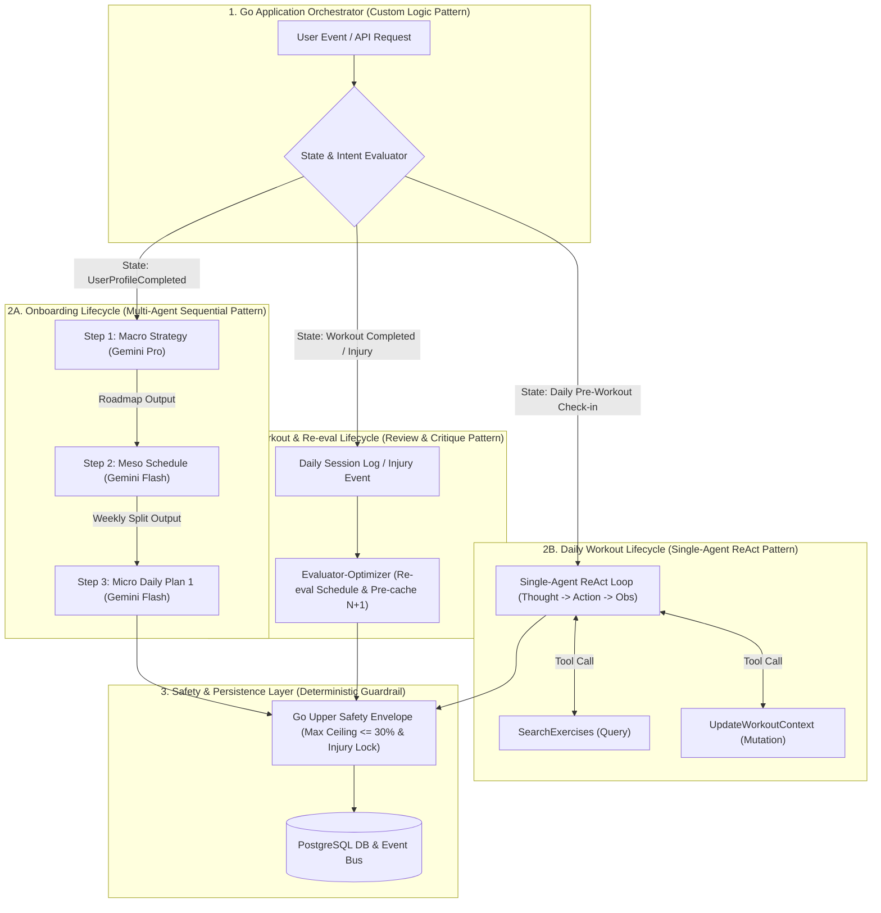

# ADR-001: Agentic Workflow Architecture for Coaching & Planning

## Status
Accepted

## Context
Module Coaching & Planning cần lựa chọn kiến trúc điều phối AI Agent để khởi tạo và quản lý kế hoạch tập luyện ở 3 cấp độ:
- **Macro Cycle**: Lộ trình 4 tuần (`WorkoutRoadmap`).
- **Meso Cycle**: Lịch tập 7 ngày (`WeeklySchedule`).
- **Micro Cycle**: Giáo án chi tiết hàng ngày (`DailyWorkoutPlan`).

Thiết kế phải thỏa mãn các yêu cầu:
1. **Năng lực suy luận tự do (Agentic Autonomy)**: AI Agent toàn quyền quyết định bài tập, thứ tự, set, rep, mức tạ, RPE và thời gian nghỉ.
2. **An toàn xác định (Deterministic Safety)**: Tuyệt đối không vi phạm chấn thương active và kiểm soát giới hạn biên độ điều chỉnh tải trọng ($\pm 30\%$ Load Adjustment Ceiling, BR-AC-02).
3. **Độ trễ phản hồi thấp (Low Perceived Latency)**: Đảm bảo thời gian chờ của người dùng khi mở ứng dụng hàng ngày xấp xỉ 0ms.
4. **Tối ưu chi phí (Cost Efficiency)**: Giảm chi phí token tiêu thụ trên quy mô lớn ($100,000+$ DAU).

---

## Options Considered

### Option 1: Monolithic Single-Shot Pipeline
Sử dụng một câu lệnh duy nhất để gọi AI Agent sinh trọn gói cả 3 cấp độ kế hoạch trong một luồng thực thi đồng bộ.
- **Ưu điểm**: Đơn giản ở giao diện gọi dịch vụ.
- **Nhược điểm**: Thời gian phản hồi chậm (3–6s), nguy cơ thất bại gộp (Rollback cả 3 kế hoạch nếu 1 phần bị lỗi), tốn token lặp lại cho các dữ liệu tĩnh.

### Option 2: Pure Direct LLM Agent (No Safety Layer)
Trao toàn bộ quyền xử lý cho duy nhất 1 LLM Agent không qua tầng kiểm soát an toàn của Go Backend.
- **Ưu điểm**: Đơn giản hóa mã nguồn Backend.
- **Nhược điểm**: Rủi ro ảo giác tải trọng gây chấn thương cho người dùng; sập luồng khi API timeout.

### Option 3: Hybrid Custom Logic Pattern (Selected)
Sử dụng bộ điều phối trạng thái (**Go Application Orchestrator**) kết hợp 3 dạng Agentic Workflows chuyên biệt và Khung an toàn kép (**Dual-Gate Safety Envelope**).

---

## Decision
Lựa chọn **Option 3: Hybrid Custom Logic Pattern**.

### Sơ đồ Luồng Kiến Trúc (Mermaid)

### Chi Tiết Thiết Kế Các Luồng Thực Thi
1. **Luồng Onboarding (Sequential Pattern)**: Khi có sự kiện `UserProfileCompleted`, thực thi chuỗi bất đồng bộ: Macro (Gemini Pro) $\rightarrow$ Meso (Gemini Flash) $\rightarrow$ Micro (Gemini Flash). Mỗi bước tương ứng 1 Transaction / 1 Aggregate Root độc lập.
2. **Luồng Tập Hàng Ngày (Single-Agent ReAct Pattern)**: Khi người dùng check-in trước buổi tập, kích hoạt ReAct Loop trên Gemini Flash với 2 Tools (`SearchExercises`, `UpdateWorkoutContext`). Phản hồi trong $< 1$s.
3. **Luồng Sau Buổi Tập (Review & Critique Pattern)**: Khi hoàn thành buổi tập hoặc có sự kiện chấn thương, Evaluator Agent đánh giá chỉ số RPE/Form Score, cập nhật PR 1RM và ngầm **Pre-cache sinh sẵn giáo án cho buổi $N+1$** (`DraftCached`).
4. **Khung An Toàn Kép (Dual-Gate Safety Envelope)**: 
   - *Gate 1 (Pre-AI Filter)*: Go Backend lọc bỏ bài tập vi phạm chấn thương active hoặc thiếu thiết bị trước khi gửi danh sách ID cho LLM.
   - *Gate 2 (Post-AI Safety Envelope)*: Go Backend kiểm tra giới hạn biên độ điều chỉnh tải trọng ($\pm 30\%$, BR-AC-02) và luật ngày nghỉ ($\ge 1$ ngày/tuần, BR-AC-01). Tự động hạ/nâng về trần hợp lệ nếu vượt ngưỡng.

---

## Rationale
1. **Phù hợp bản chất vòng đời nghiệp vụ**: Phân rã chính xác giữa luồng khởi tạo ban đầu và luồng tương tác hàng ngày, loại bỏ việc tái tạo dữ liệu không cần thiết.
2. **Loại bỏ độ trễ phản hồi**: Cơ chế Pre-caching ở luồng 2C giúp người dùng mở ứng dụng hàng ngày nhận giáo án ngay lập tức (0ms perceived latency).
3. **Đảm bảo an toàn tuyệt đối**: Tầng Dual-Gate Safety của Go Backend triệt tiêu hoàn toàn rủi ro ảo giác tải trọng và vi phạm chấn thương.
4. **Tối ưu chi phí vận hành**: Tác vụ hàng ngày chỉ kích hoạt ReAct Loop ngắn trên Gemini Flash, giảm 90% chi phí token.

---

## Consequences

### Positive
- **Độ tin cậy cao**: Phân rã 3 DB Transactions độc lập, khắc phục sự cố bán phần và không giữ kết nối DB khi chờ AI.
- **Khả năng mở rộng Tích hợp Liên-Agent**: Dễ dàng kết nối với AI Nutrition Agent và AI Camera Coach thông qua chuẩn Event-Driven Architecture (CloudEvents) mà không gây coupling.
- **Linh hoạt đa mô hình**: Kết hợp Gemini Pro cho tác vụ lập chiến lược dài hạn và Gemini Flash cho tác vụ hàng ngày.

### Negative
- Tăng độ phức tạp quản lý trạng thái điều hướng luồng (State Machine) tại tầng Go Application.
