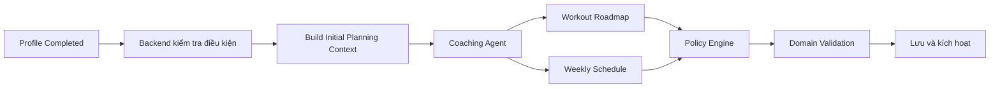
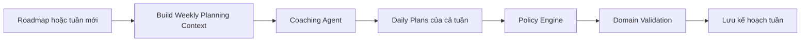
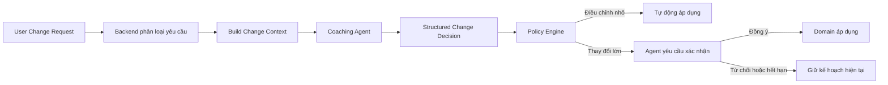
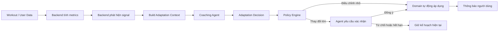
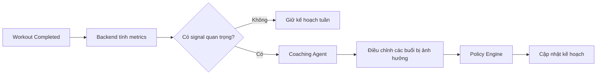
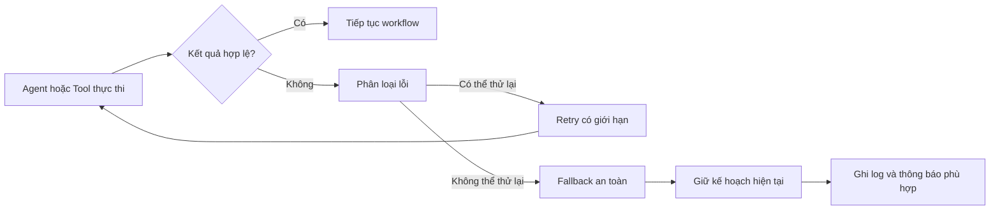

# Coaching & Planning Context Architecture

## 1. Mục tiêu

`Coaching & Planning Context` chịu trách nhiệm:

- Khởi tạo lộ trình tập luyện dài hạn.
- Sinh kế hoạch tập chi tiết theo tuần.
- Điều chỉnh roadmap, lịch tập và khối lượng tập theo yêu cầu người dùng.
- Phản ứng với các tín hiệu được Backend phát hiện từ dữ liệu thực tế.
- Đảm bảo mọi thay đổi đều vượt qua Policy Engine và Domain Invariant.

Kiến trúc sử dụng mô hình:

```text
Backend Workflow
→ Context Builder
→ Coaching Agent
→ Policy Engine
→ Domain
→ Persistence / Event
```

Backend sở hữu nghiệp vụ và dữ liệu. Agent chỉ phân tích và tạo quyết định có cấu trúc.

---

## 2. Thành phần chính

### Coaching Application Workflow

Điều phối các flow nghiệp vụ:

- Khởi tạo roadmap.
- Sinh kế hoạch tuần.
- Xử lý yêu cầu thay đổi.
- Xử lý signal từ Backend.
- Áp dụng hoặc từ chối quyết định của Agent.

### Context Builder

Chuẩn bị dữ liệu chắc chắn cần cho từng Agent goal.

Ví dụ:

- Hồ sơ tập luyện.
- Mục tiêu.
- Chấn thương đang active.
- Roadmap hiện tại.
- Lịch tập hiện tại.
- Chỉ số hiệu suất đã được Backend tổng hợp.
- Policy limits.

### Coaching Agent

Agent chịu trách nhiệm:

- Phân tích ngữ cảnh.
- Lựa chọn phương án.
- Gọi tool khi cần truy vấn sâu.
- Tạo structured decision.

Agent không được:

- Ghi trực tiếp database.
- Tự thay đổi aggregate.
- Tự bỏ qua business rule.
- Tự tính các chỉ số đã có công thức xác định.

### Policy Engine

Kiểm tra:

- Số buổi tối đa mỗi tuần.
- Ngày nghỉ bắt buộc.
- Giới hạn điều chỉnh tải.
- Chấn thương.
- Overtraining.
- Plateau.
- Post-injury adaptation.
- Các business rule liên quan.

### Domain

Các domain object chính:

- `WorkoutRoadmap`
- `WeeklySchedule`
- `DailyWorkoutPlan`
- Không cần persistent `LongTermAdjustmentProposal` ở giai đoạn đầu; trạng thái chờ xác nhận được quản lý bằng ADK session/checkpoint.

---

# 3. Core Flow 1 — Initialize Roadmap

## Mục tiêu

Khởi tạo lộ trình tập luyện sau khi hồ sơ người dùng đủ điều kiện.



## Kết quả

- `WorkoutRoadmap` cho chu kỳ 4 tuần.
- `WeeklySchedule` mô tả ngày tập và nhóm cơ.
- Chi tiết các buổi tập của tuần đầu tiên.

## Quy tắc

- Không vượt quá số buổi cho phép.
- Phải có ngày nghỉ.
- Không đưa bài vi phạm chấn thương vào kế hoạch.
- Roadmap, schedule và daily plan không nằm trong cùng một transaction dài.

---

# 4. Core Flow 2 — Generate Weekly Workout Plans

## Mục tiêu

Sinh trước toàn bộ `DailyWorkoutPlan` cho một tuần để người dùng có thể xem trước và sử dụng ngay.



## Nguyên tắc

- Sinh chi tiết theo tuần, không cần gọi Agent lại mỗi ngày nếu context không thay đổi.
- Mỗi ngày vẫn có `DailyWorkoutPlan` riêng.
- Khi có signal mới, chỉ điều chỉnh các buổi bị ảnh hưởng.
- Không sinh lại toàn bộ roadmap nếu chỉ cần sửa một buổi.

---

# 5. Core Flow 3 — Handle User Change Request

## Mục tiêu

Lắng nghe yêu cầu thay đổi trực tiếp từ người dùng.

Ví dụ:

- Muốn đổi ngày tập.
- Muốn giảm số buổi.
- Muốn tăng hoặc giảm cường độ.
- Muốn đổi bài.
- Thiếu thiết bị.
- Chỉ có ít thời gian.
- Muốn thay đổi mục tiêu.



## Phân loại thay đổi

### Điều chỉnh nhỏ

Có thể tự động áp dụng:

- Đổi bài tương đương.
- Giảm set hoặc rep.
- Điều chỉnh thời gian nghỉ.
- Rút ngắn buổi tập.
- Điều chỉnh mức tải trong giới hạn.
- Thay warm-up hoặc cooldown.

### Điều chỉnh dài hạn

Cần xác nhận bất đồng bộ:

- Đổi số buổi mỗi tuần.
- Đổi lịch cố định.
- Pause roadmap.
- Đổi mục tiêu.
- Deload Week.
- Thay cấu trúc roadmap.

Với thay đổi lớn, Agent sử dụng Human-in-the-loop: checkpoint trạng thái, tạm dừng, nhận phản hồi và tiếp tục cùng workflow. Không cần tạo bảng proposal riêng ở giai đoạn đầu.

---

# 6. Core Flow 4 — React to Backend Signals

## Mục tiêu

Backend phát hiện các hiện tượng từ dữ liệu tập luyện và yêu cầu Coaching Agent đưa ra phương án thích ứng.

Backend chịu trách nhiệm phát hiện signal bằng logic xác định.

Agent chịu trách nhiệm phân tích ý nghĩa và lựa chọn phương án.



## Các signal chính

### Inactivity

Ví dụ:

```text
Không hoạt động 7 ngày liên tiếp
```

Agent có thể đề xuất:

- Giảm số buổi.
- Rút ngắn thời lượng.
- Tạo lịch quay lại nhẹ hơn.
- Pause roadmap.

### Schedule Mismatch

Ví dụ:

```text
Liên tục bỏ cùng một ngày trong tuần
```

Agent có thể:

- Đề xuất đổi ngày.
- Chuyển buổi đó thành buổi ngắn.
- Phân bổ lại lịch tuần.

### Overtraining

Ví dụ:

```text
RPE cao liên tục
hoặc
nhiều buổi trong cùng một ngày
```

Agent có thể:

- Giảm volume.
- Chèn ngày nghỉ.
- Chèn Active Recovery.
- Giảm cường độ tuần tiếp theo.

### Plateau

Ví dụ:

```text
1RM và Form Score không tiến bộ trong nhiều tuần
```

Agent có thể:

- Chèn Deload Week.
- Đổi biến thể bài tập.
- Tăng set nhưng giữ tải.
- Thay cấu trúc progression.

### Injury

Ví dụ:

```text
Người dùng báo chấn thương mới
```

Hệ thống:

- Backend khóa các bài liên quan.
- Agent thay bằng bài an toàn.
- Điều chỉnh các buổi còn lại trong tuần.
- Áp dụng cơ chế bảo vệ sau phục hồi.

### Abnormal Training Load

Ví dụ:

```text
Khối lượng tập vượt xa mức trung bình gần đây
```

Agent có thể:

- Giảm tải buổi tiếp theo.
- Chèn ngày nghỉ.
- Điều chỉnh lịch nhóm cơ liên quan.

---

# 7. Core Flow 5 — Post-Workout Update

## Mục tiêu

Sau mỗi buổi tập, cập nhật dữ liệu và quyết định xem kế hoạch tuần có cần thay đổi hay không.



Không mặc định sinh lại toàn bộ tuần sau mỗi buổi.

Chỉ điều chỉnh khi có tín hiệu đủ mạnh.

---

# 8. Error Handling and Recovery

## Mục tiêu

Không để lỗi model, tool hoặc dữ liệu làm hỏng roadmap đang hoạt động.



## Chính sách khử lỗi

### Agent timeout hoặc model unavailable

- Retry tối đa theo cấu hình.
- Dùng exponential backoff.
- Nếu vẫn lỗi, giữ kế hoạch hiện tại.
- Không tạo thay đổi domain một phần.

### Tool timeout hoặc dependency unavailable

- Chỉ retry với thao tác đọc an toàn.
- Không retry mutation nếu chưa có idempotency key.
- Có thể dùng cache gần nhất nếu dữ liệu cho phép stale.
- Dữ liệu sức khỏe và chấn thương không dùng cache cũ để ra quyết định nguy hiểm.

### Structured output không hợp lệ

- Validate schema ngay sau khi Agent trả kết quả.
- Cho Agent sửa kết quả với feedback cụ thể.
- Giới hạn số vòng sửa.
- Nếu vẫn lỗi, chuyển sang fallback.

### Policy từ chối

- Trả violation rõ ràng cho Agent.
- Agent được sửa phương án trong số vòng giới hạn.
- Nếu không tạo được phương án hợp lệ, giữ kế hoạch hiện tại.

### Context bị stale

Trước khi commit:

```text
candidate.context_version == current_context_version
```

Nếu khác:

- Không áp dụng candidate cũ.
- Rebuild context.
- Chạy lại Agent nếu thay đổi ảnh hưởng quyết định.

### Human-in-the-loop lỗi hoặc hết hạn

- Checkpoint phải có TTL.
- Nếu user từ chối hoặc không phản hồi đúng hạn, giữ nguyên kế hoạch.
- Khi resume, phải kiểm tra lại context và policy.
- Không áp dụng trực tiếp quyết định được tạo từ context đã cũ.

### Event xử lý lặp

- Mỗi event có idempotency key.
- Handler kiểm tra event đã xử lý trước khi chạy Agent.
- Domain command phải chống áp dụng cùng một thay đổi nhiều lần.

## Fallback mặc định

```text
Không đủ dữ liệu
→ giữ kế hoạch hiện tại

Agent thất bại
→ giữ kế hoạch hiện tại

Signal an toàn nghiêm trọng
→ áp dụng deterministic safety action

Không tìm được bài phù hợp
→ loại bài rủi ro và dùng phương án an toàn đã định nghĩa

Không xác nhận thay đổi lớn
→ không áp dụng
```

---

# 9. Agent Goals

Giai đoạn đầu chỉ cần một `Coaching Orchestrator Agent`.

Agent nhận các goal sau:

```text
INITIALIZE_ROADMAP
GENERATE_WEEKLY_PLANS
HANDLE_USER_CHANGE
HANDLE_BACKEND_SIGNAL
ADJUST_AFTER_WORKOUT
REVIEW_ROADMAP
```

Một goal tương ứng với một workflow, không cần tạo một agent riêng cho mỗi goal.

---

# 10. Context Strategy

```text
Dữ liệu luôn cần
→ Backend preload

Dữ liệu chỉ cần theo nhánh
→ Agent gọi tool

Chỉ số có công thức xác định
→ Backend tính

Lựa chọn phương án mở
→ Agent quyết định
```

Ví dụ context preload:

- Mục tiêu.
- Kinh nghiệm.
- Roadmap hiện tại.
- Lịch tuần hiện tại.
- Chấn thương active.
- Thiết bị.
- Metrics đã tổng hợp.
- Policy limits.

Tool chỉ dùng khi cần:

```text
get_exercise_history
get_recovery_trend
get_coaching_memory
search_eligible_exercises
find_safe_substitutions
```

---

# 11. External Dependencies

Coaching Context cần các capability từ context khác.

| Context | Coaching cần |
|---|---|
| Profile | Mục tiêu, kinh nghiệm, chấn thương, lịch khả dụng |
| Exercise | Danh sách bài hợp lệ và bài thay thế |
| Workout Execution | Workout result, RPE, Form Score, volume |
| Progress | 1RM, completion rate, trend |
| Notification | Thông báo thay đổi kế hoạch |
| Authentication | User identity |

Nếu code thật của một dependency chưa tồn tại:

- Coaching chỉ định nghĩa port cần thiết.
- Không tự triển khai business logic của context đó.
- Ghi rõ blocker trong kế hoạch triển khai.

---

# 12. Source Structure

```text
internal/coaching/
├── domain/
│   ├── roadmap/
│   ├── schedule/
│   └── dailyplan/
├── application/
│   ├── command/
│   ├── query/
│   ├── event/
│   ├── contextbuilder/
│   └── port/
├── infrastructure/
│   ├── persistence/
│   ├── agent/
│   │   └── adk/
│   ├── policy/
│   ├── tools/
│   └── messaging/
└── transport/
```

---

# 13. Tóm tắt kiến trúc

```text
Initialize Roadmap
→ tạo roadmap, schedule và kế hoạch tuần đầu

Generate Weekly Plans
→ sinh toàn bộ DailyWorkoutPlan cho tuần

User Change Request
→ Agent phân tích
→ thay đổi nhỏ tự động
→ thay đổi lớn dùng Human-in-the-loop

Backend Signal
→ Backend phát hiện
→ Agent chọn phương án thích ứng
→ xác nhận nếu thay đổi lớn

Post-Workout
→ chỉ điều chỉnh khi có signal quan trọng

Policy
→ kiểm tra mọi quyết định

Domain
→ áp dụng thay đổi hợp lệ
```


---

## 14. Quyết định Human-in-the-loop

Giai đoạn đầu dùng Human-in-the-loop của ADK cho thay đổi lớn để tránh xây thêm persistence lifecycle cho proposal.

```text
Agent tạo phương án
→ checkpoint
→ yêu cầu user xác nhận
→ resume
→ kiểm tra lại context và policy
→ apply hoặc cancel
```

Quyết định này phù hợp khi:

- Số workflow chờ xác nhận còn ít.
- Thời gian chờ có giới hạn.
- ADK session/checkpoint đủ tin cậy.
- Chưa cần dashboard quản lý proposal nghiệp vụ.

Cần chuyển sang Backend-managed proposal khi số lượng workflow chờ lớn, thời gian chờ dài, cần audit nghiệp vụ độc lập hoặc cần xử lý proposal ngoài Agent runtime.
