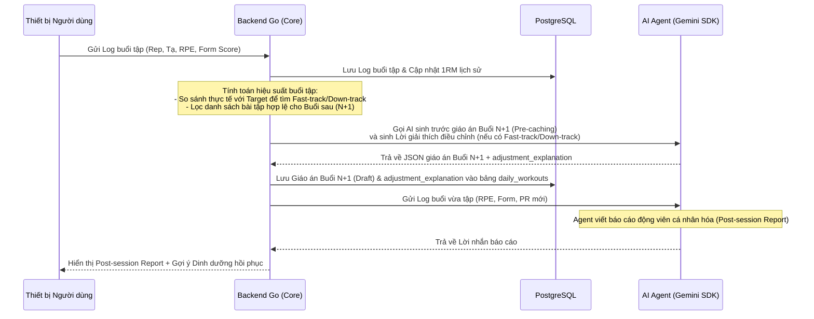

# TÀI LIỆU PHÂN TÁCH TRÁCH NHIỆM: AI AGENT & BACKEND GO
### DỰ ÁN: FITAI (GYM COMPANION) | MÃ TÀI LIỆU: FITAI-ARCH-RE-004

Tài liệu này đặc tả ranh giới kiến trúc, phân chia nhiệm vụ và cơ chế giao tiếp giữa **AI Agent (Reasoning Layer)** và **Backend Go (Deterministic Engine)** cho module Coaching.

---

## 1. Ma Trận Phân Tách Trách Nhiệm (Responsibility Matrix)

| Nhiệm vụ / Tính năng | Vai trò của Backend Go (Deterministic Engine) | Vai trò của AI Agent (Reasoning Layer) |
| :--- | :--- | :--- |
| **1. Quản lý Thư viện bài tập & Dinh dưỡng** | - Lưu trữ và quản lý Database bài tập (Video demo, nhóm cơ, khớp xương tác động).<br>- Lọc danh sách bài tập khả thi (thỏa mãn chấn thương, thiết bị và thời lượng). | - Không quản lý, chỉ sử dụng thông tin được cung cấp qua Tool để đề xuất. |
| **2. Sinh giáo án hàng ngày (DailyWorkout)** | - Cung cấp danh sách bài tập an toàn cho Agent.<br>- Nhận kết quả sắp xếp từ Agent và **áp số tạ, sets, reps cụ thể** bằng thuật toán Epley/Rule Engine. | - Đọc ngữ cảnh của user (mệt mỏi, thiết bị).<br>- Gọi Tool tìm bài tập hợp lệ.<br>- **Lựa chọn và sắp xếp thứ tự bài tập** hợp lý (ví dụ: compound trước, isolation sau). |
| **3. Điều chỉnh tải lượng (Fast-track / Down-track)** | - Nhận log buổi tập, tính toán Form trung bình và RPE.<br>- **Ra quyết định tăng/giảm tạ/volume** dựa trên quy tắc số học (BR-AC-02). | - Nhận thông tin điều chỉnh từ Backend.<br>- **Giải thích lý do** điều chỉnh cho user bằng ngôn ngữ tự nhiên thân thiện theo phong cách Coach đã chọn. |
| **4. Xử lý chấn thương đột xuất** | - Lưu trạng thái chấn thương `active` vào DB.<br>- Lọc bỏ hoàn toàn các bài liên quan đến khớp bị đau khỏi Tool tìm kiếm. | - Đưa ra các câu hỏi/hướng dẫn phục hồi an toàn (không đưa ra chẩn đoán y khoa).<br>- Tái cấu trúc buổi tập hiện tại dựa trên bài tập thay thế an toàn. |
| **5. Xử lý buổi tập bị bỏ lỡ** | - Quản lý trạng thái lịch tập của tuần dương lịch. | - Tạo câu hỏi tương tác ngắn để user tự chọn: Tập bù hay Bỏ qua. |
| **6. Cá nhân hóa phong cách Coach** | - Lưu trữ phong cách huấn luyện được chọn (Drill Sergeant, Best Friend, Data Analyst) trong DB của User Profile. | - Nhận phong cách huấn luyện từ Backend qua Prompt Context để điều chỉnh giọng điệu, ngôn từ giao tiếp phù hợp. |

---

## 2. Kiến Trúc Xử Lý Lỗi Cấp Độ Production (Production Mitigations)

### 2.1 Giảm Thiểu Độ Trễ Bằng Warm-up Rendering & NDJSON Streaming
*   **Hủy & Sinh Lại Cache Dựa Trên Sự Kiện (Event-driven Invalidation & Re-generation)**:
    Khi xảy ra bất kỳ sự thay đổi thể trạng/dụng cụ tập luyện nào của user (thông qua gọi Tool Command `UpdateWorkoutContext`), Backend Go lập tức xóa giáo án cache cũ của buổi tập tiếp theo, đồng thời chạy background job gọi AI Agent sinh lại và lưu đè giáo án cache mới (độ trễ = 0ms khi user vào tập).
*   **NDJSON Streaming kết hợp Warm-up Rendering**:
    Trong trường hợp lệch cache phút chót, Client hiển thị ngay bài tập Warm-up cũ không bị load lại (0ms) để user bắt đầu tập. Cùng lúc đó, Backend Go mở kết nối SSE và stream từng bài tập chính mới do AI Agent sinh (dạng NDJSON) về Client để render progressive (thay thế Loading Skeleton của từng bài).

### 2.2 Cơ Chế Kiểm Soát Kép & Hợp Nhất Chấn Thương (Dual-Gate Validation & Merge Logic)
*   **Merge Logic**: AI Agent trích xuất chấn thương mới (`avoid_joints`) hoặc khớp phục hồi (`recovered_joints`) gửi lên qua Tool `UpdateWorkoutContext`. Backend Go thực hiện hợp nhất:
    $$\text{Khớp khóa cuối cùng} = (\text{Chấn thương active trong DB} \setminus \text{Khớp phục hồi do Agent gửi lên}) \cup \text{Khớp đau mới do Agent gửi lên}$$
    Backend chạy SQL lọc bài tập dựa trên danh sách khớp khóa cuối cùng này và cập nhật trạng thái chấn thương trong DB.
*   **Thích ứng sau phục hồi (BR-AC-09)**: Khớp vừa phục hồi (`recovered`) sẽ được Backend áp dụng quy tắc bảo vệ khớp trong **3 buổi tập đầu tiên** (giảm 50% tải tạ tối đa, ưu tiên bài Bodyweight/Machine an toàn, chỉ overload lại khi RPE $\le 7$ và Form $\ge 80\%$).
*   **Gatekeeper cứng**: Nếu chấn thương nằm trong vùng khớp chịu lực cao (Cột sống, Gối, Vai, Cổ tay), Backend Go cưỡng bức hạ điểm tin cậy (Confidence Score) của Agent về 0%, bắt buộc hiển thị inline banner bắt user xác nhận trên UI.

### 2.3 Lọc Hai Giai Đoạn Tránh "Bịa" Bài Tập (Two-Stage Selection)
*   **Giai đoạn 1 (Backend Filter)**: Backend Go quét DB lọc sẵn khoảng 30-40 bài tập khả thi nhất (đáp ứng đúng thiết bị và chấn thương trong DB).
*   **Giai đoạn 2 (Agent Selection)**: Chỉ truyền danh sách 30-40 bài rút gọn này (kèm ID, Name, Target Muscle) cho Agent. Agent bắt buộc phải chọn bài tập nằm trong danh sách này để xếp giáo án, loại bỏ hoàn toàn việc Agent tự sáng tạo ra bài tập ngoài cơ sở dữ liệu.

### 2.4 Bảo Mật Dữ Liệu Sức Khỏe (Anonymization Pipeline)
*   **Ẩn danh hoá phiên (Pseudonymization)**: Chỉ truyền `anonymous_session_id` ngẫu nhiên và làm tròn chỉ số cơ thể lên Gemini API. Cấu hình Vertex AI ở chế độ Zero Data Retention để bảo vệ dữ liệu theo GDPR/HIPAA.

---

## 3. Quy Trình Kết Thúc Buổi Tập (Post-Workout Flow)

Khi người dùng hoàn thành set cuối cùng của bài tập cuối và bấm nút **"Hoàn thành buổi tập"**:



1.  **Backend Go xử lý**:
    *   Lưu log tập luyện, tính toán PR mới (1RM ước tính) để vinh danh.
    *   Kiểm tra quy tắc **BR-AC-02** (Fast-track / Down-track) để cập nhật Baseline sức mạnh.
    *   Gọi AI Agent sinh trước giáo án cho buổi tiếp theo (Pre-caching).
    *   **Adjustment Explanation**: Lời giải thích lý do tăng/giảm tạ được AI Agent sinh ra và Backend Go lưu vào trường `adjustment_explanation` của bản ghi **Buổi tập $N+1$** (đang ở trạng thái `draft_cached`) để hiển thị ở màn hình chào đầu buổi tập sau.
2.  **AI Agent xử lý**:
    *   Nhận log buổi tập để viết báo cáo cá nhân hóa (Post-session Report) động viên người tập.
3.  **User tiếp tục làm gì?**:
    *   **Thực hiện giãn cơ (Cooldown)**: Bấm bắt đầu tập bài Cooldown (đã được chèn sẵn từ trước trong giáo án, không phải tập xong mới suy luận).
    *   **Tuỳ chọn tập tiếp (Extra Workouts)**: User bấm nút "Tập thêm bài bổ trợ". Client gọi trực tiếp API đến Backend Go. Backend Go lọc bài tập an toàn từ DB và trả về cho Client (luồng API Go thuần, không gọi AI Agent để đảm bảo tốc độ phản hồi nhanh).
    *   Xem báo cáo tiến trình (biểu đồ volume, điểm Form trung bình) và nhận thực đơn dinh dưỡng phục hồi từ AI Dinh dưỡng.

---

## 4. Định Nghĩa Giao Tiếp Dữ Liệu (API & Tool Contracts)

### 4.1 Tool Cập nhật Ngữ cảnh Buổi tập (Backend Go cung cấp - Mutation/Command)
AI Agent gọi Tool này để cập nhật đồng thời trạng thái chấn thương mới, chấn thương phục hồi và dụng cụ ghi đè của user.

*   **Tên Tool**: `UpdateWorkoutContext`
*   **Tham số đầu vào (JSON)**:
    ```json
    {
      "avoid_joints": ["wrist"], // Khớp cần tránh mới (được Agent trích xuất)
      "recovered_joints": ["knee"], // Khớp vừa phục hồi (được Agent trích xuất để gỡ khóa)
      "override_equipments": ["dumbbell", "bodyweight"] // Dụng cụ ghi đè đột xuất (tùy chọn)
    }
    ```
*   **Dữ liệu trả về từ Backend (JSON)**:
    ```json
    {
      "status": "success",
      "message": "Cập nhật ngữ cảnh tập luyện thành công. Đã gỡ khớp gối (áp dụng BR-AC-09) và thêm khớp cổ tay vào danh sách khóa."
    }
    ```

### 4.2 Tool Tìm kiếm bài tập (Backend Go cung cấp - Query)
AI Agent sẽ gọi Tool này khi cần tìm các bài tập hợp lệ đáp ứng đúng điều kiện an toàn. Tool này là Query thuần, Backend Go tự động lấy chấn thương và thiết bị active từ DB để lọc bài tập.

*   **Tên Tool**: `SearchExercises`
*   **Tham số đầu vào (JSON)**:
    ```json
    {
      "target_muscle_group": "Legs"
    }
    ```
*   **Dữ liệu trả về từ Backend (JSON)**:
    *   *Lưu ý*: Cung cấp đầy đủ siêu dữ liệu (Metadata) chuyển động để AI Agent sắp xếp theo đúng nguyên tắc khoa học thể thao (Compound trước, Isolation sau, luân phiên kiểu chuyển động).
    ```json
    [
      {
        "exercise_id": 102,
        "name": "Romanian Deadlift with Dumbbells",
        "category": "Compound",
        "primary_muscle": "Hamstrings",
        "movement_pattern": "Hinge",
        "equipment_needed": "dumbbell"
      },
      {
        "exercise_id": 105,
        "name": "Glute Bridge",
        "category": "Isolation",
        "primary_muscle": "Glutes",
        "movement_pattern": "Hinge",
        "equipment_needed": "bodyweight"
      }
    ]
    ```

### 4.3 Cấu trúc kết quả sinh giáo án (Agent trả về cho Backend Go)
Sau khi sắp xếp, AI Agent trả về cấu trúc này để Backend Go áp số tạ/reps và lưu trữ.

*   **Định dạng trả về (JSON Schema)**:
    ```json
    {
      "selected_exercise_ids": [102, 105],
      "reasoning_explanation": "Tôi đã chọn Romanian Deadlift và Glute Bridge vì chúng tập trung vào cơ đùi sau và mông, hoàn toàn không áp lực lên khớp gối đang bị đau của bạn."
    }
    ```

---

## 5. Kịch Bản Xử Lý Rủi Ro (Exception & Fallback Handling)

### 5.1 Trường hợp AI Agent bị lỗi (API Timeout / Không phản hồi)
*   **Fallback**: Nếu cuộc gọi đến Gemini SDK bị timeout ($> 3$ giây) hoặc trả về lỗi, Backend Go sẽ kích hoạt chế độ **Static Rule Fallback**:
    *   Tự động lấy giáo án mẫu (Workout Template) có sẵn trong DB phù hợp với thiết bị và chấn thương của user.
    *   Tự động áp số tạ/set/rep.
    *   Hiển thị lời nhắn mặc định của hệ thống: *"AI Coach hiện đang bận tính toán, đây là giáo án tiêu chuẩn của bạn hôm nay."*

### 5.2 Trường hợp AI Agent trả về dữ liệu sai cấu trúc JSON
*   **Fallback**: Backend Go chạy parser kiểm tra tính hợp lệ của JSON và đối chiếu các `exercise_id` với Database.
    *   Nếu có bất kỳ `exercise_id` nào không tồn tại trong DB, Backend Go sẽ loại bỏ bài tập đó khỏi giáo án hoặc chuyển sang chế độ Static Rule Fallback để đảm bảo an toàn.
