# TÀI LIỆU THIẾT KẾ KIẾN TRÚC & LỘ TRÌNH PHÁT TRIỂN AI CAMERA COACH

Tài liệu này tổng hợp toàn bộ giải pháp kiến trúc, công nghệ và lộ trình thực hiện cho dự án Đồ án **AI Camera Coach cho người tập thể dục**. Hệ thống được thiết kế hướng tới sự bảo vệ quyền riêng tư tuyệt đối (Privacy-First) và phản hồi thời gian thực tức thì (Zero Network Lag) bằng cách chạy mô hình nhận diện và đánh giá lỗi trực tiếp ở phía Client, kết hợp với Backend Go làm nhiệm vụ quản lý cấu hình và kho thoại hướng dẫn.

---

## I. KIẾN TRÚC TỔNG QUAN HỆ THỐNG (SYSTEM ARCHITECTURE)

Hệ thống hoạt động theo mô hình lai (Hybrid) tối ưu, trong đó việc xử lý hình ảnh và tính toán kỹ thuật diễn ra hoàn toàn ở Client để đảm bảo an toàn thông tin cá nhân. Backend cung cấp học liệu khi bắt đầu và tiếp nhận báo cáo lỗi để đưa ra lời khuyên âm thanh tương thích.

```mermaid
sequenceDiagram
    autonumber
    actor User as Người tập
    participant Client as Client App (MMPose + ORT Web)
    participant HTTP_Server as HTTP API Server
    participant DB as Database (Postgres/SQLite)

    %% 1. Khởi tạo
    User->>Client: Bắt đầu bài tập
    Client->>HTTP_Server: 1. HTTP GET: Tải Rules, Dialogue Map, góc quay & model .onnx
    HTTP_Server->>DB: Truy vấn cấu hình bài tập, rules & kịch bản thoại
    DB-->>HTTP_Server: Trả về dữ liệu cấu hình & hội thoại
    HTTP_Server-->>Client: Trả về Rules, Dialogue Map, công thức & file model .onnx
    Note over Client: Nạp model .onnx & Chuẩn bị Local Voice Cache (Tải/Cache âm thanh)

    %% 2. Vòng lặp thời gian thực cục bộ
    rect rgb(240, 248, 255)
        note right of Client: Luồng xử lý thời gian thực cục bộ (Offline & Riêng tư)
        loop Mỗi khung hình (30 FPS)
            Client->>Client: Quét camera & chạy MMPose (17 điểm)
            Client->>Client: Tính các góc khớp theo công thức nhận từ BE
            Client->>Client: Chạy RandomForest (.onnx) phân loại lỗi & mức độ
            
            alt Phát hiện lỗi (Severity = 1 hoặc 2)
                Client->>Client: Đưa lỗi vào Priority Queue cục bộ để lọc lỗi ưu tiên cao nhất
                Client->>Client: Kiểm tra Cooldown Timer cục bộ (tránh spam)
                alt Đủ điều kiện phát (Đạt ưu tiên & Hết Cooldown)
                    Client->>User: Phát âm thanh cảnh báo từ Local Voice Cache (Trễ 0ms)
                end
                Client->>Client: Lưu thông tin lỗi vào Local Log Buffer
            end
        end
    end

    %% 3. Đồng bộ Log bất đồng bộ (Async Log Sync)
    loop Định kỳ trong khi tập (mỗi 10s) hoặc Gửi phần còn lại khi Kết thúc
        Client->>HTTP_Server: 2. HTTP POST: Đồng bộ Batch Logs lỗi mới {session_id, logs}
        HTTP_Server->>DB: Lưu Database (error_logs, rep_logs)
        DB-->>HTTP_Server: Xác nhận thành công
    end

    %% 4. Kết thúc
    User->>Client: Kết thúc tập luyện
    Client->>HTTP_Server: 3. HTTP POST: Đóng phiên & Báo cáo tổng kết (Tổng Reps, Sets, FormScore - không gửi lại log chi tiết)
    HTTP_Server->>DB: Tính toán hiệu suất & Lưu Database
    DB-->>HTTP_Server: Xác nhận lưu thành công
    HTTP_Server-->>Client: Trả về kết quả & Báo cáo tổng kết buổi tập
```



---

## II. THIẾT KẾ CHI TIẾT 7 TẦNG CÔNG NGHỆ

### TẦNG 1: MMPOSE 17 KEYPOINTS DETECTION (CLIENT-SIDE - PRIVACY FIRST)
*   **Công nghệ**: 
    *   **Web**: `@tensorflow-models/pose-detection` hoặc `onnxruntime-web` (chạy mô hình RTMPose/YOLOv8-pose dạng `.onnx` bằng WebAssembly/WebGL tăng tốc GPU trên trình duyệt).
    *   **Android**: ONNX Runtime Mobile SDK hoặc TensorFlow Lite.
*   **Dữ liệu đầu vào**: Luồng video camera trực tiếp độ phân giải $640 \times 480$ hoặc $1280 \times 720$, tối thiểu 24-30 FPS.
*   **Tiêu chuẩn hình ảnh**: Người dùng đứng cách camera 1.5m - 2.5m, đảm bảo ghi hình rõ ràng các bộ phận cần đo lường tùy theo bài tập.
*   **Cách hoạt động**: Xác định vị trí của 17 điểm khớp xương chính (chuẩn COCO: mũi, mắt, tai, vai, khuỷu tay, cổ tay, hông, đầu gối, cổ chân) trực tiếp trên thiết bị của khách hàng. Video không bao giờ bị gửi lên server để đảm bảo quyền riêng tư.
*   **Dữ liệu đầu ra**: Tọa độ chuẩn hóa $(x, y)$ và độ tin cậy $confidence$ của 17 điểm khớp.

### TẦNG 2: FEATURE EXTRACTION & LOCAL RULE ENGINE (CLIENT-SIDE)
*   **Công nghệ**: JavaScript/Kotlin chạy hoàn toàn trên Client.
*   **Khởi tạo cấu hình**: Khi bắt đầu bài tập, Client gọi API Backend để tải cấu hình bài tập (`MotionSpecification`) và tài nguyên cần thiết cho bài tập đó, bao gồm:
    *   **File model `.onnx`**: Mô hình đánh giá tư thế chuyên biệt cho bài tập này (ví dụ: `squat_classifier.onnx` sau khi huấn luyện RandomForest) dùng để đánh giá đúng/sai cục bộ.
    *   **Công thức tính**: Cách tính toán các góc khớp cần thiết từ tọa độ 17 điểm.
    *   **Bộ quy tắc (Rules)**: Các ngưỡng kỹ thuật để bổ trợ các phép toán tính góc và quy tắc đếm reps (State Machine).
    *   **Góc quay camera**: Hướng dẫn người dùng đặt góc quay camera khuyến nghị (ví dụ: nhìn nghiêng 90 độ cho Squat/Plank, nhìn chính diện cho Shoulder Press).
*   **Tính toán góc khớp**: Client sử dụng tọa độ 17 điểm khớp, áp dụng các công thức toán học nhận từ Backend để tính toán các góc khớp thời gian thực:
    $$\theta = \arccos\left(\frac{\vec{BA} \cdot \vec{BC}}{\|\vec{BA}\| \cdot \|\vec{BC}\|}\right) \times \frac{180}{\pi}$$
*   **Đếm Rep ở Client**: Sử dụng Máy trạng thái (State Machine) chuyển đổi trạng thái góc khớp dựa trên quy tắc đếm rep nhận từ Backend.

### TẦNG 3: SEVERITY MODEL (CLIENT-SIDE ONNX RUNTIME)
*   **Công nghệ**: Python (huấn luyện) & JavaScript/Kotlin (suy luận cục bộ qua ONNX Runtime Web/Mobile).
*   **Huấn luyện (Python)**: Huấn luyện các mô hình phân loại nhẹ như `RandomForest`, `SVM` hoặc `MLP` trong `Scikit-Learn` dựa trên vector góc khớp đầu vào của 17 điểm. Xuất ra định dạng `.onnx` bằng thư viện `skl2onnx`.
*   **Suy luận (Client)**: **Tùy thuộc vào từng bài tập**, Client sẽ tự động tải file model `.onnx` phân loại tương ứng từ Backend về khi bắt đầu tập. Sử dụng `onnxruntime-web` để suy luận trực tiếp trên Client nhằm tránh cứng nhắc như các luật ngưỡng thông thường và đảm bảo tính riêng tư của dữ liệu.
*   **Dữ liệu đầu vào**: Vector đặc trưng 1D chứa các góc khớp quan trọng, vận tốc và độ thay đổi tư thế trong một rep.
*   **Dữ liệu đầu ra**: Phân loại mức độ lỗi: `0` (Không lỗi/Bình thường), `1` (Lỗi nhẹ - Nhắc nhở), `2` (Lỗi nặng - Nguy cơ chấn thương).

### TẦNG 4: CLIENT-SIDE DIALOGUE ENGINE & VOICE CACHE (WITH BE CONFIG)
*   **Công nghệ**: JavaScript/Kotlin chạy hoàn toàn trên Client, nạp cấu hình động từ REST API Backend.
*   **Cơ chế hoạt động**:
    *   Khi bắt đầu buổi tập, Client gọi API Backend để tải về **Bảng cấu hình Luật và Hội thoại (Workout Rule & Dialogue Config)** tương ứng với bài tập và phong cách nói chuyện của HLV đã chọn (`CoachPersonality`).
    *   Client thực hiện tải trước (Pre-download) hoặc cache sẵn các tệp âm thanh/câu thoại tương ứng từ CDN về bộ nhớ thiết bị.
*   **Quản lý xung đột và tần suất phát cảnh báo cục bộ**:
    *   **Hàng đợi ưu tiên (Priority Queue)**: Trong trường hợp người tập thực hiện sai động tác quá nhanh và kích hoạt nhiều lỗi khác nhau đồng thời trong 1 giây (ví dụ: gù lưng và đầu gối quá mũi chân), FE sẽ đẩy tất cả các mã lỗi này vào một Priority Queue cục bộ. FE lọc ra lỗi có **Độ ưu tiên cao nhất** (ví dụ: Lỗi nguy hại cột sống `ERR_BACK_ARCH` có độ ưu tiên 1) để phát cảnh báo âm thanh duy nhất, loại bỏ hoặc hoãn các âm thanh của lỗi khác để tránh gây loạn cho người tập.
    *   **Bộ đếm thời gian chờ (Cooldown Timer)**: FE tự động kích hoạt bộ đếm thời gian sau khi phát cảnh báo âm thanh để khóa tiếng cảnh báo của lỗi đó trong một khoảng thời gian:
        *   **Lỗi nhẹ (Severity = 1)**: Chỉ nhắc 1 lần duy nhất trong buổi tập.
        *   **Lỗi nặng (Severity = 2)**: Cooldown ngắn (ví dụ: 3 giây) để liên tục thúc giục người dùng sửa tư thế nguy hiểm ngay lập tức.
*   **Cấu trúc dữ liệu Rules JSON mẫu (BE trả về khi khởi tạo)**:
    ```json
    {
      "workout_id": "squat_01",
      "onnx_model_url": "https://cdn.gymcompanion.com/models/squat_classifier.onnx",
      "local_rules": {
        "keypoint_confidence_threshold": 0.5,
        "jitter_filter": { "algorithm": "one_euro", "min_cutoff": 1.0, "beta": 0.007 },
        "sliding_window": { "size": 10, "min_error_ratio": 0.7 },
        "error_priorities": {
          "ERR_BACK_ARCH": 1,      // Độ ưu tiên 1 (Cao nhất - Chấn thương cột sống)
          "ERR_HEEL_LIFT": 2,      // Độ ưu tiên 2 (Nhấc gót)
          "ERR_KNEE_OVER_TOE": 3   // Độ ưu tiên 3 (Gối quá mũi chân)
        }
      },
      "dialogue_engine": {
        "personality_id": "strict_coach",
        "cooldowns": {"severity_2": 3.0 },
        "dialogue_map": {
          "ERR_BACK_ARCH": {
            "severity_1": [{ "text": "Thẳng lưng lên một chút.", "audio_url": "https://cdn.gymcompanion.com/audio/strict/back_arch_s1.mp3" }],
            "severity_2": [{ "text": "Thẳng lưng lên ngay! Nguy cơ chấn thương cột sống!", "audio_url": "https://cdn.gymcompanion.com/audio/strict/back_arch_s2.mp3" }]
          }
        }
      }
    }
    ```

### TẦNG 5: LOCAL LOG CACHE & ASYNC SESSION LOGGER (DATABASE - POSTGRESQL / SQLITE)
*   **Công nghệ**: local state queue ở Client. PostgreSQL (Production) ở Server.
*   **Cơ chế lưu trữ và đồng bộ**:
    *   **Ghi nhận cục bộ (Client-Side Log Buffer)**: Toàn bộ lỗi phát hiện được ở mỗi khung hình (kể cả những lỗi bị tắt tiếng/drop do cơ chế Priority Queue và Cooldown) đều được lưu trữ đầy đủ vào một hàng đợi nhật ký nội bộ trong bộ nhớ RAM của Client.
    *   **Đồng bộ bất đồng bộ (Batch Async Sync)**: Trong suốt buổi tập, Client định kỳ (ví dụ: mỗi 10 giây) gửi các bản ghi log mới phát sinh lên Backend dưới dạng Batch (gộp nhiều log) thông qua REST API `POST /api/v1/workouts/sessions/{id}/logs`. Khi bấm Kết thúc, Client chỉ đồng bộ nốt phần log còn sót lại cuối cùng chưa kịp gửi (nếu có).
    *   **Đóng phiên & Báo cáo tổng quan (Session Summary)**: Khi kết thúc buổi tập, Client chỉ gửi các thông số tổng kết (Tổng số Reps, Sets, điểm FormScore tổng quát) qua endpoint đóng phiên `POST /api/v1/workouts/sessions/{id}/summary`. Tuyệt đối không gửi lại toàn bộ danh sách logs chi tiết đã được đồng bộ bất đồng bộ trước đó để tối ưu hóa băng thông.
    *   **Đọc và xử lý ở Backend**: Go Backend tiếp nhận logs (dạng batch) và báo cáo tổng quan từ Client để lưu trữ vào PostgreSQL thông qua các bảng `workout_sessions`, `rep_logs`, và `error_logs`.
*   **Ứng dụng**: Phục vụ phân tích hiệu suất tập luyện (`FormScore`) và biểu đồ thống kê lỗi sau buổi tập trên ứng dụng.

### TẦNG 6: BACKEND DATA PREPARATION & SPEECH REPOSITORY (API SERVER)
*   **Công nghệ**: Go (Golang) REST API.
*   **Vai trò**: Cung cấp tài nguyên và cấu hình học liệu chuẩn bị sẵn cho bài tập bao gồm:
    1.  **Video hướng dẫn lần đầu**: Video minh họa kỹ thuật động tác chuẩn dành cho người mới tập bài đó lần đầu.
    2.  **Bộ công thức và Góc quay**: Định nghĩa các góc khớp cần đo (từ 17 điểm MMPose) và góc đặt camera chuẩn (ví dụ: nhìn nghiêng, nhìn thẳng).
    3.  **File model `.onnx`**: Mô hình AI chuyên biệt để xác định lỗi sai.
    4.  **Ngân hàng câu thoại giọng nói**: Danh sách các lời khuyên thoại (hoặc file audio/đường dẫn âm thanh tĩnh) được dịch sẵn sang tiếng Việt, phân loại theo từng lỗi sai, mức độ nghiêm trọng và **phong cách nói chuyện** (ví dụ: nghiêm khắc, hài hước, động viên, chi tiết).

### TẦNG 7: DATA SCRAPING & MODEL TRAINING PIPELINE (QUY TRÌNH DỮ LIỆU)
*   **Công nghệ**: Python, `yt-dlp`, `Streamlit`.
*   **Cào dữ liệu**: Tải video hướng dẫn chuẩn và video lỗi sai từ YouTube/TikTok bằng `yt-dlp`.
*   **Lọc dữ liệu có con người can thiệp (Human-in-the-loop)**: Video sau khi tải được hiển thị trên giao diện Streamlit nội bộ để kiểm duyệt chất lượng hình ảnh toàn thân và độ chuẩn xác của động tác.
*   **Xử lý và Gán nhãn**: 
    1. Trích xuất tọa độ xương 17 điểm (chuẩn MMPose) từ luồng video đã duyệt.
    2. Áp dụng các quy tắc toán học để gán nhãn tự động lỗi sai và mức độ lỗi cho từng khung hình.
    3. Huấn luyện mô hình RandomForest Classifier bằng Scikit-Learn với đầu vào là vector góc khớp.
    4. Xuất mô hình RandomForest đã huấn luyện sang định dạng `.onnx` (thông qua thư viện `skl2onnx`) để lưu trữ tại Backend và phân phối cho Client khi cần thiết.

---

## III. DANH SÁCH BÀI TẬP HỖ TRỢ & ĐẶC TRƯNG GÓC KHỚP

Các bài tập được giám sát dựa trên cấu hình 17 điểm khớp chính của MMPose (COCO standard):

1.  **Squat**: Góc gối (Hip-Knee-Ankle), góc hông (Shoulder-Hip-Knee), góc cột sống so với phương thẳng đứng, khoảng cách gối-mũi chân (giới hạn dựa trên tọa độ X của đầu gối và cổ chân).
2.  **Push-up**: Góc khuỷu tay (Shoulder-Elbow-Wrist), góc khuỷu tay so với thân người, độ thẳng cột sống-hông-gối (Shoulder-Hip-Ankle), ROM khuỷu tay.
3.  **Pull-up**: Góc gập khuỷu tay (Shoulder-Elbow-Wrist), độ cao cằm so với xà (tương quan tọa độ Y của cằm/mũi với cổ tay), độ đung đưa thân người (độ lệch tọa độ X của hông/gối).
4.  **Plank**: Độ lệch của Hông so với đường thẳng nối Vai và Cổ chân (Shoulder-Hip-Ankle).
5.  **Lunge**: Góc gối trước, góc hông, góc ngả thân người trước, khoảng cách gối-mũi chân chân trước.
6.  **Sit-up**: Góc gập khớp hông ở đỉnh, góc nghiêng gáy cổ so với thân mình.
7.  **Shoulder Press**: Góc khuỷu tay (độ sâu hạ tạ), độ võng cột sống thắt lưng.
8.  **Bicep Curl**: Góc khuỷu tay, sự dịch chuyển của cùi chỏ so với thân người, độ võng thắt lưng.

---

## IV. LỘ TRÌNH THỰC HIỆN CHI TIẾT (6 TUẦN)

### Tuần 1: Thu thập Dữ liệu & Thiết kế Database Core
*   **Python**: Viết script tải video chuẩn/lỗi bằng `yt-dlp`, trích xuất tọa độ xương 17 điểm bằng MMPose và làm mượt bằng Kalman Filter.
*   **Golang**: Thiết kế Database Schema SQLite/PostgreSQL quản lý thông tin bài tập, kịch bản câu thoại, và lịch sử buổi tập (`Coach Memory`). Khởi tạo khung dự án Go và sinh mã nguồn từ proto stubs.

### Tuần 2: Huấn luyện Mô hình AI (ONNX) & Phát triển REST API Backend
*   **Python**: Xây dựng công thức tính góc khớp, gán nhãn tự động mức độ lỗi. Huấn luyện mô hình RandomForest Classifier phân loại lỗi bằng Python và xuất sang định dạng `.onnx`. Chuẩn bị ngân hàng câu thoại hướng dẫn.
*   **Golang**: Phát triển các REST API cung cấp dữ liệu cấu hình khởi tạo bài tập (`MotionSpecification`: công thức, rules, góc quay, video hướng dẫn và URL tải file `.onnx` tương ứng).

### Tuần 3: REST API Cấu hình Luật, Dialogue Mapping & Khởi động Client
*   **Golang**: Thiết kế chi tiết cấu trúc JSON và xây dựng REST API cung cấp cấu hình buổi tập nâng cao (`WorkoutRuleConfig`), bao gồm luật góc khớp, bộ lọc nhiễu, danh sách độ ưu tiên lỗi và Dialogue Map theo từng phong cách HLV.
*   **Client**: Khởi tạo dự án Web (React/Vite) / Android (Kotlin), cấu hình luồng camera trực tiếp và tích hợp MMPose nhận diện 17 điểm khớp xương.

### Tuần 4: Đếm Rep & Suy luận Lỗi cục bộ trên Client (Local Inference)
*   **Client**: Lập trình State Machine tính góc khớp và đếm Reps trực tiếp trên thiết bị dựa trên cấu hình góc khớp nhận từ BE.
*   **Client**: Tải mô hình `.onnx` phân loại lỗi từ Backend, tích hợp ONNX Runtime Web/Mobile để chạy suy luận lỗi cục bộ thời gian thực từ tọa độ MMPose.

### Tuần 5: Liên thông Hệ thống (Local Execution Engine) & Lưu trữ Logs Bất đồng bộ
*   **Client**: Cài đặt Local Voice Cache (tải/cache trước file audio), xây dựng cấu trúc Hàng đợi ưu tiên (Priority Queue) để giải quyết xung đột khi có nhiều lỗi xảy ra cùng lúc (ví dụ 5 lỗi trong 1 giây), và bộ đếm Cooldown Timer cục bộ. Đảm bảo âm thanh phát offline ngay lập tức (trễ 0ms).
*   **Golang & Client**: Phát triển các REST API `POST /api/v1/workouts/sessions/{id}/logs` để nhận Batch Logs và API đóng phiên `/summary` nhận báo cáo tổng quan. Lập trình logic cho Client tự động lưu log vào bộ nhớ đệm và gửi không đồng bộ lên Server định kỳ (mỗi 10s); khi kết thúc buổi tập chỉ gửi nốt phần log còn dư chưa gửi kèm theo các thông số tổng kết tổng quan (Reps, Sets, FormScore), tránh gửi lại toàn bộ logs chi tiết để tối ưu băng thông.

### Tuần 6: Kiểm thử, Tối ưu hóa & Đóng gói Báo cáo
*   **Kiểm thử**: Đo đạc độ trễ phản hồi âm thanh (yêu cầu dưới 150ms) và đo độ ổn định FPS trên nhiều thiết bị Client.
*   **Privacy Audit**: Xác minh tính riêng tư tuyệt đối (không truyền video/hình ảnh hay tọa độ thô của khớp xương lên Server).
*   **Hoàn thiện**: Viết tài liệu báo cáo đồ án chi tiết và cấu hình Docker Compose để khởi chạy hệ thống cục bộ dễ dàng.
