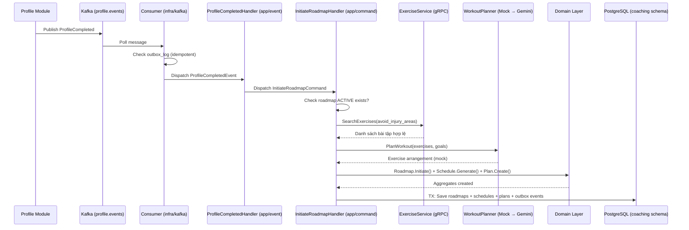

# Issue #80: Lắng nghe UserProfileCompleted → Sinh lộ trình 4 tuần & lịch tuần đầu

## Data Flow

## Notes

- **Idempotency**: Consumer check `outbox_log.event_id` trước khi dispatch. Handler check roadmap ACTIVE đã tồn tại.
- **Mock Planner**: Implement interface `WorkoutPlanner`. Swap Gemini = thay constructor, không sửa logic.
- **Injury filtering**: Profile giữ dữ liệu chấn thương. Coaching chỉ truyền `registered_injuries` → `avoid_injury_areas` khi gọi ExerciseService. Không lưu lại.
- **Schema isolation**: Không JOIN chéo. Gọi gRPC sang Exercise module để lấy bài tập.
- **3 Aggregate Root riêng biệt**: WorkoutRoadmap (chiến lược chu kỳ), WeeklySchedule (phân bổ tải/nhóm cơ), DailyWorkoutPlan (prescription JIT).
