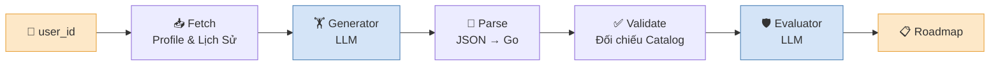
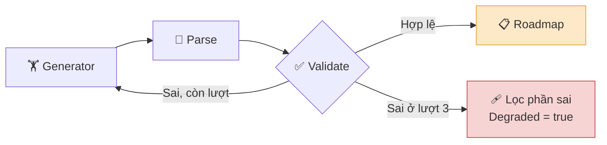
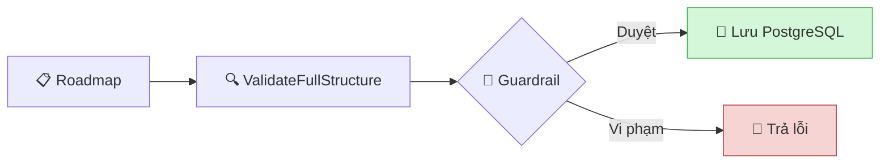

# Coaching AI Agent (Google ADK)

Hệ thống AI Coach thông minh sử dụng **Google ADK (Agent Development Kit)** để tự động sinh giáo án tập luyện cá nhân hóa 4 tuần và điều chỉnh linh hoạt theo thể trạng người dùng.

---

## 📐 Sơ Đồ Kiến Trúc (Architecture Diagram)

Luồng tạo giáo án 4 tuần (`init_roadmap_wf`) — các node chạy tuần tự:

Vòng sinh lại khi bài tập không có trong catalog — tối đa 3 lượt:

Cổng chặn cứng nằm ở tầng Application, sau khi workflow kết thúc:

---

## 🔄 Quy Trình Xử Lý Chi Tiết

1. **📥 Fetch Node** (`fetch_profile_and_history`):
   - Thu thập thể trạng (cân nặng, mục tiêu, thiết bị, lịch rảnh, chấn thương) và tối đa 3 buổi tập trong 7 ngày gần nhất.

2. **📋 Pending Node** (`fetch_pending_sessions`) — *chỉ Luồng Sửa Giáo Án*:
   - Đọc Roadmap `ACTIVE`, gửi kèm **prescription hiện tại** của từng buổi `PENDING` để AI biết đang kê gì mà sửa.
   - Không gửi ID buổi tập: kết quả khớp lại **theo thứ tự**, nên AI không thể sửa nhầm buổi.

3. **🏋️ Generator Agent**:
   - **Gemini Flash** cùng 6 Tools: tra cứu catalogue, tính 1RM, hỏi lại người dùng, thay bài tránh chấn thương, điều chỉnh khối lượng, dịch lịch tập.

4. **🧩 Parse Node**:
   - Chuyển JSON thô từ AI thành Struct Go (`GeneratedPlan`).

5. **✅ Plan Validator**:
   - Đối chiếu **mọi `exercise_id`** với catalog thật. AI chỉ được sinh `exercise_id`; các ID khác (`roadmap_id`, `session_plan_id`...) do backend cấp, `exercise_name` lấy từ catalog.
   - Bài tập không tồn tại → sinh lại, kèm feedback nêu đúng ID sai.
   - Catalog không truy cập được → dừng ngay, **không** sinh lại.

6. **🛡️ Evaluator Agent** — *chỉ Luồng Tạo Mới*:
   - Thẩm định cường độ tạ (RPE), phân bổ khối lượng, giới hạn tuần tập.
   - Mang tính **tham khảo**: không đạt thì đánh dấu `Degraded` chứ không chặn, vì đây là lượt gọi LLM thứ hai nên không tất định.

7. **🚧 Guardrail** — *tầng Application, ngoài workflow ADK*:
   - `ValidateFullStructure` rồi `guard.Check` tại `InitiateRoadmapHandler`. Đây là cổng chặn cứng cuối cùng: vi phạm thì trả lỗi và **không** lưu.

---

## 🚦 Các Luồng Xử Lý (Workflows)

- **Luồng Tạo Mới 4 Tuần (`init_roadmap_wf`)**: `Fetch` ➔ `Generator` ➔ `Parse` ➔ `Validate` ➔ `Evaluator`.
- **Luồng Gợi Ý Nhanh (`suggest_adhoc_wf`)**: `Fetch` ➔ `Generator` ➔ `Parse` ➔ `Validate`.
- **Luồng Sửa Giáo Án (`regenerate_wf`, `adaptive_wf`)**: `Fetch` ➔ **`Pending`** ➔ `Generator` ➔ `Parse` ➔ `Validate`.

---

## 📁 Cấu Trúc Thư Mục

- `agent.go`: Quản lý luồng chạy Multi-Agent Workflow và kết nối Domain model.
- `validator.go`: Đối chiếu bài tập với catalog và bất biến cấu trúc (6 buổi/tuần, 7 ngày/tuần).
- `retry.go`: Vòng sinh lại 3 lượt kèm feedback, tách khỏi ADK nên test được không cần LLM.
- `tools.go`: Định nghĩa 6 ADK Function Tools và quy tắc an toàn.
- `types.go`: Khai báo Data Models đầu vào/đầu ra giữa ứng dụng và AI.
- `prompts/`: Chứa các file Prompt gốc (`generator.txt`, `evaluator.txt`).
- `skills/`: Chứa các phác đồ hồi phục chấn thương dạng ADK Skill.

> ⚠️ Cả 3 reader (catalog, profile, lịch sử tập) hiện vẫn là mock — xem #197. `RoadmapRepo` chưa wire ở `cmd/api` nên 2 luồng sửa giáo án chưa đọc được Roadmap thật.
