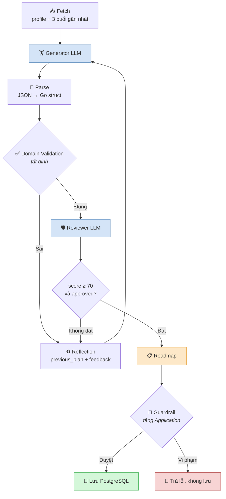

# Coaching AI Agent (Google ADK)

Sinh giáo án tập 4 tuần cá nhân hoá, và điều chỉnh khi thể trạng người dùng thay đổi. Xây trên **Google ADK v2**, model **Gemini Flash**.

Hai agent LLM, phân vai dứt khoát:

| Agent | Được làm | Không được làm |
|---|---|---|
| **Generator** | Sinh và sửa giáo án. Có 6 tool tra cứu. | — |
| **Reviewer** | Chấm điểm, nêu feedback, duyệt/từ chối. | **Sửa giáo án.** Schema đầu ra không có chỗ chứa plan. |

Chỉ Generator được tạo ra giáo án. Nghĩa là mọi giáo án đều đi qua validation, không có đường tắt nào.

---

## Vòng lặp



**Tối đa 3 vòng.** Mỗi vòng tốn 1 lần gọi Generator, và nhiều nhất 1 lần gọi Reviewer.

**Lỗi hạ tầng không tính vào 3 vòng đó.** 429, 503, timeout được chờ ra trên một ngân sách riêng (`maxTransientRetries = 2`), ưu tiên đúng `retryDelay` mà API yêu cầu, chặn trên 30s. Sinh lại sau một 429 chỉ tạo ra đúng cái 429 đó — nên nó không phải lỗi của plan, và không được tiêu lượt sinh nào. Xem `transient.go`.

Hai cửa, thứ tự có lý do:

1. **Domain Validation trước.** Nếu plan có `exercise_id` bịa ra thì quay về Generator ngay, **không gọi Reviewer**. Trả tiền cho một lượt chấm điểm trên plan đã sai chắc chắn thì không mua được gì, mà Reviewer lại tiêu feedback vào những lỗi đã được nêu chính xác rồi.
2. **Reviewer sau**, chỉ chấm những gì code không quyết được.

Hết 3 vòng mà vẫn chưa đạt: **giao plan kèm `Degraded = true`** và đính kèm phản đối của Reviewer, chứ không trả lỗi. Cửa chặn cứng cuối cùng là Guardrail ở tầng Application, không phải Reviewer.

---

## Domain Validation kiểm gì

Tất định, không LLM (`validator.go`):

1. Mọi `exercise_id` có thật trong catalog
2. `scheduled_date` là ngày thật, dạng `YYYY-MM-DD`
3. Không quá **6 buổi**/tuần
4. Không quá **7 ngày** khác nhau/tuần
5. Luồng sửa giáo án: trả đúng số buổi được giao, đúng thứ tự
6. Plan không rỗng

Lượt thứ 3 chuyển sang **salvage**: thay vì báo lỗi thì loại phần sai và đánh dấu `Degraded`.

---

## Reviewer

### Input — 4 phần, gọi tên rõ ràng

```json
{
  "original_task":     "INITIATE_4_WEEK",
  "user_context":      { "weight_kg": 75, "primary_goal": "hypertrophy",
                         "available_equipment": [...], "active_injuries": [...] },
  "recent_sessions":   [...],
  "generator_output":  { "weeks": [...] },
  "validation_result": { "passed": true, "degraded": false, "issues": [] },
  "review_round":      1,
  "previous_feedback": []
}
```

`validation_result` có mặt để Reviewer **không xử lại** những gì code đã chốt. Prompt nói thẳng: đừng báo lại lỗi catalog, đừng chấm giới hạn buổi/tuần, đừng chấm `BR-AC-10`/`BR-AC-11`.

`previous_feedback` là **những gì vòng trước đã yêu cầu**, có từ vòng 2. Không có nó thì Reviewer chấm mỗi plan như thể chưa từng có vòng nào — và một fix bị Generator lặng lẽ bỏ qua sẽ đọc thành plan sạch rồi được duyệt. Đo được thật: vòng 1 yêu cầu 2 thứ, Generator làm cái dễ bỏ cái khó, vòng 2 cho 100 điểm.

### Chấm gì — chỉ những thứ code không quyết được

| Hạng mục | Câu hỏi |
|---|---|
| `injury_safety` | Có buổi nào nạp tải lên nhóm cơ đang chấn thương? |
| `goal_fit` | Khối lượng và rep range có phục vụ `primary_goal`? |
| `equipment_fit` | Có bài nào cần thiết bị người dùng không có? |
| `schedule_fit` | Ngày tập có khớp `available_slots`, có đủ hồi phục giữa các buổi cùng nhóm cơ? |
| `progression_coherence` | 4 tuần có nối tiếp nhau, `reasoning` có khớp với thứ được kê? |

### Cách chấm điểm

**Bắt đầu ở 60**, không phải 100. Cộng tối đa +10 cho mỗi hạng mục làm tốt, nhưng **phải nêu bằng chứng trong `notes`**; trừ 10 cho mỗi khuyết điểm, và **phải nêu tên trong `feedback`**.

Điểm không phải ý kiến giữ riêng — nó là tổng của những thứ chỉ ra được. Trước khi có rubric này, Reviewer trả `score: 100, feedback: []` ở **ba lần chạy liên tiếp**; với rubric, cùng cấu hình đó cho 60 kèm hai khuyết điểm có thật.

### Output

```json
{
  "approved":   false,
  "score":      60,
  "confidence": 0.9,
  "previous_feedback": [
    { "area": "goal_fit", "applied": true,
      "evidence": "Cả 12 buổi giờ có 3 bài chính, trước là 2" },
    { "area": "warmup_specificity", "applied": false,
      "evidence": "Buổi back tuần 1 vẫn warm-up bằng pull-up, không đổi" }
  ],
  "feedback": [
    { "area":   "warmup_specificity",
      "detail": "Mọi buổi back dùng pull-up cho cả warm-up lẫn cool-down",
      "fix":    "Cho mỗi buổi một warm-up nhắm đúng nhóm cơ nó tập" }
  ],
  "notes": [
    "Khối lượng 21 → 25 → 28 → 14 set khớp mục tiêu hypertrophy"
  ]
}
```

**Không có field `plan`.** Đó là điều làm cho "chỉ review, không sửa" thành ràng buộc cấu trúc chứ không phải lời nhờ vả model.

`feedback` là **phải sửa**, `notes` là mọi thứ khác. Tách hai cái vì khi gộp, `fix` biến thành lời khen (*"keep doing this"*) — vẫn qua validate mà không nói cho Generator điều gì cần làm.

### Output của Reviewer cũng bị validate

`validateReview` (`retry.go`) từ chối verdict mà vòng lặp không hành động được:

- `score` ngoài `0..100`, hoặc `confidence` ngoài `0..1`
- Từ chối mà **không có feedback** → Generator sẽ nhận "làm lại" mà không biết sửa gì
- Có note mà **không có `fix`** → cùng vấn đề
- `approved = true` nhưng `score < 70` → verdict tự mâu thuẫn, đọc theo hướng an toàn là chưa duyệt

Và từ vòng 2, `checkFeedbackCompliance` bắt Reviewer chịu trách nhiệm với yêu cầu của vòng trước:

- **Không báo cáo** một yêu cầu nào → loại verdict
- Báo `applied` mà **không có `evidence`** → loại, vì đó là lời khẳng định chứ không phải kiểm tra
- **Duyệt trong khi còn yêu cầu chưa được thi hành** → loại thẳng

Điều cuối là phần có răng: Generator làm fix dễ rồi bỏ fix khó thì không được thưởng.

Verdict không dùng được, hoặc Reviewer gọi không tới (429, timeout): **giao plan kèm `Degraded`**, không chặn. Plan đã qua hết cửa tất định rồi, không được mất nó vì một tầng tham khảo hỏng.

### `confidence` dùng để làm gì

Từ chối mà `confidence < 0.5` thì **không** quay về Generator. Một Reviewer đang đoán mà đẩy Generator làm lại thì chỉ đổi phỏng đoán này bằng phỏng đoán khác, tốn một vòng. Verdict vẫn được ghi lại kèm `Degraded`.

---

## Regenerate — Generator nhận được gì

Không phải "hãy làm lại". Bốn phần:

| Phần | Nguồn | Có sẵn ở đâu |
|---|---|---|
| **Original Task** | `flow` | đã có trong `CoachInput` |
| **User Context** | `profile`, `recent_sessions` | đã có trong `CoachInput` |
| **Current Output** | `previous_plan` | plan vừa bị từ chối |
| **Review Feedback** | `prior_attempt_issues` và/hoặc `review_feedback` | lỗi tất định và/hoặc verdict |

Task và user context **không bị nhân đôi**: chúng vốn đã ở trong `CoachInput`, nên không nhồi lại lần nữa vào cục feedback — hai bản sao sẽ trôi lệch nhau.

`previous_plan` là bắt buộc, không phải tuỳ chọn. Agent bọc trong ADK node chạy ở `IncludeContents = "none"`, tức **không có lịch sử hội thoại** — model không nhìn thấy câu trả lời trước của chính nó. Không truyền `previous_plan` thì câu lệnh "giữ lại phần không bị gắn cờ" là lệnh không thể thi hành.

---

## Guardrail — cửa chặn cứng

Ở tầng Application (`InitiateRoadmapHandler`), sau khi workflow kết thúc: `ValidateFullStructure` rồi `guard.Check`. Vi phạm thì trả lỗi và **không lưu**.

| Mã | Luật |
|---|---|
| `BR-AC-01` | ≤ 6 buổi/tuần |
| `BR-AC-02` | Tạ trong ±30% 1RM |
| `BR-AC-09` | Không nạp tải nhóm cơ đang chấn thương |
| `BR-AC-10` | RPE nằm trong khung của phase: 6-7 / 7-8 / 8-9 / 5-6 |
| `BR-AC-11` | Tuần DELOAD ≤ 70% số set của tuần PEAK |

`BR-AC-10` và `BR-AC-11` là số học thuần trên chính plan, nên chúng thuộc về đây chứ không phải Reviewer — chắc chắn 100%, tốn 0 token. Reviewer chỉ giữ những hạng mục cần phán đoán.

---

## Bốn luồng

Hai phép toán, không phải bốn. **Tạo** sinh ra aggregate `Roadmap` mới; **vá** rewrite các buổi `PENDING` của roadmap đang có và trả `[]*SessionPlanInfo`.

| Luồng | Phép toán | Chuỗi node | Reviewer | File |
|---|---|---|---|---|
| `init_roadmap_wf` — tạo mới 4 tuần | tạo | Fetch → Generator → Parse → Validate | ✅ | `workflow_init.go` |
| `suggest_adhoc_wf` — gợi ý 1 buổi | tạo | Fetch → Generator → Parse → Validate | ❌ | `workflow_adhoc.go` |
| `regenerate_wf` — sửa buổi PENDING | vá | Fetch → **Pending** → Generator → Parse → Validate | ✅ | `workflow_rewrite.go` |
| `adaptive_wf` — điều chỉnh theo tín hiệu | vá | Fetch → **Pending** → Generator → Parse → Validate | ✅ | `workflow_rewrite.go` |

Hai luồng vá **dùng chung một builder** (`buildRewriteAgent`): cùng một phép toán, khác nhau ở cái kích hoạt — `REGENERATE_PENDING` là người dùng yêu cầu, `ADAPTIVE_CYCLE` là tín hiệu mệt mỏi/chấn thương gây ra. Chúng vẫn là **hai agent có tên riêng**: tên là cách ADK launcher và A2A server địa chỉ hoá agent, và `flow` là thứ prompt generator rẽ nhánh theo — `ADAPTIVE_CYCLE` còn phải áp `adaptation_reason` và phác đồ chấn thương.

`suggest_adhoc_wf` bỏ Reviewer: chỉ sinh 1 buổi, thêm một lần gọi LLM đắt hơn giá trị phán đoán mang lại.

**Pending Node** (chỉ 2 luồng sửa): đọc Roadmap `ACTIVE`, gửi kèm `current_prescription` của từng buổi `PENDING` để AI biết đang kê gì mà sửa. Không gửi ID buổi tập — kết quả khớp lại **theo thứ tự**, nên AI không thể sửa nhầm buổi.

---

## Cấu trúc thư mục

| File | Việc |
|---|---|
| `agent.go` | Cổng vào, khớp với `port.CoachAgent` |
| `build_agents.go` | Dựng model, tool, 2 agent LLM, schema đầu ra |
| `workflow_init.go`, `workflow_adhoc.go` | 2 luồng **tạo** |
| `workflow_rewrite.go` | 2 luồng **vá**, chung một builder |
| `transient.go` | Phân loại lỗi hạ tầng và chờ backoff, tách khỏi vòng sinh |
| `runner.go` | Nối ADK vào vòng lặp; gọi Reviewer và decode verdict |
| `retry.go` | **Vòng lặp**: generate → validate → review → reflect. Không phụ thuộc ADK nên test được không cần LLM |
| `validator.go` | Domain validation + chế độ salvage |
| `nodes.go` | 3 node thuần Go: fetch, pending, parse |
| `mapping.go` | `GeneratedPlan` → domain `Roadmap` |
| `tools.go` | 6 ADK function tool |
| `callbacks.go` | Chặn input/tool khi chấn thương SEVERE |
| `prompt_dump.go` | Dump prompt để debug, bật bằng `COACH_PROMPT_DUMP_DIR` |
| `types.go` | DTO giữa ứng dụng và AI |
| `prompts/` | `generator.txt`, `evaluator.txt` |
| `skills/` | Phác đồ hồi phục chấn thương, dạng ADK Skill |

---

## Debug

Đặt `COACH_PROMPT_DUMP_DIR` để ghi **cả hai chiều** của mỗi lần gọi model — request và response — thành một cặp file JSON:

```powershell
$env:COACH_PROMPT_DUMP_DIR = "tmp/prompts"
go run ./cmd/test-coaching     # chạy từ gốc repo
```

```
tmp/prompts/
  ...-CoachGeneratorAgent-01-req.json   ...-01-res.json   → gọi tool search_exercises
  ...-CoachGeneratorAgent-02-req.json   ...-02-res.json   → gọi tool get_exercise_pr
  ...-CoachGeneratorAgent-03-req.json   ...-03-res.json   → plan JSON
  ...-CoachReviewerAgent-01-req.json    ...-01-res.json   → verdict
```

Tên file sắp theo thứ tự gọi và request nằm cạnh response của nó. **Số cặp file cũng là số lần gọi model** — dùng để canh quota.

| File | Chứa gì |
|---|---|
| `-req.json` | `branch`, `content_count`, `system_instruction`, `tool_names`, toàn bộ `contents` |
| `-res.json` | `text` (câu trả lời), `thinking` (tách riêng), `function_calls`, `finish_reason`, `error`, và `usage` |

`usage` mang `prompt_tokens`, `output_tokens`, `thinking_tokens`, `cached_tokens` — `thinking` được tách khỏi câu trả lời vì nó bị tính là output nhưng không phải nội dung trả về. Đây là cách duy nhất thấy được một reviewer tiêu 1200 output token để trả về verdict 10 token.

Lần gọi thất bại cũng được ghi, với `error` — nên một chuỗi retry đọc được từ đầu đến cuối.

Opt-in: không set biến thì callback không được tạo, đường chạy production không đổi (`prompt_dump.go`).

---

## Hằng số điều chỉnh được

| Hằng số | Giá trị | Ở đâu |
|---|---|---|
| `maxGenerationAttempts` | 3 | `retry.go` |
| `approvalScore` | 70 | `retry.go` |
| `minActionableConfidence` | 0.5 | `retry.go` |
| `maxFeedbackIssues` | 20 | `retry.go` |
| `deloadVolumeRatio` | 0.7 | `domain/guardrail/guardrail.go` |

---

> ⚠️ Cả 3 reader (catalog, profile, lịch sử tập) hiện vẫn là mock — xem #197. `RoadmapRepo` chưa wire ở `cmd/api` nên 2 luồng sửa giáo án chưa đọc được Roadmap thật.
