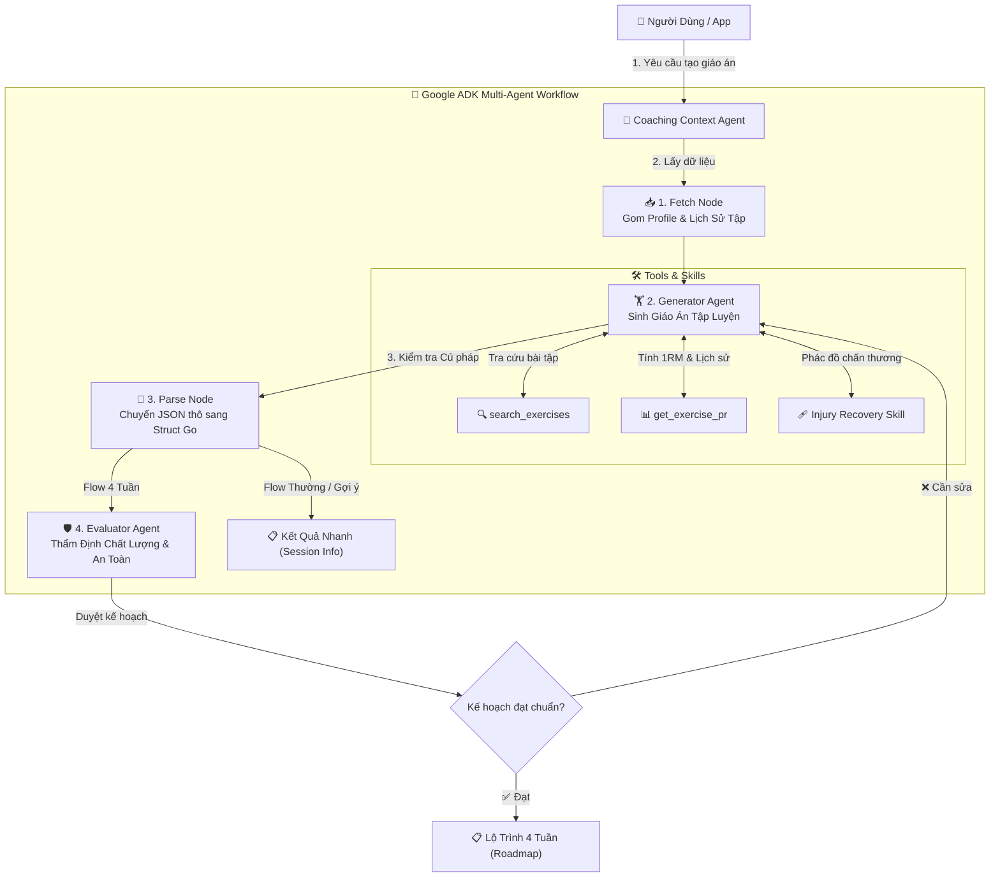

# Coaching AI Agent (Google ADK)

Hệ thống AI Coach thông minh sử dụng **Google ADK (Agent Development Kit)** để tự động sinh giáo án tập luyện cá nhân hóa 4 tuần và điều chỉnh linh hoạt theo thể trạng người dùng.

---

## 📐 Sơ Đồ Kiến Trúc (Architecture Diagram)

---

## 🔄 Quy Trình Xử Lý Chi Tiết

1. **📥 1. Fetch Node**:
   - Thu thập thông tin thể trạng (cân nặng, mục tiêu, thiết bị có sẵn, lịch rảnh, chấn thương) và lịch sử 30 ngày tập gần nhất.

2. **🏋️ 2. Generator Agent**:
   - Sử dụng **Gemini 2.5 Flash** cùng các Tools tra cứu catalogue bài tập và mức tạ kỷ lục (1RM).
   - Tự động áp dụng **Injury Recovery Skill** để tránh các nhóm cơ đang chấn thương.

3. **🧩 3. Parse Node (Màng lọc cú pháp)**:
   - Chuyển đổi và xác thực văn bản JSON từ AI thành Struct dữ liệu Go chuẩn (`GeneratedPlan`).
   - Ngăn chặn các lỗi hỏng cú pháp (Syntax error) trước khi thẩm định nghiệp vụ.

4. **🛡️ 4. Evaluator Agent (Kiểm định an toàn - Chỉ chạy ở Flow Tạo 4 Tuần)**:
   - Đóng vai trò lớp thẩm định độc lập kiểm tra an toàn: cường độ tạ (RPE), phân bổ khối lượng vận động và giới hạn tuần tập trước khi chốt lộ trình.

---

## 🚦 Các Luồng Xử Lý (Workflows)

- **Luồng Tạo Mới 4 Tuần (`init_roadmap_wf`)**: Chạy đủ **4 Bước** (`Fetch` ➔ `Generator` ➔ `Parse` ➔ `Evaluator`).
- **Luồng Điều Chỉnh / Gợi Ý Nhanh (`default_wf`)**: Chạy **3 Bước** (`Fetch` ➔ `Generator` ➔ `Parse` ➔ Trả kết quả ngay).

---

## 📁 Cấu Trúc Thư Mục

- `agent.go`: Quản lý luồng chạy Multi-Agent Workflow và kết nối Domain model.
- `tools.go`: Định nghĩa các ADK Function Tools (`search_exercises`, `get_exercise_pr`) và quy tắc an toàn.
- `types.go`: Khai báo Data Models đầu vào/đầu ra giữa ứng dụng và AI.
- `prompts/`: Chứa các file Prompt gốc (`generator.txt`, `evaluator.txt`).
- `skills/`: Chứa các phác đồ hồi phục chấn thương dạng ADK Skill.
