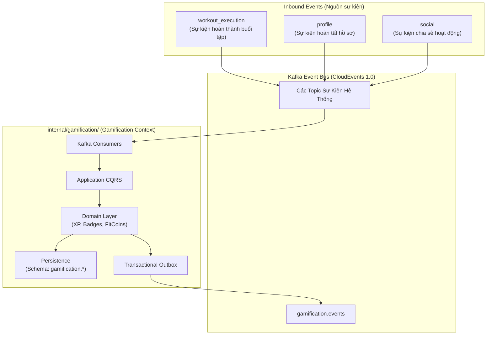

# Kiến Trúc Module Gamification (Architecture Specification)

Tài liệu này đặc tả kiến trúc tổng thể, ranh giới Bounded Context và các tầng kiến trúc của module **Gamification** trong hệ thống FITAI.

---

## 1. Vị Trí Trong Hệ Thống Modular Monolith

FITAI được xây dựng theo mô hình **Domain-Encapsulated Modular Monolith**. Mỗi Bounded Context được cô lập thành một thư mục độc lập dưới `/internal/<module_name>/`.

Module **Gamification** đóng vai trò là phân hệ bổ trợ (**Supporting Domain**), tiếp nhận các sự kiện nghiệp vụ từ hệ thống để vận hành cơ chế tích lũy kinh nghiệm (XP & Cấp độ), bảng xếp hạng toàn hệ thống (Leaderboard), vinh danh huy hiệu và quản lý tiền tệ thể thao:



---

## 2. Kiến Trúc Hexagonal (Ports & Adapters)

Module Gamification tuân thủ mô hình **Ports & Adapters**, giữ tầng Domain hoàn toàn sạch và độc lập ở mức high-level:

```text
internal/gamification/
├── domain/                      # LÕI NGHIỆP VỤ (Pure Go - Không phụ thuộc DB, Framework)
│   ├── aggregate/               # Quản lý trạng thái và quy tắc nghiệp vụ XP, Ví tiền
│   ├── entity/                  # Các thực thể nghiệp vụ (Huy hiệu, Dòng sổ cái)
│   ├── vo/                      # Value Objects (Bậc hạng, Loại giao dịch, Danh mục)
│   ├── event/                   # Domain Events nội bộ
│   └── repository/              # Port Interfaces (Định nghĩa hợp đồng lưu trữ)
│
├── application/                 # TẦNG ĐIỀU PHỐI (Use Cases)
│   ├── command/                 # Xử lý các tác vụ ghi (Cộng XP, Mở badge, Đổi quà)
│   ├── query/                   # Xử lý các tác vụ đọc (Thông tin ví, Bảng xếp hạng)
│   └── port/                    # Output Ports giao tiếp ngoài (Transaction, Cross-module reader)
│
├── infrastructure/              # TẦNG KỸ THUẬT (Driven Adapters)
│   ├── persistence/             # Hiện thực hóa lưu trữ (PostgreSQL GORM)
│   ├── event/                   # Outbox Writer (Đóng gói CloudEvents)
│   └── worker/                  # Outbox Worker quét đẩy sự kiện ra Kafka
│
└── transport/                   # TẦNG GIAO DIỆN (Driving Adapters)
    ├── grpc/                    # ConnectRPC Service Handlers
    └── consumer/                # Kafka Message Consumers
```

---

## 3. Ranh Giới Dữ Liệu & Giao Tiếp

* **Schema Isolation**: Toàn bộ dữ liệu của Gamification được cô lập trong PostgreSQL schema riêng (`gamification.*`). Không thực hiện truy vấn `JOIN` chéo sang schema của các module khác.
* **Transactional Outbox Pattern**: Mọi sự kiện phát sinh từ Gamification đều được lưu trữ cùng transaction với dữ liệu nghiệp vụ và đẩy bất đồng bộ ra Kafka topic `gamification.events`.
* **Idempotency**: Các Consumer phía tiếp nhận dữ liệu luôn kiểm tra tính lũy đẳng (Idempotent Consumer qua khóa duy nhất nghiệp vụ hoặc Ledger Guard) để đảm bảo không xử lý lặp lại sự kiện.

---

## 4. Chuẩn Transactional Outbox Dùng Chung (Module-wide Outbox)

Nhằm đảm bảo tính tin cậy tuyệt đối (At-Least-Once Delivery), loại trừ triệt để nguy cơ Dual-Write lỗi giữa Database và Kafka broker lúc mạng chập chờn, toàn bộ các tính năng con trong `internal/gamification/` đều chia sẻ chung một hạ tầng Transactional Outbox tại PostgreSQL schema `gamification.*`.

### 4.1 Schema DDL Chuẩn (`gamification.outbox` & `gamification.outbox_log`)

```sql
-- Bảng Outbox chính: Lưu trữ tạm thời các Domain Events cùng Transaction nghiệp vụ
CREATE TABLE IF NOT EXISTS gamification.outbox (
    id VARCHAR(64) PRIMARY KEY,
    event_id VARCHAR(64) NOT NULL UNIQUE,
    aggregate_type VARCHAR(64) NOT NULL,
    aggregate_id VARCHAR(64) NOT NULL,
    event_type VARCHAR(128) NOT NULL,
    payload JSONB NOT NULL,
    partition_key VARCHAR(64) NOT NULL,             -- Khóa phân vùng Kafka (= user_id)
    published BOOLEAN NOT NULL DEFAULT FALSE,
    published_at TIMESTAMPTZ,
    created_at TIMESTAMPTZ NOT NULL DEFAULT NOW(),
    status VARCHAR(32) NOT NULL DEFAULT 'PENDING',  -- PENDING | PROCESSING | PUBLISHED | FAILED
    locked_until TIMESTAMPTZ
);

-- Chỉ mục tối ưu cho Worker quét batch hiệu năng cao
CREATE INDEX IF NOT EXISTS idx_gamification_outbox_worker
    ON gamification.outbox (published, status, created_at ASC)
    WHERE published = FALSE;

-- Bảng Outbox Log: Lưu vết lịch sử xuất bản phục vụ Audit và Troubleshooting
CREATE TABLE IF NOT EXISTS gamification.outbox_log (
    id VARCHAR(64) PRIMARY KEY,
    event_id VARCHAR(64) NOT NULL,
    event_type VARCHAR(128) NOT NULL,
    payload JSONB NOT NULL,
    partition_key VARCHAR(64) NOT NULL,
    processed_at TIMESTAMPTZ NOT NULL DEFAULT NOW(),
    status VARCHAR(32) NOT NULL,                     -- PUBLISHED | FAILED
    error_message TEXT
);

CREATE INDEX IF NOT EXISTS idx_gamification_outbox_log_event
    ON gamification.outbox_log (event_id, processed_at DESC);
```

### 4.2 Cơ Chế Worker & Quét Khóa (`SELECT ... FOR UPDATE SKIP LOCKED`)

Background Worker (`internal/gamification/infrastructure/worker/outbox_worker.go`) vận hành theo chu kỳ:
1. **Claim Batch**: Quét các bản ghi chưa xuất bản (`published = FALSE`) bằng câu lệnh non-blocking:
   ```sql
   SELECT id, event_id, event_type, payload, partition_key 
   FROM gamification.outbox
   WHERE published = FALSE AND (status = 'PENDING' OR locked_until < NOW())
   ORDER BY created_at ASC
   LIMIT 100
   FOR UPDATE SKIP LOCKED;
   ```
2. **Locking Window**: Đánh dấu `status = 'PROCESSING'` kèm thời hạn `locked_until = NOW() + 30s`.
3. **Kafka Publish**: Đẩy mẻ sự kiện sang Kafka topic `gamification.events` với Partition Key = `partition_key` (luôn là `user_id` để bảo toàn thứ tự).
4. **Mark Published & Archiving**: Đánh dấu `published = TRUE`, `status = 'PUBLISHED'` và ghi nhật ký vào `gamification.outbox_log`.

### 4.3 Chuẩn CloudEvents Envelope (CloudEvents 1.0 JSON)

Mọi bản ghi `payload` trong `gamification.outbox` đều đóng gói chuẩn CloudEvents:
```json
{
  "specversion": "1.0",
  "id": "evt_01JABC1234XYZ...",
  "source": "fitai.gamification",
  "type": "contracts.supporting.gamification.v1.XpEarned",
  "datacontenttype": "application/json",
  "time": "2026-10-11T12:00:00Z",
  "partitionkey": "usr_9988-7766-5544",
  "data": {
    "userId": "usr_9988-7766-5544",
    "amount": 100
  }
}
```

### 4.4 Danh Mục Sự Kiện Module Gamification Phát Sinh

| Tên Sự Kiện (`event_type`) | Bounded Context Phát Sinh | Mục Đích & Module Lắng Nghe |
| :--- | :--- | :--- |
| `contracts.supporting.gamification.v1.XpEarned` | `xp-and-levels` | Ghi nhận tích lũy XP. `analytics`, `notification`. |
| `contracts.supporting.gamification.v1.UserLeveledUp` | `xp-and-levels` | Người dùng thăng cấp. `notification` (Push/Popup), `profile` (Cập nhật huy hiệu cấp độ), `social` (Đăng bài tự động). |
| `contracts.supporting.gamification.v1.CoinsEarned` | `fitcoins-and-ledger` | Biến động nạp coin. `notification`, `analytics` (Giám sát lạm phát). |
| `contracts.supporting.gamification.v1.CoinsSpent` | `fitcoins-and-ledger` | Biến động tiêu coin. `notification`, `analytics`. |
| `contracts.supporting.gamification.v1.StreakAdvanced` | `streaks-and-habits` | Tăng chuỗi ngày. `notification`. |
| `contracts.supporting.gamification.v1.StreakFrozen` | `streaks-and-habits` | Tiêu thụ khiên bảo vệ chuỗi. `notification`. |
| `contracts.supporting.gamification.v1.BadgeUnlocked` | `badges-and-achievements` | Mở khóa danh hiệu mới. `notification`, `social`. |

