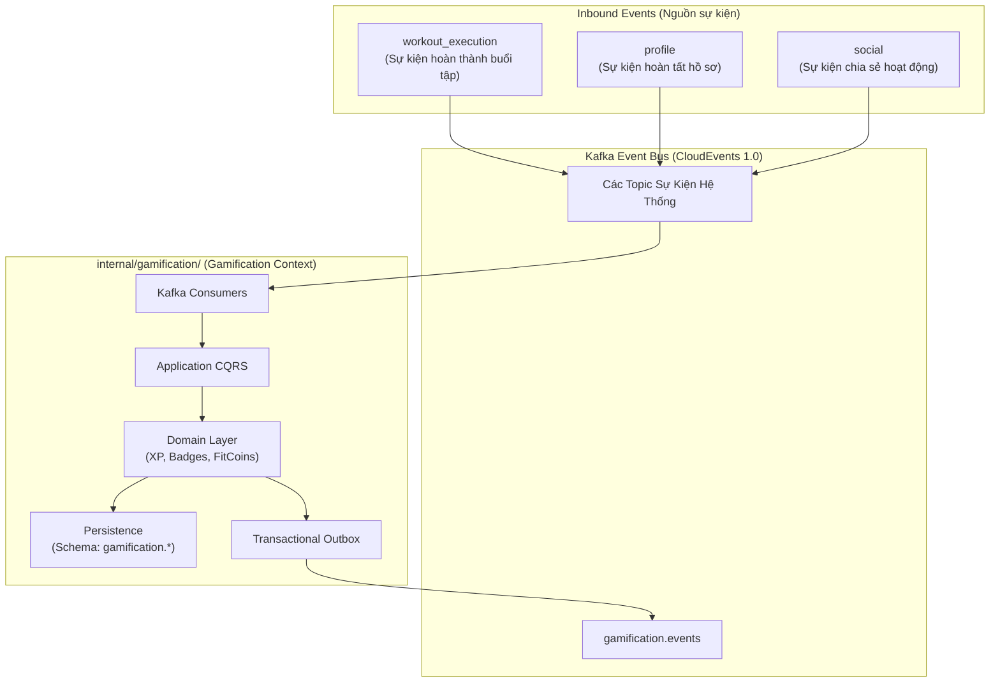

# Kiến Trúc Module Gamification (Architecture Specification)

Tài liệu này đặc tả kiến trúc tổng thể, ranh giới Bounded Context và các tầng kiến trúc của module **Gamification** trong hệ thống FITAI.

---

## 1. Vị Trí Trong Hệ Thống Modular Monolith

FITAI được xây dựng theo mô hình **Domain-Encapsulated Modular Monolith**. Mỗi Bounded Context được cô lập thành một thư mục độc lập dưới `/internal/<module_name>/`.

Module **Gamification** đóng vai trò là phân hệ bổ trợ (**Supporting Domain**), tiếp nhận các sự kiện nghiệp vụ từ hệ thống để vận hành cơ chế tích lũy kinh nghiệm (XP & Cấp độ), bảng xếp hạng toàn hệ thống (Leaderboard), vinh danh huy hiệu và quản lý tiền tệ thể thao:



---

## 2. Kiến Trúc Hexagonal (Ports & Adapters)

Module Gamification tuân thủ mô hình **Ports & Adapters**, giữ tầng Domain hoàn toàn sạch và độc lập ở mức high-level:

```text
internal/gamification/
├── domain/                      # LÕI NGHIỆP VỤ (Pure Go - Không phụ thuộc DB, Framework)
│   ├── aggregate/               # Quản lý trạng thái và quy tắc nghiệp vụ XP, Ví tiền
│   ├── entity/                  # Các thực thể nghiệp vụ (Huy hiệu, Dòng sổ cái)
│   ├── vo/                      # Value Objects (Bậc hạng, Loại giao dịch, Danh mục)
│   ├── event/                   # Domain Events nội bộ
│   └── repository/              # Port Interfaces (Định nghĩa hợp đồng lưu trữ)
│
├── application/                 # TẦNG ĐIỀU PHỐI (Use Cases)
│   ├── command/                 # Xử lý các tác vụ ghi (Cộng XP, Mở badge, Đổi quà)
│   ├── query/                   # Xử lý các tác vụ đọc (Thông tin ví, Bảng xếp hạng)
│   └── port/                    # Output Ports giao tiếp ngoài (Transaction, Cross-module reader)
│
├── infrastructure/              # TẦNG KỸ THUẬT (Driven Adapters)
│   ├── persistence/             # Hiện thực hóa lưu trữ (PostgreSQL GORM)
│   ├── event/                   # Outbox Writer (Đóng gói CloudEvents)
│   └── worker/                  # Outbox Worker quét đẩy sự kiện ra Kafka
│
└── transport/                   # TẦNG GIAO DIỆN (Driving Adapters)
    ├── grpc/                    # ConnectRPC Service Handlers
    └── consumer/                # Kafka Message Consumers
```

---

## 3. Ranh Giới Dữ Liệu & Giao Tiếp

* **Schema Isolation**: Toàn bộ dữ liệu của Gamification được cô lập trong PostgreSQL schema riêng (`gamification.*`). Không thực hiện truy vấn `JOIN` chéo sang schema của các module khác.
* **Transactional Outbox Pattern**: Mọi sự kiện phát sinh từ Gamification đều được lưu trữ cùng transaction với dữ liệu nghiệp vụ và đẩy bất đồng bộ ra Kafka topic `gamification.events`.
* **Idempotency**: Các Consumer phía tiếp nhận dữ liệu luôn kiểm tra tính lũy đẳng (Idempotent Consumer qua khóa duy nhất nghiệp vụ hoặc Ledger Guard) để đảm bảo không xử lý lặp lại sự kiện.
