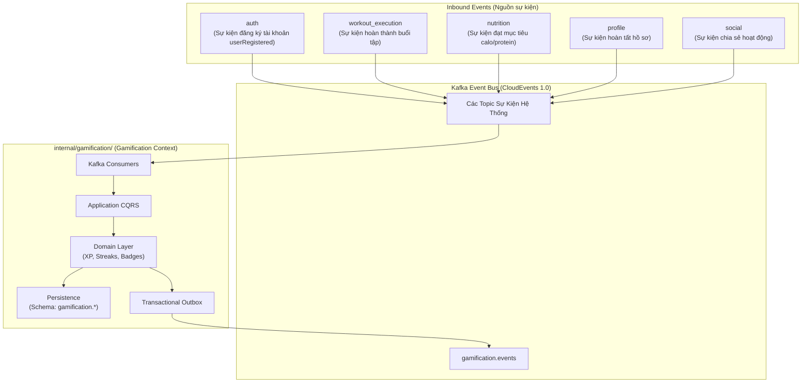

# Kiến Trúc Module Gamification (Architecture Specification)

Tài liệu này đặc tả kiến trúc tổng thể, ranh giới Bounded Context và các tầng kiến trúc của module **Gamification** trong hệ thống FITAI.

---

## 1. Vị Trí Trong Hệ Thống Modular Monolith

FITAI được xây dựng theo mô hình **Domain-Encapsulated Modular Monolith**. Mỗi Bounded Context được cô lập thành một thư mục độc lập dưới `/internal/<module_name>/`.

Module **Gamification** đóng vai trò là phân hệ bổ trợ (**Supporting Domain**), tiếp nhận các sự kiện nghiệp vụ từ hệ thống để vận hành cơ chế tích lũy kinh nghiệm (XP & Cấp độ), chuỗi ngày tập luyện (Streaks), bảng xếp hạng toàn hệ thống (Leaderboards), và hệ thống huy hiệu/thành tựu (Badges & Achievements):


```mermaid
flowchart TD
    subgraph CoreDomains["Inbound Events (Nguồn sự kiện)"]
        AU["auth<br/>(Sự kiện đăng ký tài khoản userRegistered)"]
        WE["workout_execution<br/>(Sự kiện hoàn thành buổi tập)"]
        NU["nutrition<br/>(Sự kiện đạt mục tiêu calo/protein)"]
        PR["profile<br/>(Sự kiện hoàn tất hồ sơ)"]
        SO["social<br/>(Sự kiện chia sẻ hoạt động)"]
    end

    subgraph EventBus["Kafka Event Bus (CloudEvents 1.0)"]
        TOPIC_IN["Các Topic Sự Kiện Hệ Thống"]
        TOPIC_GA["gamification.events"]
    end

    subgraph GamificationContext["internal/gamification/ (Gamification Context)"]
        direction TB
        G_CONSUMER["Kafka Consumers"]
        G_APP["Application CQRS"]
        G_DOMAIN["Domain Layer<br/>(XP, Streaks, Badges)"]
        G_REPO["Persistence<br/>(Schema: gamification.*)"]
        G_OUTBOX["Transactional Outbox"]
    end

    AU & WE & NU & PR & SO --> TOPIC_IN
    TOPIC_IN --> G_CONSUMER
    G_CONSUMER --> G_APP --> G_DOMAIN --> G_REPO
    G_DOMAIN --> G_OUTBOX --> TOPIC_GA
```

---

## 2. Kiến Trúc Hexagonal (Ports & Adapters)

Module Gamification tuân thủ mô hình **Ports & Adapters**, giữ tầng Domain hoàn toàn sạch và độc lập ở mức high-level:

```text
internal/gamification/
├── domain/                      # LÕI NGHIỆP VỤ (Pure Go - Không phụ thuộc DB, Framework)
│   ├── aggregate/               # Quản lý trạng thái và quy tắc nghiệp vụ XP, Streak, Badges
│   ├── entity/                  # Các thực thể nghiệp vụ (Lịch sử điểm, Lịch sử chuỗi)
│   ├── vo/                      # Value Objects (Cấp độ, Điểm thưởng, Loại hoạt động)
│   ├── event/                   # Domain Events nội bộ
│   └── repository/              # Port Interfaces (Định nghĩa hợp đồng lưu trữ)
│
├── application/                 # TẦNG ĐIỀU PHỐI (Use Cases)
│   ├── command/                 # Xử lý các tác vụ ghi (Cộng XP, Cập nhật Streak, Lưu snapshot)
│   ├── query/                   # Xử lý các tác vụ đọc (Thông tin XP, Chuỗi ngày, Bảng xếp hạng)
│   └── port/                    # Output Ports giao tiếp ngoài (Transaction, Outbox)
│
├── infrastructure/              # TẦNG KỸ THUẬT (Driven Adapters)
│   ├── persistence/             # Hiện thực hóa lưu trữ (PostgreSQL GORM)
│   └── worker/                  # Outbox Worker quét đẩy sự kiện ra Kafka
│
└── transport/                   # TẦNG GIAO DIỆN (Driving Adapters)
    ├── grpc/                    # ConnectRPC Service Handlers
    └── consumer/                # Kafka Message Consumers
        ├── user_registered_consumer.go        # Khởi tạo tức thì hồ sơ game hóa khi đăng ký
        ├── activity_ingestion_coordinator.go   # Điều phối tuần tự sự kiện buổi tập (XP -> Streak)
        └── nutrition_event_consumer.go        # Consumer đạt mục tiêu dinh dưỡng
```

---

## 3. Ranh Giới Dữ Liệu & Giao Tiếp

* **Schema Isolation**: Toàn bộ dữ liệu của Gamification được cô lập trong PostgreSQL schema riêng (`gamification.*`). Không thực hiện truy vấn `JOIN` chéo sang schema của các module khác.
* **Transactional Outbox Pattern**: Mọi sự kiện phát sinh từ Gamification đều được lưu trữ cùng transaction với dữ liệu nghiệp vụ và đẩy bất đồng bộ ra Kafka topic `gamification.events`.
* **Idempotency**: Các Consumer phía tiếp nhận dữ liệu luôn kiểm tra tính lũy đẳng (Idempotent Consumer qua khóa duy nhất nghiệp vụ hoặc Outbox Log Guard) để đảm bảo không xử lý lặp lại sự kiện.
* **Manual Offset Commit (At-Least-Once Delivery)**: Toàn bộ Kafka Consumers sử dụng cơ chế Manual Commit: `FetchMessage` -> `ProcessMessage` (kèm retry nội bộ tối đa 3 lần cho lỗi tạm thời) -> `CommitMessages`. Offset chỉ được commit khi xử lý thành công hoặc sau khi đã ghi nhận lỗi vĩnh viễn vào `outbox_log`, loại trừ triệt để nguy cơ mất message (Silent Message Loss) khi xảy ra sự cố mạng hoặc cơ sở dữ liệu.

---

## 4. Chuẩn Transactional Outbox Dùng Chung (Module-wide Outbox - SSOT)

> [!IMPORTANT]
> Mục 4 này là **Nguồn Chân Lý Duy Nhất (Single Source of Truth - SSOT)** cho hạ tầng Transactional Outbox Pattern của toàn bộ module Gamification. Tất cả các tài liệu tính năng con (`features/*/02-design.md`, `03-plan.md`) không được định nghĩa lại bảng DDL hay worker lặp lại, mà phải dẫn chiếu trực tiếp về đây.

Nhằm đảm bảo tính tin cậy tuyệt đối (At-Least-Once Delivery), loại trừ triệt để nguy cơ Dual-Write lỗi giữa Database và Kafka broker lúc mạng chập chờn, toàn bộ các tính năng con trong `internal/gamification/` đều chia sẻ chung một hạ tầng Transactional Outbox tại PostgreSQL schema `gamification.*`.

### 4.1 Schema DDL Chuẩn (`gamification.outbox` & `gamification.outbox_log`)

```sql
-- Bảng Outbox chính: Lưu trữ tạm thời các Domain Events cùng Transaction nghiệp vụ
CREATE TABLE IF NOT EXISTS gamification.outbox (
    id UUID PRIMARY KEY DEFAULT gen_random_uuid(),
    event_id UUID NOT NULL UNIQUE,
    aggregate_type VARCHAR(255),
    aggregate_id VARCHAR(255),
    event_type VARCHAR(255) NOT NULL,
    payload JSONB NOT NULL,
    partition_key VARCHAR(255) NOT NULL,             -- Khóa phân vùng Kafka (= user_id)
    published BOOLEAN NOT NULL DEFAULT FALSE,
    published_at TIMESTAMPTZ,
    created_at TIMESTAMPTZ NOT NULL DEFAULT NOW(),
    status VARCHAR(50) NOT NULL DEFAULT 'PENDING',  -- PENDING | PROCESSING | PUBLISHED | FAILED | DEAD_LETTER
    retry_count INT NOT NULL DEFAULT 0,
    max_retries INT NOT NULL DEFAULT 5,
    last_error TEXT,
    locked_until TIMESTAMPTZ
);

-- Chỉ mục Partial tối ưu cho Worker quét batch hiệu năng cao, bỏ qua các bản ghi đã xuất bản và dead-letter
CREATE INDEX IF NOT EXISTS idx_gamification_outbox_unprocessed
    ON gamification.outbox (created_at ASC)
    WHERE published = FALSE AND status != 'DEAD_LETTER';

-- Bảng Outbox Log: Lưu vết lịch sử xuất bản phục vụ Audit và Idempotent Consumer
CREATE TABLE IF NOT EXISTS gamification.outbox_log (
    id UUID PRIMARY KEY DEFAULT gen_random_uuid(),
    event_id UUID NOT NULL,
    event_type VARCHAR(255) NOT NULL,
    payload JSONB NOT NULL,
    partition_key VARCHAR(255) NOT NULL,
    processed_at TIMESTAMPTZ NOT NULL DEFAULT NOW(),
    status VARCHAR(50) NOT NULL,                     -- PUBLISHED | FAILED
    error_message TEXT
);

CREATE INDEX IF NOT EXISTS idx_gamification_outbox_log_event_status
    ON gamification.outbox_log (event_id, status);

CREATE UNIQUE INDEX IF NOT EXISTS ux_gamification_outbox_log_event_id
    ON gamification.outbox_log (event_id);
```

### 4.2 Cơ Chế Worker & Quét Khóa (`SELECT ... FOR UPDATE SKIP LOCKED`)

Background Worker (`internal/gamification/infrastructure/worker/outbox_worker.go`) vận hành theo chu kỳ:
1. **Claim Batch**: Quét các bản ghi chưa xuất bản bằng câu lệnh non-blocking:
   ```sql
   SELECT id, event_id, event_type, payload, partition_key, retry_count, max_retries 
   FROM gamification.outbox
   WHERE published = FALSE AND status != 'DEAD_LETTER' AND (status = 'PENDING' OR locked_until < NOW())
   ORDER BY created_at ASC
   LIMIT 100
   FOR UPDATE SKIP LOCKED;
   ```
2. **Locking Window**: Đánh dấu `status = 'PROCESSING'` kèm thời hạn `locked_until = NOW() + 30s`.
3. **Kafka Publish**: Đẩy mẻ sự kiện sang Kafka topic `gamification.events` với Partition Key = `partition_key` (luôn là `user_id` để bảo toàn thứ tự).
4. **Mark Published & Archiving**: Đánh dấu `published = TRUE`, `status = 'PUBLISHED'` và ghi nhật ký vào `gamification.outbox_log`.
5. **Cơ chế chống Poison Pill**: Nếu publish thất bại, tăng `retry_count += 1` và cập nhật `last_error`. Nếu `retry_count >= max_retries`, chuyển `status = 'DEAD_LETTER'` và phát cảnh báo metric; worker tiếp tục xử lý các sự kiện phía sau mà không bị kẹt vô tận.

### 4.3 Chuẩn CloudEvents Envelope (CloudEvents 1.0 JSON)

Mọi bản ghi `payload` trong `gamification.outbox` đều đóng gói chuẩn CloudEvents và sử dụng contract hợp nhất tại `proto/contracts/supporting/gamification/v1/event/gamification_events.proto`:
```json
{
  "specversion": "1.0",
  "id": "evt_01JABC1234XYZ...",
  "source": "services/gamification",
  "type": "contracts.supporting.gamification.v1.xpEarned",
  "datacontenttype": "application/json",
  "time": "2026-10-11T12:00:00Z",
  "partitionkey": "usr_9988-7766-5544",
  "data": {
    "userId": "usr_9988-7766-5544",
    "deltaXp": 100,
    "newXp": 1500,
    "newLevel": 6
  }
}
```

### 4.4 Danh Mục Sự Kiện

#### Sự Kiện Module Gamification Phát Sinh (`gamification.events`)
Tất cả các sự kiện bên dưới được định nghĩa tách riêng theo chuẩn CloudEvents 1.0 trong `proto/contracts/supporting/gamification/v1/event/` (tuân thủ quy chuẩn camelCase theo `docs/04_event_driven_standards.md`):

| Tên Sự Kiện (`event_type`) | Bounded Context Phát Sinh | Mục Đích & Module Lắng Nghe |
| :--- | :--- | :--- |
| `contracts.supporting.gamification.v1.xpEarned` | `xp-and-levels` | Ghi nhận tích lũy XP. `analytics`, `notification`. |
| `contracts.supporting.gamification.v1.userLeveledUp` | `xp-and-levels` | Người dùng thăng cấp. `notification` (Push/Popup), `profile` (Cập nhật huy hiệu), `social` (Đăng bài tự động). |
| `contracts.supporting.gamification.v1.streakAdvanced` | `streaks-and-habits` | Tăng chuỗi ngày. `notification`. |
| `contracts.supporting.gamification.v1.streakReset` | `streaks-and-habits` | Đứt chuỗi ngày sau ngày nghỉ. `notification`. |
| `contracts.supporting.gamification.v1.streakMilestoneReached` | `streaks-and-habits` | Chạm mốc chuỗi kỷ luật (7, 14, 30, 50, 100, 365 ngày). `notification`, `social`. |
| `contracts.supporting.gamification.v1.badgeUnlocked` | `badges` | Người dùng mở khóa huy hiệu mới. `notification` (Push/Popup vinh danh), `social` (Khoe bài). |

#### Sự Kiện Ngoại Vi Lắng Nghe (Inbound Events)
| Tên Sự Kiện | Module Phát | Xử Lý Phía Gamification |
| :--- | :--- | :--- |
| `contracts.generic.auth.v1.userRegistered` | `auth` | Khởi tạo tức thì bộ đôi hồ sơ Gamification (`user_xp = 0, level = 1`, `user_streak = 0`) và snapshot (`display_name`, `avatar_url`). |
| `contracts.core.workout_execution.v1.event.WorkoutSessionCompleted` | `workout_execution` | Điều phối qua `ActivityIngestionCoordinator` để cộng XP và tăng chuỗi Streak. |
| `contracts.core.workout_execution.v1.event.NewPersonalRecordAchieved` | `workout_execution` | Thưởng thêm PR Bonus (+25 XP) khi lập kỷ lục mới. |
| `contracts.core.nutrition.v1.event.DailyNutritionGoalAchieved` | `nutrition` | Thưởng $+30$ XP và duy trì Streak dinh dưỡng trong ngày nghỉ. |

---

## 5. Chuẩn Hóa Xử Lý Bất Đồng Bộ Đa Aggregate & Khử Deadlock (Activity Ingestion Coordinator)

### 5.1 Vấn Đề Khi Nhận Sự Kiện Hoàn Thành Buổi Tập (`WorkoutSessionCompleted`)
Khi một buổi tập kết thúc, hệ thống phát ra CloudEvent `contracts.core.workout_execution.v1.WorkoutSessionCompleted`. Trong module Gamification, sự kiện này tác động đồng thời lên **2 Aggregate độc lập**:
1. `UserXp`: Tính toán và cộng điểm kinh nghiệm XP, nâng cấp level.
2. `UserStreak`: Cập nhật chuỗi ngày kỷ luật tập luyện liên tục.

### 5.2 Khử Triệt Để Deadlock & Đảm Bảo Tính Toàn Vẹn ACID: Single Atomic Transaction
- **Rủi ro của việc chia tách nhiều Transaction rời rạc**:
  Nếu chia 3 bước thành 3 transaction độc lập (Streak -> Commit, XP -> Commit, Badges -> Commit):
  - Khi Bước 1 (Streak) commit thành công nhưng Bước 2 (XP) hoặc Bước 3 (Badges) gặp lỗi (DB timeout, connection pool nghẽn), hệ thống rơi vào trạng thái không nhất quán bán phần (**Inconsistent Partial State**): Chuỗi đã tăng nhưng điểm XP không vào tài khoản.
- **Giải Pháp Chuẩn Hóa (Single Atomic Transaction với Thứ Tự Khóa Tất Định)**:
  - `ActivityIngestionCoordinator` bọc toàn bộ 3 bước trong **1 Database Transaction duy nhất** thông qua `SQLTransactionManager.WithTransaction` (hỗ trợ transaction tái nhập / re-entrant).
  - Áp dụng **Thứ tự khóa tất định (Deterministic Lock Ordering)**:
    1. Bước 1: Khóa bi quan `gamification.user_streak` (`SELECT ... FOR UPDATE`). Cập nhật chuỗi ngày kỷ luật.
    2. Bước 2: Khóa bi quan `gamification.user_xp` (`SELECT ... FOR UPDATE`). Áp dụng hệ số Streak Multiplier mới nhất (1.1x nếu streak >= 3, 1.2x nếu streak >= 7) để tính điểm XP và cập nhật cấp độ.
    3. Bước 3: Batch insert `gamification.user_badges` (`ON CONFLICT DO NOTHING`) và ghi các domain events tương ứng vào `gamification.outbox`.
  - **Triệt tiêu 100% Deadlock**: Vì toàn bộ hệ thống luôn tuân thủ nghiêm ngặt thứ tự `user_streak` $\rightarrow$ `user_xp`, không có bất kỳ luồng nào chiếm khóa theo chiều ngược lại, điều kiện chờ vòng (**Circular Wait**) bị triệt tiêu hoàn toàn.
  - **Đảm bảo All-or-Nothing**: Nếu bất kỳ bước nào trong 3 bước thất bại, toàn bộ giao dịch được tự động ROLLBACK sạch sẽ. Kafka Consumer nhận lỗi và re-try qua cơ chế Manual Commit.

```text
SINGLE ATOMIC TRANSACTION (Toàn vẹn ACID - Rollback toàn bộ nếu bất kỳ bước nào lỗi):
  BEGIN;
    -- Bước 1: Khóa và cập nhật Streak (Deterministic Lock #1)
    SELECT * FROM gamification.user_streak WHERE user_id = $1 FOR UPDATE;
    --> Cập nhật chuỗi ngày liên tục theo giờ địa phương (UserStreak)
    --> Ghi nhận Outbox streakAdvanced (và streakMilestoneReached nếu chạm mốc)

    -- Bước 2: Khóa và cập nhật XP (Deterministic Lock #2)
    --> Kiểm tra Idempotency phiên tập: HasSession(user_id, session_id)
    --> Áp dụng hệ số Streak Multiplier chuẩn xác cho chính buổi tập hôm nay
    SELECT * FROM gamification.user_xp WHERE user_id = $1 FOR UPDATE;
    --> Cập nhật điểm XP, kiểm tra Level Up (UserXp)
    --> Ghi nhận Outbox xpEarned (và userLeveledUp nếu thăng cấp)

    -- Bước 3: Batch Badges & Outbox Events
    --> Gom tất cả huy hiệu hợp lệ (FIRST_WORKOUT, PR_BREAKER, STREAK_*, LEVEL_*)
    --> Kiểm tra khoảng thăng cấp (oldLevel < X && newLevel >= X) để không sót khi nhảy cấp
    --> INSERT INTO gamification.user_badges BATCH ON CONFLICT DO NOTHING;
    --> Ghi nhận Outbox badgeUnlocked BATCH
  COMMIT;  -- Commit nguyên tử toàn bộ Streak, XP, Badges và Outbox Events.
```

### 5.3 Tính Ưu Việt Của Kiến Trúc Atomic Coordinator
1. **Tính Nhất Quán Tuyệt Đối (ACID Consistency):** Không bao giờ tồn tại trạng thái dở dang (Streak tăng mà không có XP hoặc ngược lại).
2. **0% Nguy Cơ Deadlock:** Thứ tự chiếm khóa cố định (`user_streak` $\rightarrow$ `user_xp`) ngăn chặn 100% tình trạng tương tranh kẹt khóa.
3. **Phần Thưởng Công Bằng & Đồng Bộ:** Chuỗi kỷ luật được đánh giá trước, giúp buổi tập hiện tại lập tức nhận đúng hệ số nhân XP tương ứng.
4. **Bảo Vệ Người Dùng Mới (Zero Lost Updates):** `FindByIDForUpdate` tự động khởi tạo hàng cơ sở (`ON CONFLICT (user_id) DO NOTHING`) trước khi gọi `SELECT ... FOR UPDATE`, đảm bảo khóa dòng vật lý luôn hoạt động tin cậy 100% ngay cả khi sự kiện hoàn thành tập luyện đến trước sự kiện đăng ký người dùng.

---

## 6. Khởi Tạo Hồ Sơ Game Hóa Tức Thì (Eager Initialization via UserRegistered)

### 6.1 Vấn Đề Của Khởi Tạo Lười (Lazy Initialization Anti-Pattern)
Nếu chỉ tạo bản ghi khi người dùng hoàn thành buổi tập đầu tiên (Lazy Initialization):
- Khi user vừa đăng ký tài khoản, mở app vào tab Bảng Xếp Hạng (Leaderboards) hoặc Chuỗi Ngày (Streaks), database chưa hề có bản ghi của user đó.
- Truy vấn tính thứ hạng cá nhân (`SELECT COUNT(*) + 1 FROM gamification.user_xp WHERE xp > :my_xp`) bị lỗi hoặc trả về kết quả sai do `:my_xp = NULL`.
- Truy vấn chuỗi phải xử lý các ngoại lệ `RecordNotFound`, làm tăng độ phức tạp của code tầng Query và nguy cơ crash ứng dụng lúc 3 AM.

### 6.2 Giải Pháp: Eager Initialization Với UserRegistered Consumer
Gamification triển khai `UserRegisteredConsumer` lắng nghe sự kiện `contracts.generic.auth.v1.userRegistered` từ topic `auth.events` (Consumer Group: `gamification-user-registered-group`):
- Ngay khi tài khoản được tạo ở Auth, Gamification thực thi 1 Local Database Transaction khởi tạo đồng thời với tính lũy đẳng (`ON CONFLICT (user_id) DO NOTHING`):
  1. `gamification.user_xp`: `xp = 0`, `level = 1`
  2. `gamification.user_streak`: `current_streak = 0`, `longest_streak = 0`
  3. `gamification.user_snapshots`: `display_name = full_name`, `avatar_url = avatar_url`
- **Kết quả**: 100% gymer tồn tại trong hệ thống đều có sẵn trạng thái Game hóa từ giây đầu tiên. Các API tra cứu (`GetStreak`, `GetMyXp`, `GetGlobalLeaderboard`) hoạt động mượt mà, nhất quán tuyệt đối, loại bỏ hoàn toàn các nhánh code xử lý dữ liệu khuyết thiếu.

