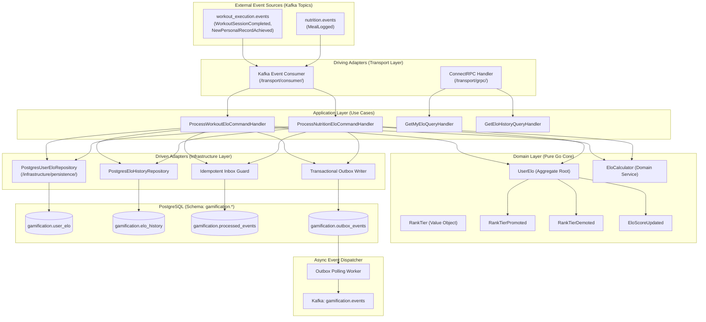
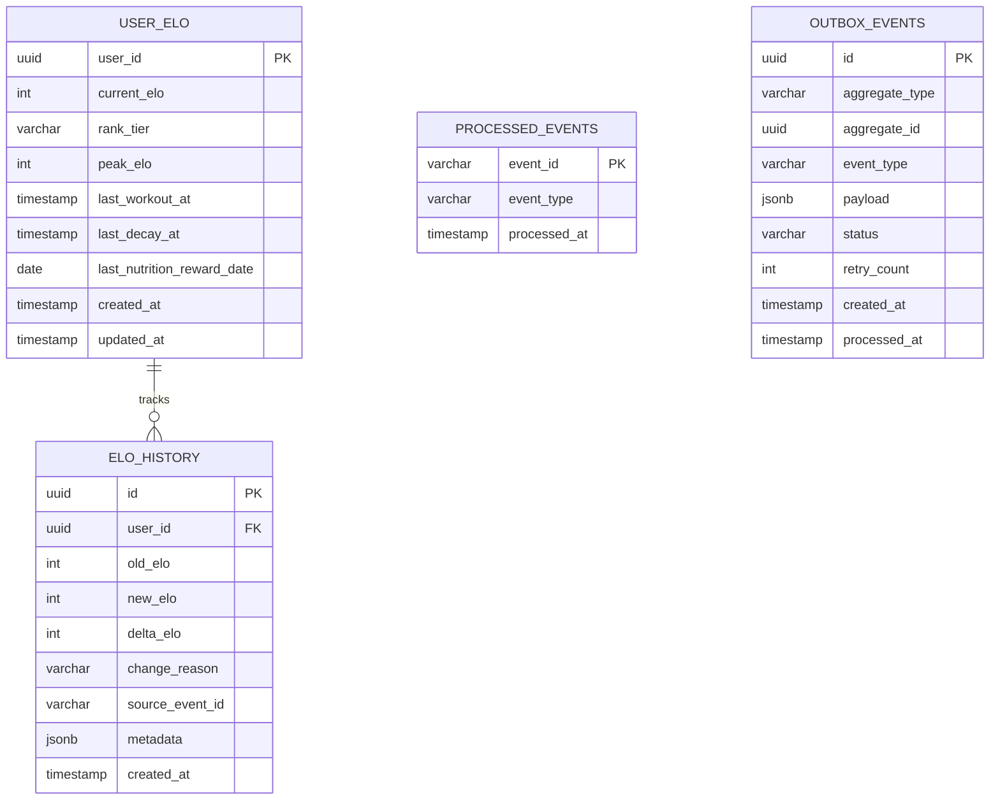
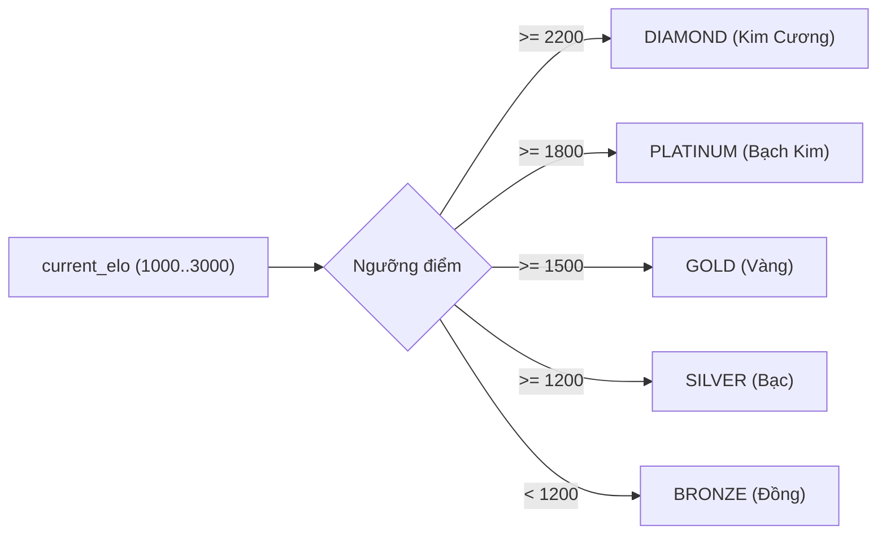
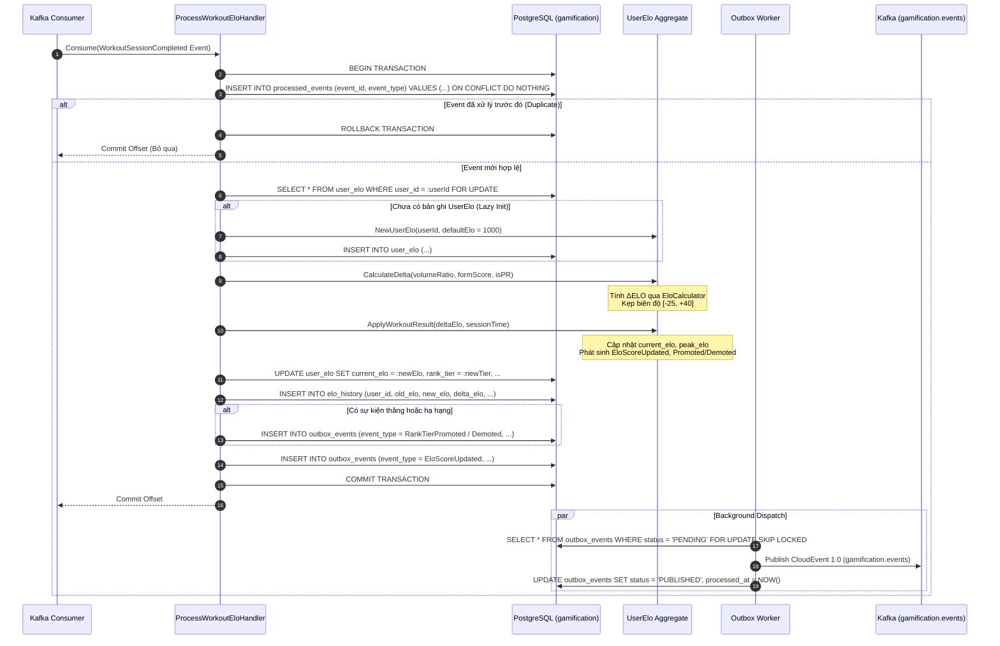
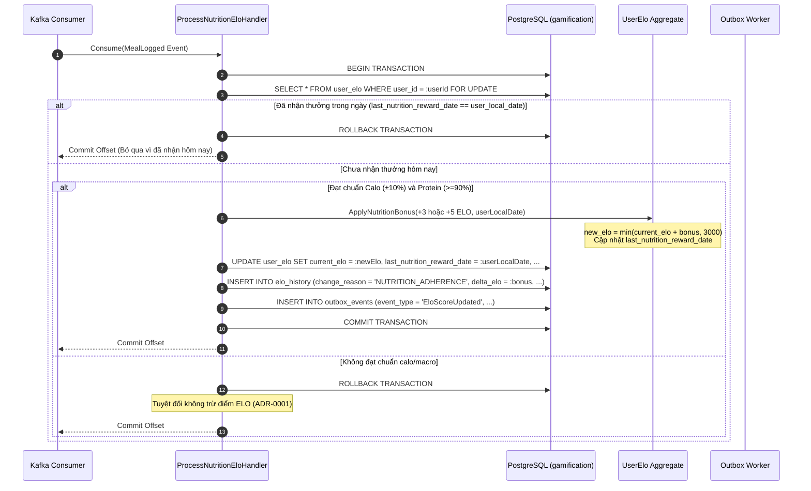
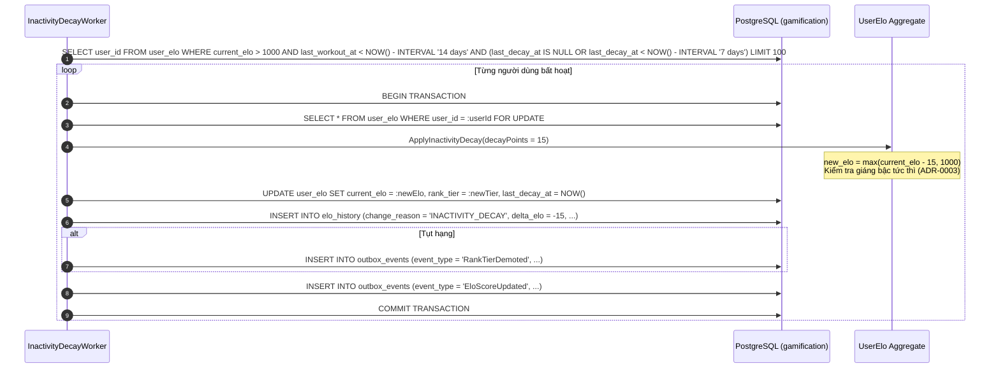
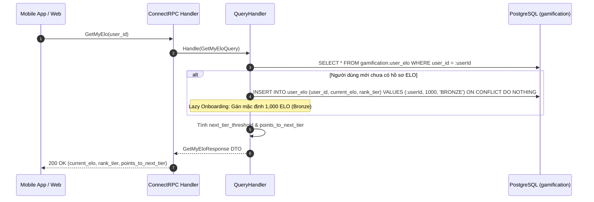

# Design: ELO Rating & Rank Tiers

## ADR References
- [ADR-0001: Tích Hợp Điểm Thưởng Kỷ Luật Dinh Dưỡng Vào Hệ Thống ELO](./adr/ADR-0001-incorporate-nutrition-adherence-bonus-into-elo.md)
- [ADR-0002: Hoãn Xác Lập Cơ Chế Tính Điểm Solo (PvP) Cho Đến Khi Xây Dựng Module Competition](./adr/ADR-0002-defer-solo-pvp-elo-scoring-mechanism.md)
- [ADR-0003: Ánh Xạ Bậc Hạng Trực Tiếp Không Trạng Thái (Loại Bỏ Demotion Shield)](./adr/ADR-0003-stateless-direct-rank-mapping-without-demotion-shield.md)
- [ADR-0004: Sử Dụng Khóa Dòng Bi Quan (SELECT FOR UPDATE) Cho Cập Nhật Điểm ELO](./adr/ADR-0004-use-pessimistic-row-locking-for-elo-updates.md)
- [ADR-0005: Thiết Lập Trần Cứng (Max ELO = 3,000) và Sàn Điểm ELO Cơ Sở](./adr/ADR-0005-establish-elo-range-and-hard-cap.md)

---

## 1. System & Component Architecture

### 1.1 Tổng quan Kiến trúc Hexagonal (Ports & Adapters)
Tính năng **ELO Rating & Rank Tiers** tuân thủ nghiêm ngặt mô hình kiến trúc Hexagonal của dự án. Tầng Domain hoàn toàn cô lập với cơ sở dữ liệu và framework, tiếp nhận các tác vụ qua Driving Adapters (Kafka Consumer & ConnectRPC) và giao tiếp với thế giới bên ngoài qua Driven Adapters (PostgreSQL Persistence & Transactional Outbox):



### 1.2 Ranh giới Module & Các File Mã Nguồn Dự Kiến
Các thành phần mã nguồn sẽ được đặt trong thư mục `internal/gamification/` theo chuẩn Hexagonal:

- **Domain Layer (`internal/gamification/domain/`)**:
  - `aggregate/user_elo.go`: Aggregate root `UserElo` quản lý trạng thái điểm số, phiên bản, thời gian cập nhật.
  - `vo/rank_tier.go`: Value object định nghĩa 5 bậc hạng và hàm thuần túy `DetermineTier(elo int32) RankTier`.
  - `service/elo_calculator.go`: Domain service hiện thực hóa công thức tính $\Delta ELO$ từ volume, form score, PR và dinh dưỡng.
  - `event/elo_events.go`: Khai báo domain events nội bộ (`EloScoreUpdated`, `RankTierPromoted`, `RankTierDemoted`).
  - `repository/user_elo_repository.go`: Port interface định nghĩa các phương thức `FindByID`, `Save`, `GetForUpdate`.

- **Application Layer (`internal/gamification/application/`)**:
  - `command/process_workout_elo.go`: Use case xử lý sự kiện buổi tập hoàn thành.
  - `command/process_nutrition_elo.go`: Use case xử lý sự kiện thưởng dinh dưỡng.
  - `query/get_my_elo.go`: Use case lấy thông tin rank và ELO cá nhân.
  - `query/get_elo_history.go`: Use case lấy lịch sử biến động điểm.

- **Infrastructure Layer (`internal/gamification/infrastructure/`)**:
  - `persistence/postgres/user_elo_repository.go`: Hiện thực hóa truy vấn PostgreSQL với GORM/sqlc.
  - `persistence/postgres/elo_history_repository.go`: Ghi log biến động điểm.
  - `persistence/postgres/inbox_repository.go`: Lưu vết sự kiện đã xử lý chống lặp.
  - `persistence/postgres/outbox_repository.go`: Ghi nhận sự kiện CloudEvents vào outbox.
  - `worker/outbox_worker.go`: Background worker quét bảng outbox và publish sang Kafka.

- **Transport Layer (`internal/gamification/transport/`)**:
  - `consumer/workout_event_consumer.go`: Kafka reader cho `WorkoutSessionCompleted`.
  - `consumer/nutrition_event_consumer.go`: Kafka reader cho `MealLogged`.
  - `grpc/gamification_handler.go`: Hiện thực hóa ConnectRPC service theo protobuf contract.

---

## 2. Database & Data Model Design

### 2.1 Entity Relationship Diagram (ERD)



### 2.2 Đặc Tả Schema PostgreSQL (`gamification.*`)

```sql
-- Schema cô lập của module Gamification
CREATE SCHEMA IF NOT EXISTS gamification;

-- Bảng 1: Hồ sơ ELO & Bậc Hạng Người Dùng
CREATE TABLE IF NOT EXISTS gamification.user_elo (
    user_id UUID PRIMARY KEY,
    current_elo INTEGER NOT NULL DEFAULT 1000 CHECK (current_elo >= 1000 AND current_elo <= 3000),
    rank_tier VARCHAR(20) NOT NULL DEFAULT 'BRONZE',
    peak_elo INTEGER NOT NULL DEFAULT 1000 CHECK (peak_elo >= 1000 AND peak_elo <= 3000 AND peak_elo >= current_elo),
    last_workout_at TIMESTAMPTZ,
    last_decay_at TIMESTAMPTZ,
    last_nutrition_reward_date DATE, -- Lưu ngày địa phương đã nhận thưởng dinh dưỡng (chống cộng lặp trong ngày)
    created_at TIMESTAMPTZ NOT NULL DEFAULT CURRENT_TIMESTAMP,
    updated_at TIMESTAMPTZ NOT NULL DEFAULT CURRENT_TIMESTAMP
);

CREATE INDEX IF NOT EXISTS idx_user_elo_ranking ON gamification.user_elo (current_elo DESC, updated_at ASC);
CREATE INDEX IF NOT EXISTS idx_user_elo_decay ON gamification.user_elo (last_workout_at) 
    WHERE current_elo > 1000;

-- Bảng 2: Lịch Sử Biến Động Điểm ELO (Append-only Audit Log)
CREATE TABLE IF NOT EXISTS gamification.elo_history (
    id UUID PRIMARY KEY DEFAULT gen_random_uuid(),
    user_id UUID NOT NULL REFERENCES gamification.user_elo(user_id) ON DELETE CASCADE,
    old_elo INTEGER NOT NULL,
    new_elo INTEGER NOT NULL,
    delta_elo INTEGER NOT NULL,
    change_reason VARCHAR(50) NOT NULL, -- WORKOUT_COMPLETED, NUTRITION_ADHERENCE, INACTIVITY_DECAY, ADMIN_ADJUST
    source_event_id VARCHAR(100),       -- ID của CloudEvent kích hoạt biến động
    metadata JSONB DEFAULT '{}'::jsonb, -- Thông tin thêm (session_id, form_score, volume_ratio, etc.)
    created_at TIMESTAMPTZ NOT NULL DEFAULT CURRENT_TIMESTAMP
);

CREATE INDEX IF NOT EXISTS idx_elo_history_user_created ON gamification.elo_history (user_id, created_at DESC);
CREATE UNIQUE INDEX IF NOT EXISTS uq_elo_history_source_event 
    ON gamification.elo_history (user_id, change_reason, source_event_id) 
    WHERE source_event_id IS NOT NULL;

-- Bảng 3: Hộp Thư Đã Xử Lý (Idempotent Inbox Guard)
CREATE TABLE IF NOT EXISTS gamification.processed_events (
    event_id VARCHAR(100) PRIMARY KEY,
    event_type VARCHAR(100) NOT NULL,
    processed_at TIMESTAMPTZ NOT NULL DEFAULT CURRENT_TIMESTAMP
);

-- Bảng 4: Transactional Outbox (CloudEvents 1.0)
CREATE TABLE IF NOT EXISTS gamification.outbox_events (
    id UUID PRIMARY KEY DEFAULT gen_random_uuid(),
    aggregate_type VARCHAR(50) NOT NULL DEFAULT 'UserElo',
    aggregate_id UUID NOT NULL,
    event_type VARCHAR(150) NOT NULL,
    payload JSONB NOT NULL,
    status VARCHAR(20) NOT NULL DEFAULT 'PENDING', -- PENDING, PUBLISHED, FAILED
    retry_count INTEGER NOT NULL DEFAULT 0,
    created_at TIMESTAMPTZ NOT NULL DEFAULT CURRENT_TIMESTAMP,
    processed_at TIMESTAMPTZ
);

CREATE INDEX IF NOT EXISTS idx_outbox_events_pending 
    ON gamification.outbox_events (status, created_at ASC) 
    WHERE status = 'PENDING';
```

### 2.3 Quy Tắc Ánh Xạ Bậc Hạng Trực Tiếp (Stateless Direct Rank Mapping - ADR-0003)

Theo quyết định tại **ADR-0003**, hệ thống **không sử dụng máy trạng thái (No State Machine)** và không áp dụng cơ chế khiên rớt hạng (`Demotion Shield`). Bậc hạng là một hàm thuần túy (Pure Function) không lưu trạng thái trung gian, phân định trực tiếp theo dải điểm `current_elo`:

| Bậc Hạng (Rank Tier) | Dải Điểm ELO (Range) | Đặc Điểm & Cơ Chế Giáng Hạng |
| :--- | :---: | :--- |
| **Đồng (Bronze)** | $1,000 - 1,199$ | Mức khởi tạo mặc định; sàn tối thiểu hệ thống (không bị decay dưới 1,000). |
| **Bạc (Silver)** | $1,200 - 1,499$ | Thăng hạng ngay khi chạm 1,200; rớt xuống dưới 1,200 giáng về Đồng tức thì. |
| **Vàng (Gold)** | $1,500 - 1,799$ | Thăng hạng ngay khi chạm 1,500; rớt xuống dưới 1,500 giáng về Bạc tức thì. |
| **Bạch Kim (Platinum)**| $1,800 - 2,199$ | Thăng hạng ngay khi chạm 1,800; rớt xuống dưới 1,800 giáng về Vàng tức thì. |
| **Kim Cương (Diamond)**| $2,200 - 3,000$ | Bậc tối cao; trần cứng 3,000 ELO (ADR-0005); rớt dưới 2,200 giáng về Platinum. |



---

## 3. Detailed Flow & Execution Logic

Tất cả các luồng xử lý nghiệp vụ (Use Cases) được chuẩn hóa theo cấu trúc thống nhất: **Mục tiêu & Kích hoạt $\rightarrow$ Biểu đồ trình tự $\rightarrow$ Các bước thực thi $\rightarrow$ Kiểm soát giao dịch & Lũy đẳng**.

---

### 3.1 Luồng Xử Lý Sự Kiện Buổi Tập Hoàn Thành (UC-ELO-01)

#### 1. Mục tiêu & Kích hoạt
- **Trigger**: Consumer nhận được CloudEvent `contracts.core.workout_execution.v1.event.WorkoutSessionCompleted` từ Kafka topic `workout_execution.events`.
- **Preconditions**: Buổi tập hợp lệ, có `session_id`, `user_id`, thời lượng và khối lượng nâng thực tế.

#### 2. Biểu đồ trình tự tương tác


#### 3. Các bước thực thi chi tiết
1. **Kiểm tra lũy đẳng**: Ghi `event_id` vào bảng `gamification.processed_events`. Nếu xung đột khóa chính, rollback và bỏ qua.
2. **Khóa dòng bi quan**: Thực thi `SELECT ... FROM gamification.user_elo WHERE user_id = :id FOR UPDATE` để tuần tự hóa giao dịch (ADR-0004).
3. **Tính toán biến động điểm**:
   - Gọi `EloCalculator.CalculateWorkoutDelta()` với tham số tỷ lệ khối lượng, điểm form (fallback 75 nếu không có AI), và cờ PR.
   - Kẹp biến động $\Delta ELO \in [-25, +40]$.
4. **Cập nhật trạng thái Aggregate**:
   - Cập nhật điểm mới, kẹp trần sàn $[1000, 3000]$ (ADR-0005).
   - Xác định bậc hạng mới qua `DetermineRankTier(newElo)` (ADR-0003).
   - Phát sinh Domain Events: `EloScoreUpdated`, và `RankTierPromoted` hoặc `RankTierDemoted` (nếu đổi bậc).
5. **Lưu trữ dữ liệu**: Cập nhật `user_elo`, ghi nhật ký `elo_history`, ghi nhận sự kiện vào `outbox_events`.
6. **Commit**: Hoàn tất giao dịch và commit offset Kafka.

#### 4. Kiểm soát giao dịch & Lũy đẳng
- Toàn bộ bước 1 đến 5 chạy trong **1 Transaction duy nhất**.
- Khóa `FOR UPDATE` bảo vệ toàn vẹn điểm số khi có nhiều buổi tập hoàn tất gần như đồng thời.

---

### 3.2 Luồng Thưởng Kỷ Luật Dinh Dưỡng Hàng Ngày (UC-ELO-02)

#### 1. Mục tiêu & Kích hoạt
- **Trigger**: Consumer nhận được CloudEvent `contracts.core.nutrition.v1.event.MealLogged` từ Kafka topic `nutrition.events`.
- **Preconditions**: Người dùng ghi nhận bữa ăn trong ngày; module `nutrition` xác nhận tổng calo và macro ngày.

#### 2. Biểu đồ trình tự tương tác


#### 3. Các bước thực thi chi tiết
1. **Kiểm tra ngày nhận thưởng**: Khóa dòng `user_elo` bằng `FOR UPDATE`. Kiểm tra `last_nutrition_reward_date`:
   - Nếu đã bằng `user_local_date`: Bỏ qua để chống cộng lặp thưởng trong ngày.
2. **Đánh giá tiêu chuẩn dinh dưỡng**:
   - Nếu Calo đạt trong ngưỡng an toàn $\pm 10\%$ và Protein đạt $\ge 90\%$ mục tiêu ngày:
     - Thưởng $+3$ ELO (hoặc $+5$ ELO nếu đạt streak 3 ngày ăn chuẩn).
     - Cập nhật `last_nutrition_reward_date = user_local_date`.
     - Ghi nhận `elo_history` với lý do `NUTRITION_ADHERENCE`.
     - Ghi Outbox event `EloScoreUpdated`.
3. **Chính sách không phạt**: Nếu người dùng ăn lệch mục tiêu hoặc quên log: Không trừ ELO (ADR-0001).

#### 4. Kiểm soát giao dịch & Lũy đẳng ngày
- Khóa `FOR UPDATE` ngăn chặn 2 sự kiện log bữa ăn liên tiếp trong cùng 1 giây kích hoạt thưởng 2 lần.
- Cột `last_nutrition_reward_date DATE` đóng vai trò là Daily Idempotency Guard tự nhiên.

---

### 3.3 Luồng Suy Giảm Điểm Do Bất Hoạt (UC-ELO-03)

#### 1. Mục tiêu & Kích hoạt
- **Trigger**: Background Scheduler kích hoạt định kỳ (hàng ngày vào lúc 02:00 AM) chạy job quét tài khoản bất hoạt.
- **Preconditions**: Người dùng có `current_elo > 1000` (Bậc Đồng sàn 1,000 không bao giờ bị decay) và `last_workout_at < NOW() - INTERVAL '14 days'`.

#### 2. Biểu đồ trình tự tương tác


#### 3. Các bước thực thi chi tiết
1. **Lọc người dùng đủ điều kiện decay**: Quét batch 100 người dùng có `current_elo > 1000`, nghỉ tập $>14$ ngày và chưa bị trừ decay trong 7 ngày gần nhất.
2. **Khóa dòng & Trừ điểm**: Mở transaction riêng cho từng user với `SELECT ... FOR UPDATE`.
3. **Cập nhật sàn**: Trừ $15$ ELO, đảm bảo điểm sau trừ không thấp hơn sàn $1000$: $\text{new\_elo} = \max(\text{current\_elo} - 15, 1000)$.
4. **Hạ bậc tức thì**: Nếu điểm rớt xuống dưới ngưỡng của bậc hiện tại, chuyển bậc ngay lập tức và phát sự kiện `RankTierDemoted` (ADR-0003).
5. **Ghi log & Commit**: Cập nhật `last_decay_at = NOW()`, ghi `elo_history`, commit transaction.

#### 4. Kiểm soát giao dịch & Ngưỡng chặn sàn
- Mỗi người dùng chạy trong 1 transaction độc lập, tránh giữ khóa lâu trên toàn bảng.
- Ràng buộc check `current_elo >= 1000` bảo đảm an toàn dữ liệu mức cơ sở dữ liệu.

---

### 3.4 Luồng Truy Vấn ELO & Lịch Sử Biến Động (UC-ELO-04)

#### 1. Mục tiêu & Kích hoạt
- **Trigger**: Client gọi RPC `GetMyElo` hoặc `GetEloHistory` qua ConnectRPC / REST Gateway.
- **Preconditions**: Bearer Token hợp lệ, giải mã được `user_id`.

#### 2. Biểu đồ trình tự tương tác


#### 3. Các bước thực thi chi tiết
1. **Truy vấn hồ sơ**: Đọc từ bảng `gamification.user_elo`.
2. **Khởi tạo lười (Lazy Onboarding)**: Nếu chưa tồn tại, tự động insert bản ghi mặc định (1,000 ELO, Bậc Bronze) mà không cần migration dữ liệu cũ.
3. **Tính toán khoảng cách thăng hạng**:
   - Xác định ngưỡng điểm của bậc kế tiếp theo `current_elo`.
   - Tính `points_to_next_tier = next_threshold - current_elo` (nếu đang ở Kim Cương thì trả về $0$).
4. **Phân trang lịch sử**: Đối với `GetEloHistory`, thực hiện truy vấn `SELECT ... FROM gamification.elo_history WHERE user_id = :id ORDER BY created_at DESC LIMIT :pageSize OFFSET :offset`.

#### 4. Hiệu năng & Chỉ mục
- Truy vấn đọc thuần túy (Read-only), không sử dụng khóa dòng.
- Tận dụng chỉ mục B-Tree `idx_user_elo_ranking` và `idx_elo_history_user_created` cho độ trễ $< 5\text{ms}$.

---

### 3.5 Quy Cách Thuật Toán Cốt Lõi (Core Mathematical Specification)

#### 1. Hệ Số Biến Động $K$ Suy Giảm Theo Bậc
Nhằm tránh lạm phát điểm ở các bậc cao, hệ số $K$ suy giảm dần:
| Bậc Hạng | Hệ Số $K$ | Mục Đích Thiết Kế |
| :--- | :---: | :--- |
| **Bronze, Silver** | $32$ | Tạo động lực ban đầu, điểm số phản hồi nhanh và rõ rệt. |
| **Gold** | $24$ | Cân bằng giữa tiến bộ và giữ hạng. |
| **Platinum** | $16$ | Đòi hỏi phong độ ổn định, hạn chế dao động lớn. |
| **Diamond** | $10$ | Bậc tinh anh; biến động điểm chặt chẽ, chống gian lận leo rank. |

#### 2. Công Thức Biến Động Điểm Buổi Tập ($\Delta ELO$)
$$\text{VolumeRatio} = \min\left(\frac{V_{\text{actual}}}{V_{\text{target}}}, 1.2\right)$$
$$\text{FormScoreRatio} = \frac{\text{FormScore}}{100.0} \quad (\text{Mặc định } 0.75 \text{ cho bài tập không có camera AI})$$
$$\text{PerformanceScore} = 0.5 \cdot \text{VolumeRatio} + 0.3 \cdot \text{FormScoreRatio} + 0.2 \cdot \text{PRBonus} - 0.5$$
$$\Delta ELO = \text{clamp}\left(\text{round}(K \cdot \text{PerformanceScore}), -25, +40\right)$$

*Trong đó:*
- $\text{PRBonus} = 1.0$ nếu người dùng phá kỷ lục cá nhân trong buổi tập, ngược lại bằng $0.0$.
- Biên độ biến động trong 1 buổi tập bị kẹp cứng trong đoạn $[-25, +40]$ ELO.

#### 3. Ràng Buộc Trần Cứng & Sàn Điểm Tuyệt Đối (ADR-0005)
$$\text{new\_elo} = \min\left(\max\left(\text{current\_elo} + \Delta ELO, 1000\right), 3000\right)$$
- **Sàn tối thiểu**: $1,000$ ELO (người dùng không bao giờ bị trừ dưới 1,000).
- **Trần cứng tối đa**: $3,000$ ELO (người dùng đạt 3,000 sẽ dừng tích lũy thêm điểm ELO).

#### 4. Hàm Ánh Xạ Bậc Hạng Trực Tiếp (ADR-0003)
$$\text{DetermineRankTier}(\text{elo}) = \begin{cases} 
\text{DIAMOND} & \text{nếu } \text{elo} \ge 2200 \\
\text{PLATINUM} & \text{nếu } \text{elo} \ge 1800 \\
\text{GOLD} & \text{nếu } \text{elo} \ge 1500 \\
\text{SILVER} & \text{nếu } \text{elo} \ge 1200 \\
\text{BRONZE} & \text{ngược lại}
\end{cases}$$

---

## 4. API & Integration Contracts

### 4.1 Hợp Đồng Protobuf (`proto/contracts/supporting/gamification/v1/`)

#### Service Contract: `service/gamification_service.proto`
```protobuf
syntax = "proto3";

package contracts.supporting.gamification.v1.service;

import "contracts/supporting/gamification/v1/message/gamification_messages.proto";

option go_package = "github.com/viethung213/gym-companion/internal/gen/go/contracts/supporting/gamification/v1/service;gamificationservicev1";

service GamificationService {
  // Lấy thông tin ELO và bậc hạng cá nhân
  rpc GetMyElo(contracts.supporting.gamification.v1.message.GetMyEloRequest) 
      returns (contracts.supporting.gamification.v1.message.GetMyEloResponse);

  // Lấy lịch sử biến động điểm ELO
  rpc GetEloHistory(contracts.supporting.gamification.v1.message.GetEloHistoryRequest) 
      returns (contracts.supporting.gamification.v1.message.GetEloHistoryResponse);
}
```

#### Message Contract: `message/gamification_messages.proto`
```protobuf
syntax = "proto3";

package contracts.supporting.gamification.v1.message;

import "google/protobuf/timestamp.proto";

option go_package = "github.com/viethung213/gym-companion/internal/gen/go/contracts/supporting/gamification/v1/message;gamificationmessagev1";

enum RankTier {
  RANK_TIER_UNSPECIFIED = 0;
  RANK_TIER_BRONZE = 1;
  RANK_TIER_SILVER = 2;
  RANK_TIER_GOLD = 3;
  RANK_TIER_PLATINUM = 4;
  RANK_TIER_DIAMOND = 5;
}

message GetMyEloRequest {
  string user_id = 1;
}

message GetMyEloResponse {
  string user_id = 1;
  int32 current_elo = 2;
  RankTier rank_tier = 3;
  int32 peak_elo = 4;
  int32 next_tier_threshold = 5;
  int32 points_to_next_tier = 6;
  google.protobuf.Timestamp updated_at = 7;
}

message GetEloHistoryRequest {
  string user_id = 1;
  int32 page_size = 2;
  string page_token = 3;
}

message EloHistoryRecord {
  string id = 1;
  int32 old_elo = 2;
  int32 new_elo = 3;
  int32 delta_elo = 4;
  string change_reason = 5;
  google.protobuf.Timestamp created_at = 6;
}

message GetEloHistoryResponse {
  repeated EloHistoryRecord records = 1;
  string next_page_token = 2;
}
```

#### Event Contract: `event/elo_events.proto`
```protobuf
syntax = "proto3";

package contracts.supporting.gamification.v1.event;

import "google/protobuf/timestamp.proto";
import "contracts/supporting/gamification/v1/message/gamification_messages.proto";

option go_package = "github.com/viethung213/gym-companion/internal/gen/go/contracts/supporting/gamification/v1/event;gamificationeventv1";

message EloScoreUpdated {
  string user_id = 1;
  int32 old_elo = 2;
  int32 new_elo = 3;
  int32 delta_elo = 4;
  string reason = 5;
  google.protobuf.Timestamp occurred_at = 6;
}

message RankTierPromoted {
  string user_id = 1;
  contracts.supporting.gamification.v1.message.RankTier old_tier = 2;
  contracts.supporting.gamification.v1.message.RankTier new_tier = 3;
  int32 current_elo = 4;
  google.protobuf.Timestamp promoted_at = 5;
}

message RankTierDemoted {
  string user_id = 1;
  contracts.supporting.gamification.v1.message.RankTier old_tier = 2;
  contracts.supporting.gamification.v1.message.RankTier new_tier = 3;
  int32 current_elo = 4;
  google.protobuf.Timestamp demoted_at = 5;
}
```

---

## 5. Non-Functional & Security Considerations

### 5.1 Concurrency & Idempotency (The 3 AM Test)
- **Khóa bi quan (Pessimistic Locking)**: Mọi thao tác cập nhật ELO bắt buộc thực hiện trong transaction với câu lệnh `SELECT ... FROM gamification.user_elo WHERE user_id = $1 FOR UPDATE`. Điều này đảm bảo khi có nhiều sự kiện gửi đến cùng lúc (ví dụ: kết thúc buổi tập đồng thời với log bữa ăn), các giao dịch sẽ được tuần tự hóa (serialized), loại bỏ hoàn toàn race condition gây mất điểm.
- **Bảng `processed_events`**: Đóng vai trò là chốt chặn lũy đẳng (Idempotent Inbox Guard). Khi Kafka gửi lại sự kiện lặp (do network retry), ràng buộc khóa chính `PRIMARY KEY (event_id)` sẽ kích hoạt lỗi xung đột và hủy giao dịch ngay lập tức mà không làm thay đổi điểm ELO.

### 5.2 Schema Isolation
- Mã nguồn của `internal/gamification/` chỉ kết nối và thao tác với schema `gamification.*`.
- Không thực hiện bất kỳ lệnh `JOIN` nào sang các bảng của `workout_execution`, `social`, hay `profile`.

### 5.3 Rollout & Khởi Tạo Dữ Liệu
- Khi người dùng mới chưa có bản ghi trong `gamification.user_elo`, câu lệnh nạp dữ liệu sẽ tự động tạo bản ghi khởi tạo với `current_elo = 1000`, `rank_tier = 'BRONZE'` mà không yêu cầu bước migration phức tạp cho dữ liệu người dùng cũ.
