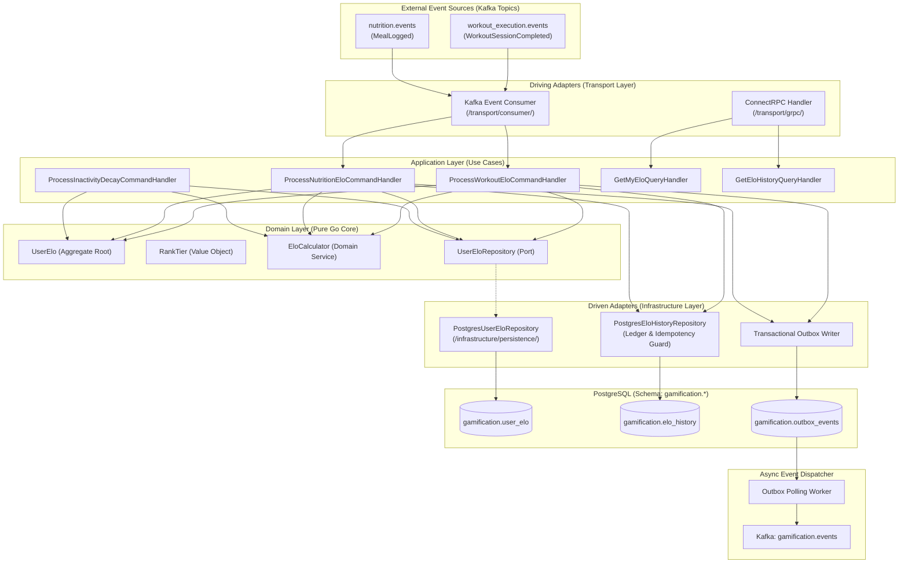
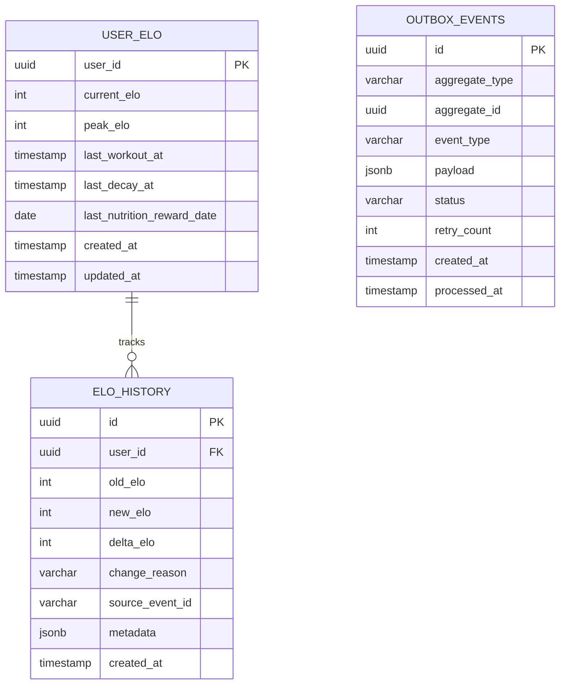
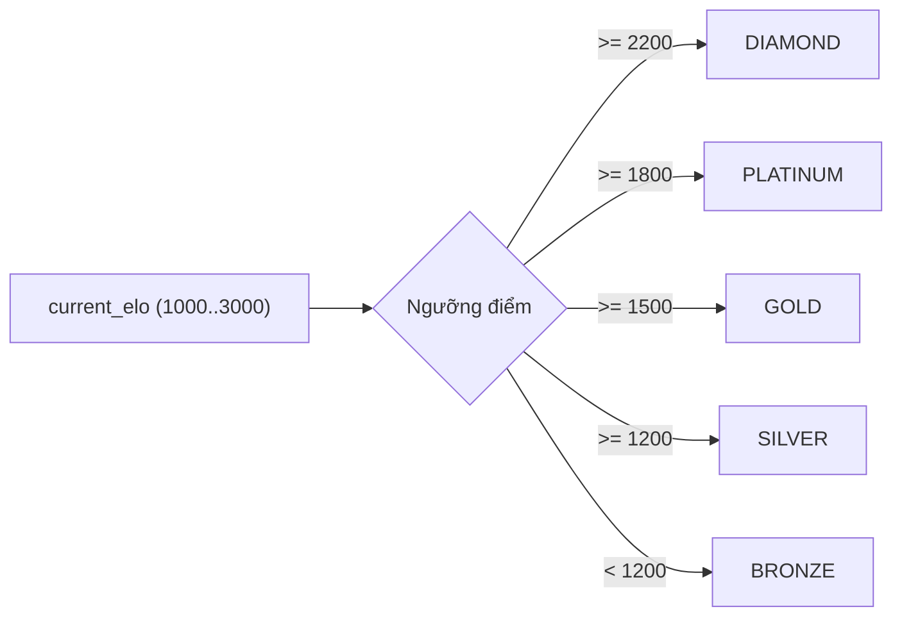
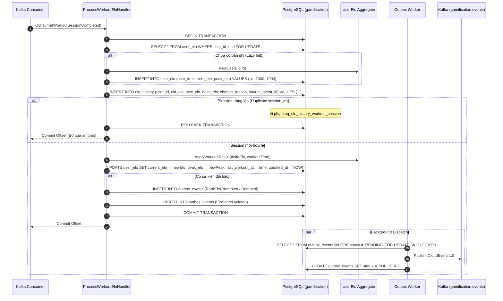
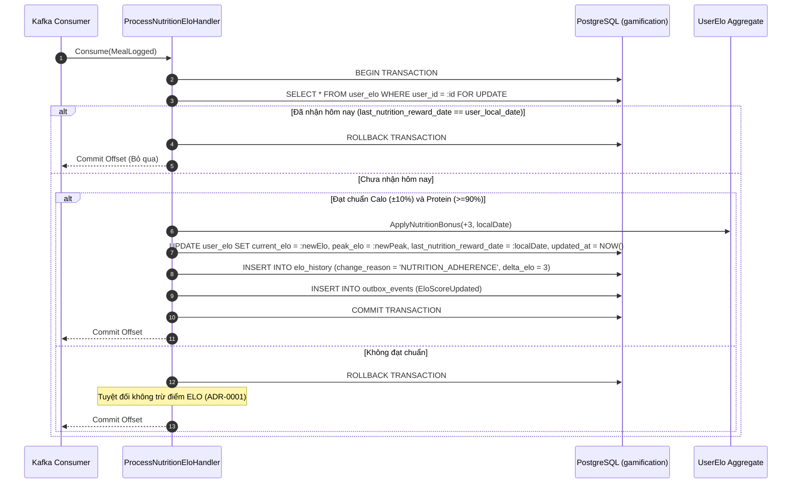
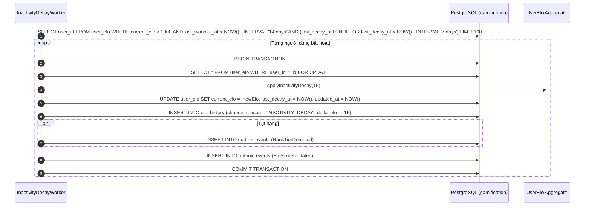
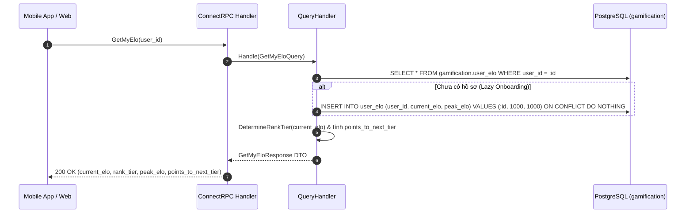

# Design: ELO Rating & Rank Tiers

## ADR References
- [ADR-0001: Tích Hợp Điểm Thưởng Kỷ Luật Dinh Dưỡng Vào Hệ Thống ELO](./adr/ADR-0001-incorporate-nutrition-adherence-bonus-into-elo.md)
- [ADR-0002: Hoãn Xác Lập Cơ Chế Tính Điểm Solo (PvP) Cho Đến Khi Xây Dựng Module Competition](./adr/ADR-0002-defer-solo-pvp-elo-scoring-mechanism.md)
- [ADR-0003: Ánh Xạ Bậc Hạng Trực Tiếp Không Trạng Thái (Loại Bỏ Demotion Shield)](./adr/ADR-0003-stateless-direct-rank-mapping-without-demotion-shield.md)
- [ADR-0004: Sử Dụng Khóa Dòng Bi Quan (SELECT FOR UPDATE) Cho Cập Nhật Điểm ELO](./adr/ADR-0004-use-pessimistic-row-locking-for-elo-updates.md)
- [ADR-0005: Thiết Lập Trần Cứng (Max ELO = 3,000) và Sàn Điểm ELO Cơ Sở](./adr/ADR-0005-establish-elo-range-and-hard-cap.md)

---

## 1. System & Component Architecture

### 1.1 Tổng Quan Kiến Trúc Hexagonal (Ports & Adapters)
Tính năng **ELO Rating & Rank Tiers** tuân thủ mô hình Hexagonal Architecture của dự án. Tầng Domain hoàn toàn cô lập với cơ sở dữ liệu và framework, giao tiếp qua Driving Adapters (Kafka Consumer, ConnectRPC) và Driven Adapters (PostgreSQL Persistence, Transactional Outbox):



### 1.2 Ranh Giới Module & Các File Mã Nguồn Dự Kiến
- **Domain Layer (`internal/gamification/domain/`)**:
  - `aggregate/user_elo.go`: Aggregate root quản lý điểm, phiên bản, thời gian tập và bất biến thăng/giáng hạng.
  - `vo/rank_tier.go`: Value object định nghĩa 5 bậc hạng và hàm ánh xạ `DetermineRankTier(elo int32) RankTier`.
  - `service/elo_calculator.go`: Domain service tính toán biến động điểm ELO từ hiệu suất và kỷ luật.
  - `event/elo_events.go`: Domain events (`EloScoreUpdated`, `RankTierPromoted`, `RankTierDemoted`).
  - `repository/user_elo_repository.go`: Port interface (`FindByID`, `GetForUpdate`, `Save`).
- **Application Layer (`internal/gamification/application/`)**:
  - `command/`: Handlers cho `ProcessWorkoutElo`, `ProcessNutritionElo`, `ProcessInactivityDecay`.
  - `query/`: Handlers cho `GetMyElo`, `GetEloHistory`.
- **Infrastructure Layer (`internal/gamification/infrastructure/`)**:
  - `persistence/postgres/`: Triển khai repository với `SELECT ... FOR UPDATE`, elo history ledger (kiểm soát lũy đẳng), outbox writer.
  - `worker/outbox_worker.go`: Background worker quét bảng outbox và publish CloudEvents sang Kafka.
- **Transport Layer (`internal/gamification/transport/`)**:
  - `consumer/`: Kafka readers cho các sự kiện hoàn thành buổi tập và dinh dưỡng.
  - `grpc/`: ConnectRPC handler hiện thực hóa protobuf contract.

---

## 2. Database & Data Model Design

### 2.1 Entity Relationship Diagram (ERD)



### 2.2 Đặc Tả Schema PostgreSQL (`gamification.*`)

```sql
CREATE SCHEMA IF NOT EXISTS gamification;

-- Bảng 1: Hồ sơ ELO Người Dùng (Rank Tier là hàm thuần túy từ current_elo theo ADR-0003, không lưu cột thừa)
CREATE TABLE IF NOT EXISTS gamification.user_elo (
    user_id UUID PRIMARY KEY,
    current_elo INTEGER NOT NULL DEFAULT 1000 CHECK (current_elo >= 1000 AND current_elo <= 3000),
    peak_elo INTEGER NOT NULL DEFAULT 1000 CHECK (peak_elo >= 1000 AND peak_elo <= 3000 AND peak_elo >= current_elo),
    last_workout_at TIMESTAMPTZ,
    last_decay_at TIMESTAMPTZ,
    last_nutrition_reward_date DATE,
    created_at TIMESTAMPTZ NOT NULL DEFAULT CURRENT_TIMESTAMP,
    updated_at TIMESTAMPTZ NOT NULL DEFAULT CURRENT_TIMESTAMP
);

CREATE INDEX IF NOT EXISTS idx_user_elo_ranking ON gamification.user_elo (current_elo DESC, updated_at ASC);
CREATE INDEX IF NOT EXISTS idx_user_elo_decay ON gamification.user_elo (last_workout_at) 
    WHERE current_elo > 1000;

-- Bảng 2: Lịch Sử Biến Động Điểm ELO (Append-only Audit Log & Idempotency Guard)
CREATE TABLE IF NOT EXISTS gamification.elo_history (
    id UUID PRIMARY KEY DEFAULT gen_random_uuid(),
    user_id UUID NOT NULL REFERENCES gamification.user_elo(user_id) ON DELETE CASCADE,
    old_elo INTEGER NOT NULL,
    new_elo INTEGER NOT NULL,
    delta_elo INTEGER NOT NULL,
    change_reason VARCHAR(50) NOT NULL,
    source_event_id VARCHAR(100),
    metadata JSONB DEFAULT '{}'::jsonb,
    created_at TIMESTAMPTZ NOT NULL DEFAULT CURRENT_TIMESTAMP
);

CREATE INDEX IF NOT EXISTS idx_elo_history_user_created ON gamification.elo_history (user_id, created_at DESC);

-- Chốt chặn lũy đẳng: Mỗi session_id buổi tập chỉ được tính ELO duy nhất một lần
CREATE UNIQUE INDEX IF NOT EXISTS uq_elo_history_workout_session 
    ON gamification.elo_history (user_id, source_event_id) 
    WHERE change_reason = 'WORKOUT_COMPLETED' AND source_event_id IS NOT NULL;

-- Bảng 3: Transactional Outbox (CloudEvents 1.0)
CREATE TABLE IF NOT EXISTS gamification.outbox_events (
    id UUID PRIMARY KEY DEFAULT gen_random_uuid(),
    aggregate_type VARCHAR(50) NOT NULL DEFAULT 'UserElo',
    aggregate_id UUID NOT NULL,
    event_type VARCHAR(150) NOT NULL,
    payload JSONB NOT NULL,
    status VARCHAR(20) NOT NULL DEFAULT 'PENDING',
    retry_count INTEGER NOT NULL DEFAULT 0,
    created_at TIMESTAMPTZ NOT NULL DEFAULT CURRENT_TIMESTAMP,
    processed_at TIMESTAMPTZ
);

CREATE INDEX IF NOT EXISTS idx_outbox_events_pending 
    ON gamification.outbox_events (status, created_at ASC) 
    WHERE status = 'PENDING';
```

### 2.3 Quy Tắc Ánh Xạ Bậc Hạng Trực Tiếp (Stateless Direct Rank Mapping - ADR-0003)
Hệ thống **không sử dụng máy trạng thái** và không dùng khiên rớt hạng (`Demotion Shield`). Bậc hạng là hàm thuần túy theo dải điểm `current_elo`:

| Bậc Hạng (Rank Tier) | Dải Điểm ELO | Đặc Điểm & Cơ Chế Giáng Hạng |
| :--- | :---: | :--- |
| **Bronze (Đồng)** | $1,000 - 1,199$ | Khởi tạo mặc định; sàn tối thiểu hệ thống (không decay dưới 1,000). |
| **Silver (Bạc)** | $1,200 - 1,499$ | Thăng hạng khi $\ge 1,200$; rớt dưới 1,200 giáng về Bronze tức thì. |
| **Gold (Vàng)** | $1,500 - 1,799$ | Thăng hạng khi $\ge 1,500$; rớt dưới 1,500 giáng về Silver tức thì. |
| **Platinum (Bạch Kim)**| $1,800 - 2,199$ | Thăng hạng khi $\ge 1,800$; rớt dưới 1,800 giáng về Gold tức thì. |
| **Diamond (Kim Cương)**| $2,200 - 3,000$ | Bậc tối cao; trần cứng 3,000 ELO (ADR-0005); rớt dưới 2,200 giáng về Platinum. |



---

## 3. High-Level Flow & Execution Logic

### 3.1 Luồng Xử Lý Buổi Tập Hoàn Thành (UC-ELO-01)



**Các bước thực thi & Ranh giới giao dịch:**
1. **Khóa dòng & Lũy đẳng**: `SELECT ... FOR UPDATE` trên `user_elo` tuần tự hóa cập nhật đồng thời (ADR-0004). Chặn sự kiện lặp qua ràng buộc duy nhất `uq_elo_history_workout_session` trên `elo_history` (`source_event_id = session_id`).
2. **Cập nhật Aggregate**: Tính toán $\Delta ELO$, kẹp trần sàn $[1000, 3000]$, cập nhật `peak_elo = max(peak_elo, new_elo)`. Đánh giá bậc hạng tức thì qua hàm thuần túy `DetermineRankTier`.
3. **Lưu trữ nguyên tử**: Cập nhật `user_elo`, ghi nhật ký `elo_history`, lưu sự kiện vào `outbox_events` trong cùng một transaction.

---

### 3.2 Luồng Thưởng Kỷ Luật Dinh Dưỡng Hàng Ngày (UC-ELO-02)



---

### 3.3 Luồng Suy Giảm Điểm Bất Hoạt (UC-ELO-03)



---

### 3.4 Luồng Truy Vấn ELO Cá Nhân & Lịch Sử (UC-ELO-04)



---

## 4. API & Integration Contracts

### 4.1 Service Contract (`proto/contracts/supporting/gamification/v1/service/gamification_service.proto`)
```protobuf
syntax = "proto3";

package contracts.supporting.gamification.v1.service;

import "contracts/supporting/gamification/v1/message/gamification_messages.proto";

option go_package = "github.com/viethung213/gym-companion/internal/gen/go/contracts/supporting/gamification/v1/service;gamificationservicev1";

service GamificationService {
  rpc GetMyElo(contracts.supporting.gamification.v1.message.GetMyEloRequest) 
      returns (contracts.supporting.gamification.v1.message.GetMyEloResponse);

  rpc GetEloHistory(contracts.supporting.gamification.v1.message.GetEloHistoryRequest) 
      returns (contracts.supporting.gamification.v1.message.GetEloHistoryResponse);
}
```

### 4.2 Message Schemas (`proto/contracts/supporting/gamification/v1/message/gamification_messages.proto`)
```protobuf
syntax = "proto3";

package contracts.supporting.gamification.v1.message;

import "google/protobuf/timestamp.proto";

option go_package = "github.com/viethung213/gym-companion/internal/gen/go/contracts/supporting/gamification/v1/message;gamificationmessagev1";

enum RankTier {
  RANK_TIER_UNSPECIFIED = 0;
  RANK_TIER_BRONZE = 1;
  RANK_TIER_SILVER = 2;
  RANK_TIER_GOLD = 3;
  RANK_TIER_PLATINUM = 4;
  RANK_TIER_DIAMOND = 5;
}

message GetMyEloRequest {
  string user_id = 1;
}

message GetMyEloResponse {
  string user_id = 1;
  int32 current_elo = 2;
  RankTier rank_tier = 3;
  int32 peak_elo = 4;
  int32 next_tier_threshold = 5;
  int32 points_to_next_tier = 6;
  google.protobuf.Timestamp updated_at = 7;
}

message GetEloHistoryRequest {
  string user_id = 1;
  int32 page_size = 2;
  string page_token = 3;
}

message EloHistoryRecord {
  string id = 1;
  int32 old_elo = 2;
  int32 new_elo = 3;
  int32 delta_elo = 4;
  string change_reason = 5;
  google.protobuf.Timestamp created_at = 6;
}

message GetEloHistoryResponse {
  repeated EloHistoryRecord records = 1;
  string next_page_token = 2;
}
```

### 4.3 CloudEvents Contracts (`proto/contracts/supporting/gamification/v1/event/elo_events.proto`)
```protobuf
syntax = "proto3";

package contracts.supporting.gamification.v1.event;

import "google/protobuf/timestamp.proto";
import "contracts/supporting/gamification/v1/message/gamification_messages.proto";

option go_package = "github.com/viethung213/gym-companion/internal/gen/go/contracts/supporting/gamification/v1/event;gamificationeventv1";

message EloScoreUpdated {
  string user_id = 1;
  int32 old_elo = 2;
  int32 new_elo = 3;
  int32 delta_elo = 4;
  string reason = 5;
  google.protobuf.Timestamp occurred_at = 6;
}

message RankTierPromoted {
  string user_id = 1;
  contracts.supporting.gamification.v1.message.RankTier old_tier = 2;
  contracts.supporting.gamification.v1.message.RankTier new_tier = 3;
  int32 current_elo = 4;
  google.protobuf.Timestamp promoted_at = 5;
}

message RankTierDemoted {
  string user_id = 1;
  contracts.supporting.gamification.v1.message.RankTier old_tier = 2;
  contracts.supporting.gamification.v1.message.RankTier new_tier = 3;
  int32 current_elo = 4;
  google.protobuf.Timestamp demoted_at = 5;
}
```

---

## 5. Non-Functional & Security Considerations

### 5.1 Concurrency & Idempotency (The 3 AM Test)
- **Khóa bi quan (Pessimistic Locking)**: Cập nhật ELO luôn thực thi trong transaction với `SELECT ... FROM gamification.user_elo WHERE user_id = $1 FOR UPDATE` (ADR-0004), tuần tự hóa mọi cập nhật đồng thời, loại bỏ 100% race conditions và Lost Updates.
- **Idempotency Guard**: Ràng buộc duy nhất `uq_elo_history_workout_session` trên `gamification.elo_history (user_id, source_event_id)` chặn đứng việc tính toán trùng lặp cho cùng một `session_id`, loại bỏ bảng trung gian thừa mà vẫn đảm bảo tính lũy đẳng tuyệt đối.

### 5.2 Schema Isolation & Security
- Phân hệ Gamification chỉ truy cập schema `gamification.*`. Cấm mọi câu lệnh `JOIN` sang các schema khác (`auth`, `workout_execution`, `nutrition`).
- API phục vụ người dùng bên ngoài chỉ cung cấp quyền đọc (Read-only); biến động điểm chỉ được kích hoạt bởi sự kiện nội bộ đã xác thực.

### 5.3 Lazy Onboarding
- Khởi tạo mặc định $1000$ ELO (Bronze) ngay khi phát sinh buổi tập hoặc truy vấn lần đầu, không yêu cầu migration dữ liệu người dùng cũ.
