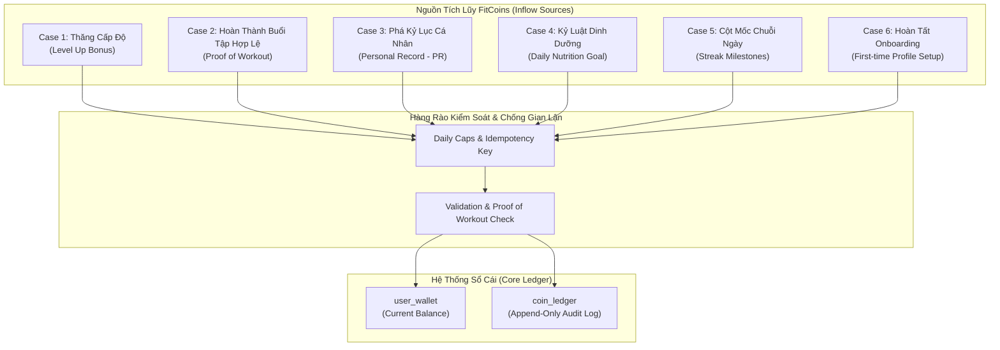

# Feature: Tiền Tệ Ảo FitCoins & Sổ Cái Bất Biến (FitCoins & Immutable Ledger)

## Summary
Tính năng **Tiền Tệ Ảo FitCoins & Sổ Cái Bất Biến (FitCoins & Immutable Ledger)** chịu trách nhiệm thiết lập và vận hành nền kinh tế ảo nội bộ cho hệ thống FITAI:
- **Đơn vị tiền tệ FitCoins**: Thước đo giá trị hữu hình vinh danh tính kỷ luật và nỗ lực thực chất của gymer (Earned-Only Currency).
- **Hệ thống Sổ Cái Bất Biến (Immutable Audit Ledger)**: Vận hành theo mô hình append-only, ghi vết $100\%$ giao dịch thu/chi, đảm bảo không thể sửa hoặc xóa dữ liệu cũ, triệt tiêu rủi ro chi tiêu kép (Double Spending) và số dư âm.
- **Tập trung vào Động Cơ Tích Lũy (Earning Engine)**: Phân tích và chuẩn hóa toàn bộ các trường hợp gymer có thể tích lũy coin (thăng cấp, hoàn thành buổi tập hợp lệ, phá kỷ lục cá nhân, dinh dưỡng, cột mốc chuỗi ngày) đi kèm **Trần khống chế chống gian lận (Daily Earning Caps)**.
- **Cổng Chi Tiêu Mở (Generic Spending Seam)**: Cung cấp API trừ coin tổng quát và an toàn (`SpendCoins`), đóng vai trò là "Ngân Hàng" phục vụ các tính năng tiêu dùng sau này (Shop, Khiên bảo vệ Streak, Voucher đối tác) mà không bị phụ thuộc cứng vào bảng giá hay kho hàng cụ thể.

---

## Problem and Desired Outcome

### Problem
1. **Thiếu phần thưởng hữu hình**: Điểm XP và Cấp độ chỉ mang tính biểu tượng tinh thần; người dùng cần một loại "tài sản ảo" tích lũy được để đổi lấy các đặc quyền và tiện ích thực tế trong ứng dụng.
2. **Rủi ro lạm phát & Gian lận kinh tế ảo**: Nếu không có cơ chế kiểm soát nguồn cung (Faucet) và trần thu nhập hàng ngày (Daily Caps), người dùng có thể gian lận (spam tạo buổi tập ảo 1 phút, log dinh dưỡng ảo) để cày coin vô tội vạ, làm phá sản nền kinh tế in-app.
3. **Lỗ hổng kỹ thuật của ví tiền truyền thống**:
   - Các hệ thống ví chỉ cập nhật đè số dư (`UPDATE wallet SET balance = balance - 100`) thường xuyên gặp lỗi **chi tiêu kép (Double Spending)** khi có 2 request gửi đồng thời, dẫn đến số dư âm hoặc mất dấu vết kiểm toán khi xảy ra khiếu nại.

### Desired Outcome
1. **Minh bạch nguồn thu nhập (Observable Inflow)**: Quy định chính xác từng hành vi thể chất nào sinh ra coin, bao nhiêu coin, và giới hạn tối đa mỗi ngày là bao nhiêu.
2. **Kiểm toán bất biến & Ràng buộc toàn vẹn tuyệt đối**:
   - $100\%$ giao dịch thu/chi được ghi 1 dòng vào `gamification.coin_ledger`.
   - Ràng buộc cứng `CHECK (balance >= 0)` và khóa dòng bi quan `SELECT ... FOR UPDATE` đảm bảo không bao giờ âm tiền và chống chi tiêu kép.
3. **Tách biệt ranh giới rõ ràng (Separation of Concerns)**:
   - Module FitCoins chỉ đóng vai trò là **Sổ Cái & Ngân Hàng Trung Ương**.
   - Module không quản lý kho hàng, không hardcode danh mục vật phẩm hay bảng giá Shop; chỉ cung cấp cổng trừ coin chuẩn hóa cho các tính năng khác gọi vào.

---

## Actors and Entry Points

- **Gym User (Mobile App / Web Client)**:
  - Xem số dư ví hiện tại: RPC `GetWalletBalance`.
  - Xem lịch sử biến động sổ cái (phân trang): RPC `ListLedgerTransactions`.
- **Inbound Event Consumers (Kafka CloudEvents)**:
  - Lắng nghe các sự kiện nỗ lực từ hệ thống để tự động cộng coin:
    - `UserLeveledUp` (từ `xp-and-levels`).
    - `WorkoutCompleted` (từ `workout_execution`).
    - `DailyNutritionAchieved` (từ `nutrition`).
    - `StreakMilestoneReached` (từ `streaks-and-habits`).
    - `ProfileOnboardingCompleted` (từ `profile`).
- **Internal Cross-Module Services**:
  - Các module dịch vụ khác (Shop, Streak Freeze, Voucher Engine) gọi vào Application Port `WalletService.SpendCoins(...)` để trừ coin khi người dùng thực hiện giao dịch đổi quà.

---

## Scope

### In Scope
- Quản lý số dư ví người dùng (`gamification.user_wallet`).
- Sổ cái kiểm toán bất biến append-only (`gamification.coin_ledger`).
- Đặc tả và chuẩn hóa **toàn bộ 6 trường hợp tích lũy FitCoins** kèm cơ chế trần khống chế (Daily Caps).
- Cung cấp cơ chế trừ coin an toàn (`SpendCoins`) hỗ trợ `idempotency_key` và kiểm soát số dư tối thiểu.
- API ConnectRPC Protobuf: `GetWalletBalance`, `ListLedgerTransactions`.

### Out of Scope & Explicitly Deferred
- **Bảng giá cứng & Kho hàng vật phẩm Cửa Hàng [DEFERRED]**: Không hardcode giá vật phẩm Streak Freeze hay XP Boost vào module này. Danh mục hàng hóa sẽ do phân hệ Shop/Inventory quản lý độc lập.
- **Nạp tiền thật mua FitCoins (IAP / Fiat Gateway) [DEFERRED]**: FitCoins là tiền tệ tích lũy thuần túy qua vận động (Proof of Workout), chưa hỗ trợ nạp tiền thật qua Apple Pay/Google Play/Stripe.
- **Chuyển coin P2P giữa người dùng [DEFERRED]**: Nghiêm cấm chuyển tiền giữa các tài khoản để ngăn chặn cày clone và gian lận.

---

## Current vs Desired Behavior

- **Current Behavior**: Hệ thống chỉ có điểm kinh nghiệm `xp` và cấp độ `level`. Khi người dùng hoàn thành bài tập hay lên cấp, chỉ có XP tăng lên mà không có ví tiền hay đơn vị tiền tệ tích lũy nào.
- **Desired Behavior**: 
  - Mỗi người dùng có một ví FitCoins đi kèm sổ cái kiểm toán bất biến.
  - Khi hoàn thành bài tập, lên cấp, hoặc đạt mục tiêu dinh dưỡng, hệ thống tự động cộng coin vào ví theo đúng quy tắc hạn mức, lưu vết rõ ràng vào sổ cái.

---

## Phân Tích Toàn Diện Các Trường Hợp Tích Lũy FitCoins (Earning Cases)

Hệ thống thiết lập 6 kịch bản tích lũy coin (Inflow Cases), bảo đảm mọi đồng coin sinh ra đều gắn liền với nỗ lực thể chất có thật:



---

### Case 1: Thưởng Thăng Cấp Độ Trọn Đời (Level Up Bonus)
- **Bản chất**: Thưởng khi gymer tích lũy đủ XP để nâng Level từ $L_{old}$ lên $L_{new}$.
- **Điều kiện**: Nhận sự kiện `UserLeveledUp`.
- **Công thức tính thưởng**:
  - **Cấp thông thường** ($L \rightarrow L+1$): Thưởng cố định **$+10$ FitCoins**.
  - **Cột mốc tròn chục (Milestone Levels: 10, 20, 30, 40, 50...)**: Thưởng lớn **$+50$ FitCoins**.
  - **Cột mốc huyền thoại (Level 100)**: Thưởng đặc biệt **$+200$ FitCoins**.
- **Cơ chế chống gian lận**: Do hàm XP căn bậc hai $\text{Level} = \min(\lfloor \sqrt{xp / 50} \rfloor + 1, 100)$ có độ dốc tăng dần, người dùng không thể spam lên level liên tục trong thời gian ngắn.
- **Idempotency Key**: `earn:level_up:<user_id>:<new_level>`.

---

### Case 2: Thưởng Hoàn Thành Buổi Tập Hợp Lệ (Proof of Workout Reward)
- **Bản chất**: Thưởng cho từng buổi tập luyện thực tế mỗi ngày.
- **Tiêu chuẩn Buổi tập hợp lệ (Proof of Workout)**:
  - Thời lượng buổi tập $\ge 15$ phút.
  - Tổng số hiệp tập (sets) $\ge 3$.
  - Không bị cờ bất thường (`is_anomalous_session == false`).
- **Mức thưởng**: **$+5$ FitCoins / buổi tập hợp lệ**.
- **Trần khống chế gian lận (Daily Cap - The 3 AM Test)**:
  - **Tối đa 1 lần nhận thưởng tập luyện / ngày** theo múi giờ địa phương (`user_local_date`).
  - *Ý nghĩa*: Dù gymer tập 2–3 buổi trong ngày, chỉ buổi tập đầu tiên đạt chuẩn được nhận $+5$ coin (các buổi sau vẫn nhận XP bình thường nhưng không nhận coin). Ngăn chặn $100\%$ hành vi bấm hoàn thành 20 bài tập ảo để cày trộm coin.
- **Idempotency Key**: `earn:workout:<workout_session_id>`.

---

### Case 3: Thưởng Phá Kỷ Lục Cá Nhân (Personal Record - PR Bonus)
- **Bản chất**: Khuyến khích người dùng bứt phá giới hạn thể lực bản thân (nâng mức tạ nặng hơn hoặc nhiều rep hơn ở các bài tập lớn: Bench Press, Squat, Deadlift...).
- **Điều kiện**: Buổi tập hợp lệ có đánh dấu cờ `is_pr == true` từ phân hệ `workout_execution`.
- **Mức thưởng**: **$+5$ FitCoins / ngày có kỷ lục mới**.
- **Trần khống chế gian lận (Daily Cap)**:
  - **Tối đa 1 lần thưởng PR / ngày** (tối đa $+5$ coin/ngày), bất kể trong buổi tập đó người dùng phá PR ở bao nhiêu bài tập.
- **Idempotency Key**: `earn:pr:<user_id>:<user_local_date>`.

---

### Case 4: Thưởng Kỷ Luật Dinh Dưỡng Hàng Ngày (Nutrition Adherence Reward)
- **Bản chất**: Thể hình đòi hỏi cả tập luyện lẫn ăn uống. Thưởng cho gymer khi hoàn thành mục tiêu năng lượng và đạm trong ngày.
- **Điều kiện**: Nhận sự kiện `DailyNutritionAchieved` xác nhận lượng Calo và Protein đạt mục tiêu trong dung sai cho phép ($\pm 10\%$).
- **Mức thưởng**: **$+3$ FitCoins / ngày**.
- **Trần khống chế gian lận (Daily Cap)**:
  - **Tối đa 1 lần / ngày** theo ngày địa phương `user_local_date`.
- **Idempotency Key**: `earn:nutrition:<user_id>:<user_local_date>`.

---

### Case 5: Thưởng Cán Cột Mốc Chuỗi Ngày Bền Bỉ (Streak Milestones Reward)
- **Bản chất**: Tôn vinh tính kiên trì dài hạn (chỉ thưởng coin ở các cột mốc lớn, ngày thường không thưởng coin để tránh lạm phát).
- **Mức thưởng bậc thang**:
  - Cán mốc **7 ngày** (1 tuần): Thưởng **$+15$ FitCoins**.
  - Cán mốc **30 ngày** (1 tháng): Thưởng **$+50$ FitCoins**.
  - Cán mốc **100 ngày**: Thưởng **$+150$ FitCoins**.
  - Cán mốc **365 ngày** (1 năm): Thưởng **$+500$ FitCoins**.
- **Điều kiện**: Nhận sự kiện `StreakMilestoneReached`. Mỗi cột mốc chỉ nhận thưởng **duy nhất 1 lần trọn đời**.
- **Idempotency Key**: `earn:streak:<user_id>:<milestone_days>`.

---

### Case 6: Thưởng Hoàn Tất Khởi Tạo Hồ Sơ (First-Time Onboarding Bonus)
- **Bản chất**: Tặng "vốn khởi nghiệp" ban đầu khi người dùng mới hoàn thành thiết lập hồ sơ thể trạng (chiều cao, cân nặng, mục tiêu).
- **Mức thưởng**: **$+20$ FitCoins**.
- **Điều kiện**: Chỉ nhận **duy nhất 1 lần trong suốt vòng đời tài khoản**.
- **Idempotency Key**: `earn:onboarding:<user_id>`.

---

### Tổng Kết Ma Trận Thu Nhập & Trần Kiểm Soát (Tokenomics Summary)

| Nguồn tích lũy | Tần suất phát sinh | Mức thưởng (FitCoins) | Trần khống chế (Daily Cap / Limit) |
| :--- | :--- | :---: | :--- |
| **1. Thăng cấp độ** | Khi tích lũy đủ XP | **$+10$** (Cột mốc: **$+50$** – **$+200$**) | Tự nhiên theo đường cong XP căn bậc hai |
| **2. Buổi tập hợp lệ** | Hàng ngày | **$+5$** | **Tối đa 1 lần / ngày** (5 coin/ngày) |
| **3. Kỷ lục cá nhân (PR)** | Khi phá kỷ lục | **$+5$** | **Tối đa 1 lần / ngày** (5 coin/ngày) |
| **4. Dinh dưỡng kỷ luật** | Hàng ngày | **$+3$** | **Tối đa 1 lần / ngày** (3 coin/ngày) |
| **5. Cột mốc Streak** | Khi cán mốc 7, 30, 100, 365 ngày | **$+15$** $\rightarrow$ **$+500$** | 1 lần cho mỗi cột mốc trọn đời |
| **6. Khởi tạo hồ sơ** | 1 lần duy nhất | **$+20$** | 1 lần duy nhất trọn đời |

> [!TIP]
> **Ước tính cung tiền thực tế**:
> Một gymer tập luyện cực kỳ chăm chỉ và kỷ luật sẽ kiếm được tối đa:
> $$5\text{ (tập)} + 3\text{ (dinh dưỡng)} = 8\text{ FitCoins/ngày} \approx 56\text{ FitCoins/tuần}$$
> Cộng thêm trung bình $1$ lần lên cấp/tuần ($+10$ coin), tổng thu nhập trung bình của gymer tích cực là $\approx 65\text{–}75\text{ FitCoins/tuần}$ ($\approx 300\text{ FitCoins/tháng}$).
> Đây là con số cơ sở vững chắc để định giá các tiện ích sau này mà không lo mất kiểm soát cung tiền.

---

## Khung Cơ Chế Chi Tiêu Mở (Generic Spending Framework)

Thay vì hardcode danh mục vật phẩm, module FitCoins cung cấp cơ chế trừ coin an toàn:

### Cổng trừ coin nghiệp vụ (`SpendCoins`)
```go
type SpendRequest struct {
    UserID         uuid.UUID
    Amount         int64          // Số coin cần trừ (> 0)
    Reason         string         // Mã nghiệp vụ: SPEND_STREAK_FREEZE, SPEND_XP_BOOST, SPEND_VOUCHER...
    IdempotencyKey string         // Khóa lũy đẳng chống trừ trùng
    Metadata       map[string]any // Dữ liệu bổ trợ
}
```

### Các kịch bản sử dụng (Use Cases) trong tương lai:
1. **Tiện ích bảo vệ kỷ luật (Protection Perks)**: Mua khiên Đóng Băng Chuỗi (Streak Freeze) bảo toàn streak khi lỡ ngày tập.
2. **Tiện ích tăng tốc động lực (Booster Perks)**: Mua gói nhân đôi XP trong thời gian ngắn (Double XP Boost 15m).
3. **Phần thưởng thực tế (Real-World Perks)**: Quy đổi voucher giảm giá whey protein, đồ tập từ các đối tác thương hiệu liên kết.

---

## User Scenarios / Use Cases

### UC-FC-01: Tích Lũy Coin Tự Động Từ Hoạt Động (Earning Inflow)
- **Actor**: Inbound Kafka Consumers.
- **Trigger**: Hệ thống phát sinh một trong các sự kiện: `WorkoutCompleted`, `UserLeveledUp`, `DailyNutritionAchieved`, `StreakMilestoneReached`.
- **Main Flow**:
  1. Consumer xác thực tính hợp lệ của sự kiện và tạo `idempotency_key` tương ứng.
  2. Bắt đầu Database Transaction:
     - Khóa dòng ví: `SELECT balance FROM gamification.user_wallet WHERE user_id = :id FOR UPDATE`.
     - Kiểm tra `coin_ledger` theo `idempotency_key`. Nếu đã tồn tại $\rightarrow$ Trả về thành công ngay (Idempotent).
     - Kiểm tra trần Daily Cap trong ngày (nếu là sự kiện workout, pr, nutrition).
     - Cập nhật số dư: `new_balance = balance + amount`.
     - Chèn bản ghi append-only vào `coin_ledger` với `amount`, `balance_after = new_balance`, `reason`, `idempotency_key`.
  3. Commit transaction.
- **Postconditions**: Ví người dùng được cộng coin chính xác, số dư cập nhật và có dòng kiểm toán bất biến.

---

### UC-FC-02: Thực Hiện Giao Dịch Chi Tiêu Coin (Spending Outflow)
- **Actor**: Tính năng nghiệp vụ nội bộ (Shop / Perks).
- **Trigger**: Người dùng xác nhận đổi một tiện ích hoặc vật phẩm.
- **Main Flow**:
  1. Dịch vụ gọi `WalletService.SpendCoins(ctx, req)`.
  2. Bắt đầu Database Transaction:
     - Khóa dòng ví: `SELECT balance FROM gamification.user_wallet WHERE user_id = :id FOR UPDATE`.
     - Kiểm tra `idempotency_key`: Nếu đã từng xử lý thành công $\rightarrow$ Trả về kết quả trước đó.
     - Kiểm tra số dư: Nếu `balance < req.Amount` $\rightarrow$ Rollback transaction, trả về lỗi `ERR_INSUFFICIENT_FUNDS`.
     - Cập nhật số dư: `new_balance = balance - req.Amount`.
     - Chèn bản ghi vào `coin_ledger`: `amount = -req.Amount`, `balance_after = new_balance`, `reason`, `idempotency_key`.
  3. Commit transaction.
  4. Trả về thành công kèm `balance_after`.
- **Alternate Flow (Không đủ số dư)**:
  - Nếu `balance < req.Amount`: Báo lỗi `FAILED_PRECONDITION: Số dư FitCoins không đủ`, không ghi ledger, không thay đổi số dư ví.

---

### UC-FC-03: Tra Cứu Số Dư & Lịch Sử Giao Dịch Sổ Cái
- **Actor**: Gym User (Đã xác thực).
- **Main Flow**:
  1. Người dùng gọi API `GetWalletBalance` $\rightarrow$ Trả về `balance` hiện tại.
  2. Người dùng gọi API `ListLedgerTransactions(limit = 20, cursor = ...)` $\rightarrow$ Trả về danh sách các dòng lịch sử thu/chi từ `coin_ledger` kèm phân trang.

---

## Business Rules and Invariants

### BR-FC-01: Bất Biến Số Dư Không Âm (Non-Negative Balance Invariant)
- Tại mọi thời điểm:
  $$\text{balance} \ge 0$$
- Được bảo vệ 2 lớp:
  1. Logic Domain kiểm tra: `if balance < amount { return ErrInsufficientBalance }`.
  2. Ràng buộc PostgreSQL: `CONSTRAINT chk_wallet_balance_non_negative CHECK (balance >= 0)`.

### BR-FC-02: Nguyên Tắc Sổ Cái Append-Only (Immutable Ledger Rule)
- Bảng `gamification.coin_ledger` nghiêm cấm cập nhật (`UPDATE`) hoặc xóa (`DELETE`).
- Phương trình cân bằng sổ cái luôn được bảo toàn:
  $$B_{\text{after}} = B_{\text{before}} + \Delta_{\text{amount}} \quad (\text{với } B \text{ là } \texttt{balance})$$

### BR-FC-03: Chống Chi Tiêu Kép (Anti-Double-Spending Rule)
- Mọi thao tác thay đổi số dư ví bắt buộc phải sử dụng khóa dòng bi quan:
  ```sql
  SELECT balance FROM gamification.user_wallet WHERE user_id = $1 FOR UPDATE;
  ```
- Đảm bảo tuần tự hóa tuyệt đối, loại bỏ Lost Update khi nhiều request diễn ra đồng thời.

### BR-FC-04: Tuân Thủ Trần Thu Nhập Ngày (Daily Cap Enforcement)
- Hệ thống khống chế chặt chẽ giới hạn thu nhập theo ngày dương lịch địa phương (`user_local_date`):
  - Tối đa 1 lần thưởng Buổi tập hợp lệ / ngày ($+5$ coin).
  - Tối đa 1 lần thưởng Phá kỷ lục cá nhân / ngày ($+5$ coin).
  - Tối đa 1 lần thưởng Kỷ luật dinh dưỡng / ngày ($+3$ coin).

---

## Error and Boundary Scenarios

- **Số Dư Không Đủ**: Trả về `ERR_INSUFFICIENT_FUNDS`, không trừ tiền, không ghi ledger.
- **Trùng Lặp Idempotency Key**: Trả về kết quả giao dịch cũ, không thực hiện cộng/trừ lần 2.
- **Tập Luyện Nhiều Buổi Trong Ngày**: Buổi thứ nhất nhận $+5$ coin; các buổi tiếp theo trong cùng ngày nhận $0$ coin (vẫn nhận XP bình thường).
- **Người Dùng Mới Chưa Có Ví**: Khởi tạo tự động ví với `balance = 0` trong lần giao dịch đầu tiên.

---

## Acceptance Criteria

- [ ] **AC-FC-01**: GIVEN người dùng hoàn thành buổi tập hợp lệ đầu tiên trong ngày WHEN sự kiện `WorkoutCompleted` được xử lý THEN ví được cộng đúng $+5$ FitCoins và ledger ghi nhận bản ghi với `amount = +5`.
- [ ] **AC-FC-02**: GIVEN người dùng hoàn thành buổi tập thứ 2 trong cùng một ngày WHEN sự kiện `WorkoutCompleted` được xử lý THEN ví không được cộng thêm coin (Daily Cap = 1 lần/ngày).
- [ ] **AC-FC-03**: GIVEN người dùng lên Level 10 (mốc tròn chục) WHEN sự kiện `UserLeveledUp` được xử lý THEN ví được cộng đúng $+50$ FitCoins.
- [ ] **AC-FC-04**: GIVEN ví có 50 FitCoins WHEN có yêu cầu trừ 60 FitCoins THEN hệ thống từ chối với lỗi `ERR_INSUFFICIENT_FUNDS` và số dư giữ nguyên 50.
- [ ] **AC-FC-05**: GIVEN ví có 50 FitCoins WHEN có 2 yêu cầu trừ 40 FitCoins gửi đến đồng thời THEN đúng 1 yêu cầu thành công, yêu cầu còn lại bị từ chối do không đủ số dư (chống chi tiêu kép).
- [ ] **AC-FC-06**: GIVEN cùng một sự kiện nạp coin có `idempotency_key` bị gửi lại 2 lần THEN ví chỉ được cộng tiền đúng 1 lần duy nhất.

---

## Non-Functional Requirements

- **The 3 AM Test**: Zero cron jobs định kỳ. Toàn bộ tính toán diễn ra theo thời gian thực (Real-time).
- **ACID Transaction**: Cập nhật `user_wallet` và chèn bản ghi `coin_ledger` bắt buộc nằm trong cùng 1 Database Transaction.
- **Hiệu Năng**: Truy vấn số dư ví $< 2\text{ ms}$; ghi nhận giao dịch $< 5\text{ ms}$.

---

## Open Questions & Decisions Needed

> [!NOTE]
> 1. **Mức thưởng Onboarding ban đầu**: Tặng $+20$ FitCoins khi hoàn tất hồ sơ lần đầu đã vừa vặn để tạo vốn ban đầu chưa?
> 2. **Trần thưởng theo ngày**: Giới hạn tối đa 1 buổi tập/ngày ($+5$ coin) và 1 lần dinh dưỡng/ngày ($+3$ coin) có cần điều chỉnh linh hoạt theo gói hội viên hay giữ cố định cho toàn bộ người dùng?

---

## Explicit Assumptions
- Giả định rằng FitCoins là tiền tệ nội bộ, không có giá trị quy đổi trực tiếp ra tiền mặt (fiat currency).
- Giả định rằng ngày địa phương của người dùng (`user_local_date`) được tính toán dựa trên múi giờ đã lưu trong hồ sơ người dùng.
