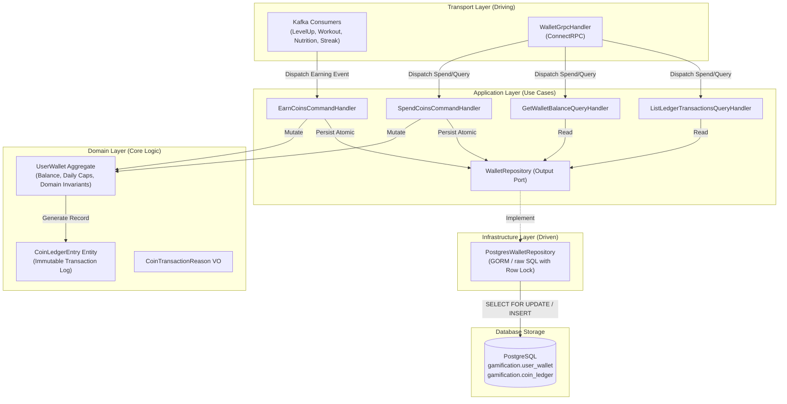
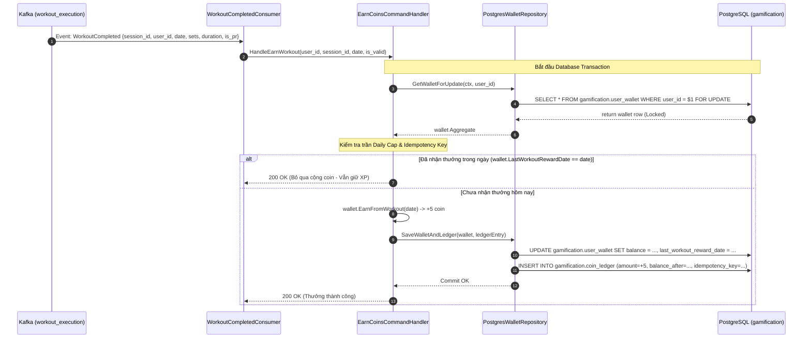
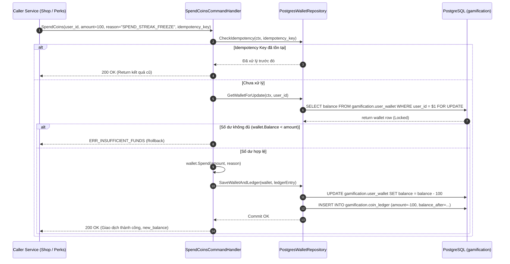

# Thiết Kế Kỹ Thuật: Tiền Tệ Ảo FitCoins & Sổ Cái Bất Biến (FitCoins & Immutable Ledger)

## 1. Kiến Trúc Hexagonal (Ports & Adapters)

Phân hệ FitCoins vận hành như một **Micro-Ledger Engine** hoàn toàn khép kín, độc lập với các phân hệ khác:



### Ranh giới & Trách nhiệm các tầng:
1. **Domain Layer**:
   - `UserWallet`: Quản lý số dư, thực thi nghiệp vụ tích lũy theo từng trường hợp (Level Up, Workout, PR, Nutrition, Streak, Onboarding) và kiểm tra bất biến `Balance >= Amount`.
   - `CoinLedgerEntry`: Biểu diễn bản ghi sổ cái bất biến, tính toán phương trình cân bằng $\text{balance\_after} = \text{balance\_before} + \text{amount}$.
2. **Application Layer**:
   - Điều phối transaction ACID, kiểm tra Idempotency Key, nạp và lưu trữ Aggregate qua Output Port `WalletRepository`.
3. **Infrastructure Layer**:
   - Hiện thực hóa `PostgresWalletRepository`: Sử dụng khóa dòng bi quan `SELECT ... FOR UPDATE` trên bảng `user_wallet`, lưu đồng thời ví và sổ cái trong 1 transaction cục bộ.
4. **Transport Layer**:
   - Kafka Consumers: Chuyển đổi các CloudEvents từ domain ngoài thành `EarnCoinsCommand`.
   - ConnectRPC Server: Cung cấp API tra cứu số dư, lịch sử giao dịch và cổng chi tiêu `SpendCoins`.

---

## 2. Thiết Kế Cơ Sở Dữ Liệu & Ràng Buộc ACID (Database & DDL)

### 2.1. Sơ Đồ Quan Hệ Dữ Liệu (ERD)

```mermaid
erDiagram
    user_wallet ||--o{ coin_ledger : "records 100% transactions"
    
    user_wallet {
        uuid user_id PK "Khóa chính, 1-1 với người dùng"
        bigint balance "Số dư tức thời, CHECK >= 0"
        date last_workout_reward_date "Ngày nhận thưởng tập gần nhất (Daily Cap)"
        date last_pr_reward_date "Ngày nhận thưởng PR gần nhất (Daily Cap)"
        date last_nutrition_reward_date "Ngày nhận thưởng dinh dưỡng gần nhất (Daily Cap)"
        timestamptz created_at "Thời điểm tạo ví"
        timestamptz updated_at "Thời điểm cập nhật số dư"
    }

    coin_ledger {
        uuid id PK "Khóa chính dòng sổ cái"
        uuid user_id FK "ID người dùng sở hữu"
        int amount "Số coin biến động (+ nạp, - tiêu, CHECK <> 0)"
        bigint balance_after "Số dư sau giao dịch, CHECK >= 0"
        varchar reason "Mã nghiệp vụ: EARN_WORKOUT, SPEND_STREAK_FREEZE..."
        varchar source_event_id "Mã CloudEvent hoặc Request ID nguồn"
        varchar idempotency_key UQ "Khóa lũy đẳng duy nhất chống duplicate"
        jsonb metadata "Dữ liệu ngữ cảnh giao dịch"
        timestamptz created_at "Thời điểm ghi sổ (bất biến)"
    }
```

### 2.2. DDL PostgreSQL Schema `gamification.*`

```sql
-- 1. Bảng Ví Người Dùng (User Wallet)
CREATE TABLE IF NOT EXISTS gamification.user_wallet (
    user_id UUID PRIMARY KEY,
    balance BIGINT NOT NULL DEFAULT 0,
    last_workout_reward_date DATE,
    last_pr_reward_date DATE,
    last_nutrition_reward_date DATE,
    created_at TIMESTAMPTZ NOT NULL DEFAULT NOW(),
    updated_at TIMESTAMPTZ NOT NULL DEFAULT NOW(),
    CONSTRAINT chk_user_wallet_balance_non_negative CHECK (balance >= 0)
);

-- 2. Bảng Sổ Cái Kiểm Toán Bất Biến (Coin Ledger - Append Only)
CREATE TABLE IF NOT EXISTS gamification.coin_ledger (
    id UUID PRIMARY KEY DEFAULT gen_random_uuid(),
    user_id UUID NOT NULL,
    amount INT NOT NULL,
    balance_after BIGINT NOT NULL,
    reason VARCHAR(64) NOT NULL,
    source_event_id VARCHAR(128),
    idempotency_key VARCHAR(128) NOT NULL,
    metadata JSONB DEFAULT '{}'::jsonb,
    created_at TIMESTAMPTZ NOT NULL DEFAULT NOW(),
    CONSTRAINT chk_coin_ledger_amount_nonzero CHECK (amount <> 0),
    CONSTRAINT chk_coin_ledger_balance_after_non_negative CHECK (balance_after >= 0),
    CONSTRAINT uq_coin_ledger_idempotency_key UNIQUE (idempotency_key)
);

-- 3. Chỉ mục tối ưu hóa hiệu năng
-- Truy vấn lịch sử giao dịch phân trang theo thời gian
CREATE INDEX IF NOT EXISTS idx_coin_ledger_user_created 
ON gamification.coin_ledger (user_id, created_at DESC);
```

---

## 3. Luồng Xử Lý Nghiệp Vụ (Sequence Diagrams)

### 3.1. Luồng Tích Lũy Coin Từ Buổi Tập (Inbound Earning Flow with Daily Cap)



### 3.2. Luồng Chi Tiêu Coin (Spending Outflow & Double-Spending Guard)



---

## 4. Hợp Đồng Giao Diện API (Protobuf ConnectRPC)

Tệp hợp đồng: `contracts/gamification/wallet/v1/wallet.proto`

```protobuf
syntax = "proto3";

package contracts.gamification.wallet.v1;

import "google/protobuf/timestamp.proto";

option go_package = "github.com/viethung213/gym-companion/internal/gen/go/contracts/gamification/wallet/v1;walletv1";

// Dịch vụ Quản Lý Ví Tiền Tệ Thể Thao FitCoins
service WalletService {
  // Tra cứu số dư ví hiện tại
  rpc GetWallet(GetWalletRequest) returns (GetWalletResponse);

  // Tra cứu lịch sử biến động sổ cái phân trang
  rpc ListTransactions(ListTransactionsRequest) returns (ListTransactionsResponse);

  // Cổng chi tiêu coin nghiệp vụ (Dùng cho Client hoặc các service nội bộ)
  rpc SpendCoins(SpendCoinsRequest) returns (SpendCoinsResponse);
}

message GetWalletRequest {}

message GetWalletResponse {
  string user_id = 1;
  int64 balance = 2;
  google.protobuf.Timestamp updated_at = 3;
}

message ListTransactionsRequest {
  int32 page_size = 1; // Mặc định 20, tối đa 100
  int32 page_token = 2; // Offset hoặc page index
}

message LedgerEntry {
  string id = 1;
  int32 amount = 2; // Dương: nạp, Âm: tiêu
  int64 balance_after = 3;
  string reason = 4;
  string source_event_id = 5;
  google.protobuf.Timestamp created_at = 6;
}

message ListTransactionsResponse {
  repeated LedgerEntry items = 1;
  int64 total_count = 2;
}

message SpendCoinsRequest {
  int64 amount = 1; // Số coin cần trừ (> 0)
  string reason = 2; // Mã nghiệp vụ (vd: SPEND_STREAK_FREEZE)
  string idempotency_key = 3; // Khóa lũy đẳng chống trùng lặp
}

message SpendCoinsResponse {
  string transaction_id = 1;
  int64 balance_after = 2;
  google.protobuf.Timestamp created_at = 3;
}
```

---

## 5. Cấu Trúc Mã Nguồn (Code Organization)

```text
internal/gamification/
├── domain/
│   ├── aggregate/
│   │   ├── user_wallet.go                # Aggregate UserWallet & Domain Invariants
│   │   └── user_wallet_test.go           # Unit tests nghiệp vụ ví & Daily Caps
│   ├── entity/
│   │   └── coin_ledger_entry.go          # Entity CoinLedgerEntry
│   └── vo/
│       └── coin_transaction_reason.go    # Enums lý do giao dịch
│
├── application/
│   ├── command/
│   │   ├── earn_coins.go                 # Use Case cộng coin (6 cases)
│   │   ├── earn_coins_test.go            # Unit tests cộng coin & Daily Caps
│   │   ├── spend_coins.go                # Use Case trừ coin an toàn
│   │   └── spend_coins_test.go           # Unit tests chống double spending & âm tiền
│   ├── query/
│   │   ├── get_wallet_balance.go         # Use Case đọc số dư
│   │   └── list_ledger_transactions.go   # Use Case đọc lịch sử sổ cái
│   └── port/
│       └── wallet_repository.go          # Output Port giao tiếp DB
│
├── infrastructure/
│   └── persistence/
│       ├── wallet_repository.go          # GORM / SQL implementation with Row Lock
│       └── wallet_repository_test.go     # Integration test tương tranh PostgreSQL
│
└── transport/
    ├── grpc/
    │   └── wallet_handler.go             # ConnectRPC Server Handler
    └── consumer/
        ├── level_up_consumer.go          # Lắng nghe UserLeveledUp
        └── workout_consumer.go           # Lắng nghe WorkoutCompleted
```
