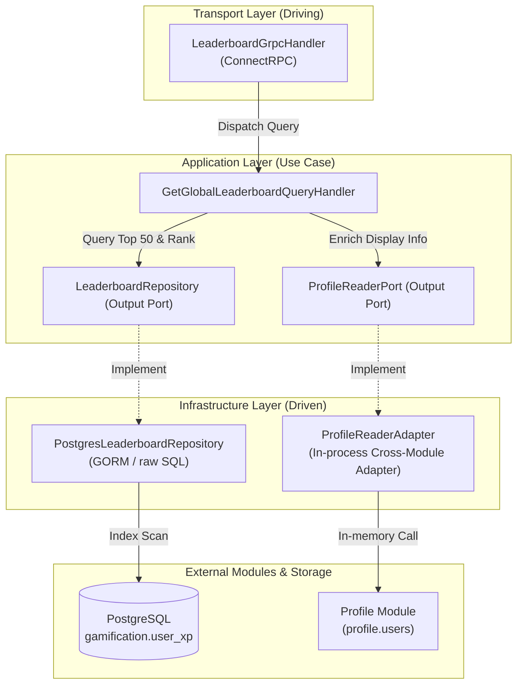
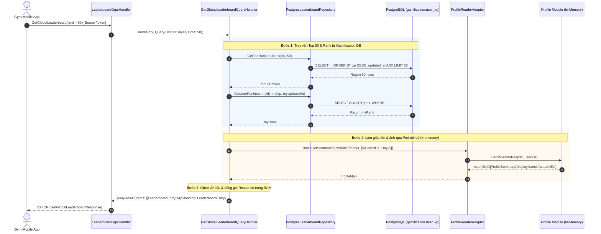

# Thiết Kế Kỹ Thuật: Bảng Xếp Hạng Toàn Hệ Thống Theo Điểm XP (XP Leaderboard)

## 1. Kiến Trúc Hexagonal (Ports & Adapters)

Tính năng **Bảng Xếp Hạng Toàn Hệ Thống (XP Leaderboard)** là một Use Case thuần đọc (**Read-Only Query Use Case**), tuân thủ nghiêm ngặt mô hình Ports & Adapters:



### Ranh giới trách nhiệm giữa các tầng:
1. **Transport Layer**: Tiếp nhận request ConnectRPC `GetGlobalLeaderboard`, xác thực Bearer Token, trích xuất `user_id` và chuyển giao cho Application Query Handler.
2. **Application Layer**:
   - `GetGlobalLeaderboardQueryHandler`: Điều phối truy vấn Top 50 từ cơ sở dữ liệu và gọi `ProfileReaderPort` để làm giàu thông tin tên/ảnh của gymer.
   - Định nghĩa hai Output Ports: `LeaderboardRepository` và `ProfileReaderPort`.
3. **Infrastructure Layer**:
   - `PostgresLeaderboardRepository`: Thực thi các truy vấn SQL tối ưu hóa trên bảng `gamification.user_xp`.
   - `ProfileReaderAdapter`: Hiện thực hóa `ProfileReaderPort` bằng cách gọi hàm in-memory sang Application Service của module `profile` với timeout $500\text{ ms}$ và cơ chế fallback an toàn.

---

## 2. Thiết Kế Cơ Sở Dữ Liệu & Chỉ Mục (Database & Index DDL)

Tính năng vận hành trực tiếp trên bảng `gamification.user_xp` sẵn có từ module `xp-and-levels`, không tạo bảng trung gian hay nhân bản dữ liệu.

### Chỉ mục B-Tree Composite Index
Để đáp ứng chuẩn hiệu năng "The 3 AM Test" (độ trễ $< 5\text{ ms}$), hệ thống kích hoạt chỉ mục kết hợp:

```sql
-- Migration: Tạo index phục vụ truy vấn Bảng Xếp Hạng
CREATE INDEX IF NOT EXISTS idx_user_xp_leaderboard 
ON gamification.user_xp (xp DESC, updated_at ASC);
```

### Phân tích cơ chế truy vấn vật lý (Physical Query Mechanics):

#### Truy vấn 1: Lấy danh sách Top 50 dẫn đầu
```sql
SELECT user_id, xp, level, updated_at
FROM gamification.user_xp
ORDER BY xp DESC, updated_at ASC
LIMIT 50;
```
* **Kế hoạch thực thi (Execution Plan)**: PostgreSQL sử dụng **Index Scan** trên `idx_user_xp_leaderboard`. Engine duyệt tuần tự đúng 50 leaf nodes đầu tiên của cây B-tree và dừng lại ngay lập tức (không cần sắp xếp lại toàn bộ bảng).
* **Thời gian thực thi**: $< 2\text{ ms}$.

#### Truy vấn 2: Xác định vị trí người dùng gọi API (`my_rank`)
Nếu người dùng hiện tại nằm trong Top 50, vị trí chính là `index + 1` của mảng kết quả ($O(1)$).
Nếu người dùng nằm ngoài Top 50, thực thi câu lệnh đếm có chỉ mục:
```sql
SELECT COUNT(*) + 1 AS my_rank
FROM gamification.user_xp
WHERE xp > :my_xp 
   OR (xp = :my_xp AND updated_at < :my_updated_at)
   OR (xp = :my_xp AND updated_at = :my_updated_at AND user_id < :my_user_id);
```
* **Kế hoạch thực thi**: Nhờ index trên `(xp DESC, updated_at ASC)`, engine thực hiện **Index Only Scan** để đếm số lượng bản ghi thỏa mãn điều kiện.
* **Thời gian thực thi**: P99 $< 20\text{ ms}$.

---

## 3. Luồng Xử Lý Nghiệp Vụ (Sequence Diagram)

### Luồng thành công chính (Happy Path with Profile Enrichment):



### Cơ chế phòng vệ khi Module Profile gặp sự cố (Resilience & Fallback Guard):
* Lệnh gọi sang `ProfileReaderPort` được bọc bởi `context.WithTimeout(ctx, 500*time.Millisecond)`.
* Nếu module `profile` bị lỗi, timeout hoặc trả về thiếu bản ghi của một `user_id`:
  * Tầng Application **không làm crash request**.
  * Tự động áp dụng giá trị fallback mặc định: `display_name = "Gymer"`, `avatar_url = ""`.
  * Bảng xếp hạng vẫn được hiển thị nguyên vẹn cho người dùng.

---

## 4. Hợp Đồng Giao Diện API (Protobuf ConnectRPC)

Tệp hợp đồng: `contracts/gamification/leaderboard/v1/leaderboard.proto`

```protobuf
syntax = "proto3";

package contracts.gamification.leaderboard.v1;

option go_package = "github.com/viethung213/gym-companion/internal/gen/go/contracts/gamification/leaderboard/v1;leaderboardv1";

// Dịch vụ Bảng Xếp Hạng Toàn Hệ Thống
service LeaderboardService {
  // Tra cứu bảng vàng Top 50 và thứ hạng cá nhân theo thời gian thực
  rpc GetGlobalLeaderboard(GetGlobalLeaderboardRequest) returns (GetGlobalLeaderboardResponse);
}

message GetGlobalLeaderboardRequest {
  // Số lượng thành viên tối đa cần lấy (Mặc định: 50, Tối đa: 100)
  int32 limit = 1;
}

message LeaderboardEntry {
  // Vị trí thứ hạng (Bắt đầu từ 1)
  int64 rank = 1;
  // ID định danh người dùng
  string user_id = 2;
  // Tên hiển thị công khai (Lấy từ module profile)
  string display_name = 3;
  // Đường dẫn ảnh đại diện (Lấy từ module profile)
  string avatar_url = 4;
  // Tổng điểm kinh nghiệm tích lũy trọn đời
  int64 xp = 5;
  // Cấp độ trọn đời hiện tại (Level 1-100)
  int32 level = 6;
}

message GetGlobalLeaderboardResponse {
  // Danh sách Top người dùng dẫn đầu hệ thống (Sắp xếp theo rank tăng dần)
  repeated LeaderboardEntry items = 1;
  // Vị trí và thành tích của chính người dùng đang gọi API
  LeaderboardEntry my_standing = 2;
}
```

---

## 5. Cấu Trúc Mã Nguồn (Code Organization)

```text
internal/gamification/
├── application/
│   ├── port/
│   │   ├── leaderboard_repository.go     # Output Port truy vấn DB bảng xếp hạng
│   │   └── profile_reader.go             # Output Port nạp thông tin tên/avatar
│   └── query/
│       ├── get_global_leaderboard.go     # Query DTO & Handler chính
│       └── get_global_leaderboard_test.go# Unit tests với mock repository & port
│
├── infrastructure/
│   ├── persistence/
│   │   └── leaderboard_repository.go     # GORM implementation của LeaderboardRepository
│   └── adapter/
│       └── profile_adapter.go            # In-process adapter gọi sang module profile
│
└── transport/
    └── grpc/
        └── leaderboard_handler.go        # ConnectRPC Server Handler
```
