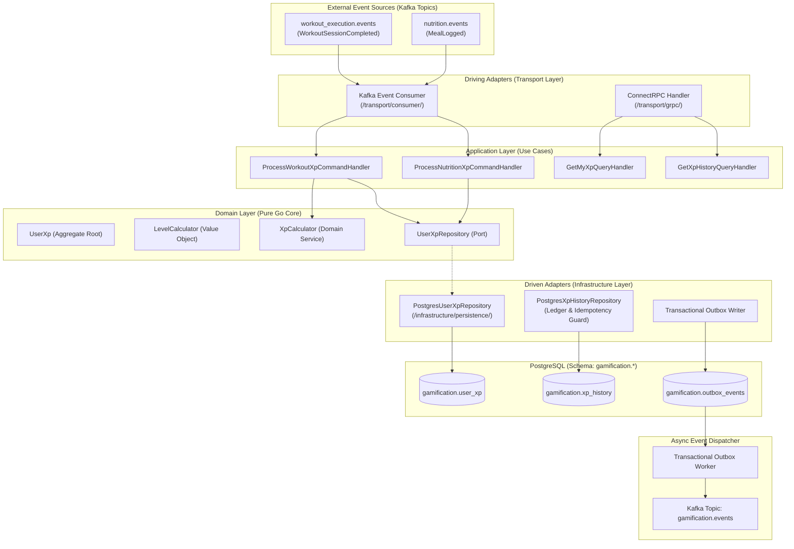
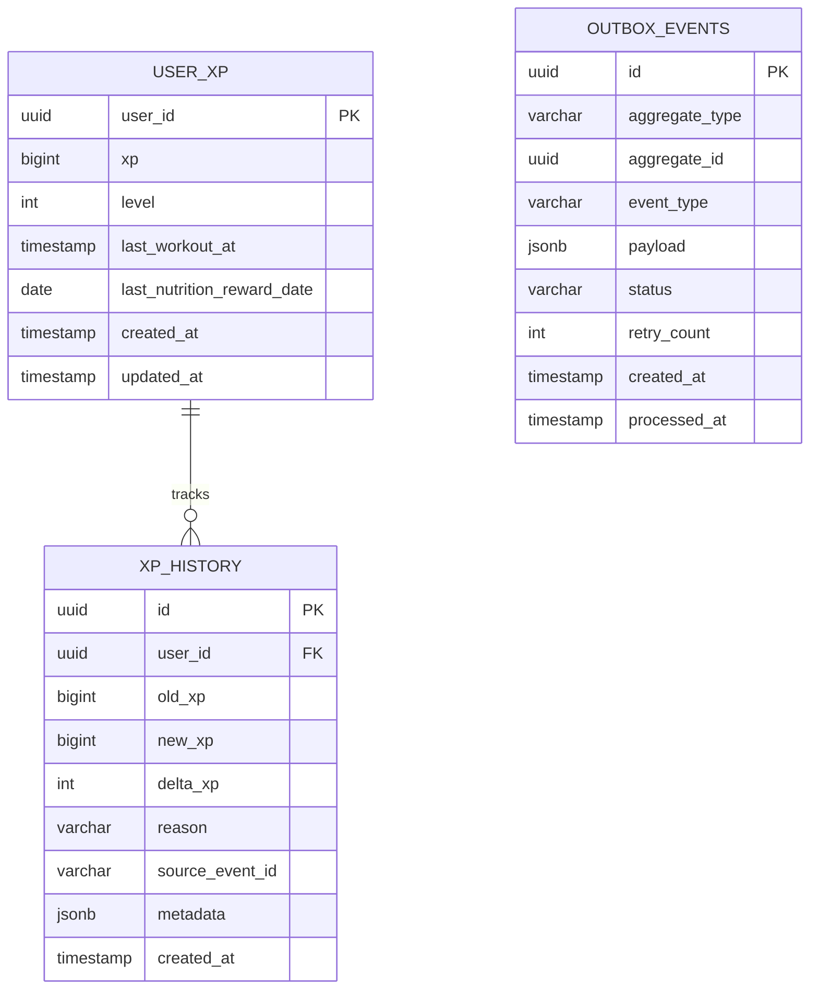
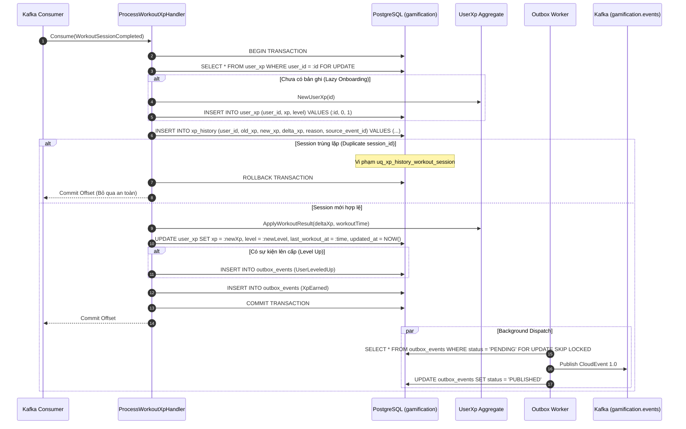
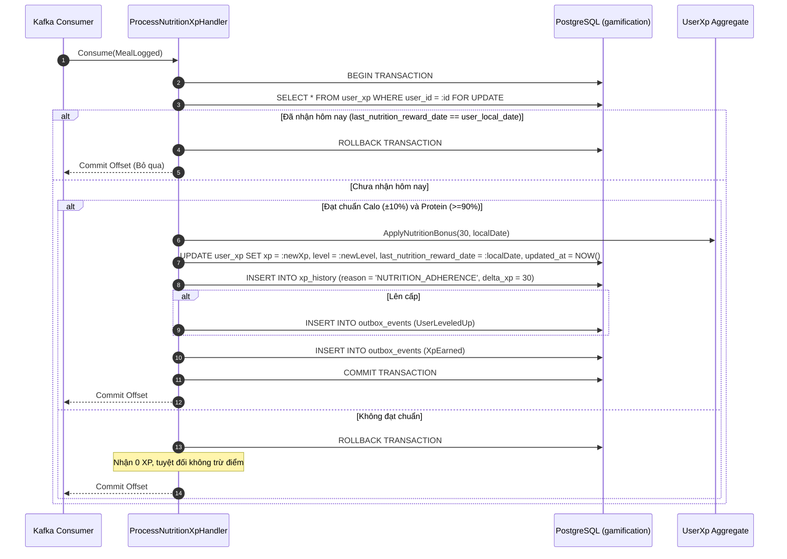
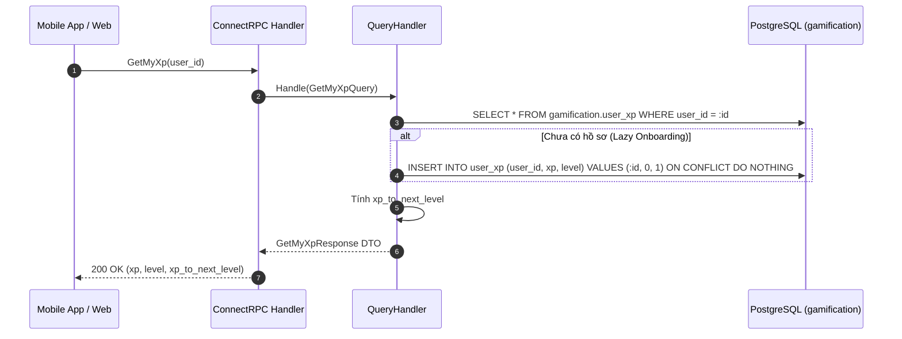

# Design: Hệ Thống Điểm Kinh Nghiệm (XP) & Cấp Độ

## ADR References
- [ADR-0001: Kiến Trúc Điểm Kinh Nghiệm (XP) & Cấp Độ (Level 1–100)](./adr/ADR-0001-xp-and-level-progression-architecture.md)
- [ADR-0002: Sử Dụng Khóa Dòng Bi Quan (SELECT FOR UPDATE) Cho Cập Nhật Điểm XP](./adr/ADR-0002-use-pessimistic-row-locking-for-xp-updates.md)
- [ADR-0003: Tích Hợp Điểm Thưởng Kỷ Luật Dinh Dưỡng (+30 XP/ngày) Vào Hệ Thống XP](./adr/ADR-0003-incorporate-nutrition-adherence-bonus-into-xp.md)

---

## 1. System & Component Architecture

### 1.1 Tổng Quan Kiến Trúc Hexagonal (Ports & Adapters)
Tính năng **XP & Cấp Độ** tuân thủ mô hình Hexagonal Architecture của dự án. Tầng Domain hoàn toàn cô lập với cơ sở dữ liệu và framework:



### 1.2 Cấu Trúc Thư Mục Triển Khai (`internal/gamification/`)
```text
internal/gamification/
├── domain/
│   ├── aggregate/
│   │   └── user_xp.go             # Aggregate root quản lý xp, level
│   ├── entity/
│   │   └── xp_history.go          # Entity dòng lịch sử biến động điểm
│   ├── vo/
│   │   └── level_calculator.go    # Value object tính toán Level 1..100
│   ├── service/
│   │   └── xp_calculator.go       # Domain service tính delta XP buổi tập
│   ├── event/
│   │   ├── xp_earned.go           # Event phát sinh khi cộng XP
│   │   └── user_leveled_up.go     # Event phát sinh khi thăng cấp
│   └── repository/
│       ├── user_xp_repository.go  # Interface port thao tác user_xp
│       └── xp_history_repository.go
├── application/
│   ├── command/
│   │   ├── process_workout_xp.go  # Use case nhận XP buổi tập
│   │   └── process_nutrition_xp.go# Use case nhận XP dinh dưỡng
│   ├── query/
│   │   ├── get_my_xp.go           # Truy vấn XP và tiến trình cấp độ
│   │   └── get_xp_history.go      # Truy vấn lịch sử điểm phân trang
│   └── dto/
│       └── xp_dto.go
├── infrastructure/
│   ├── persistence/
│   │   └── postgres/
│   │       ├── model.go           # GORM models (UserXpModel, XpHistoryModel)
│   │       ├── user_xp_repo.go    # Hiện thực hóa khóa dòng FOR UPDATE
│   │       └── xp_history_repo.go # Hiện thực hóa ghi log & chặn trùng lặp
│   └── outbox/
│       └── outbox_repository.go
└── transport/
    ├── consumer/
    │   ├── workout_consumer.go    # Consumer workout.events
    │   └── nutrition_consumer.go  # Consumer nutrition.events
    └── grpc/
        └── gamification_handler.go# ConnectRPC Handlers
```

---

## 2. Database & Data Model Design

### 2.1 Entity Relationship Diagram (ERD)



### 2.2 Đặc Tả Schema PostgreSQL (`gamification.*`)

```sql
CREATE SCHEMA IF NOT EXISTS gamification;

-- Bảng 1: Hồ sơ Điểm XP & Cấp Độ Người Dùng
CREATE TABLE IF NOT EXISTS gamification.user_xp (
    user_id UUID PRIMARY KEY,
    xp BIGINT NOT NULL DEFAULT 0 CHECK (xp >= 0),
    level INTEGER NOT NULL DEFAULT 1 CHECK (level >= 1 AND level <= 100),
    last_workout_at TIMESTAMPTZ,
    last_nutrition_reward_date DATE,
    created_at TIMESTAMPTZ NOT NULL DEFAULT CURRENT_TIMESTAMP,
    updated_at TIMESTAMPTZ NOT NULL DEFAULT CURRENT_TIMESTAMP
);

-- Index phục vụ Bảng Xếp Hạng toàn cầu và lọc top điểm
CREATE INDEX IF NOT EXISTS idx_user_xp_leaderboard 
    ON gamification.user_xp (xp DESC, updated_at ASC);

-- Bảng 2: Sổ Cái Kiểm Toán Biến Động XP (Append-only Audit Log & Idempotency Guard)
CREATE TABLE IF NOT EXISTS gamification.xp_history (
    id UUID PRIMARY KEY DEFAULT gen_random_uuid(),
    user_id UUID NOT NULL REFERENCES gamification.user_xp(user_id) ON DELETE CASCADE,
    old_xp BIGINT NOT NULL,
    new_xp BIGINT NOT NULL,
    delta_xp INTEGER NOT NULL CHECK (delta_xp > 0),
    reason VARCHAR(50) NOT NULL,
    source_event_id VARCHAR(100),
    metadata JSONB DEFAULT '{}'::jsonb,
    created_at TIMESTAMPTZ NOT NULL DEFAULT CURRENT_TIMESTAMP
);

CREATE INDEX IF NOT EXISTS idx_xp_history_user_created 
    ON gamification.xp_history (user_id, created_at DESC);

-- Chốt chặn lũy đẳng: Mỗi session_id buổi tập chỉ được nhận thưởng XP duy nhất một lần
CREATE UNIQUE INDEX IF NOT EXISTS uq_xp_history_workout_session 
    ON gamification.xp_history (user_id, source_event_id) 
    WHERE reason = 'WORKOUT_COMPLETED' AND source_event_id IS NOT NULL;

-- Bảng 3: Transactional Outbox (Đảm bảo độ tin cậy At-Least-Once khi bắn CloudEvents)
CREATE TABLE IF NOT EXISTS gamification.outbox_events (
    id UUID PRIMARY KEY DEFAULT gen_random_uuid(),
    aggregate_type VARCHAR(50) NOT NULL,
    aggregate_id UUID NOT NULL,
    event_type VARCHAR(100) NOT NULL,
    payload JSONB NOT NULL,
    status VARCHAR(20) NOT NULL DEFAULT 'PENDING',
    retry_count INTEGER NOT NULL DEFAULT 0,
    created_at TIMESTAMPTZ NOT NULL DEFAULT CURRENT_TIMESTAMP,
    processed_at TIMESTAMPTZ
);

CREATE INDEX IF NOT EXISTS idx_outbox_events_pending 
    ON gamification.outbox_events (status, created_at ASC) 
    WHERE status = 'PENDING';
```

---

## 3. Sequence Diagrams & Execution Flows

### 3.1 Luồng Thưởng XP Buổi Tập (UC-XP-01)



### 3.2 Luồng Thưởng XP Kỷ Luật Dinh Dưỡng Hàng Ngày (UC-XP-02)



### 3.3 Luồng Truy Vấn XP Cá Nhân & Tiến Trình Cấp Độ (UC-XP-03)



---

## 4. API & Integration Contracts

### 4.1 Service Contract (`proto/contracts/supporting/gamification/v1/service/gamification_service.proto`)
```protobuf
syntax = "proto3";

package contracts.supporting.gamification.v1.service;

import "contracts/supporting/gamification/v1/message/gamification_messages.proto";

option go_package = "github.com/viethung213/gym-companion/internal/gen/go/contracts/supporting/gamification/v1/service;gamificationservicev1";

service GamificationService {
  rpc GetMyXp(contracts.supporting.gamification.v1.message.GetMyXpRequest) 
      returns (contracts.supporting.gamification.v1.message.GetMyXpResponse);

  rpc GetXpHistory(contracts.supporting.gamification.v1.message.GetXpHistoryRequest) 
      returns (contracts.supporting.gamification.v1.message.GetXpHistoryResponse);
}
```

### 4.2 Message Schemas (`proto/contracts/supporting/gamification/v1/message/gamification_messages.proto`)
```protobuf
syntax = "proto3";

package contracts.supporting.gamification.v1.message;

import "google/protobuf/timestamp.proto";

option go_package = "github.com/viethung213/gym-companion/internal/gen/go/contracts/supporting/gamification/v1/message;gamificationmessagev1";

message GetMyXpRequest {
  string user_id = 1;
}

message GetMyXpResponse {
  string user_id = 1;
  int64 xp = 2;
  int32 level = 3;
  int64 xp_to_next_level = 4;
  google.protobuf.Timestamp updated_at = 5;
}

message GetXpHistoryRequest {
  string user_id = 1;
  int32 page_size = 2;
  string page_token = 3;
}

message XpHistoryRecord {
  string id = 1;
  int32 delta_xp = 2;
  int64 old_xp = 3;
  int64 new_xp = 4;
  string reason = 5;
  google.protobuf.Timestamp created_at = 6;
}

message GetXpHistoryResponse {
  repeated XpHistoryRecord records = 1;
  string next_page_token = 2;
}
```

### 4.3 Domain Events (`proto/contracts/supporting/gamification/v1/event/gamification_events.proto`)
```protobuf
syntax = "proto3";

package contracts.supporting.gamification.v1.event;

import "google/protobuf/timestamp.proto";

option go_package = "github.com/viethung213/gym-companion/internal/gen/go/contracts/supporting/gamification/v1/event;gamificationeventv1";

message XpEarned {
  string user_id = 1;
  int32 delta_xp = 2;
  int64 old_xp = 3;
  int64 new_xp = 4;
  string reason = 5;
  string source_event_id = 6;
  google.protobuf.Timestamp earned_at = 7;
}

message UserLeveledUp {
  string user_id = 1;
  int32 old_level = 2;
  int32 new_level = 3;
  int64 xp = 4;
  google.protobuf.Timestamp leveled_up_at = 5;
}
```

---

## 5. Non-Functional & Security Considerations

### 5.1 Concurrency & Idempotency (The 3 AM Test)
- **Khóa bi quan (Pessimistic Locking)**: Cập nhật XP luôn thực thi trong transaction với `SELECT ... FROM gamification.user_xp WHERE user_id = $1 FOR UPDATE` (ADR-0002), tuần tự hóa mọi cập nhật đồng thời, loại bỏ 100% race conditions và Lost Updates.
- **Idempotency Guard**: Ràng buộc duy nhất `uq_xp_history_workout_session` trên `gamification.xp_history (user_id, source_event_id)` chặn đứng việc tính thưởng lặp cho cùng một `session_id`, bảo vệ nguyên tử trong cùng transaction.

### 5.2 Hiệu Năng Truy Vấn & Chỉ Mục
- Tối ưu hóa truy vấn Leaderboard và Profile bằng chỉ mục B-tree `idx_user_xp_leaderboard (xp DESC, updated_at ASC)` trên bảng `user_xp`.

### 5.3 Schema Isolation
- Phân hệ Gamification chỉ truy cập schema `gamification.*`. Cấm mọi câu lệnh `JOIN` sang các schema khác (`auth`, `workout_execution`, `nutrition`).
