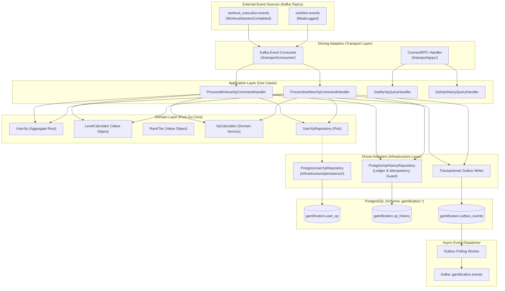
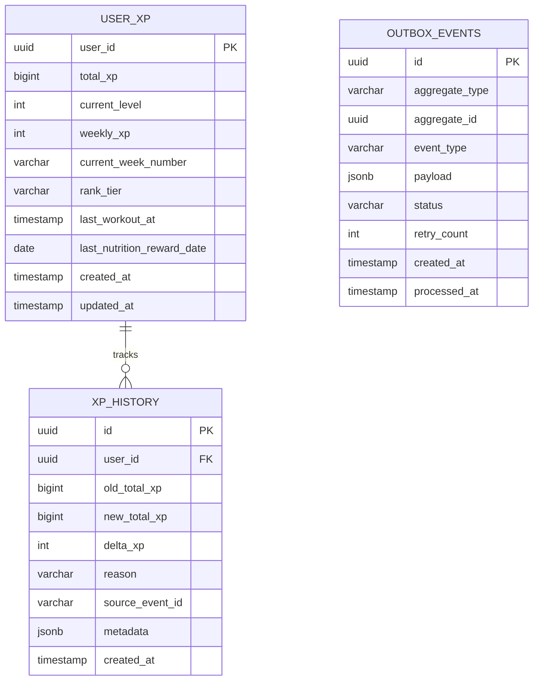
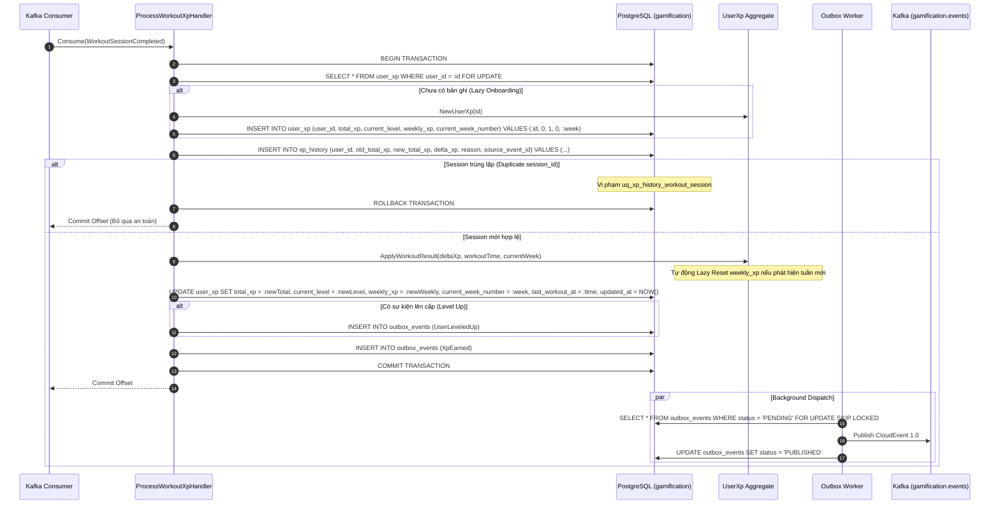
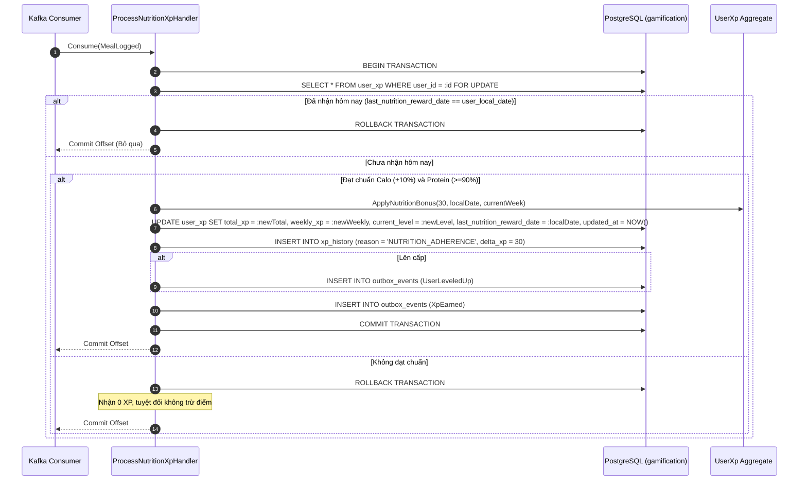
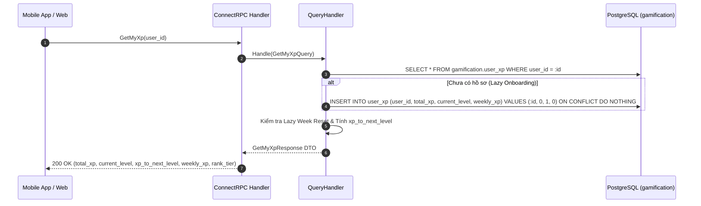

# Design: XP (Experience Points) & Weekly Leagues

## ADR References
- [ADR-0001: Kiến Trúc Động Cơ XP Kép: XP Trọn Đời & Giải Đấu Tuần](./adr/ADR-0001-dual-engine-xp-and-weekly-leagues.md)
- [ADR-0002: Cơ Chế Làm Mới Tuần Lười Biếng (Lazy Week Reset)](./adr/ADR-0002-lazy-week-reset-on-user-activity.md)
- [ADR-0003: Sử Dụng Khóa Dòng Bi Quan (SELECT FOR UPDATE) Cho Cập Nhật Điểm XP](./adr/ADR-0003-use-pessimistic-row-locking-for-xp-updates.md)
- [ADR-0004: Tích Hợp Điểm Thưởng Kỷ Luật Dinh Dưỡng Vào Hệ Thống XP](./adr/ADR-0004-incorporate-nutrition-adherence-bonus-into-xp.md)

---

## 1. System & Component Architecture

### 1.1 Tổng Quan Kiến Trúc Hexagonal (Ports & Adapters)
Tính năng **XP & Weekly Leagues** tuân thủ mô hình Hexagonal Architecture của dự án. Tầng Domain hoàn toàn cô lập với cơ sở dữ liệu và framework:



### 1.2 Ranh Giới Module & Các File Mã Nguồn Dự Kiến
- **Domain Layer (`internal/gamification/domain/`)**:
  - `aggregate/user_xp.go`: Aggregate root quản lý `total_xp`, `current_level`, `weekly_xp`, `current_week_number` và xử lý Lazy Week Reset.
  - `vo/rank_tier.go`: Value object định nghĩa 5 bậc giải đấu tuần (`BRONZE`, `SILVER`, `GOLD`, `PLATINUM`, `DIAMOND`).
  - `vo/level_calculator.go`: Thuật toán thuần túy tính toán cấp độ $1..100$ và số XP cần để lên cấp tiếp theo.
  - `service/xp_calculator.go`: Domain service tính toán biến động điểm XP từ buổi tập, dinh dưỡng và chuỗi streak.
  - `event/xp_events.go`: Domain events (`XpEarned`, `UserLeveledUp`).
  - `repository/user_xp_repository.go`: Port interface (`FindByID`, `GetForUpdate`, `Save`).
- **Application Layer (`internal/gamification/application/`)**:
  - `command/`: Handlers cho `ProcessWorkoutXp`, `ProcessNutritionXp`.
  - `query/`: Handlers cho `GetMyXp`, `GetXpHistory`.
- **Infrastructure Layer (`internal/gamification/infrastructure/`)**:
  - `persistence/postgres/`: Triển khai repository với `SELECT ... FOR UPDATE`, `XpHistoryRepository` (chốt chặn lũy đẳng), Outbox Writer.
  - `worker/outbox_worker.go`: Background worker quét bảng outbox và publish CloudEvents sang Kafka.
- **Transport Layer (`internal/gamification/transport/`)**:
  - `consumer/`: Kafka readers cho các sự kiện hoàn thành buổi tập và dinh dưỡng.
  - `grpc/`: ConnectRPC handler hiện thực hóa protobuf contract.

---

## 2. Database & Data Model Design

### 2.1 Entity Relationship Diagram (ERD)



### 2.2 Đặc Tả Schema PostgreSQL (`gamification.*`)

```sql
CREATE SCHEMA IF NOT EXISTS gamification;

-- Bảng 1: Hồ sơ Điểm XP & Cấp Bậc Người Dùng
CREATE TABLE IF NOT EXISTS gamification.user_xp (
    user_id UUID PRIMARY KEY,
    total_xp BIGINT NOT NULL DEFAULT 0 CHECK (total_xp >= 0),
    current_level INTEGER NOT NULL DEFAULT 1 CHECK (current_level >= 1 AND current_level <= 100),
    weekly_xp INTEGER NOT NULL DEFAULT 0 CHECK (weekly_xp >= 0),
    current_week_number VARCHAR(10) NOT NULL DEFAULT '',
    rank_tier VARCHAR(20) NOT NULL DEFAULT 'BRONZE',
    last_workout_at TIMESTAMPTZ,
    last_nutrition_reward_date DATE,
    created_at TIMESTAMPTZ NOT NULL DEFAULT CURRENT_TIMESTAMP,
    updated_at TIMESTAMPTZ NOT NULL DEFAULT CURRENT_TIMESTAMP
);

CREATE INDEX IF NOT EXISTS idx_user_xp_weekly_leaderboard 
    ON gamification.user_xp (rank_tier, weekly_xp DESC);
CREATE INDEX IF NOT EXISTS idx_user_xp_total_level 
    ON gamification.user_xp (total_xp DESC);

-- Bảng 2: Sổ Cái Kiểm Toán Biến Động XP (Append-only Audit Log & Idempotency Guard)
CREATE TABLE IF NOT EXISTS gamification.xp_history (
    id UUID PRIMARY KEY DEFAULT gen_random_uuid(),
    user_id UUID NOT NULL REFERENCES gamification.user_xp(user_id) ON DELETE CASCADE,
    old_total_xp BIGINT NOT NULL,
    new_total_xp BIGINT NOT NULL,
    delta_xp INTEGER NOT NULL CHECK (delta_xp > 0),
    reason VARCHAR(50) NOT NULL,
    source_event_id VARCHAR(100),
    metadata JSONB DEFAULT '{}'::jsonb,
    created_at TIMESTAMPTZ NOT NULL DEFAULT CURRENT_TIMESTAMP
);

CREATE INDEX IF NOT EXISTS idx_xp_history_user_created 
    ON gamification.xp_history (user_id, created_at DESC);

-- Chốt chặn lũy đẳng: Mỗi session_id buổi tập chỉ được nhận thưởng XP duy nhất một lần
CREATE UNIQUE INDEX IF NOT EXISTS uq_xp_history_workout_session 
    ON gamification.xp_history (user_id, source_event_id) 
    WHERE reason = 'WORKOUT_COMPLETED' AND source_event_id IS NOT NULL;

-- Bảng 3: Transactional Outbox (CloudEvents 1.0)
CREATE TABLE IF NOT EXISTS gamification.outbox_events (
    id UUID PRIMARY KEY DEFAULT gen_random_uuid(),
    aggregate_type VARCHAR(50) NOT NULL DEFAULT 'UserXp',
    aggregate_id UUID NOT NULL,
    event_type VARCHAR(150) NOT NULL,
    payload JSONB NOT NULL,
    status VARCHAR(20) NOT NULL DEFAULT 'PENDING',
    retry_count INTEGER NOT NULL DEFAULT 0,
    created_at TIMESTAMPTZ NOT NULL DEFAULT CURRENT_TIMESTAMP,
    processed_at TIMESTAMPTZ
);

CREATE INDEX IF NOT EXISTS idx_outbox_events_pending 
    ON gamification.outbox_events (status, created_at ASC) 
    WHERE status = 'PENDING';
```

---

## 3. Sequence Diagrams & Execution Flows

### 3.1 Luồng Thưởng XP Buổi Tập & Lazy Reset Tuần (UC-XP-01)



### 3.2 Luồng Thưởng XP Kỷ Luật Dinh Dưỡng Hàng Ngày (UC-XP-02)



### 3.3 Luồng Truy Vấn XP Cá Nhân & Tiến Trình Cấp Độ (UC-XP-03)



---

## 4. API & Integration Contracts

### 4.1 Service Contract (`proto/contracts/supporting/gamification/v1/service/gamification_service.proto`)
```protobuf
syntax = "proto3";

package contracts.supporting.gamification.v1.service;

import "contracts/supporting/gamification/v1/message/gamification_messages.proto";

option go_package = "github.com/viethung213/gym-companion/internal/gen/go/contracts/supporting/gamification/v1/service;gamificationservicev1";

service GamificationService {
  rpc GetMyXp(contracts.supporting.gamification.v1.message.GetMyXpRequest) 
      returns (contracts.supporting.gamification.v1.message.GetMyXpResponse);

  rpc GetXpHistory(contracts.supporting.gamification.v1.message.GetXpHistoryRequest) 
      returns (contracts.supporting.gamification.v1.message.GetXpHistoryResponse);
}
```

### 4.2 Message Schemas (`proto/contracts/supporting/gamification/v1/message/gamification_messages.proto`)
```protobuf
syntax = "proto3";

package contracts.supporting.gamification.v1.message;

import "google/protobuf/timestamp.proto";

option go_package = "github.com/viethung213/gym-companion/internal/gen/go/contracts/supporting/gamification/v1/message;gamificationmessagev1";

enum RankTier {
  RANK_TIER_UNSPECIFIED = 0;
  RANK_TIER_BRONZE = 1;
  RANK_TIER_SILVER = 2;
  RANK_TIER_GOLD = 3;
  RANK_TIER_PLATINUM = 4;
  RANK_TIER_DIAMOND = 5;
}

message GetMyXpRequest {
  string user_id = 1;
}

message GetMyXpResponse {
  string user_id = 1;
  int64 total_xp = 2;
  int32 current_level = 3;
  int64 xp_to_next_level = 4;
  int32 weekly_xp = 5;
  RankTier rank_tier = 6;
  string current_week_number = 7;
  google.protobuf.Timestamp updated_at = 8;
}

message GetXpHistoryRequest {
  string user_id = 1;
  int32 page_size = 2;
  string page_token = 3;
}

message XpHistoryRecord {
  string id = 1;
  int64 old_total_xp = 2;
  int64 new_total_xp = 3;
  int32 delta_xp = 4;
  string reason = 5;
  google.protobuf.Timestamp created_at = 6;
}

message GetXpHistoryResponse {
  repeated XpHistoryRecord records = 1;
  string next_page_token = 2;
}
```

### 4.3 CloudEvents Contracts (`proto/contracts/supporting/gamification/v1/event/xp_events.proto`)
```protobuf
syntax = "proto3";

package contracts.supporting.gamification.v1.event;

import "google/protobuf/timestamp.proto";

option go_package = "github.com/viethung213/gym-companion/internal/gen/go/contracts/supporting/gamification/v1/event;gamificationeventv1";

message XpEarned {
  string user_id = 1;
  int32 delta_xp = 2;
  string reason = 3;
  int64 new_total_xp = 4;
  int32 new_weekly_xp = 5;
  google.protobuf.Timestamp occurred_at = 6;
}

message UserLeveledUp {
  string user_id = 1;
  int32 old_level = 2;
  int32 new_level = 3;
  int64 total_xp = 4;
  google.protobuf.Timestamp leveled_up_at = 5;
}
```

---

## 5. Non-Functional & Security Considerations

### 5.1 Concurrency & Idempotency (The 3 AM Test)
- **Khóa bi quan (Pessimistic Locking)**: Cập nhật XP luôn thực thi trong transaction với `SELECT ... FROM gamification.user_xp WHERE user_id = $1 FOR UPDATE` (ADR-0003), tuần tự hóa mọi cập nhật đồng thời, loại bỏ 100% race conditions và Lost Updates.
- **Idempotency Guard**: Ràng buộc duy nhất `uq_xp_history_workout_session` trên `gamification.xp_history (user_id, source_event_id)` chặn đứng việc tính thưởng lặp cho cùng một `session_id`, bảo vệ nguyên tử trong cùng transaction.

### 5.2 Hiệu Năng Reset Tuần (Lazy Reset on Activity)
- Xóa bỏ hoàn toàn scheduled job quét hàng triệu bản ghi lúc nửa đêm Chủ nhật (ADR-0002). Cờ `current_week_number` bảo đảm tải reset được chia đều tự nhiên theo từng lượt tập của người dùng sang tuần mới.

### 5.3 Schema Isolation
- Phân hệ Gamification chỉ truy cập schema `gamification.*`. Cấm mọi câu lệnh `JOIN` sang các schema khác (`auth`, `workout_execution`, `nutrition`).
