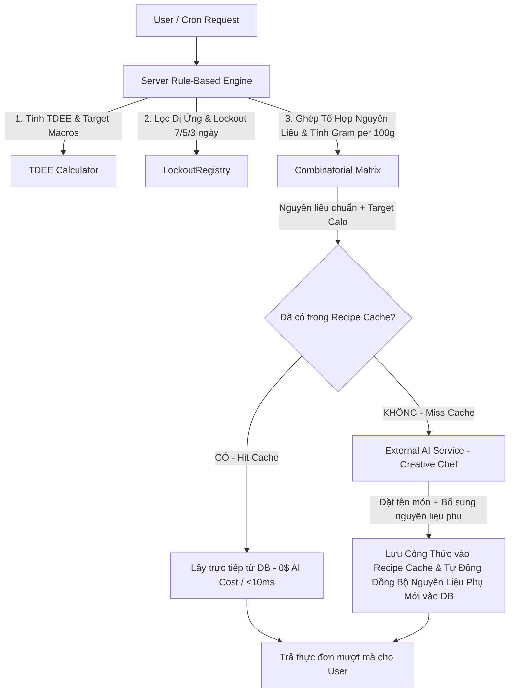

# Kiến Trúc Sinh Thực Đơn Thông Minh: Kết Hợp Server Rule-Based Engine & External AI

Tài liệu này mô tả chi tiết chiến lược kiến trúc hạ tầng và quy trình nghiệp vụ để sinh thực đơn cá nhân hóa cho module **Nutrition / NutiFood** (`internal/nutrition`).

Kiến trúc này giải quyết triệt để bài toán **Tối ưu chi phí AI (giảm 95% API calls)**, **Tăng tốc độ phản hồi (< 50ms)**, đồng thời đảm bảo **Sự đa dạng tuyệt đối không trùng lặp** và **Tính chính xác 100% về Calo/Macros**.

---

## 1. Nguyên Lý Cốt Lõi: Server-Heavy & AI Creative Chef

> [!IMPORTANT]
> **Khẳng định kiến trúc**: 
> Hệ thống chuyển dịch **90% khối lượng tính toán toán học, lọc quy tắc và căn chỉnh dinh dưỡng sang Server Go Backend (Rule-Based Engine)**. 
> External AI (Gemini / OpenAI) đóng vai trò là **"Đầu bếp sáng tạo" (Creative Chef)** — chỉ làm nhiệm vụ biến tấu tên món ăn, phong cách nêm nếm và hướng dẫn chế biến từ các khối nguyên liệu chuẩn đã được Server chuẩn bị sẵn.

---

## 2. Giải Đáp Thắc Mắc Kiến Trúc Cốt Lõi

### Câu hỏi 1: Nếu như thế này thì sẽ thiên về Server chạy nhiều hơn, AI chỉ thực hiện biến tấu cách nấu/chế biến thôi đúng không?

**ĐÚNG HOÀN TOÀN!** 
- **Server Go Backend gánh 90% khối lượng công việc**: Server chịu trách nhiệm tính toán chính xác 100% số gram nguyên liệu, cân bằng tỷ lệ Protein/Carb/Fat, lọc bỏ nguyên liệu gây dị ứng, kiểm tra danh sách nguyên liệu bị khóa (`LockoutRegistry`), và ghép ma trận tổ hợp nguyên liệu.
- **External AI đóng vai trò "Đầu bếp sáng tạo" (Creative Chef)**: AI không cần bận tâm đến phép tính calo phức tạp. AI chỉ nhận được 3-4 nguyên liệu chuẩn đã tính sẵn calo từ Server và sáng tạo tên món ăn hấp dẫn (VD: *"Ức gà áp chảo sốt chanh dây thảo mộc"*), phong cách nêm nếm và hướng dẫn các bước nấu nhanh.

---

### Câu hỏi 2: Mỗi lần có cách chế biến mới thì có nên Cache lại luôn không?

**CÓ, RẤT NÊN CACHE LẠI NGAY LẬP TỨC!**
- **Cơ chế Recipe Cache Tự Động Mở Rộng (Self-Growing Recipe Library)**:
  - Khi External AI tạo ra 1 cách chế biến mới lạ cho một tổ hợp nguyên liệu (VD: `Ức gà + Khoai lang + Bông cải`), Server **LẬP TỨC CACHE VÀO CSDL (`nutrition.food_items` / `nutrition.recipes`)**.
  - **Lần đầu tiên**: Tốn 1 lần gọi External AI để sinh cách chế biến mới -> Lưu vào DB.
  - **Từ lần thứ 2 trở đi**: Khi bất kỳ người dùng nào khác (hoặc chính user đó sau vài ngày) ghép trúng tổ hợp nguyên liệu này, Server sẽ **lấy luôn công thức từ DB Cache** mà **KHÔNG CẦN GỌI AI NỮA**. Chi phí = 0$, thời gian phản hồi siêu tốc `< 10ms`.

---

## 3. 6 Chiến Lược Tối Ưu Chi Phí & Đa Dạng Thực Đơn

### 3.1. Tổ Hợp Nguyên Liệu Cấu Trúc (Combinatorial Ingredient Matrix)
Thay vì lưu các "món ăn tĩnh cố định", Server quản lý các **khối nguyên liệu độc lập** trong CSDL:
- **Khối Protein ($N_1 = 30$)**: Ức gà, Thịt bò, Cá hồi, Tôm, Đậu phụ, Trứng, Mực...
- **Khối Tinh bột ($N_2 = 20$)**: Cơm gạo lứt, Khoai lang, Yến mạch, Bún lứt, Mì kiều mạch...
- **Khối Rau củ ($N_3 = 20$)**: Bông cải xanh, Măng tây, Cà chua, Rau bina, Ớt chuông...
- **Khối Chế biến ($N_4 = 15$)**: Áp chảo thảo mộc, Sốt chanh dây, Nướng giấy bạc, Xào tỏi oliu, Hấp gừng...

$$\text{Tổng số công thức kết hợp} = 30 \times 20 \times 20 \times 15 = \mathbf{180,000} \text{ món ăn khác nhau}$$

Server tự động thực hiện phép tính ma trận tổ hợp để ghép các khối nguyên liệu sao cho tổng Calo/Protein/Carb/Fat vừa khít với nhu cầu người dùng.

---

### 3.2. Cá Nhân Hóa Theo `UserID` + `LockoutRegistry` (BR-NU-02)
- **Random Seed theo User**: Server sử dụng `Hash(UserID + Ngày)` làm hạt giống ngẫu nhiên để chọn ma trận nguyên liệu. 
  - *Kết quả*: 2 người dùng có cùng TDEE mở app cùng thời điểm sẽ nhận được 2 thực đơn **hoàn toàn khác nhau**.
- **Khóa Chống Lặp (`LockoutRegistry`)**: Khi người dùng ăn 1 món (VD: Ức gà), Server tự động khóa Protein chính trong 7 ngày, Carb chính trong 5 ngày, Chủ đề món trong 3 ngày. Trong 7 ngày tiếp theo, Server loại bỏ hoàn toàn ức gà khỏi ma trận tổ hợp của user đó.

---

### 3.3. Rule-Based Engine + AI Agent Resilience (Google ADK & Auto Quota Fallback)
- **Server Go Backend**: Thực hiện công việc tính toán nặng nhất — căn chỉnh chính xác từng gram nguyên liệu (VD: 130g ức gà + 140g khoai lang + 80g bông cải = 510 kcal, 42g Protein).
- **External AI (Google ADK v2 Multi-Agent Orchestration)**: Sử dụng framework **Google ADK v2** với `ADKNutritionAgent`, nhận prompt siêu ngắn chứa 3 nguyên liệu chuẩn + target macros từ Server và đóng vai trò sáng tạo tên món (VD: *"Ức gà áp chảo sốt chanh dây thảo mộc"*).
- **Cơ chế Tự Động Chuyển Đổi Model Dự Phòng (`FallbackLLM` Auto Quota Failover)**:
  - Hệ thống tích hợp wrapper `FallbackLLM` triển khai giao diện `model.LLM` của Google ADK v2.
  - Tùy chỉnh linh hoạt qua biến môi trường: `GEMINI_MODEL` (Mô hình chính: `gemini-2.5-flash`) và `GEMINI_FALLBACK_MODELS` (Mô hình dự phòng: `gemini-2.0-flash,gemini-2.5-flash-lite,gemini-1.5-flash`).
  - Khi mô hình chính cạn Quota hoặc vấp lỗi HTTP `429 Too Many Requests` / `RESOURCE_EXHAUSTED`, `FallbackLLM` tự động nhận biết, ghi log cảnh báo và gọi mô hình dự phòng kế tiếp ngay lập tức trong thời gian thực mà người dùng không bị gián đoạn.
- **Embedded Prompt Architecture (`//go:embed prompts/*.txt`)**:
  - Toàn bộ các file prompt hướng dẫn (`generator.txt`, `daily.txt`, `post_workout.txt`, `pantry.txt`, `adhoc.txt`, `estimate_nutrient.txt`, `nutrition_insight.txt`) được nhúng trực tiếp vào Go binary lúc biên dịch thông qua `//go:embed prompts/*.txt`.
  - Đảm bảo khởi tạo an toàn, độc lập môi trường làm việc (`Cwd`), tránh lỗi truy cập đường dẫn file và tăng tốc độ đọc prompt lên tối đa.

### 3.4. Caching Công Thức & Số Liệu Dinh Dưỡng (Recipe & Nutrient Cache)
- Món ăn ngoài kế hoạch: Khi user tự nhập tên món (VD: *"1 tô bún bò huế"*), Server kiểm tra Cache. Nếu món này đã từng được AI ước tính cho 1 user khác trước đây, Server tái sử dụng ngay lập tức với chi phí = 0$.

### 3.5. Xử Lý Thay Đổi Định Lượng Khi Tập Luyện & Tỷ Lệ Gia Vị/Chế Biến

> [!WARNING]
> **Thách thức ẩm thực**: Khi thay đổi định lượng nguyên liệu chính (VD: tăng ức gà từ 130g lên 220g), tỷ lệ gia vị (muối, mắm, dầu ăn), thời gian áp chảo/nướng và quy trình chế biến sẽ bị thay đổi. Nếu chỉ nhân số gram cơ học trên UI mà không điều chỉnh cách nấu, món ăn có thể bị nhạt, cháy hoặc chín không đều.

Để giải quyết vấn đề này mà vẫn tối ưu chi phí hạ tầng, hệ thống áp dụng:

#### Phương án : Gọi AI Điều Chỉnh Công Thức (Khi Người Dùng Muốn Tăng Trực Tiếp Bữa Chính)
- **Cách làm**: Nếu người dùng chọn tăng trực tiếp số lượng nguyên liệu ở món chính bữa tối, Server gửi 1 prompt siêu nhẹ sang External AI:
  > *"Công thức hiện tại là 'Ức gà áp chảo sốt chanh dây' (130g ức gà, áp chảo 5 phút). Nay tăng ức gà lên 220g. Hãy điều chỉnh lại lượng gia vị (dầu ăn, sốt chanh dây) và thời gian áp chảo phù hợp."*
- **Ưu điểm**: Công thức được AI tinh chỉnh chuẩn vị ẩm thực, thời gian nấu chuẩn xác. AI chỉ trả về dòng điều chỉnh gia vị & thời gian nấu ngắn gọn (tốn rất ít token).

---

### 3.6. Sinh Thực Đơn Lười (Deferred / On-Demand Lazy Generation)
- **Cron 5:00 AM**: Không sinh thực đơn AI đắt đỏ cho 100% người dùng. Cron 5:00 AM chỉ chạy Rule Engine Server để tạo khung tổ hợp nguyên liệu nhanh trong DB.
- **Khi User mở app**: Hệ thống kiểm tra Recipe Cache. 90% trường hợp món ăn đã có trong Cache -> hiển thị tức thì (<20ms). Chỉ 10% trường hợp công thức chưa từng xuất hiện mới gọi AI để tạo tên món mới.

---

## 4. Tổng Kết So Sánh Tối Ưu Hạ Tầng

| Chỉ số / Tiêu chí | Mô Hình AI Thuần Túy (Ban Đầu) | Mô Hình Server Rule Engine + Recipe Cache (Mới) |
| :--- | :--- | :--- |
| **Vai trò Server** | Chỉ nhận/truyền dữ liệu | **Gánh 90% tính toán toán học, lockout, ma trận nguyên liệu** |
| **Vai trò External AI** | Tính calo + Sinh toàn bộ món | **Chỉ biến tấu tên món & cách chế biến mới lạ** |
| **Cơ chế Caching** | Không cache công thức AI | **Tự động lưu công thức AI mới vào DB để dùng lại vĩnh viễn** |
| **Số AI API Call / User / Ngày** | **8 - 10 lần / ngày** | **0 - 0.3 lần / ngày** (Giảm >95% chi phí) |
| **Tốc độ phản hồi UI** | 1.5s - 3s | **< 20ms** (Hit Cache từ CSDL) |
| **Độ chính xác Calo/Macros** | Đôi lúc bị ảo giác (Hallucination) | **Chính xác 100%** theo công thức chuẩn khoa học |
