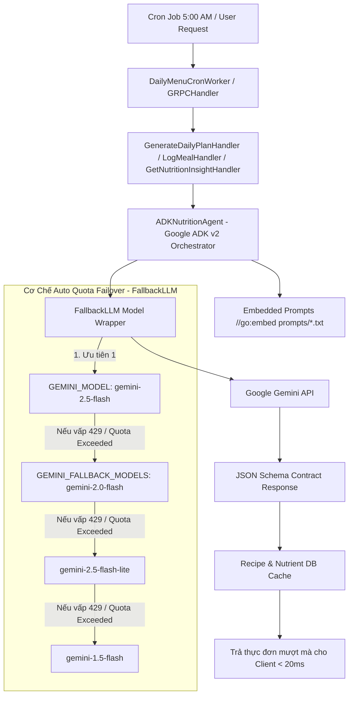
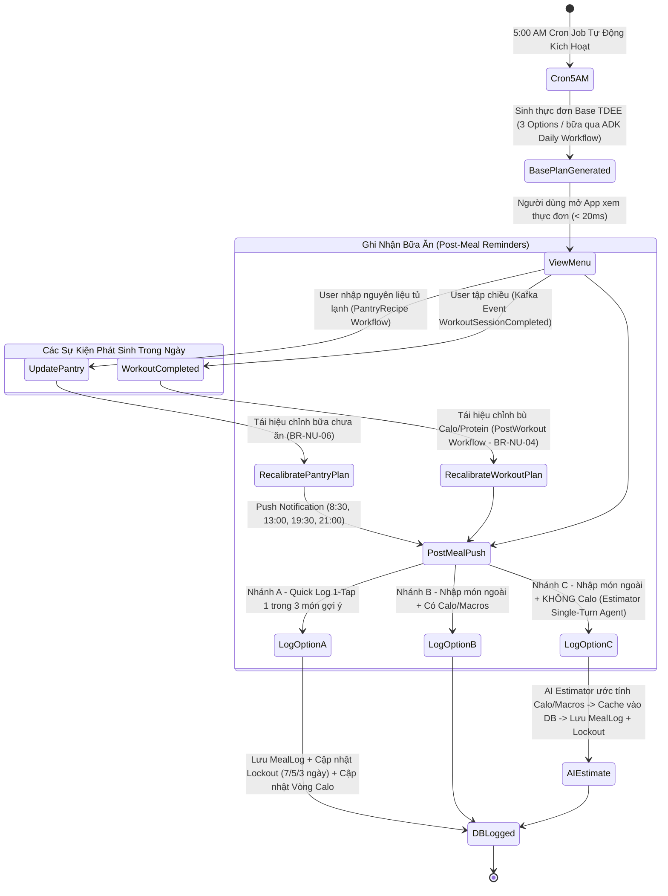

# Workflow Hoàn Chỉnh: Từ Sinh Thực Đơn Đến Ghi Nhận Lịch Sử Ăn Uống

Tài liệu này mô tả chi tiết toàn bộ vòng đời hoạt động của module **Nutrition / NutiFood** (`internal/nutrition`), bao gồm tất cả các kịch bản tương tác người dùng, từ 5:00 AM tự động sinh thực đơn, các luồng AI Agent Google ADK v2 với cơ chế tự động chuyển model dự phòng khi cạn Quota (`FallbackLLM`), cho tới khi người dùng hoàn thành bữa ăn và ghi nhận lịch sử.

---

## 1. Tổng Quan Kiến Trúc Hạ Tầng AI & Luồng Xử Lý (End-to-End Infrastructure Architecture)

---

## 2. Tổng Quan Sơ Đồ Trạng Thái Vòng Đời Bữa Ăn (End-to-End Lifecycle Diagram)

---

## 3. Chi Tiết 6 Luồng Hoạt Động Cốt Lõi Trong Module Nutrition

### Luồng 1: Sinh Thực Đơn Đầu Ngày (5:00 AM Scheduled Cron Job & `DailyMenuCronWorker`)
- **Thời gian**: Đúng 5:00 AM hàng ngày (`0 5 * * *`).
- **Thực thi**: Background Worker `DailyMenuCronWorker` ([daily_menu_cron_worker.go](file:///e:/LEAN/TTTN/internal/nutrition/infrastructure/worker/daily_menu_cron_worker.go)) quét danh sách active users (có hoạt động trong 7 ngày qua).
- **Sử dụng Semaphore Pool**: `maxConcurrentAICalls = 10` để kiểm soát số lượng cuộc gọi đồng thời.
- **Hành động**:
  1. Lấy chỉ số sinh trắc học (`BiologicalMetrics`) từ `ProfileClient`.
  2. `TDEECalculator` tính `Base TDEE` theo công thức Mifflin-St Jeor (Rest Day TDEE, target >= 1200 kcal - **BR-NU-01**).
  3. Server chạy `CombinatorialMatrix` tổ hợp nguyên liệu và tính gram per 100g.
  4. Lấy prompt `prompts/daily.txt` (đã nhúng qua `//go:embed`) và gọi `ADKNutritionAgent.dailyWorkflowAgent`.
  5. `FallbackLLM` tự động gọi `gemini-2.5-flash`, nếu bị hết quota (429) sẽ tự chuyển sang `gemini-2.0-flash` / `gemini-2.5-flash-lite`.
  6. Tra cứu `RecipeCacheRepository`:
     - **HIT CACHE**: Trả về tên món & hướng dẫn từ DB ($0$ AI Cost, $<10\text{ms}$).
     - **MISS CACHE**: AI Creative Chef đặt tên món, gợi ý nêm nếm gia vị và bổ sung nguyên liệu phụ.
  7. Lưu `NutritionPlan` vào DB `nutrition.nutrition_plans` và ghi Outbox Event `NutritionPlanGenerated`.
- **Kết quả**: Khi user mở app lúc 6:30 hay 7:00 AM, API `GetTodayMenu` trả về thực đơn mượt mà trong **< 20ms**.

---

### Luồng 2: Tái Hiệu Chỉnh Khi Nhập Nguyên Liệu Tủ Lạnh (`RecalibratePlanWithPantryHandler` & `PantryRecipeWorkflow`)
- **Tình huống**: Người dùng mở tủ lạnh thấy có sẵn trứng, ức gà, cà chua... và chọn "Cập nhật thực đơn theo tủ lạnh".
- **API Call / Handler**: `RecalibratePlanWithPantryHandler.Handle()`.
- **Hành động**:
  1. Giữ nguyên các bữa ăn đã log từ sáng.
  2. Đọc prompt `prompts/pantry.txt` qua `//go:embed` và kích hoạt `ADKNutritionAgent.pantryWorkflowAgent`.
  3. Đánh giá nguyên liệu có sẵn với `LockoutRegistry`:
     - **Trùng Lockout (`BR-NU-02.2`)**: Vẫn cho dùng nguyên liệu (tránh lãng phí), gán cờ `RequiresNovelCookingStyle` yêu cầu AI hướng dẫn **phương pháp chế biến mới lạ**.
     - **Không trùng Lockout**: Ưu tiên xếp vào ma trận các bữa chưa ăn.
  4. `FallbackLLM` tự động điều phối gọi model khả dụng không bị 429 Rate Limit.
  5. AI Creative Chef đặt tên món & hướng dẫn nấu -> Lưu Recipe Cache và trả thực đơn mới về Client.

---

### Luồng 3: Tái Hiệu Chỉnh Động Khi Có Buổi Tập Chiều (`WorkoutSessionCompleted` & `PostWorkoutWorkflow`)
- **Tình huống**: Người dùng hoàn thành buổi tập lúc 17:30 chiều tiêu hao 450 kcal.
- **Trigger**: Kafka Event `contracts.core.workout_execution.v1.event.WorkoutSessionCompleted`.
- **Hành động**:
  1. Consumer `Nutrition Workout Event Consumer` ([consumer.go](file:///e:/LEAN/TTTN/internal/nutrition/infrastructure/kafka/consumer.go)) nhận sự kiện.
  2. Server tính toán: $\text{Target Calo Mới} = \text{Base TDEE} + 450 \text{ kcal}$.
  3. Giữ nguyên bữa sáng & trưa đã ăn.
  4. Đọc prompt `prompts/post_workout.txt` qua `//go:embed` và gọi `ADKNutritionAgent.postWorkoutWorkflowAgent`.
  5. Phân bổ Calo & Protein bổ sung vào bữa tối và bữa phụ (hoặc đề xuất *NutiFood High Protein Shake* phục hồi cơ bắp - **BR-NU-04**).

---

### Luồng 4: Gợi Ý Nhanh Bữa Ăn Độc Lập (`AdhocSuggestionWorkflow`)
- **Tình huống**: Người dùng muốn AI gợi ý nhanh 1-3 bữa ăn tức thời ngoài kế hoạch ngày.
- **Hành động**:
  1. Đọc prompt `prompts/adhoc.txt` qua `//go:embed` và kích hoạt `ADKNutritionAgent.adhocWorkflowAgent`.
  2. AI dựa trên lượng calo yêu cầu truyền vào để chọn nguyên liệu và sáng tạo công thức nhanh.
  3. `FallbackLLM` đảm bảo việc gọi AI diễn ra thông suốt kể cả khi 1 model bị dính 429 quota limit.

---

### Luồng 5: Ước Tính Dinh Dưỡng Món Nhập Tay (`EstimateNutrient` Single-Turn Agent)
- **Tình huống**: Người dùng ăn món ngoài kế hoạch (VD: *"1 tô bún bò huế"*) và **không biết số Calo/Macros**.
- **Handler**: `LogMealHandler.Handle()`.
- **Hành động**:
  1. Server kiểm tra DB Nutrient Cache:
     - **CÓ CACHE**: Trả về số liệu ngay ($0$ AI Cost, $<5\text{ms}$).
     - **CHƯA CÓ CACHE**: Đọc prompt `prompts/estimate_nutrient.txt` qua `//go:embed` và gọi `ADKNutritionAgent.EstimateNutrient()`.
  2. AI ước tính dinh dưỡng (600 kcal, 28g P, 70g C, 22g F).
  3. Server tự động lưu công thức vào Nutrient Cache cho các lần tra cứu sau, lưu `MealLog` vào DB.
  4. Cập nhật `LockoutRegistry` (7 ngày đạm thịt bò, 5 ngày tinh bột bún).

---

### Luồng 6: Phân Tích Xu Hướng & Đề Xuất Cải Thiện (`GenerateNutritionInsight` Single-Turn Agent)
- **Tình huống**: Người dùng mở trang báo cáo dinh dưỡng tuần và yêu cầu phân tích cá nhân hóa.
- **Handler**: `GetNutritionInsightHandler.Handle()`.
- **Hành động**:
  1. Trích xuất lịch sử ăn uống 7-30 ngày gần nhất của user.
  2. Đọc prompt `prompts/nutrition_insight.txt` qua `//go:embed` và gọi `ADKNutritionAgent.GenerateNutritionInsight()`.
  3. AI phân tích điểm mạnh, các điểm cần cải thiện (`ImprovementAreas`), điểm đánh giá tổng thể (`OverallScore`) và đề xuất tinh chỉnh Macro.
  4. Trả về cho gRPC Server `GetNutritionInsightResponse`.

---

## 4. Bảng Tóm Tắt Các Luồng & Mô Hình AI Resilience (Reconciliation Matrix)

| Luồng Nghiệp Vụ | Trigger / Caller | Agent / Workflow | Embedded Prompt | Mô Hình AI Failover (`FallbackLLM`) |
| :--- | :--- | :--- | :--- | :--- |
| **1. Sinh thực đơn 5h Sáng** | Cron Worker (`0 5 * * *`) | `dailyWorkflowAgent` | `prompts/daily.txt` | `gemini-2.5-flash` $\rightarrow$ `gemini-2.0-flash` $\rightarrow$ `gemini-2.5-flash-lite` $\rightarrow$ `gemini-1.5-flash` |
| **2. Tái hiệu chỉnh Tủ lạnh** | API Recalibrate Pantry | `pantryWorkflowAgent` | `prompts/pantry.txt` | Tự động chuyển model khi chạm mốc 429 Quota Exceeded |
| **3. Bù Calo sau tập** | Kafka Event `WorkoutSessionCompleted` | `postWorkoutWorkflowAgent` | `prompts/post_workout.txt` | Tự động chuyển model khi chạm mốc 429 Quota Exceeded |
| **4. Gợi ý bữa nhanh** | Direct User Request | `adhocWorkflowAgent` | `prompts/adhoc.txt` | Tự động chuyển model khi chạm mốc 429 Quota Exceeded |
| **5. Ước tính món nhập tay** | `LogMeal` (Calo = 0) | `estimatorAgent` | `prompts/estimate_nutrient.txt` | Tự động chuyển model khi chạm mốc 429 Quota Exceeded |
| **6. Báo cáo phân tích tuần** | gRPC `GetNutritionInsight` | `insightAgent` | `prompts/nutrition_insight.txt` | Tự động chuyển model khi chạm mốc 429 Quota Exceeded |
