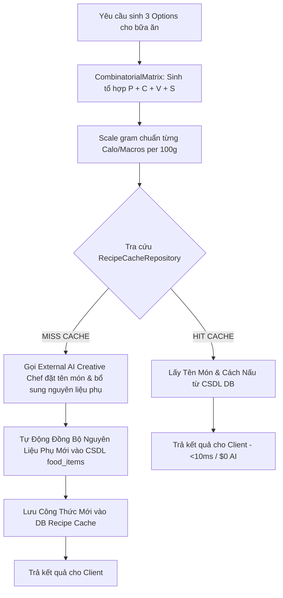

# Đặc Tả Server Rule-Based Engine: Thuật Toán & Quy Tắc Nghiệp Vụ Go Backend

Tài liệu đặc tả kỹ thuật chi tiết dành cho các kỹ sư triển khai tầng **Domain & Application** của module **Nutrition / NutiFood** (`internal/nutrition`). 

Tài liệu tập trung vào kiến trúc **Server-Heavy Rule Engine** thuần Go, quy tắc tính toán ma trận tổ hợp nguyên liệu, lọc cách ly dị ứng/lockout, thuật toán căn chỉnh định lượng gram tự động và cơ chế Recipe Caching.

---

## 1. Cấu Trúc Thành Phần Rule-Based Engine Trong Domain Layer

```
internal/nutrition/
├── domain/
│   ├── aggregate/
│   │   ├── food_item.go           # Aggregate: FoodItem catalog & approval
│   │   ├── meal_history.go        # Aggregate: MealHistory & MealLog
│   │   └── nutrition_plan.go      # Aggregate: NutritionPlan & 4 Meal Slots
│   ├── repository/
│   │   ├── ai_service.go          # Port Interface: AIService (SelectCreativeMealOptions, EstimateNutrient, GenerateNutritionInsight)
│   │   ├── food_item_repository.go
│   │   ├── meal_history_repository.go
│   │   ├── nutrition_plan_repository.go
│   │   ├── recipe_cache_repository.go
│   │   └── profile_client.go
│   ├── service/
│   │   ├── tdee_calculator.go      # Domain Service: Mifflin-St Jeor TDEE & Workout Surplus (BR-NU-01 & BR-NU-04)
│   │   ├── combinatorial_matrix.go # Domain Service: Thuật toán Ma Trận Tổ Hợp Nguyên Liệu
│   │   └── menu_generator.go       # Domain Service: MenuGenerator (Rule Engine Orchestrator + Recipe Cache)
│   └── vo/
│       ├── calorie_allocation.go   # Value Object: CalorieAllocation & Target Macros
│       ├── lockout_registry.go     # Value Object: LockoutRegistry & Quy tắc cách ly (BR-NU-02)
│       └── food_nutrient.go        # Value Object: FoodNutrient per 100g
└── infrastructure/ai/adk/
    ├── agent.go                   # ADKNutritionAgent implements repository.AIService
    ├── fallback_llm.go            # FallbackLLM (Auto Quota Failover GEMINI_MODEL & GEMINI_FALLBACK_MODELS)
    ├── build_agents.go            # Multi-Agent Workflow setup + //go:embed prompts/*.txt
    └── tools.go                   # ADK Function Tools (fetch_food_catalog, calculate_macro_gram, suggest_nutifood)
```

---

## 2. Đặc Tả Chi Tiết Các Thành Phần Thuật Toán

### 2.1. Bộ Tính Toán TDEE & Phân Bổ Macro Linh Hoạt (`tdee_calculator.go`)

#### 1. Công thức Mifflin-St Jeor chuẩn:
$$\text{BMR}_{\text{Nam}} = 10 \times \text{weight (kg)} + 6.25 \times \text{height (cm)} - 5 \times \text{age} + 5$$
$$\text{BMR}_{\text{Nữ}} = 10 \times \text{weight (kg)} + 6.25 \times \text{height (cm)} - 5 \times \text{age} - 161$$
$$\text{Base TDEE} = \text{BMR} \times \text{ActivityFactor}$$

#### 2. Ràng buộc An toàn (Invariant BR-NU-01):
```go
if targetCalories < 1200.0 {
    targetCalories = 1200.0 // Bắt buộc tối thiểu 1200 kcal/ngày vì an toàn sức khỏe
}
```

#### 3. Điều chỉnh linh hoạt theo Calo tập luyện (BR-NU-04):
$$\text{Target Calories Mới} = \text{Base TDEE} + \text{WorkoutCaloriesBurned}$$
- Phân bổ Tỷ lệ Macro Chuẩn (VD: 30% Protein, 40% Carb, 30% Fat):
  - $\text{Protein (g)} = \frac{\text{Target Calories} \times 0.30}{4}$
  - $\text{Carb (g)} = \frac{\text{Target Calories} \times 0.40}{4}$
  - $\text{Fat (g)} = \frac{\text{Target Calories} \times 0.30}{9}$

---

### 2.2. Thuật Toán Ma Trận Tổ Hợp Nguyên Liệu (`combinatorial_matrix.go`)

#### 1. Nguyên lýMa trận 4 Chiều (4D Ingredient Matrix):
Mỗi công thức món ăn được tạo thành từ 4 phần tử nguyên liệu độc lập:
$$M = (P_i, C_j, V_k, S_l)$$
Trong đó:
- $P_i \in \text{Protein Catalog}$ (Ức gà, Thịt bò, Cá hồi, Tôm, Đậu phụ, Mực...)
- $C_j \in \text{Carb Catalog}$ (Cơm gạo lứt, Khoai lang, Yến mạch, Bún lứt...)
- $V_k \in \text{Veggie Catalog}$ (Bông cải xanh, Măng tây, Cà chua, Rau bina...)
- $S_l \in \text{Style Catalog}$ (Áp chảo thảo mộc, Nướng giấy bạc, Xào tỏi oliu, Hấp gừng...)

#### 2. Thuật toán Căn Chỉnh Định Lượng Gram Tự Động (Gram-Level Auto-Scaling):
Cho trước Target Macros của bữa ăn: $T = (P_{\text{target}}, C_{\text{target}}, F_{\text{target}})$.
Server tự động giải hệ phương trình tuyến tính để tính số gram chính xác của từng nguyên liệu:

$$\text{Gram}_{\text{Protein Source}} = \frac{P_{\text{target}}}{P_{\text{per 100g}} / 100}$$
$$\text{Gram}_{\text{Carb Source}} = \frac{C_{\text{target}}}{C_{\text{per 100g}} / 100}$$
$$\text{Gram}_{\text{Veggie Source}} = \text{Cố định } 100\text{g} \ - \ 150\text{g (chứa xơ)}$$

```go
// Ví dụ logic Go căn chỉnh gram nguyên liệu
func ScaleIngredientGrams(proteinFood FoodNutrient, targetProteinGrams float64) float64 {
    if proteinFood.ProteinPer100g <= 0 {
        return 100.0
    }
    return (targetProteinGrams / proteinFood.ProteinPer100g) * 100.0
}
```

---

### 2.3. Bộ Lọc Cách Ly Dị Ứng & Lockout Chống Lặp (`lockout_registry.go`)

#### 1. Quy tắc Khóa Thời Gian (BR-NU-02):
Khi một bữa ăn được ghi nhận (`MealLog`), Server tự động thêm vào `LockoutRegistry`:
- **Protein main source**: Khóa trong **7 ngày**.
- **Carb main source**: Khóa trong **5 ngày**.
- **Category / Dish Theme**: Khóa trong **3 ngày**.

#### 2. Logic Lọc Ma Trận (Isolation Matrix Rules):
- **BR-NU-02.1 (Strict Isolation khi không có input tủ lạnh)**:
  ```go
  func (r *LockoutRegistry) FilterAvailableIngredients(catalog []FoodNutrient, activeLockouts []LockoutItem) []FoodNutrient {
      var valid []FoodNutrient
      for _, food := range catalog {
          if !isLocked(food, activeLockouts) && !isAllergen(food, userRestrictions) {
              valid = append(valid, food)
          }
      }
      return valid
  }
  ```
- **BR-NU-02.2 (Novel Culinary Method khi có input tủ lạnh trùng Lockout)**:
  - Nếu `userPantryItems` chứa nguyên liệu đang nằm trong `activeLockouts`:
    - **Vẫn cho phép sử dụng nguyên liệu đó** (tránh lãng phí thực phẩm).
    - **Flag**: Bật cờ `RequiresNovelCookingStyle = true` để bắt buộc chọn $S_l \in \text{Style Catalog}$ chưa từng sử dụng trong các ngày gần nhất.

---

### 2.4. Subsystem Recipe Caching & AI Fallback Orchestrator (`menu_generator.go`)



#### Quy Trình Xử Lý Chi Tiết:
1. **Bước 1 (Rule Engine)**: Sinh ma trận tổ hợp $(P_i, C_j, V_k, S_l)$ và tính gram chuẩn cho bữa ăn theo công thức $\Delta \text{Gram} = \frac{\Delta \text{Calo}}{\text{CaloriesPer100g}} \times 100$.
2. **Bước 2 (Cache Lookup)**: Tìm kiếm trong bảng `nutrition.recipes` bằng key `Hash(P_i, C_j, V_k, S_l)`.
   - **Nếu tìm thấy (Hit Cache)**: Lấy Tên món + Cách chế biến đã lưu trong DB. Chi phí AI = 0$, Phản hồi `<10ms`.
   - **Nếu không tìm thấy (Miss Cache)**: Gọi External AI với prompt làm Creative Chef:
     > *"Tôi có [130g Ức gà, 140g Khoai lang, 80g Bông cải xanh]. Phương pháp: Áp chảo. Bạn có thể tự do bổ sung các nguyên liệu/gia vị phụ trợ bên ngoài (tỏi, ớt, dầu oliu, nấm, sốt...). Hãy đặt 1 tên món ăn hấp dẫn và ghi hướng dẫn nấu 3 bước ngắn gọn."*
3. **Bước 3 (Auto DB Catalog Sync & Cache Auto-Save)**: 
   - Nếu AI bổ sung nguyên liệu/gia vị phụ mới chưa có trong CSDL, Server tự động chèn nguyên liệu mới này vào `nutrition.food_items`.
   - Lưu toàn bộ tên món & hướng dẫn từ AI vào bảng `nutrition.recipes` để phục vụ vĩnh viễn cho tất cả các user khác sau này.

---

### 2.5. Quy Tắc Tối Ưu Sinh 3 Options Mỗi Bữa (`BR-NU-05.1` & `BR-NU-03`)

Mỗi bữa ăn (Sáng, Trưa, Tối, Phụ) bắt buộc phải chứa **3 Lựa chọn (`MealOption`)**:
- **Option A (Tự nấu chuẩn)**: Tổ hợp nguyên liệu chính tự nấu theo ma trận Rule Engine.
- **Option B (Tự nấu đổi vị)**: Tổ hợp nguyên liệu thay thế nguồn đạm khác (VD: Cá/Tôm thay gà).
- **Option C (Tiện lợi NutiFood - BR-NU-03)**: Gợi ý sản phẩm đóng gói NutiFood tương đương giá trị dinh dưỡng (VD: *NutiFood Varna Complete* hoặc *NutiFood LeanMax*).

---

## 3. Bảng Tổng Hợp Quy Tắc Nghiệp Vụ (Business Rules Registry)

| Mã Quy Tắc | Tên Quy Tắc | Tầng Xử Lý | Mô Tả Thuật Toán |
| :--- | :--- | :--- | :--- |
| **BR-NU-01** | Minimum Safety Calorie | Domain (`tdee_calculator.go`) | Target Calo luôn $\ge 1200\text{ kcal/ngày}$. |
| **BR-NU-02** | Anti-Repetition Lockout | Domain (`lockout_registry.go`) | Khóa đạm 7 ngày, tinh bột 5 ngày, chủ đề 3 ngày sau khi LogMeal. |
| **BR-NU-02.1** | Strict Lockout Isolation | Domain (`combinatorial_matrix.go`) | Không có input tủ lạnh -> Cấm 100% nguyên liệu trong Lockout. |
| **BR-NU-02.2** | Novel Culinary Method | Domain (`menu_generator.go`) | Nguyên liệu tủ lạnh trùng Lockout -> Cho dùng nhưng bắt buộc đổi cách chế biến mới lạ. |
| **BR-NU-03** | NutiFood Partner Suggestion | Domain (`menu_generator.go`) | Đính kèm sản phẩm NutiFood làm Option C tiện lợi trong thực đơn. |
| **BR-NU-04** | Event-Driven Workout Surplus | Application / Kafka Consumer | Buổi tập chiều phát event -> Tự động tính Calo tiêu hao bổ sung vào bữa tối/phụ. |
| **BR-NU-05.1** | 3+ Options Per Meal | Domain (`menu_generator.go`) | Sinh tối thiểu 3 lựa chọn món ăn cho mỗi bữa. |
| **BR-NU-05.2** | Post-Meal Reminders | Notification Worker | Phát Push Notification vào 8:30, 13:00, 19:30, 21:00. |
| **BR-NU-05.3** | Auto AI Calorie Estimation | Application (`log_meal.go`) | User log món ngoài không nhập calo -> AI tự ước tính & cache vào DB. |
| **BR-NU-06** | Pantry On-Demand Recalibration| Application (`recalibrate_pantry.go`) | API tái hiệu chỉnh các bữa chưa ăn theo nguyên liệu sẵn có trong tủ lạnh. |
