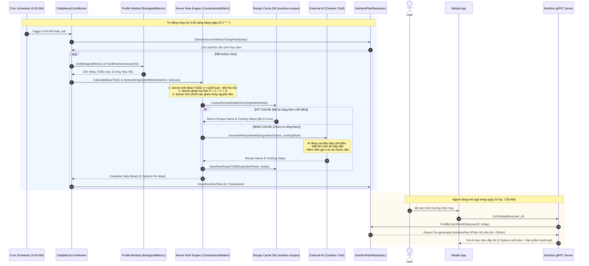
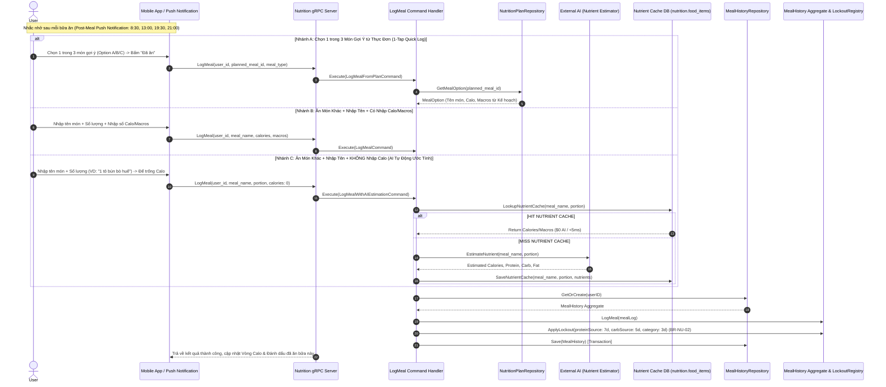
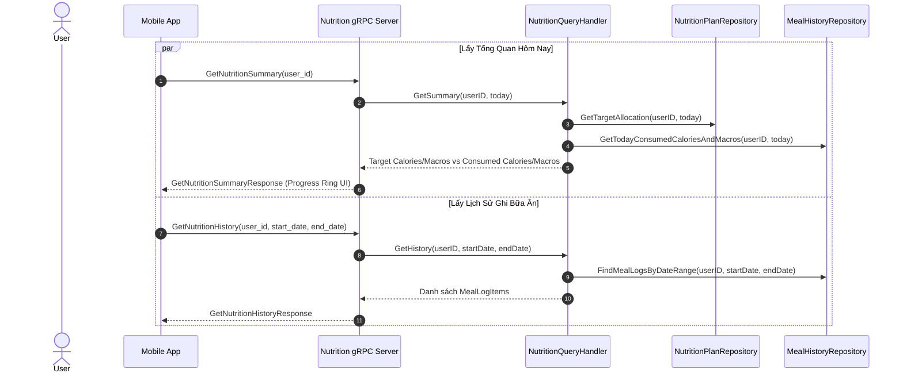
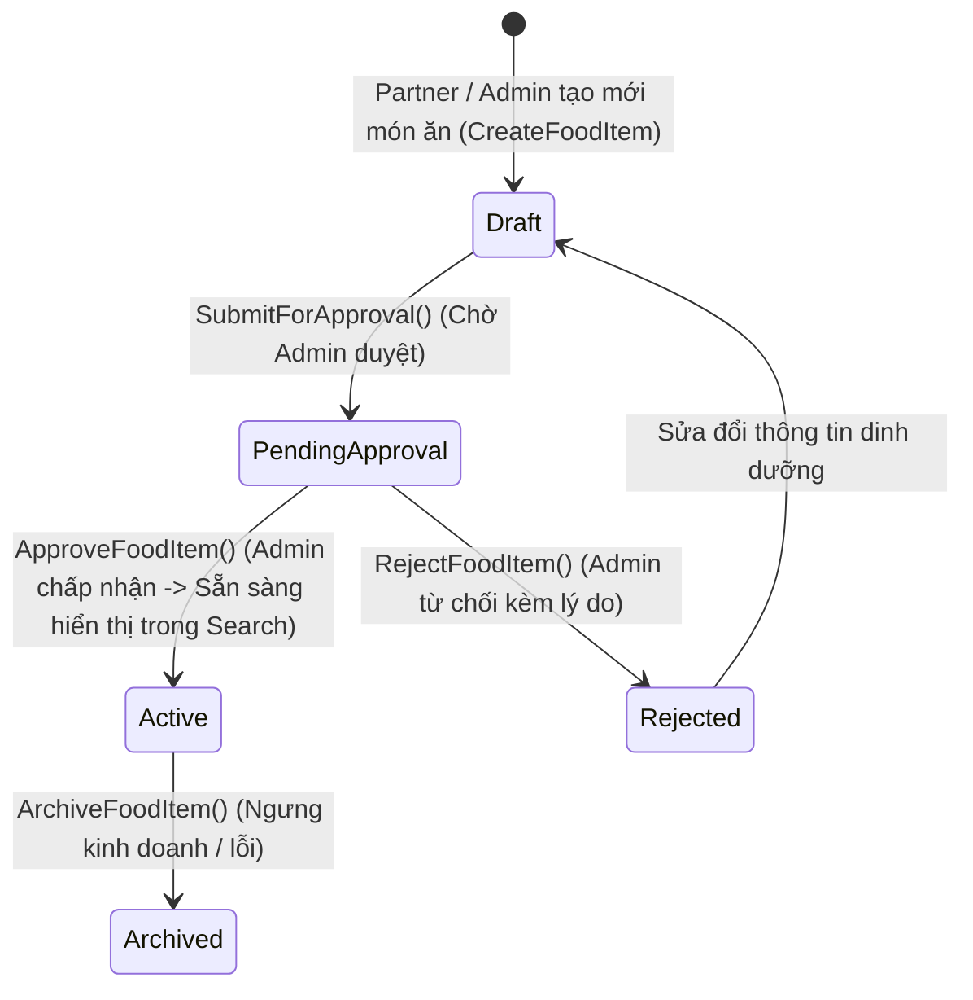
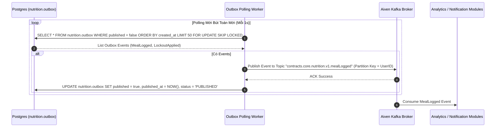
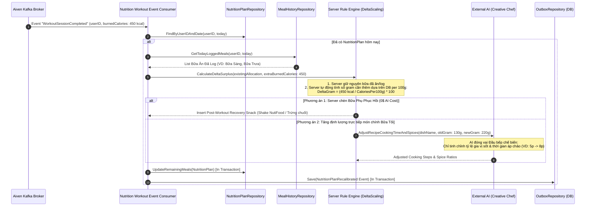
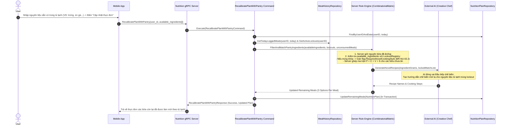

# Master Implementation Plan: Module AI Nutrition Engine / NutiFood (`internal/nutrition`)

Tài liệu kế hoạch kỹ thuật tổng thể dành cho Bounded Context **Nutrition / NutiFood** (`internal/nutrition`) chuẩn kiến trúc **Domain-Driven Design (DDD)**, **Hexagonal Architecture (Ports & Adapters)**, và các quy ước lập trình Go trong `AGENTS.md`.

Tài liệu được cập nhật chính xác theo nguyên lý **Server-Heavy Rule Engine + AI Creative Chef** (đã thiết kế tại các file **06, 07, 08**):
- **Server Go Backend**: Gánh **90% khối lượng công việc** — tính toán TDEE, phân bổ calo, tính chính xác từng gram nguyên liệu per 100g, lọc dị ứng, check `LockoutRegistry` (7/5/3 ngày) và ghép ma trận tổ hợp ($180,000+$ món).
- **External AI (Gemini/OpenAI)**: Đóng vai trò là **"Đầu bếp chế biến & Sáng tạo" (Creative Chef)** — chỉ làm nhiệm vụ đặt tên món ăn hấp dẫn, gợi ý phong cách nêm nếm gia vị và thời gian nấu từ các khối nguyên liệu chuẩn do Server tính sẵn.

---

## 1. User Review & Scope Alignment

> [!IMPORTANT]
> **Khẳng định kiến trúc cốt lõi**:
> 1. **Phạm vi tính năng**: Triển khai đầy đủ 3 Aggregates (`NutritionPlan`, `MealHistory`, `FoodItem`), `TDEECalculator`, `CombinatorialMatrix` (Server Rule Engine), `RecipeCacheRepository` ($0$ AI Cost cho lượt tái sử dụng), cơ chế chống lặp món Lockout (BR-NU-02), đề xuất sản phẩm NutiFood (BR-NU-03), tái hiệu chỉnh động khi tập luyện (BR-NU-04) / tủ lạnh (BR-NU-06), và Outbox CDC phát sự kiện lên Kafka.
> 2. **Cơ sở dữ liệu**: Sử dụng PostgreSQL schema riêng `nutrition` với các bảng `nutrition_plans`, `meal_histories`, `meal_logs`, `lockout_registries`, `food_items` (lưu các trường `calories_per_100g`, `protein_per_100g`, `carbs_per_100g`, `fat_per_100g`), `recipes` (Recipe Cache), bảng `outbox` & `outbox_log` (đã khởi tạo tại `01-init-schemas.sql`).
> 3. **Phân định ranh giới Server vs AI**: 
>    - **Server**: Quyết định lượng gram, món ăn, chỉ tiêu Calo/Macros, check lockout.
>    - **External AI**: Chỉ đóng vai trò Đầu bếp chế biến — đặt tên món, tinh chỉnh lượng gia vị/thời gian nấu khi tăng định lượng hoặc yêu cầu chế biến mới lạ.

---

## 2. Proposed Changes & File Structure

### Database & Migrations

#### [NEW] [07-create-nutrition-tables.sql](file:///e:/LEAN/TTTN/internal/shared/database/migrations/07-create-nutrition-tables.sql)
- Tạo các bảng nghiệp vụ trong PostgreSQL schema `nutrition` (schema `nutrition`, `outbox` và `outbox_log` đã được tạo từ `01-init-schemas.sql`):
  - `nutrition.nutrition_plans`: Lưu kế hoạch calo/macros theo ngày, target calories, phân bổ protein/carb/fat, danh sách bữa ăn gợi ý dưới dạng JSONB.
  - `nutrition.meal_histories`: Quản lý lịch sử ăn uống của user.
  - `nutrition.meal_logs`: Các món ăn thực tế đã ghi nhận (`meal_log_id`, `meal_name`, `meal_type`, `calories`, `protein`, `carbs`, `fat`, `logged_at`).
  - `nutrition.lockout_registries`: Lưu vết khóa nguyên liệu (Protein khóa 7 ngày, Carb khóa 5 ngày, Dish Theme khóa 3 ngày - BR-NU-02).
  - `nutrition.food_items`: Danh mục thực phẩm chuẩn per 100g (`calories_per_100g`, `protein_per_100g`, `carbs_per_100g`, `fat_per_100g`), nhãn dị ứng/chay/Halal, nhãn sản phẩm NutiFood, trạng thái vòng đời (`Draft`, `PendingApproval`, `Active`).
  - `nutrition.recipes`: Thư viện Recipe Cache tự động tích lũy từ External AI để tái sử dụng $0$ AI Cost.
- Seed dữ liệu ban đầu duy nhất cho bảng `nutrition.food_items` (danh mục thực phẩm chuẩn & sản phẩm NutiFood như NutiFood Varna, NutiFood LeanMax).

---

### Domain Layer (`internal/nutrition/domain`)

Không import thư viện ngoài (không GORM, không Gin/REST, không ORM tags). Định nghĩa đầy đủ Aggregate Roots, Entities, Value Objects, Domain Events và Interfaces (Ports).

#### [NEW] [calorie_allocation.go](file:///e:/LEAN/TTTN/internal/nutrition/domain/calorie_allocation.go)
- **Value Object**: `CalorieAllocation` (Target calories, Protein grams, Carb grams, Fat grams).
- **Invariant**: Target calories >= 1200 kcal/ngày (BR-NU-01).

#### [NEW] [lockout_registry.go](file:///e:/LEAN/TTTN/internal/nutrition/domain/lockout_registry.go)
- **Value Object**: `LockoutRegistry` quản lý danh sách nguyên liệu/loại món bị khóa kèm thời hạn mở khóa.
- **BR-NU-02**: Tự động khóa Protein chính 7 ngày, Carb chính 5 ngày, Chủ đề món 3 ngày sau khi log bữa ăn.
- **BR-NU-02.1**: Cấm tuyệt đối nguyên liệu bị khóa nếu không có input tủ lạnh.
- **BR-NU-02.2**: Nếu nguyên liệu tủ lạnh trùng Lockout -> Cho dùng nhưng yêu cầu AI đổi phương pháp chế biến mới lạ.

#### [NEW] [food_nutrient.go](file:///e:/LEAN/TTTN/internal/nutrition/domain/food_nutrient.go)
- **Value Object**: `FoodNutrient` chứa calo, macro per 100g (`CaloriesPer100g`, `ProteinPer100g`, `CarbsPer100g`, `FatPer100g`), allergen tags, partner tags (NutiFood).

#### [NEW] [nutrition_plan.go](file:///e:/LEAN/TTTN/internal/nutrition/domain/nutrition_plan.go)
- **Aggregate Root**: `NutritionPlan`
- Chứa `PlanID`, `UserID`, `Date`, `CalorieAllocation`, `DailyMealOptions` (Sáng, Trưa, Tối, Phụ).
- **BR-NU-05 (Chuyển đổi Thực đơn Kế hoạch -> Lịch sử Ăn uống & Nhắc nhở theo bữa)**:
  - **BR-NU-05.1**: Sinh ít nhất 3 Lựa chọn (`MealOption`) cho mỗi bữa ăn.
  - **BR-NU-05.2**: Nhắc nhở đẩy sau mỗi bữa ăn (8:30, 13:00, 19:30, 21:00).
  - **BR-NU-05.3**: Quick-log 1-tap 1/3 options | Custom log có calo | Custom log KHÔNG calo -> AI tự động ước tính & cache DB.

#### [NEW] [meal_history.go](file:///e:/LEAN/TTTN/internal/nutrition/domain/meal_history.go)
- **Aggregate Root**: `MealHistory`
- Chứa `HistoryID`, `UserID`, danh sách `MealLog` entities và `LockoutRegistry`.
- Business Method: `LogMeal(...)`, `LogMealFromPlan(...)`, `LogCustomMealWithAIEstimation(...)`, `ApplyLockout(...)`.

#### [NEW] [food_item.go](file:///e:/LEAN/TTTN/internal/nutrition/domain/food_item.go)
- **Aggregate Root**: `FoodItem`
- State Lifecycle: `Draft` -> `SubmitForApproval()` -> `Approve()` (`Active`) / `Reject()`.

#### [NEW] [tdee_calculator.go](file:///e:/LEAN/TTTN/internal/nutrition/domain/tdee_calculator.go)
- **Domain Service**: Tính TDEE theo Mifflin-St Jeor và tự động điều chỉnh Calo/Macro linh hoạt.
- **BR-NU-04**: Tái hiệu chỉnh thực đơn động khi có sự kiện tập luyện `WorkoutSessionCompleted`.

#### [NEW] [combinatorial_matrix.go](file:///e:/LEAN/TTTN/internal/nutrition/domain/combinatorial_matrix.go)
- **Domain Service (Rule-Based Matrix Engine)**: Thuật toán ma trận tổ hợp nguyên liệu ($N_1 \text{ Protein} \times N_2 \text{ Carb} \times N_3 \text{ Veggie} \times N_4 \text{ Style} = 180,000+$ món) + Tự động căn chỉnh gram nguyên liệu chuẩn theo công thức:
  $$\Delta \text{Gram} = \frac{\Delta \text{Calo}}{\text{CaloriesPer100g}} \times 100$$

#### [NEW] [menu_generator.go](file:///e:/LEAN/TTTN/internal/nutrition/domain/menu_generator.go)
- **Domain Service Orchestrator**: 
  1. Sử dụng `CombinatorialMatrix` trên Server để sinh tổ hợp nguyên liệu chuẩn Calo/Macros.
  2. Tra cứu `RecipeCacheRepository`: Nếu đã có công thức -> Lấy DB ($0$ AI Cost).
  3. Nếu chưa có -> Gọi `AIService` làm **Đầu bếp chế biến** (đặt tên món & hướng dẫn chế biến từ nguyên liệu chuẩn của Server).
  4. **Quy tắc Bổ Sung Nguyên Liệu Phụ & Tự Động Đồng Bộ CSDL (Auto DB Catalog Sync)**:
     - Prompt cho External AI cho phép AI **tự do bổ sung thêm nguyên liệu/gia vị phụ trợ bên ngoài** (như tỏi, ớt, dầu oliu, nấm, sốt...) để món ăn chế biến tròn vị.
     - Khi AI trả về công thức có chứa nguyên liệu phụ mới chưa có trong CSDL `nutrition.food_items`, Server **tự động chèn nguyên liệu mới này vào CSDL `nutrition.food_items`** (với thông số dinh dưỡng per 100g do AI ước tính) để tái sử dụng cho tất cả người dùng khác lần sau.
     - Lưu toàn bộ công thức vào `nutrition.recipes` (Recipe Cache DB).

#### [NEW] [ai_service.go](file:///e:/LEAN/TTTN/internal/nutrition/domain/ai_service.go)
- **Port / Interface**: `AIService` hợp đồng gọi External AI làm **Creative Chef (Đầu bếp chế biến & nêm nếm)** và **Nutrient Estimator**, tích hợp Prompt Rule cho phép bổ sung nguyên liệu phụ trợ và trích xuất nguyên liệu mới để đồng bộ CSDL.

#### [NEW] [events.go](file:///e:/LEAN/TTTN/internal/nutrition/domain/events.go)
- Domain Events: `NutritionPlanGenerated`, `NutritionPlanRecalibrated`, `MealLogged`, `LockoutApplied`, `FoodItemCreated`, `FoodItemApproved`.

#### [NEW] [repository.go](file:///e:/LEAN/TTTN/internal/nutrition/domain/repository.go)
- Interfaces: `NutritionPlanRepository`, `MealHistoryRepository`, `FoodItemRepository`, `RecipeCacheRepository`.

---

### Application Layer (`internal/nutrition/application`)

#### Commands:
- [NEW] [generate_daily_plan.go](file:///e:/LEAN/TTTN/internal/nutrition/application/command/generate_daily_plan.go): UC-05.1 Base TDEE plan generation.
- [NEW] [recalibrate_plan_with_pantry.go](file:///e:/LEAN/TTTN/internal/nutrition/application/command/recalibrate_plan_with_pantry.go): **BR-NU-06** API tái hiệu chỉnh bữa ăn theo nguyên liệu tủ lạnh.
- [NEW] [log_meal.go](file:///e:/LEAN/TTTN/internal/nutrition/application/command/log_meal.go): UC-05.2 & **BR-NU-05** Log meal (1-tap quick log / custom log với AI auto estimation).
- [NEW] [create_food_item.go](file:///e:/LEAN/TTTN/internal/nutrition/application/command/create_food_item.go)
- [NEW] [approve_food_item.go](file:///e:/LEAN/TTTN/internal/nutrition/application/command/approve_food_item.go)

#### Queries:
- [NEW] [get_today_menu.go](file:///e:/LEAN/TTTN/internal/nutrition/application/query/get_today_menu.go)
- [NEW] [get_nutrition_history.go](file:///e:/LEAN/TTTN/internal/nutrition/application/query/get_nutrition_history.go)
- [NEW] [get_nutrition_summary.go](file:///e:/LEAN/TTTN/internal/nutrition/application/query/get_nutrition_summary.go)

---

### Infrastructure Layer (`internal/nutrition/infrastructure`)

#### AI Integration (Google ADK v2 & FallbackLLM) & Persistence:
- [NEW] [agent.go](file:///e:/LEAN/TTTN/internal/nutrition/infrastructure/ai/adk/agent.go): `ADKNutritionAgent` triển khai `repository.AIService`.
- [NEW] [fallback_llm.go](file:///e:/LEAN/TTTN/internal/nutrition/infrastructure/ai/adk/fallback_llm.go): `FallbackLLM` bọc `model.LLM`, tự động failover sang model dự phòng khi hết quota/429 (`GEMINI_MODEL` & `GEMINI_FALLBACK_MODELS`).
- [NEW] [build_agents.go](file:///e:/LEAN/TTTN/internal/nutrition/infrastructure/ai/adk/build_agents.go): Khởi tạo LLM nodes & workflow agents với file prompt nhúng tĩnh (`//go:embed prompts/*.txt`).
- [NEW] [tools.go](file:///e:/LEAN/TTTN/internal/nutrition/infrastructure/ai/adk/tools.go): ADK Function Tools (`fetch_food_catalog`, `calculate_macro_gram`, `suggest_nutifood_supplement`).
- [NEW] [retry.go](file:///e:/LEAN/TTTN/internal/nutrition/infrastructure/ai/adk/retry.go): Retry mechanism & plan validation.
- [NEW] [gorm_models.go](file:///e:/LEAN/TTTN/internal/nutrition/infrastructure/persistence/gorm_models.go): Mapping `ToDomain()` / `ToPersistence()`.
- [NEW] [postgres_repository.go](file:///e:/LEAN/TTTN/internal/nutrition/infrastructure/persistence/postgres_repository.go)
- [NEW] [outbox_repository.go](file:///e:/LEAN/TTTN/internal/nutrition/infrastructure/persistence/outbox_repository.go)
- [NEW] [grpc_handler.go](file:///e:/LEAN/TTTN/internal/nutrition/infrastructure/transport/grpc_handler.go): gRPC Adapter `NutritionServiceServer`.

#### Workers:
- [NEW] [outbox_worker.go](file:///e:/LEAN/TTTN/internal/nutrition/infrastructure/worker/outbox_worker.go): CDC Outbox Worker sang Kafka.
- [NEW] [daily_menu_cron_worker.go](file:///e:/LEAN/TTTN/internal/nutrition/infrastructure/worker/daily_menu_cron_worker.go): Cron Job 5:00 AM (`0 5 * * *`) pre-generate Base TDEE plan.

---

## 3. Workflows & Activity Diagrams (7 Sơ Đồ Mermaid Chuẩn AI Creative Chef)

### Flow 1: Cron Job 5:00 AM Tự Động Sinh Thực Đơn Đầu Ngày (`DailyMenuCronWorker` & `GetTodayMenu`)

---

### Flow 2: Log Bữa Ăn Theo Nhắc Nhở & AI Tự Động Tính Calo (`LogMeal` & `BR-NU-05`)

---

### Flow 3: Tổng Quan Calo/Macro & Lịch Sử (`GetSummary` & `GetHistory`)

---

### Flow 4: Vòng Đời Phê Duyệt Thực Phẩm (`FoodItem` Lifecycle)

---

### Flow 5: Outbox CDC & Phát Sự Kiện Sang Kafka

---

### Flow 6: Tái Hiệu Chỉnh Định Lượng Khi Tập Luyện Chiều (`WorkoutSessionCompleted` Event - BR-NU-04)

---

### Flow 7: Tái Hiệu Chỉnh Thực Đơn Khi Nhập Nguyên Liệu Sẵn Có (`RecalibratePlanWithPantry` API - BR-NU-06)

---

## 4. Verification Plan

### Automated Unit Tests
1. **Domain Tests**:
   - `go test -v ./internal/nutrition/domain/...`
   - Test `CalorieAllocation`: Kiểm tra Invariant `target >= 1200 kcal` (BR-NU-01).
   - Test `CombinatorialMatrix`: Kiểm tra ghép tổ hợp ma trận $180k+$ món và tính gram chuẩn theo công thức $\Delta \text{Gram} = \frac{\Delta \text{Calo}}{\text{CaloriesPer100g}} \times 100$.
   - Test `LockoutRegistry`: Kiểm tra nguyên tắc khóa 7 ngày đạm, 5 ngày tinh bột, 3 ngày chủ đề món (BR-NU-02, BR-NU-02.1, BR-NU-02.2).
   - Test `MenuGenerator`: Tra cứu Recipe Cache HIT/MISS và đính kèm sản phẩm NutiFood (BR-NU-03).
2. **Application CQRS Tests**:
   - `go test -v ./internal/nutrition/application/...`
   - Mock repositories để kiểm tra logic `GenerateDailyPlan`, `RecalibratePlanWithPantry`, `LogMeal`.

### Automated Integration Tests
1. **Repository & Outbox Integration Tests**:
   - `go test -v ./internal/nutrition/tests/integration/...`
   - Chạy với Postgres container / test DB để kiểm tra transaction lưu Aggregate và Outbox event nguyên khối.

### Code Quality & Contract Validation
1. **Go Code Style Rules**: `golangci-lint run ./internal/nutrition/...`
2. **Buf Proto Schema**: `buf lint`
