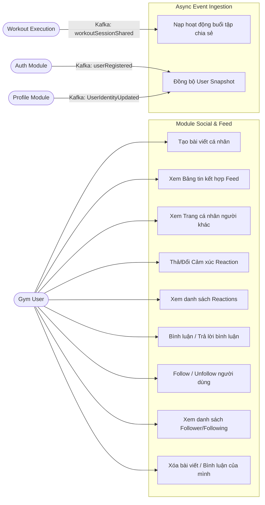
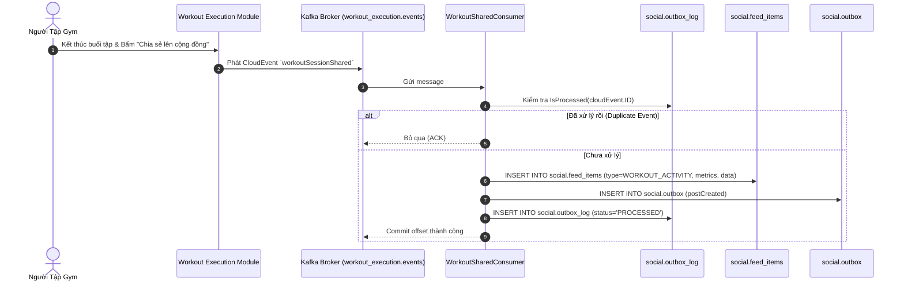
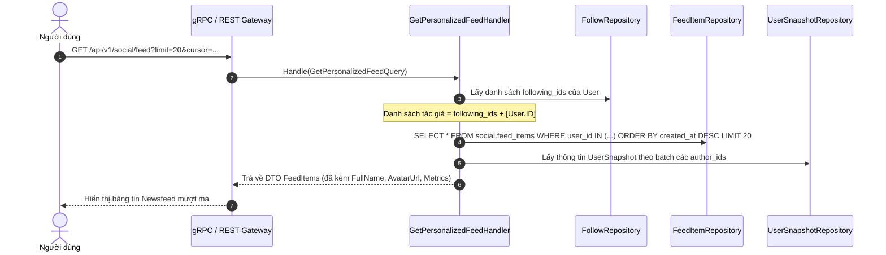
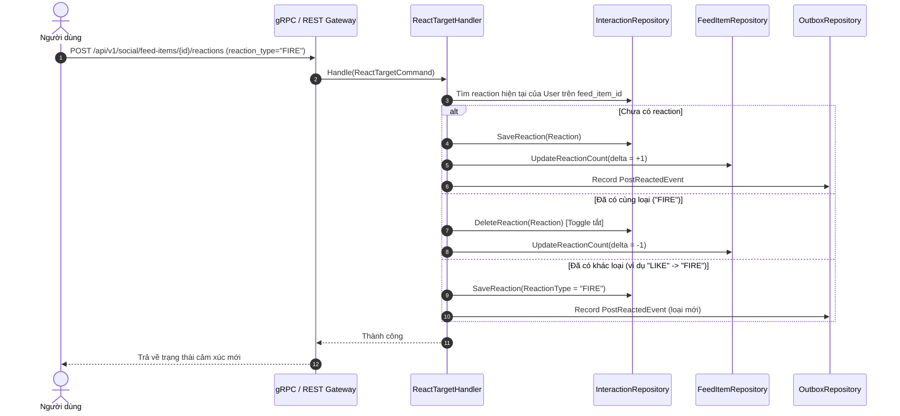
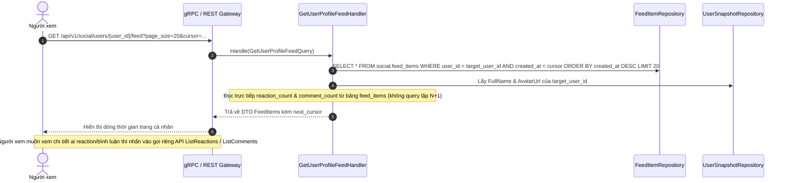
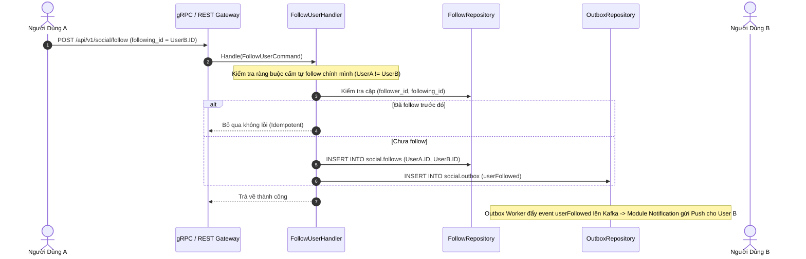
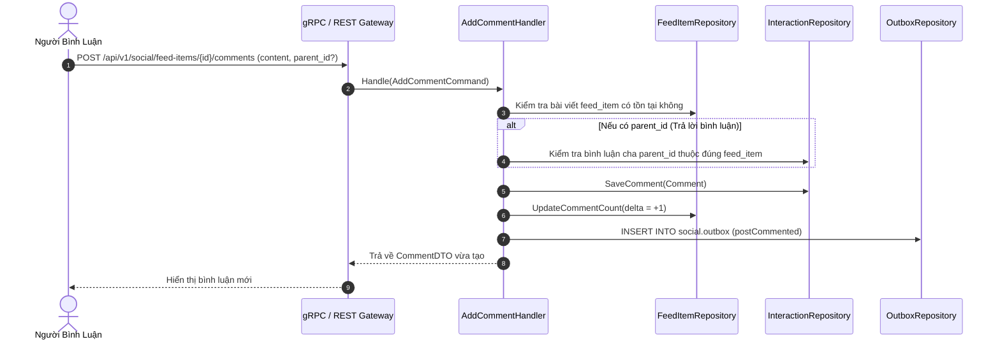
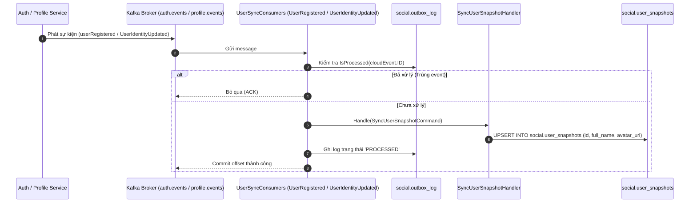
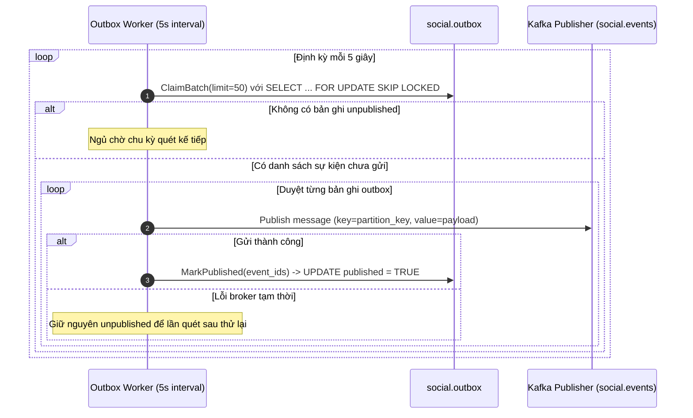

# Phân Tích Hệ Thống — Module Social (System Analysis)

Tài liệu này trình bày phân tích ca sử dụng (Use Cases), tác nhân (Actors), phân tích sự kiện (Event Storming), và luồng dữ liệu (Data Flow) của Bounded Context **Social**.

---

## 1. Tác Nhân Hệ Thống (Actors)

| Tác nhân | Vai trò trong hệ thống |
| :--- | :--- |
| **Gym User (Athlete)** | Người dùng tập gym, đăng bài viết, chia sẻ buổi tập, theo dõi bạn bè, thả reaction, bình luận. |
| **Follower / Friend** | Bạn bè trong mạng lưới theo dõi, tiếp nhận thông báo và bảng tin cá nhân hóa từ người họ follow. |
| **Workout Execution Module** | Module bên ngoài phát sự kiện khi người dùng hoàn thành và chia sẻ buổi tập luyện. |
| **Auth / Profile Module** | Các module danh tính phát sự kiện cập nhật tài khoản để Social đồng bộ bản sao User Snapshot. |

---

## 2. Biểu Đồ Ca Sử Dụng (Use Case Diagram)

---

## 3. Phân Tích Sự Kiện (Event Storming & Domain Events)

Module Social là cả nhà xuất bản (Publisher) và người tiêu thụ (Consumer) sự kiện bất đồng bộ:

### 3.1. Sự kiện Nội bộ Module Phát ra (Outbound Domain Events)
Các sự kiện này được ghi vào bảng `social.outbox` trong cùng transaction với thay đổi nghiệp vụ, sau đó Outbox Worker quét và phát tán ra Kafka:

| Tên sự kiện (CloudEvent Type) | Kafka Topic | Partition Key | Điều kiện kích hoạt | Dữ liệu chính (Payload) |
| :--- | :--- | :--- | :--- | :--- |
| `contracts.supporting.social.v1.postCreated` | `social.events` | `author_id` | Người dùng tạo bài viết hoặc chia sẻ buổi tập thành công | `post_id`, `author_id`, `caption`, `created_at` |
| `contracts.supporting.social.v1.postReacted` | `social.events` | `reactor_id` | Người dùng thả hoặc đổi cảm xúc trên bài viết | `post_id`, `author_id`, `reactor_id`, `reaction_type` |
| `contracts.supporting.social.v1.postCommented` | `social.events` | `commenter_id` | Người dùng thêm bình luận vào bài viết | `post_id`, `author_id`, `commenter_id`, `comment_id`, `content` |
| `contracts.supporting.social.v1.userFollowed` | `social.events` | `follower_id` | Người dùng theo dõi một gymer khác | `follower_id`, `following_id`, `created_at` |
| `contracts.supporting.social.v1.userUnfollowed` | `social.events` | `follower_id` | Người dùng hủy theo dõi một gymer khác | `follower_id`, `following_id`, `unfollowed_at` |

### 3.2. Sự kiện Lắng Nghe từ Module Khác (Inbound Events)

| Nguồn phát | Kafka Topic | Consumer Group | Tên sự kiện (CloudEvent Type) | Hành động trong Social |
| :--- | :--- | :--- | :--- | :--- |
| **Workout Execution** | `workout_execution.events` | `social-workout-shared-group` | `contracts.core.workout_execution.v1.workoutSessionShared` | Tạo `FeedItem` loại `WORKOUT_ACTIVITY` và đưa lên bảng tin |
| **Auth** | `auth.events` | `social-user-registered-group` | `contracts.generic.auth.v1.userRegistered` | Tạo bản ghi mới trong `social.user_snapshots` |
| **Profile** | `profile.events` | `social-user-identity-updated-group` | `contracts.supporting.profile.v1.event.UserIdentityUpdated` | Cập nhật `full_name`, `avatar_url` trong `social.user_snapshots` |

---

## 4. Sơ Đồ Luồng Dữ Liệu Chi Tiết (Data Flow Diagrams)

### 4.1. Luồng Chia Sẻ Buổi Tập (Privacy-First Ingestion)

### 4.2. Luồng Lấy Bảng Tin Cá Nhân Hóa (Personalized Activity Feed)

### 4.3. Luồng Tương Tác Cảm Xúc (Idempotent Reaction Toggle)

### 4.4. Luồng Lấy Dòng Hoạt Động Trang Cá Nhân (User Profile Feed)

### 4.5. Luồng Đồ Thị Quan Hệ Bạn Bè (Follow & Notification Dispatch)

### 4.6. Luồng Bình Luận Đa Cấp (Threaded Comments Flow)

### 4.7. Luồng Đồng Bộ Danh Tính Bất Đồng Bộ (Async User Snapshot Sync)

### 4.8. Luồng Quét & Đẩy Sự Kiện Ra Kafka Bus (Transactional Outbox Worker)

