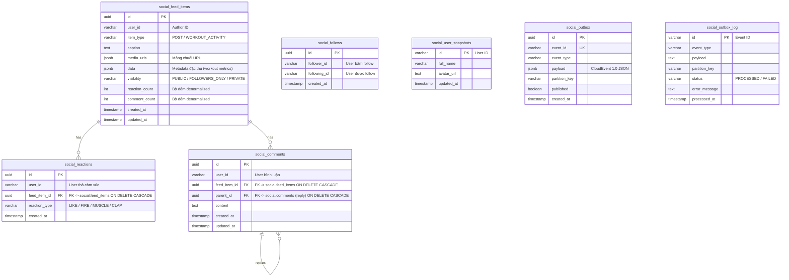

# Thiết Kế Hệ Thống — Module Social (System Design)

Tài liệu này đặc tả chi tiết kiến trúc kỹ thuật của Bounded Context **Social & Activity Feed** theo mô hình **Hexagonal Architecture (Ports & Adapters)** và các tiêu chuẩn khắt khe trong `AGENTS.md`.

---

## 1. Kiến Trúc Hexagonal (Ports & Adapters)

Module Social được đóng gói hoàn toàn trong thư mục `/internal/social/`:

```
internal/social/
├── domain/                      # LÕI NGHIỆP VỤ (Không import thư viện ngoài, không ORM/JSON tag)
│   ├── aggregate/               # FeedItem (Post, WorkoutActivity), Follow (Social Graph)
│   ├── entity/                  # Comment, Reaction, UserSnapshot
│   ├── value_object/ (vo/)      # ReactionType, Visibility, ItemType, WorkoutMetrics, TargetType
│   ├── event/                   # PostCreated, PostReacted, PostCommented, UserFollowed, UserUnfollowed
│   ├── repository/              # Ports: FeedItemRepository, FollowRepository, InteractionRepository, UserSnapshotRepository
│   └── derror/                  # Domain Errors chuẩn hóa (ErrFeedItemNotFound, ErrSelfFollow, ...)
│
├── application/                 # APPLICATION LAYER (Điều phối luồng nghiệp vụ)
│   ├── command/                 # Use Cases ghi: CreatePost, DeleteFeedItem, IngestWorkoutActivity, ReactTarget, FollowUser, ...
│   ├── query/                   # Use Cases đọc: GetActivityFeed, GetUserProfileFeed, GetSocialSummary, ListComments, ListReactions, ...
│   └── port/                    # Ports phụ: OutboxRepository, OutboxLogRepository, TransactionManager, EventPublisher
│
├── infrastructure/              # ADAPTERS NGOÀI (Cơ sở dữ liệu, Event Bus, Background Workers)
│   ├── persistence/             # GORM Repositories, Database Models & Mappers
│   │   ├── gorm_feed_item_repository.go
│   │   ├── gorm_follow_repository.go
│   │   ├── gorm_interaction_repository.go  # Quản lý Reaction & Comment
│   │   ├── gorm_user_snapshot_repository.go
│   │   ├── gorm_outbox_repository.go       # Khóa FOR UPDATE SKIP LOCKED
│   │   ├── gorm_outbox_log_repository.go   # Idempotency inbox logger
│   │   ├── models.go                       # GORM Models (social.* schema)
│   │   ├── mapper.go                       # Chuyển đổi Domain <-> Persistence
│   │   └── tx_manager.go                   # Quản lý Database Transaction
│   ├── event/                   # Outbox Writer (Đóng gói CloudEvents 1.0)
│   ├── kafka/                   # Kafka Publisher
│   └── worker/                  # Outbox Background Worker (CDC Poller)
│
├── transport/                   # DRIVING ADAPTERS (Giao diện bên ngoài)
│   ├── grpc/                    # gRPC Service Handler (Implements SocialServiceServer)
│   └── consumer/                # Kafka Consumers (CloudEvents Unpackers)
│       ├── cloudevent.go
│       ├── user_registered_consumer.go
│       ├── user_identity_updated_consumer.go
│       └── workout_shared_consumer.go
│
└── test/                        # E2E & INTEGRATION TESTS (Full-stack SQLite in-memory)
    ├── e2e_test.go              # Kiểm thử hoàn chỉnh hành trình người dùng
    └── testutil/
        └── testutil.go          # Helper khởi tạo DB & Repositories
```

---

## 2. Thiết Kế Cơ Sở Dữ Liệu (PostgreSQL Schema: `social`)

Tất cả bảng đều thuộc schema cô lập `social` (Migration: `12-create-social-tables.sql`):



### Chiến Lược Đánh Index Tối Ưu

```sql
-- 1. Index lấy Feed cá nhân hóa & User Feed siêu tốc theo thời gian giảm dần
CREATE INDEX idx_social_feed_items_user_created ON social.feed_items (user_id, created_at DESC);

-- 2. Index cho Comments trên bài viết (phân trang theo thời gian)
CREATE INDEX idx_social_comments_feed_created ON social.comments (feed_item_id, created_at ASC);

-- 3. Unique Index chống trùng lặp Follow & Reaction
CREATE UNIQUE INDEX idx_social_follows_pair ON social.follows (follower_id, following_id);
CREATE UNIQUE INDEX idx_social_reactions_user_feed ON social.reactions (user_id, feed_item_id);

-- 4. Index Outbox Worker quét bản ghi chưa phát hành
CREATE INDEX idx_social_outbox_unpublished ON social.outbox (published, created_at) WHERE published = FALSE;
```

---

## 3. Thiết Kế Concurrency & Outbox Pattern

### 3.1. Outbox Worker với `FOR UPDATE SKIP LOCKED`
Để đảm bảo nhiều worker chạy song song mà không xung đột hay lock trùng bản ghi:
- Repository sử dụng GORM clause:
  ```go
  clauses: []clause.Expression{
      clause.Locking{Strength: "UPDATE", Options: "SKIP LOCKED"},
  }
  ```
- PostgreSQL chỉ cấp quyền khóa cho worker nào đến trước; worker khác tự động bỏ qua các dòng đang bị khóa để xử lý lô tiếp theo.

### 3.2. Idempotency với Outbox Log (Inbox Pattern)
Khi Consumer đọc sự kiện từ Kafka:
1. Kiểm tra `outboxLogRepo.IsProcessed(ctx, eventID)`.
2. Nếu bản ghi đã tồn tại với `PROCESSED`: Bỏ qua (không thực thi lặp).
3. Nếu chưa xử lý: Thực thi nghiệp vụ và ghi lại trạng thái vào `social.outbox_log`.

### 3.3. Kafka Messaging Topology & Topics Đồng Bộ
Hệ thống sử dụng Kafka broker với CloudEvents 1.0 JSON format:

| Hướng (Direction) | Kafka Topic | Consumer Group | CloudEvent Type | Ghi chú |
| :--- | :--- | :--- | :--- | :--- |
| **Outbound** (Phát đi) | `social.events` | N/A (Publisher) | `contracts.supporting.social.v1.*` | Partition key theo `author_id` / `follower_id` |
| **Inbound** (Tiêu thụ) | `workout_execution.events` | `social-workout-shared-group` | `contracts.core.workout_execution.v1.workoutSessionShared` | Tự động tạo bài tập chia sẻ `WORKOUT_ACTIVITY` |
| **Inbound** (Tiêu thụ) | `auth.events` | `social-user-registered-group` | `contracts.generic.auth.v1.userRegistered` | Khởi tạo snapshot định danh ban đầu |
| **Inbound** (Tiêu thụ) | `profile.events` | `social-user-identity-updated-group` | `contracts.supporting.profile.v1.event.UserIdentityUpdated` | Cập nhật họ tên, avatar mới nhất vào snapshot |

---

## 4. Đặc Tả Giao Diện API (Contract-First Protobuf)

Hệ thống được định nghĩa tại `proto/contracts/supporting/social/v1/service/social_service.proto`:

| HTTP Method | REST Path | gRPC Method | Mục đích |
| :--- | :--- | :--- | :--- |
| `POST` | `/api/v1/social/posts` | `CreatePost` | Tạo bài viết mới |
| `DELETE` | `/api/v1/social/feed-items/{feed_item_id}` | `DeleteFeedItem` | Xóa bài viết / hoạt động |
| `POST` | `/api/v1/social/feed-items/{feed_item_id}/reactions` | `ReactTarget` | Thả/Đổi/Hủy cảm xúc |
| `GET` | `/api/v1/social/feed-items/{feed_item_id}/reactions` | `ListReactions` | Xem danh sách người thả cảm xúc |
| `POST` | `/api/v1/social/feed-items/{feed_item_id}/comments` | `AddComment` | Thêm bình luận |
| `GET` | `/api/v1/social/feed-items/{feed_item_id}/comments` | `ListComments` | Lấy danh sách bình luận (Cursor) |
| `DELETE` | `/api/v1/social/comments/{comment_id}` | `DeleteComment` | Xóa bình luận |
| `POST` | `/api/v1/social/users/{user_id}/follow` | `FollowUser` | Theo dõi người dùng |
| `POST` | `/api/v1/social/users/{user_id}/unfollow` | `UnfollowUser` | Hủy theo dõi người dùng |
| `GET` | `/api/v1/social/users/{user_id}/followers` | `ListFollowers` | Lấy danh sách Followers |
| `GET` | `/api/v1/social/users/{user_id}/following` | `ListFollowing` | Lấy danh sách Following |
| `GET` | `/api/v1/social/feed` | `GetPersonalizedFeed` | Lấy Newfeed tổng hợp |
| `GET` | `/api/v1/social/users/{user_id}/feed` | `GetUserFeed` | Lấy Feed trang cá nhân bạn bè |
| `GET` | `/api/v1/social/me/feed` | `GetMyFeed` | Lấy Feed trang cá nhân của tôi |
| `GET` | `/api/v1/social/summary` | `GetSocialSummary` | Thống kê số lượng bài, follower, volume |
