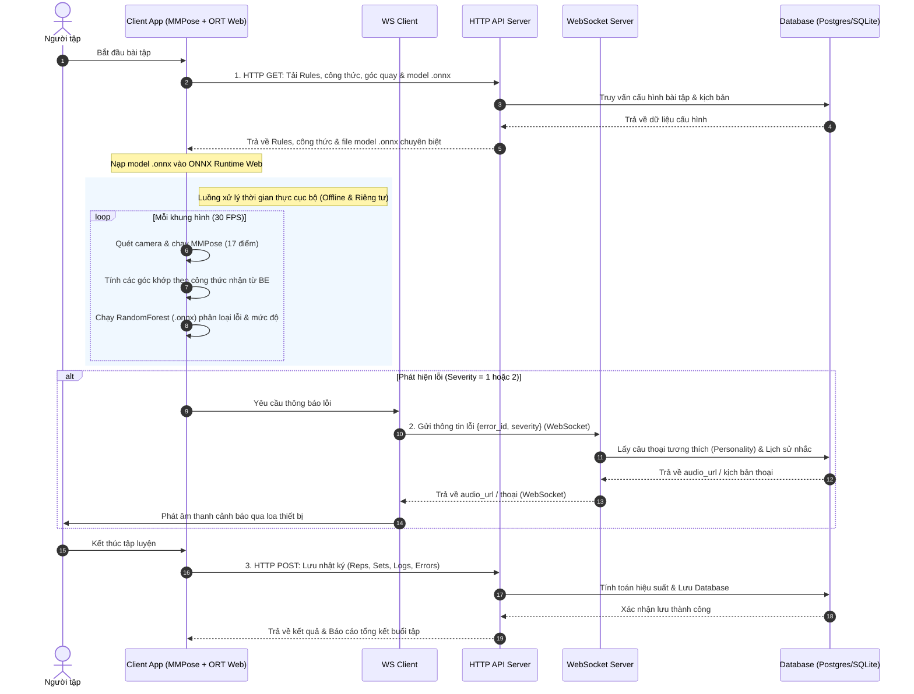

# TÀI LIỆU THIẾT KẾ KIẾN TRÚC & LỘ TRÌNH PHÁT TRIỂN AI CAMERA COACH

Tài liệu này tổng hợp toàn bộ giải pháp kiến trúc, công nghệ và lộ trình thực hiện cho dự án Đồ án **AI Camera Coach cho người tập thể dục**. Hệ thống được thiết kế hướng tới sự bảo vệ quyền riêng tư tuyệt đối (Privacy-First) và phản hồi thời gian thực tức thì (Zero Network Lag) bằng cách chạy mô hình nhận diện và đánh giá lỗi trực tiếp ở phía Client, kết hợp với Backend Go làm nhiệm vụ quản lý cấu hình và kho thoại hướng dẫn.

---

## I. KIẾN TRÚC TỔNG QUAN HỆ THỐNG (SYSTEM ARCHITECTURE)

Hệ thống hoạt động theo mô hình lai (Hybrid) tối ưu, trong đó việc xử lý hình ảnh và tính toán kỹ thuật diễn ra hoàn toàn ở Client để đảm bảo an toàn thông tin cá nhân. Backend cung cấp học liệu khi bắt đầu và tiếp nhận báo cáo lỗi để đưa ra lời khuyên âm thanh tương thích.

---

## II. THIẾT KẾ CHI TIẾT 7 TẦNG CÔNG NGHỆ

### TẦNG 1: MMPOSE 17 KEYPOINTS DETECTION (CLIENT-SIDE - PRIVACY FIRST)
*   **Công nghệ**: 
    *   **Web**: `@tensorflow-models/pose-detection` hoặc `onnxruntime-web` (chạy mô hình RTMPose/YOLOv8-pose dạng `.onnx` bằng WebAssembly/WebGL tăng tốc GPU trên trình duyệt).
    *   **Android**: ONNX Runtime Mobile SDK hoặc TensorFlow Lite.
*   **Dữ liệu đầu vào**: Luồng video camera trực tiếp độ phân giải $640 \times 480$ hoặc $1280 \times 720$, tối thiểu 24-30 FPS.
*   **Tiêu chuẩn hình ảnh**: Người dùng đứng cách camera 1.5m - 2.5m, đảm bảo ghi hình rõ ràng các bộ phận cần đo lường tùy theo bài tập.
*   **Cách hoạt động**: Xác định vị trí của 17 điểm khớp xương chính (chuẩn COCO: mũi, mắt, tai, vai, khuỷu tay, cổ tay, hông, đầu gối, cổ chân) trực tiếp trên thiết bị của khách hàng. Video không bao giờ bị gửi lên server để đảm bảo quyền riêng tư.
*   **Dữ liệu đầu ra**: Tọa độ chuẩn hóa $(x, y)$ và độ tin cậy $confidence$ của 17 điểm khớp.

### TẦNG 2: FEATURE EXTRACTION & LOCAL RULE ENGINE (CLIENT-SIDE)
*   **Công nghệ**: JavaScript/Kotlin chạy hoàn toàn trên Client.
*   **Khởi tạo cấu hình**: Khi bắt đầu bài tập, Client gọi API Backend để tải cấu hình bài tập (`MotionSpecification`) và tài nguyên cần thiết cho bài tập đó, bao gồm:
    *   **File model `.onnx`**: Mô hình đánh giá tư thế chuyên biệt cho bài tập này (ví dụ: `squat_classifier.onnx` sau khi huấn luyện RandomForest) dùng để đánh giá đúng/sai cục bộ.
    *   **Công thức tính**: Cách tính toán các góc khớp cần thiết từ tọa độ 17 điểm.
    *   **Bộ quy tắc (Rules)**: Các ngưỡng kỹ thuật để bổ trợ các phép toán tính góc và quy tắc đếm reps (State Machine).
    *   **Góc quay camera**: Hướng dẫn người dùng đặt góc quay camera khuyến nghị (ví dụ: nhìn nghiêng 90 độ cho Squat/Plank, nhìn chính diện cho Shoulder Press).
*   **Tính toán góc khớp**: Client sử dụng tọa độ 17 điểm khớp, áp dụng các công thức toán học nhận từ Backend để tính toán các góc khớp thời gian thực:
    $$\theta = \arccos\left(\frac{\vec{BA} \cdot \vec{BC}}{\|\vec{BA}\| \cdot \|\vec{BC}\|}\right) \times \frac{180}{\pi}$$
*   **Đếm Rep ở Client**: Sử dụng Máy trạng thái (State Machine) chuyển đổi trạng thái góc khớp dựa trên quy tắc đếm rep nhận từ Backend.

### TẦNG 3: SEVERITY MODEL (CLIENT-SIDE ONNX RUNTIME)
*   **Công nghệ**: Python (huấn luyện) & JavaScript/Kotlin (suy luận cục bộ qua ONNX Runtime Web/Mobile).
*   **Huấn luyện (Python)**: Huấn luyện các mô hình phân loại nhẹ như `RandomForest`, `SVM` hoặc `MLP` trong `Scikit-Learn` dựa trên vector góc khớp đầu vào của 17 điểm. Xuất ra định dạng `.onnx` bằng thư viện `skl2onnx`.
*   **Suy luận (Client)**: **Tùy thuộc vào từng bài tập**, Client sẽ tự động tải file model `.onnx` phân loại tương ứng từ Backend về khi bắt đầu tập. Sử dụng `onnxruntime-web` để suy luận trực tiếp trên Client nhằm tránh cứng nhắc như các luật ngưỡng thông thường và đảm bảo tính riêng tư của dữ liệu.
*   **Dữ liệu đầu vào**: Vector đặc trưng 1D chứa các góc khớp quan trọng, vận tốc và độ thay đổi tư thế trong một rep.
*   **Dữ liệu đầu ra**: Phân loại mức độ lỗi: `0` (Không lỗi/Bình thường), `1` (Lỗi nhẹ - Nhắc nhở), `2` (Lỗi nặng - Nguy cơ chấn thương).

### TẦNG 4: DIALOGUE ENGINE & STYLE SELECTOR (SERVER-SIDE)
*   **Công nghệ**: Go (Golang) xử lý logic kết nối và ánh xạ lời khuyên.
*   **Cơ chế hoạt động**:
    *   Khi Client phát hiện lỗi (cấp độ 1 hoặc 2) bằng Rule Engine/RandomForest cục bộ, Client sẽ gửi một tin nhắn qua **WebSocket** chứa thông tin: `{error_id, severity}`.
    *   Go Backend tiếp nhận tin nhắn, truy vấn bảng lưu trữ kịch bản lời nhắc dựa trên: `Workout ID` + `Error ID` + `Severity` + `User Style/Personality` (phong cách nói chuyện được người dùng chọn: nghiêm khắc, nhẹ nhàng, hài hước, v.v.).
    *   Backend trả về đường dẫn tệp âm thanh (audio URL) đã sinh sẵn hoặc văn bản thoại tương ứng.
*   **Quản lý tần suất nhắc nhở (Frequency Control)**: Backend lưu vết lịch sử nhắc nhở của phiên tập (`Coach Memory`) để áp dụng các quy tắc điều hướng giọng nói:
    *   **Lỗi nhẹ (Severity = 1)**: Chỉ phát cảnh báo **1 lần duy nhất** trong cả set tập để người dùng lưu ý điều chỉnh kỹ thuật, tránh gây cảm giác khó chịu hoặc spam làm xao nhãng buổi tập.
    *   **Lỗi nặng (Severity = 2)**: Phát cảnh báo **liên tục** (mỗi khi Client báo lỗi ở các rep kế tiếp) nhằm thúc giục người dùng sửa tư thế ngay lập tức, phòng tránh tối đa nguy cơ chấn thương xương khớp.
    *   **Ưu tiên cảnh báo**: Ưu tiên cao nhất cho lỗi nặng (`Severity = 2`), tạm thời ghi đè hoặc bỏ qua lỗi nhẹ nếu xảy ra đồng thời.

### TẦNG 5: COACH MEMORY & SESSION LOGGER (DATABASE - POSTGRESQL / SQLITE)
*   **Công nghệ**: PostgreSQL (Production) / SQLite (Development/Mobile), tích hợp thông qua `GORM` trong Go.
*   **Thiết kế bảng**:
    *   `users`: Lưu trình độ, chấn thương, thông tin cá nhân, phong cách giọng nói HLV ưa thích (`CoachPersonality`).
    *   `workout_sessions`: Quản lý các hiệp tập, bài tập, mục tiêu reps, thời gian tập.
    *   `rep_logs`: Lưu trữ chi tiết thông số góc, thời gian thực hiện của từng rep.
    *   `error_logs`: Lưu lịch sử lỗi gặp phải của từng rep phục vụ cho việc thống kê kỹ thuật.
*   **Ứng dụng**:
    *   Trong khi tập, Client tích lũy nhật ký tập (reps, lỗi tư thế, góc khớp).
    *   Khi kết thúc buổi tập, Client gửi toàn bộ thông tin tổng hợp này qua một API HTTP POST để Backend xử lý tính toán điểm kỹ thuật (`FormScore`), lưu dữ liệu lịch sử và đóng phiên tập một cách an toàn.

### TẦNG 6: BACKEND DATA PREPARATION & SPEECH REPOSITORY (API SERVER)
*   **Công nghệ**: Go (Golang) REST API.
*   **Vai trò**: Cung cấp tài nguyên và cấu hình học liệu chuẩn bị sẵn cho bài tập bao gồm:
    1.  **Video hướng dẫn lần đầu**: Video minh họa kỹ thuật động tác chuẩn dành cho người mới tập bài đó lần đầu.
    2.  **Bộ công thức và Góc quay**: Định nghĩa các góc khớp cần đo (từ 17 điểm MMPose) và góc đặt camera chuẩn (ví dụ: nhìn nghiêng, nhìn thẳng).
    3.  **File model `.onnx`**: Mô hình AI chuyên biệt để xác định lỗi sai.
    4.  **Ngân hàng câu thoại giọng nói**: Danh sách các lời khuyên thoại (hoặc file audio/đường dẫn âm thanh tĩnh) được dịch sẵn sang tiếng Việt, phân loại theo từng lỗi sai, mức độ nghiêm trọng và **phong cách nói chuyện** (ví dụ: nghiêm khắc, hài hước, động viên, chi tiết).

### TẦNG 7: DATA SCRAPING & MODEL TRAINING PIPELINE (QUY TRÌNH DỮ LIỆU)
*   **Công nghệ**: Python, `yt-dlp`, `Streamlit`.
*   **Cào dữ liệu**: Tải video hướng dẫn chuẩn và video lỗi sai từ YouTube/TikTok bằng `yt-dlp`.
*   **Lọc dữ liệu có con người can thiệp (Human-in-the-loop)**: Video sau khi tải được hiển thị trên giao diện Streamlit nội bộ để kiểm duyệt chất lượng hình ảnh toàn thân và độ chuẩn xác của động tác.
*   **Xử lý và Gán nhãn**: 
    1. Trích xuất tọa độ xương 17 điểm (chuẩn MMPose) từ luồng video đã duyệt.
    2. Áp dụng các quy tắc toán học để gán nhãn tự động lỗi sai và mức độ lỗi cho từng khung hình.
    3. Huấn luyện mô hình RandomForest Classifier bằng Scikit-Learn với đầu vào là vector góc khớp.
    4. Xuất mô hình RandomForest đã huấn luyện sang định dạng `.onnx` (thông qua thư viện `skl2onnx`) để lưu trữ tại Backend và phân phối cho Client khi cần thiết.

---

## III. DANH SÁCH BÀI TẬP HỖ TRỢ & ĐẶC TRƯNG GÓC KHỚP

Các bài tập được giám sát dựa trên cấu hình 17 điểm khớp chính của MMPose (COCO standard):

1.  **Squat**: Góc gối (Hip-Knee-Ankle), góc hông (Shoulder-Hip-Knee), góc cột sống so với phương thẳng đứng, khoảng cách gối-mũi chân (giới hạn dựa trên tọa độ X của đầu gối và cổ chân).
2.  **Push-up**: Góc khuỷu tay (Shoulder-Elbow-Wrist), góc khuỷu tay so với thân người, độ thẳng cột sống-hông-gối (Shoulder-Hip-Ankle), ROM khuỷu tay.
3.  **Pull-up**: Góc gập khuỷu tay (Shoulder-Elbow-Wrist), độ cao cằm so với xà (tương quan tọa độ Y của cằm/mũi với cổ tay), độ đung đưa thân người (độ lệch tọa độ X của hông/gối).
4.  **Plank**: Độ lệch của Hông so với đường thẳng nối Vai và Cổ chân (Shoulder-Hip-Ankle).
5.  **Lunge**: Góc gối trước, góc hông, góc ngả thân người trước, khoảng cách gối-mũi chân chân trước.
6.  **Sit-up**: Góc gập khớp hông ở đỉnh, góc nghiêng gáy cổ so với thân mình.
7.  **Shoulder Press**: Góc khuỷu tay (độ sâu hạ tạ), độ võng cột sống thắt lưng.
8.  **Bicep Curl**: Góc khuỷu tay, sự dịch chuyển của cùi chỏ so với thân người, độ võng thắt lưng.

---

## IV. LỘ TRÌNH THỰC HIỆN CHI TIẾT (6 TUẦN)

### Tuần 1: Thu thập Dữ liệu & Thiết kế Database Core
*   **Python**: Viết script tải video chuẩn/lỗi bằng `yt-dlp`, trích xuất tọa độ xương 17 điểm bằng MMPose và làm mượt bằng Kalman Filter.
*   **Golang**: Thiết kế Database Schema SQLite/PostgreSQL quản lý thông tin bài tập, kịch bản câu thoại, và lịch sử buổi tập (`Coach Memory`). Khởi tạo khung dự án Go và sinh mã nguồn từ proto stubs.

### Tuần 2: Huấn luyện Mô hình AI (ONNX) & Phát triển REST API Backend
*   **Python**: Xây dựng công thức tính góc khớp, gán nhãn tự động mức độ lỗi. Huấn luyện mô hình RandomForest Classifier phân loại lỗi bằng Python và xuất sang định dạng `.onnx`. Chuẩn bị ngân hàng câu thoại hướng dẫn.
*   **Golang**: Phát triển các REST API cung cấp dữ liệu cấu hình khởi tạo bài tập (`MotionSpecification`: công thức, rules, góc quay, video hướng dẫn và URL tải file `.onnx` tương ứng).

### Tuần 3: WebSocket Server, Dialogue Engine & Khởi động Client
*   **Golang**: Xây dựng WebSocket Server tiếp nhận gói tin báo lỗi từ Client. Phát triển Dialogue Engine ánh xạ (`error_id` + `severity` + `CoachPersonality` -> audio/thoại) và tích hợp bộ điều khiển tần suất nhắc (Frequency Control).
*   **Client**: Khởi tạo dự án Web (React/Vite) / Android (Kotlin), cấu hình luồng camera trực tiếp và tích hợp MMPose nhận diện 17 điểm khớp xương.

### Tuần 4: Đếm Rep & Suy luận Lỗi cục bộ trên Client (Local Inference)
*   **Client**: Lập trình State Machine tính góc khớp và đếm Reps trực tiếp trên thiết bị.
*   **Client**: Tải mô hình `.onnx` phân loại lỗi từ Backend, tích hợp ONNX Runtime Web/Mobile để chạy suy luận lỗi cục bộ thời gian thực từ tọa độ MMPose.

### Tuần 5: Liên thông Hệ thống (End-to-End) & Lưu trữ Nhật ký tập luyện
*   **Tích hợp**: Kết nối WebSocket giữa Client và Server để truyền tin báo lỗi thời gian thực, nhận phản hồi câu thoại/audio và phát âm thanh hướng dẫn tương ứng trên thiết bị.
*   **Golang & Client**: Phát triển luồng kết thúc buổi tập, Client tổng hợp dữ liệu và gọi API HTTP POST gửi báo cáo tổng kết để Backend lưu vào cơ sở dữ liệu (`WorkoutSession`, `RepLog`, `ErrorLog`).

### Tuần 6: Kiểm thử, Tối ưu hóa & Đóng gói Báo cáo
*   **Kiểm thử**: Đo đạc độ trễ phản hồi âm thanh (yêu cầu dưới 150ms) và đo độ ổn định FPS trên nhiều thiết bị Client.
*   **Privacy Audit**: Xác minh tính riêng tư tuyệt đối (không truyền video/hình ảnh hay tọa độ thô của khớp xương lên Server).
*   **Hoàn thiện**: Viết tài liệu báo cáo đồ án chi tiết và cấu hình Docker Compose để khởi chạy hệ thống cục bộ dễ dàng.
